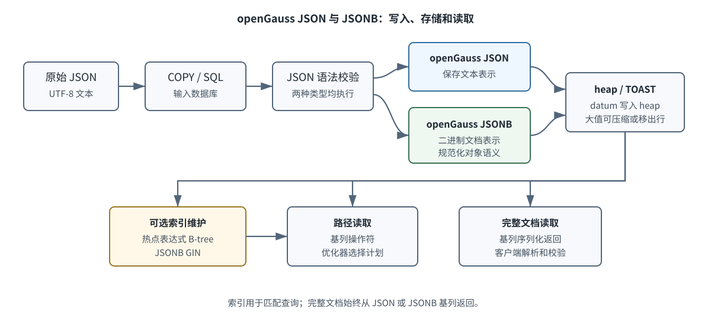
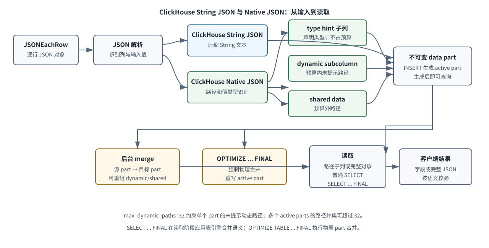
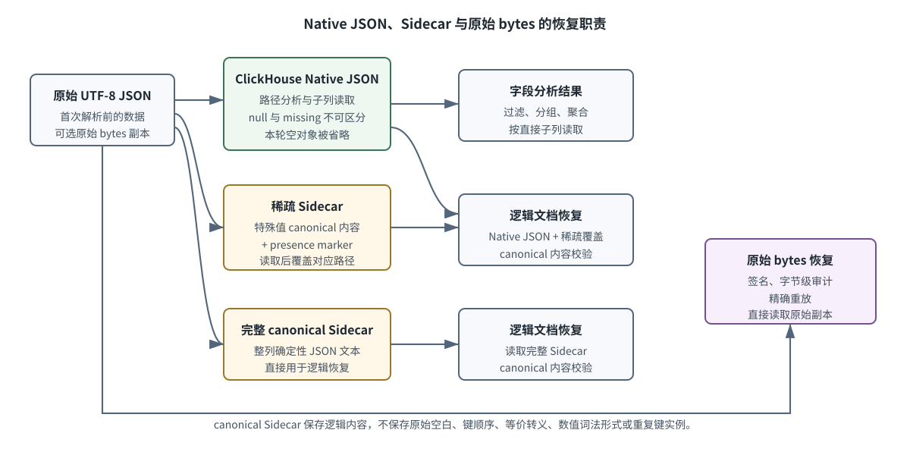

# Agent Trace JSON 存储阶段二组内汇报辅助材料

> 日期：2026-09-09
> 范围：openGauss JSON、openGauss JSONB、ClickHouse String JSON、ClickHouse Native JSON
> 详细证据：[阶段二报告](json-storage-stage2-report-2026-09-09.md)

## 1. 当前结论

**一句结论：四种存储结构没有统一最优项，路径分析偏向 openGauss JSONB 或 ClickHouse Native JSON，完整文档读取偏向文本表示。**

| 场景 | openGauss | ClickHouse |
|---|---|---|
| 高频、低密度路径过滤 | openGauss JSONB；明确热点可加表达式索引 | ClickHouse Native JSON 直接子列 |
| 完整文档分页 | 本轮 openGauss JSON 较低 | 本轮 ClickHouse String JSON 较低 |
| 稳定列聚合 | JSON 与 JSONB 接近 | ClickHouse String JSON 与 ClickHouse Native JSON 接近 |
| 字节级审计与重放 | 首次解析前保存原始 UTF-8 bytes | 首次解析前保存原始 UTF-8 bytes |

补充实验在 48,534 行固定 Trace 输入上执行四轮，每种结构获得 2,080 个正式查询样本。原六结构实验和补充四结构实验分别统计，没有把两批查询直接混算。

适用边界：单机固定版本、热查询和独立载入程序；结果不代表 Collector、exporter、benchmark 全链路，也不代表饱和吞吐。

## 2. openGauss JSON 与 openGauss JSONB 流程

**一句结论：openGauss JSON 保存进入 datum 后的文本表示，openGauss JSONB 保存二进制文档表示；两者均由 heap/TOAST 存储，索引只服务匹配查询。**

| 补充四结构场景 | openGauss JSON | openGauss JSONB |
|---|---:|---:|
| 载入 rows/s | **6,322.38** | 6,134.30 |
| 高频路径 S02 p50 | 281.72 ms | **96.45 ms** |
| 低密度路径 S03 p50 | 271.10 ms | **88.10 ms** |
| 完整文档分页 S06 p50 | **197.21 ms** | 459.78 ms |

输入先通过 COPY 或 SQL 进入数据库，两种类型均执行 JSON 语法校验。openGauss JSONB 不保留对象键顺序，重复对象键仅保留最后一个值；它避免查询时反复执行 JSON 文本词法解析，并可建立表达式索引或 GIN。完整文档从基列返回，不从索引重建。

适用边界：路径结果依赖操作、选择率、索引和返回量。openGauss JSON 的文本表示不等于首次摄入的原始事件 bytes。补充四结构的载入还包含原文表写入。

## 3. ClickHouse String JSON 与 ClickHouse Native JSON 流程

**一句结论：ClickHouse String JSON 的处理路径更直接，ClickHouse Native JSON 用类型识别和子列组织换取路径读取能力，并承担 data part 与 merge 生命周期成本。**

| 补充四结构场景 | ClickHouse String JSON | ClickHouse Native JSON |
|---|---:|---:|
| 载入 rows/s | **5,754.01** | 5,105.91 |
| 高频路径 S02 p50 | 121.78 ms | **91.91 ms** |
| 低密度路径 S03 p50 | 68.60 ms | **47.60 ms** |
| 完整文档分页 S06 p50 | **48.21 ms** | 77.53 ms |

JSONEachRow 把每行解析为 JSON 对象。ClickHouse String JSON 保存压缩文本；ClickHouse Native JSON 识别路径和值类型。type hint 路径写入固定类型子列，其余路径在单 part 内受 `max_dynamic_paths=32` 限制，分别进入 dynamic subcolumn 或 shared data。

INSERT 生成可查询的不可变 data part。后台 merge 重写源 part，并可改变 dynamic/shared 的物理归属。`OPTIMIZE TABLE ... FINAL` 强制物理合并；`SELECT ... FINAL` 只在读取阶段应用表引擎合并语义。

适用边界：本版本观察到 merge 通常优先保留非空出现量较高的路径，这不是每次 merge 的固定保证。多个 active parts 的路径并集可以超过单 part 的 32 路径预算。

## 4. Sidecar 与恢复

**一句结论：ClickHouse Native JSON 负责路径分析，Sidecar 负责补充逻辑文档状态，原始 bytes 副本负责逐字节恢复。**

| 方案 | Sidecar bytes | presence marker | 恢复 ms | 文档差异 |
|---|---:|---:|---:|---:|
| 无 Sidecar | 0 | 0 | 45.000 | **5,456** |
| 稀疏 Sidecar | 26,698,849 | 48,534 条 / 1,607,879 bytes | 4,721.643 | **0** |
| 完整 canonical Sidecar | 81,634,867 | 0 | **2,180.746** | **0** |
| type hint + 稀疏 Sidecar | 26,698,849 | 48,534 条 / 1,607,879 bytes | 5,076.783 | **0** |

无 Sidecar 的本轮实测差异由 **5,446 个 JSON null 和 10 个空对象造成共 5,456 条差异；空数组差异为 0**，普通值内容门禁通过。稀疏规则仍保守覆盖递归包含 JSON null、空对象或空数组的 Attribute。type hint 对缺失声明路径返回类型默认值，恢复时需要 presence marker 区分缺失和值恰好等于默认值。

适用边界：表内恢复时间是一次全语料客户端机制观察，不是查询 latency。稀疏 Sidecar 的条目和字节已经包含 marker。canonical Sidecar 不是摄入原文，不支持原始空白、键顺序、等价转义、数值词法和重复键实例的恢复。

## 5. 四结构场景化选择

**一句结论：先按查询场景选择候选，再把写入、空间、恢复和维护成本一起验证。**

| 场景 | 本轮观察 | 当前选择依据 |
|---|---|---|
| 基础载入 | openGauss JSON、ClickHouse String JSON 在各自引擎内较高 | 写入预算、是否需要路径组织 |
| 稳定列聚合 | 同引擎两种 JSON 表示接近 | 稳定字段继续使用强类型列 |
| 高频路径 | openGauss JSONB 96.45 ms；ClickHouse Native JSON 91.91 ms | 路径密度、直接子列或定向索引 |
| 低密度路径 | openGauss JSONB 88.10 ms；ClickHouse Native JSON 47.60 ms | 谓词、选择率、dynamic/shared 归属 |
| 单路径投影 | openGauss JSONB 明显低于 openGauss JSON；ClickHouse 两结构接近 | wall 与客户端恢复分别核算 |
| 完整 Trace | openGauss 两结构接近；ClickHouse String JSON 较低 | 返回量、Sidecar 和客户端恢复 |
| 完整文档分页 | openGauss JSON、ClickHouse String JSON 在各自引擎内较低 | 文档大小与详情读取比例 |
| 持续写入 | 原六结构样本均通过对应水位 truth | 需扩大到长时间维护稳态 |
| 索引或 type hint | 表达式索引和 GIN 在匹配查询上有效；hinted 路径不占本版本动态预算 | 维护成本、默认值语义、marker 成本 |

基础四结构不含 openGauss 表达式索引、GIN 或 ClickHouse type hint。原六结构实验中，表达式索引把高频路径 Q02 p50 从 112.49 ms 降至 **20.59 ms**；`jsonb_hash_ops` GIN 把低密度 containment Q05 从 88.77 ms 降至 **3.84 ms**。这些扩展需要按真实查询单独启用。

适用边界：openGauss 空间是 heap、TOAST 和 index 的 allocated bytes；ClickHouse 空间是 active parts compressed bytes，不能据此排列跨引擎压缩率。阶段一的 5000 路径数据只表示压力边界。

## 6. 后续工作

**一句结论：阶段二已经固定动态属性的比较方法，阶段三继续验证长 payload 的物理分层。**

| 已完成 | 后续验证 |
|---|---|
| 四种基础存储结构的载入与 S01～S06 | 同表内联、独立 payload 表、Full/Core、asset reference |
| openGauss JSON/JSONB 与索引机制 | 长值的 heap/TOAST 空间和详情恢复 |
| ClickHouse Native JSON、Sidecar、merge 和 FINAL | 长值的 part 空间、列裁剪和恢复 |
| canonical 与原始 bytes 边界 | asset 缺失、损坏、元数据不一致和孤儿对象 |

阶段三入口见[阶段三实验设计](json-storage-stage3-experiment-design-2026-09-09.md)。完整数字、异常和证据边界以[阶段二报告](json-storage-stage2-report-2026-09-09.md)为准。

适用边界：阶段三仍使用独立载入程序；接入产品前需要冻结 exporter、schema、查询 catalog 和数据身份，再执行系统级验证。
