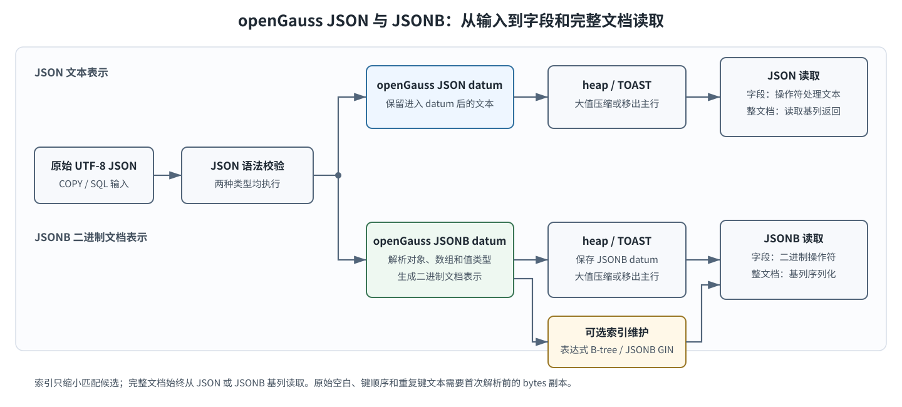
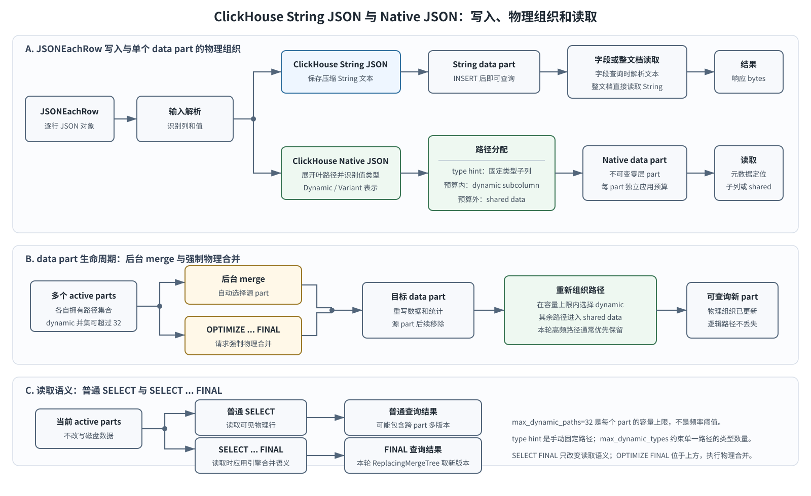
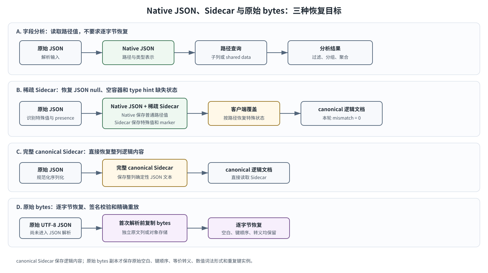

# Agent Trace JSON 存储阶段二组内汇报辅助材料

> 日期：2026-09-09
> 范围：openGauss JSON、openGauss JSONB、ClickHouse String JSON、ClickHouse Native JSON
> 原理说明：[openGauss JSONB 与 ClickHouse Native JSON](json-storage-principles-2026-09-09.md)
> 详细证据：[阶段二报告](json-storage-stage2-report-2026-09-09.md)

## 1. 当前结论

**一句结论：四种存储结构没有统一最优项，路径分析偏向 openGauss JSONB 或 ClickHouse Native JSON，完整文档读取偏向文本表示。**

| 场景 | openGauss | ClickHouse |
|---|---|---|
| 高频、低密度路径过滤 | openGauss JSONB；明确热点可加表达式索引 | ClickHouse Native JSON 直接子列 |
| 完整文档分页 | 本轮 openGauss JSON 较低 | 本轮 ClickHouse String JSON 较低 |
| 稳定列聚合 | JSON 与 JSONB 接近 | ClickHouse String JSON 与 ClickHouse Native JSON 接近 |
| 字节级审计与重放 | 首次解析前保存原始 UTF-8 bytes | 首次解析前保存原始 UTF-8 bytes |

补充实验在 48,534 行固定 Trace 输入上执行四轮，每种结构获得 2,080 个正式查询样本。原六结构实验和补充四结构实验分别统计，没有把两批查询直接混算。

适用边界：单机固定版本、热查询和独立载入程序；结果不代表 Collector、exporter、benchmark 全链路，也不代表饱和吞吐。

## 2. 实验数据来源与构造

**一句结论：补充横比复用同一批公开 Agent 轨迹的确定性 Span 投影，只改变数据库中的 JSON 存储结构。**

数据源是 Hugging Face `Leoxx/whowhen_pro` 的 **text split**。源数据包含 6,257 条失败轨迹记录，每条记录包含任务、framework、benchmark、trajectory 和 failure ground truth。`trace-synthesis` 按固定规则把 trajectory 中的 user、agent、action、tool 和 final answer 等事件转换为 Trace 根 Span、LLM Span 和 Tool Span，最终得到 **6,257 条 Trace、48,534 个 Span**。

“确定性投影”表示转换结果由输入、配置和 `seed=42` 共同确定：Trace ID 根据 split 和源记录 ID 使用 UUID5 派生，Span ID 根据 Trace ID 和固定局部名称派生；时间、token、部署环境和 telemetry dialect 等补充字段使用 seed 与 ID 的哈希计算。相同输入、配置和 seed 会得到相同的行序、标识和字段值。时间戳从 2030-01-01 起构造，只服务固定查询窗口，不代表真实到达时间。

阶段二生成器继续执行以下转换：

1. 抽取 `trace_id`、`span_id`、时间、Span 类型和状态等稳定列。
2. 将点分隔的 Attribute key 可逆地投影为嵌套 JSON，生成四种结构共用的动态属性内容。
3. 保存 canonical JSON、首次解析前的原始事件 bytes，以及每行内容摘要。
4. 独立计算固定查询参数、结果摘要和每个写入水位的 truth；数据库查询结果不参与生成期望值。
5. 按 256 行保持同一行序分块，共 190 个 block，最后一个 block 为 150 行。

| 数据特征 | 固定输入 |
|---|---:|
| Span / Trace | 48,534 / 6,257 |
| Span 类型 | llm 17,486；tool 24,791；trace 6,257 |
| 顶层 Attribute key | 29 |
| 每行 Attribute key 数 p50 / p95 / p99 / 最大值 | 8 / 14 / 15 / 15 |
| 写入 block | 190 个；256 行，末 block 150 行 |
| 查询覆盖 | 稳定列聚合、高频路径、低密度路径、单路径投影、完整 Trace、完整文档页 |

补充实验没有重新生成数据库输入行，只从阶段二冻结数据生成 S01～S06 的补充 truth 和查询目录。四种结构共享同一数据、block 边界、查询参数、可见水位、结果摘要和原文恢复契约。

适用边界：当前输入只覆盖 `whowhen-pro` text split，不包含 image、image_gui 或 video split。29 个顶层 Attribute key 代表较窄样本，不能据此推断多租户生产环境或 5,000 路径分布。

## 3. openGauss JSON 与 openGauss JSONB 流程

**一句结论：openGauss JSON 保存进入 datum 后的文本表示，openGauss JSONB 保存二进制文档表示；两者均由 heap/TOAST 存储，索引只服务匹配查询。**

处理流程分为五步：

1. 客户端把 UTF-8 JSON 通过 COPY 或 SQL 发送给数据库；openGauss JSON 和 openGauss JSONB 都先校验 JSON 语法。
2. openGauss JSON 保存进入 JSON datum 后的文本表示。路径查询时执行 JSON 操作符并处理文本内容。
3. openGauss JSONB 在写入时解析对象和数组，生成二进制文档表示；对象键顺序不再保留，重复键只保留最后一个值。
4. 两种 datum 都写入 heap；较大值由 TOAST 压缩或移出主行。显式创建的表达式 B-tree 或 JSONB GIN 在写入时同步维护。
5. 字段查询使用基列操作符，优化器按谓词和选择率决定是否使用索引；完整文档始终读取基列并序列化返回。

| 补充四结构场景 | openGauss JSON | openGauss JSONB |
|---|---:|---:|
| 载入 rows/s | **6,322.38** | 6,134.30 |
| 高频路径 S02 p50 | 281.72 ms | **96.45 ms** |
| 低密度路径 S03 p50 | 271.10 ms | **88.10 ms** |
| 完整文档分页 S06 p50 | **197.21 ms** | 459.78 ms |

适用边界：路径结果依赖操作、选择率、索引和返回量。openGauss JSON 的文本表示不等于首次摄入的原始事件 bytes。补充四结构的载入还包含原文表写入。

## 4. ClickHouse String JSON 与 ClickHouse Native JSON 流程

**一句结论：ClickHouse String JSON 的处理路径更直接，ClickHouse Native JSON 用类型识别和子列组织换取路径读取能力，并承担 data part 与 merge 生命周期成本。**

处理流程按写入、组织、维护和读取展开：

1. JSONEachRow 解析每个输入对象并找到目标列。ClickHouse String JSON 把动态属性保存为压缩 String，字段查询时再调用 JSON 提取函数。
2. ClickHouse Native JSON 在写入时展开叶路径并识别值类型。手动声明的 type hint 路径进入固定类型子列，不参与本实验的动态路径预算。
3. 未声明路径成为 dynamic path 候选。每个 data part 独立应用 `max_dynamic_paths=32`：预算内路径保存为 dynamic subcolumn，其余路径保存到 shared data。
4. INSERT 写出不可变的零层 data part，提交后即可查询。多个 active parts 各自拥有路径集合，因此全表可见的 dynamic path 并集可以超过 32。
5. 后台 merge 读取多个源 part 并写出目标 part，同时重新组织 dynamic subcolumn 与 shared data。本版本实测中，非空出现量较高的路径通常保留为 dynamic subcolumn。
6. 路径查询先根据 part 元数据确定读取固定子列、dynamic subcolumn 还是 shared data；完整对象读取需要组合这些物理表示。
7. `OPTIMIZE TABLE ... FINAL` 强制执行物理 part 合并；`SELECT ... FINAL` 只在查询时应用表引擎的合并语义，不改写磁盘上的 part。

dynamic subcolumn 的主要影响因素如下：

| 因素 | 对物理组织的影响 |
|---|---|
| type hint | 手动指定稳定路径和类型，形成固定类型子列；本版本实测不占 32 个 dynamic path 名额 |
| 单个 part 的未声明路径数 | 与 `max_dynamic_paths` 比较；超过预算的路径进入 shared data |
| 路径在源 part 中的非空出现量 | merge 生成目标 part 时用于路径统计；本轮观察到高频路径通常优先成为 dynamic subcolumn |
| block 与 part 组成 | 每个零层 part 独立选路；不同 part 的 dynamic path 集合可以不同 |
| 同一路径的值类型数量 | 由 Dynamic/Variant 表示及 `max_dynamic_types` 约束，影响类型子流、转换和读取成本，不等同于 dynamic path 名额 |
| merge 后目标 part 的上限 | 目标 part 仍受 JSON 类型参数和相关 MergeTree 设置约束，路径可在 dynamic 与 shared 之间移动 |

`max_dynamic_paths` 是容量上限，不是“出现频率达到某值就自动建子列”的频率阈值。频率是 merge 重组时的选择依据之一；路径是否值得手动声明为 type hint，还应结合查询频率、类型稳定性和缺失值语义判断。

| 补充四结构场景 | ClickHouse String JSON | ClickHouse Native JSON |
|---|---:|---:|
| 载入 rows/s | **5,754.01** | 5,105.91 |
| 高频路径 S02 p50 | 121.78 ms | **91.91 ms** |
| 低密度路径 S03 p50 | 68.60 ms | **47.60 ms** |
| 完整文档分页 S06 p50 | **48.21 ms** | 77.53 ms |

适用边界：本版本观察到 merge 通常优先保留非空出现量较高的路径，这不是每次 merge 的固定保证。多个 active parts 的路径并集可以超过单 part 的 32 路径预算。

## 5. Sidecar 与恢复

**一句结论：ClickHouse Native JSON 负责路径分析，Sidecar 负责补充逻辑文档状态，原始 bytes 副本负责逐字节恢复。**

恢复流程分为三个目标：

1. 字段分析直接读取 ClickHouse Native JSON 的路径表示，适合过滤、分组和聚合。
2. 逻辑文档恢复读取 Native JSON 后，再用稀疏 Sidecar 覆盖 JSON null 和空容器；type hint 路径还需要 presence marker 区分缺失和值等于类型默认值。完整 canonical Sidecar 可以直接提供整列逻辑内容。
3. 字节级恢复直接读取首次解析前保存的原始 UTF-8 bytes，用于签名校验、精确重放和字节级审计。

| 方案 | Sidecar bytes | presence marker | 恢复 ms | 文档差异 |
|---|---:|---:|---:|---:|
| 无 Sidecar | 0 | 0 | 45.000 | **5,456** |
| 稀疏 Sidecar | 26,698,849 | 48,534 条 / 1,607,879 bytes | 4,721.643 | **0** |
| 完整 canonical Sidecar | 81,634,867 | 0 | **2,180.746** | **0** |
| type hint + 稀疏 Sidecar | 26,698,849 | 48,534 条 / 1,607,879 bytes | 5,076.783 | **0** |

无 Sidecar 的本轮实测差异由 **5,446 个 JSON null 和 10 个空对象造成共 5,456 条差异；空数组差异为 0**，普通值内容门禁通过。稀疏规则仍保守覆盖递归包含 JSON null、空对象或空数组的 Attribute。type hint 对缺失声明路径返回类型默认值，恢复时需要 presence marker 区分缺失和值恰好等于默认值。

适用边界：表内恢复时间是一次全语料客户端机制观察，不是查询 latency。稀疏 Sidecar 的条目和字节已经包含 marker。canonical Sidecar 不是摄入原文，不支持原始空白、键顺序、等价转义、数值词法和重复键实例的恢复。

## 6. 四结构场景化选择

**一句结论：先按查询场景选择候选，再把写入、空间、恢复和维护成本一起验证。**

| 场景 | 本轮观察 | 当前选择依据 |
|---|---|---|
| 基础载入 | openGauss JSON、ClickHouse String JSON 在各自引擎内较高 | 写入预算、是否需要路径组织 |
| 稳定列聚合 | 同引擎两种 JSON 表示接近 | 稳定字段继续使用强类型列 |
| 高频路径 | openGauss JSONB 96.45 ms；ClickHouse Native JSON 91.91 ms | 路径密度、直接子列或定向索引 |
| 低密度路径 | openGauss JSONB 88.10 ms；ClickHouse Native JSON 47.60 ms | 谓词、选择率、dynamic/shared 归属 |
| 单路径投影 | openGauss JSONB 明显低于 openGauss JSON；ClickHouse 两结构接近 | wall 与客户端恢复分别核算 |
| 完整 Trace | openGauss 两结构接近；ClickHouse String JSON 较低 | 返回量、Sidecar 和客户端恢复 |
| 完整文档分页 | openGauss JSON、ClickHouse String JSON 在各自引擎内较低 | 文档大小与详情读取比例 |
| 持续写入 | 原六结构样本均通过对应水位 truth | 需扩大到长时间维护稳态 |
| 索引或 type hint | 表达式索引和 GIN 在匹配查询上有效；hinted 路径不占本版本动态预算 | 维护成本、默认值语义、marker 成本 |

基础四结构不含 openGauss 表达式索引、GIN 或 ClickHouse type hint。原六结构实验中，表达式索引把高频路径 Q02 p50 从 112.49 ms 降至 **20.59 ms**；`jsonb_hash_ops` GIN 把低密度 containment Q05 从 88.77 ms 降至 **3.84 ms**。这些扩展需要按真实查询单独启用。

适用边界：openGauss 空间是 heap、TOAST 和 index 的 allocated bytes；ClickHouse 空间是 active parts compressed bytes，不能据此排列跨引擎压缩率。阶段一的 5000 路径数据只表示压力边界。

## 7. 后续工作

**一句结论：阶段二已经固定动态属性的比较方法，阶段三继续验证长 payload 的物理分层。**

| 已完成 | 后续验证 |
|---|---|
| 四种基础存储结构的载入与 S01～S06 | 同表内联、独立 payload 表、Full/Core、asset reference |
| openGauss JSON/JSONB 与索引机制 | 长值的 heap/TOAST 空间和详情恢复 |
| ClickHouse Native JSON、Sidecar、merge 和 FINAL | 长值的 part 空间、列裁剪和恢复 |
| canonical 与原始 bytes 边界 | asset 缺失、损坏、元数据不一致和孤儿对象 |

阶段三入口见[阶段三实验设计](json-storage-stage3-experiment-design-2026-09-09.md)。完整数字、异常和证据边界以[阶段二报告](json-storage-stage2-report-2026-09-09.md)为准。

适用边界：阶段三仍使用独立载入程序；接入产品前需要冻结 exporter、schema、查询 catalog 和数据身份，再执行系统级验证。
