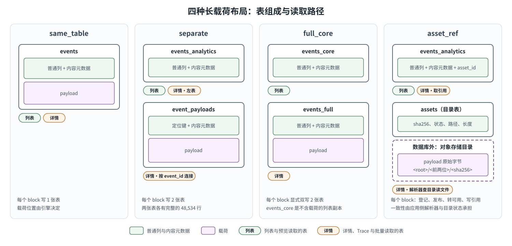
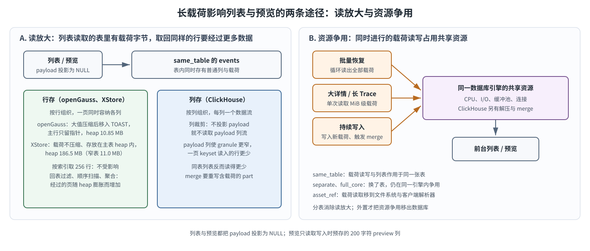
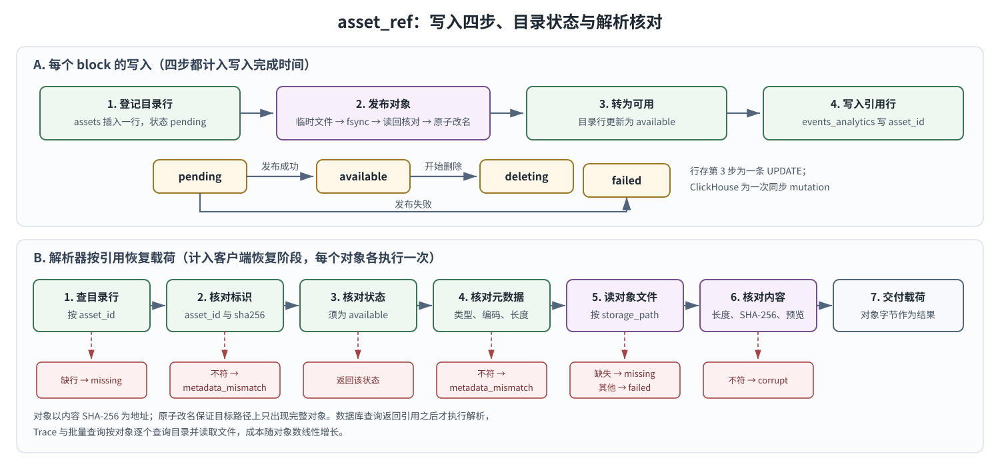

# Agent Trace JSON 存储阶段三组内汇报：长载荷的四种布局

> 日期：2026-10-08
>
> 状态：x86 主机、ARM 主机 A（首轮与修正后的重新运行）与 ARM 主机 B 的结果均已纳入；主机 A 的 ClickHouse 与 XStore `same_table`、`full_core` 未做分进程混合负载，表中以"未测"标出
>
> 被测引擎：XStore（GaussVector 103.0.0 release）、ClickHouse 23.3.10.5（ARM 主机 A、B）；openGauss 6.0.0、ClickHouse 25.12.11.4（x86 主机）

本文汇总阶段三的原理、设计与两套环境的实验结果，按"背景—布局—引擎—外置对象的实现—方法—逐场景结果—跨场景结论"的顺序组织，供组内汇报使用。机制细节与完整证据见三份来源文档：[阶段三原理与设计](stage3-payload-principles.md)（下文简称"原理与设计"）、[阶段三实验报告（openGauss 与 ClickHouse 25.12）](stage3-payload-x86-report.md)（下文简称"x86 报告"）、[阶段三 XStore 横向比较实验报告](stage3-payload-xstore-report.md)（下文简称"XStore 报告"）。

**数据来源标注。** 表中按主机标注来源：**x86** 为 openGauss 6.0.0 与 ClickHouse 25.12 的结果；**主机 A** 为 ARM 主机 A 上 XStore 与 ClickHouse 23.3 的结果；**主机 B** 为 ARM 主机 B 的同组结果。主机 A 的首轮运行使用修正前的实验程序；实验程序针对首轮发现的问题修正后，主机 A 重新运行受影响的场景（第 6.6 节）。主机 A 的 XStore 主矩阵各表使用修正后的结果，首轮结果只在标明"首轮"处引用。

**单位与记号。** 时延单位为 ms，p50 为四轮轮级中位数：先在每轮内取中位数，再对四轮取中位数。表中 MB 为 10^6 字节，KiB、MiB 为二进制单位。表中加粗为同一引擎、同一主机内最快的布局（第 15 节为同一布局内最快的状态，第 14 节为 `batch_loop` 阶段前台受影响最小的布局）；"—"表示该主机返回的结果不含此项。

## 1. 汇报要点

| 问题 | 结论 | 依据 |
|---|---|---|
| 同表存放的长载荷是否拖慢不读载荷的列表 | 取决于引擎如何存放大值。openGauss 把大值压缩后移入 TOAST，列表不受影响；ClickHouse 按列读取，同表列表反而读得更少；XStore 把载荷不压缩地存放在主表的 heap 内，按索引取一页不受影响（修正后中间页与第一页都约 22–23 ms，四种布局相同）；需要逐行读取大量行的查询要经过膨胀的 heap：首轮的中间页写法先回表过滤 13,652 行，同表慢 2.1 倍；每个 block 写入后确认可见行数的全表 `MAX` 查询慢约 2.6–2.9 倍 | 第 8、17.1 节 |
| 同时进行的载荷读写是否干扰前台 | 各请求流分进程运行后，循环批量恢复、大详情、长 Trace 与持续写入都没有明显干扰前台列表：XStore 两台主机的库内布局在批量恢复期间前台 p95 为 24–29 ms、丢弃 0 次；ClickHouse 四种布局在批量恢复期间丢弃 0–2 次，`same_table` p95 由 23.7 ms 升至 28.9 ms，其余三种布局 p95 为 38–41 ms，与各自其他未受主机负载干扰的阶段同量级。首轮与 x86 观察到的大量丢弃主要来自压测客户端进程内的争用。在本实验的负载与主机规模下，分表与外置都不需要承担前台隔离的作用 | 第 14 节 |
| 分层的写入与空间成本 | 写入：分表与外置都增加写入步骤，ClickHouse 的 `asset_ref` 因同步 mutation 最慢。空间取决于引擎是否压缩库内载荷：openGauss 与 ClickHouse 外置后总占用上升到 2.884 倍与 6.921 倍，XStore 下降到 0.787 倍 | 第 7 节 |
| 详情与 Trace | 行存上把载荷存于数据库内的三种布局（`same_table`、`separate`、`full_core`，下文称**库内布局**）最快且对载荷大小不敏感；ClickHouse 的 `separate` 连接整表读取右表，23.3 的详情与 Trace、25.12 的 Trace 显著离群；ClickHouse 的 `asset_ref` 在大对象上最快（x86 为 2 MiB，主机 A 自 512 KiB 起） | 第 10、11 节 |
| 外置的判据 | 对象数量决定外置是否划算，字节总量不决定：同样 80 MiB，40 个 2 MiB 对象时 `asset_ref` 最快，1,280 个 64 KiB 对象时最慢 | 第 13 节 |
| ClickHouse 的 part 状态 | part 状态对列表的影响大于布局：x86 上约为布局差异的三倍；主机 A 上暂停 merge、190 个 part 并存时列表约 89 ms，为合并成单个 part 后的 2.66–5.59 倍。优先控制 part 数 | 第 15 节 |
| 外置的一致性 | 六个故障用例在两套环境的四个引擎上都按设计分类与收敛；内容是否可用由事件引用、目录记录与对象字节三者相互核对判定 | 第 16 节 |

## 2. 背景与研究问题

### 2.1 Agent Trace 中的长载荷

Agent Trace 以 Span 为基本记录。一条 Span 由标识（`event_id`、`trace_id`、`span_id`、`parent_span_id`）、项目与时间、类型与状态等普通列组成；其中一部分 Span 还携带模型输入输出、工具调用结果或检索文档这类长文本，本文称为**载荷**（payload）。载荷的分布有两个特点：大多数 Span 不携带载荷，携带载荷的 Span 单条可达数百 KiB 到数 MiB。

应用对同一批 Span 有性质不同的访问：

| 访问形态 | 典型用途 | 是否需要载荷 |
|---|---|---|
| 分页列表 | 按项目与时间浏览 Span 时间线 | 不需要 |
| 预览 | 列表中附带载荷开头的一小段文本 | 只需要固定长度的预览 |
| 单条详情 | 打开一条 Span 查看完整内容 | 需要一个完整载荷 |
| 完整 Trace | 展开一条 Trace 的全部 Span | 需要该 Trace 的全部载荷 |
| 批量恢复 | 导出、离线分析或重放 | 需要一批完整载荷 |
| 持续写入 | 在线采集 | 写入全部列 |

载荷放在哪里，决定了这些访问各自读取多少数据、写入需要几步、空间如何计算，以及数据库之外的组件要承担多少一致性责任。

### 2.2 研究问题

阶段三比较四种组织同一份逻辑记录的布局，回答四个问题：

1. 长载荷是否、在哪些场景、以多大幅度影响不读取载荷的列表与预览查询：同表存放的载荷是否进入列表的读取路径，并发的载荷读写是否干扰前台查询；
2. 物理分层带来的写入、后台维护、空间与详情恢复成本；
3. 载荷的大小、出现分布与可压缩性如何改变各布局的成本；
4. 把载荷外置为数据库之外的对象后，能否正确恢复内容，并在缺失、损坏和部分失败时保持明确状态。

阶段一和阶段二研究 Span 属性的 JSON 表示。阶段三沿用阶段二的普通列、Trace 结构、写入 block 与查询窗口，只把长载荷的物理位置作为变量。载荷在数据库内以保持 UTF-8 字节的 `TEXT`（行存）或 `String`（ClickHouse）保存，不使用 JSON 类型，也不查询载荷内部路径。

### 2.3 输入数据

基础记录来自公开数据集 `Leoxx/whowhen_pro` 的 text split，经确定性 Trace 投影得到 48,534 条 Span，与阶段二使用同一份冻结输入（版本固定、内容按摘要校验的输入数据）。记录按 `ingest_seq` 排序，每 256 行构成一个写入 **block**，共 190 个 block。

生成器以种子 `20260907` 为 1,481 条记录生成载荷，内容互不重复，分为五种 **profile**：

| profile | 单条字节 | 内容 | 用途 |
|---|---:|---|---|
| `text_64k` | 65,536 | 可压缩文本 | 小型长值 |
| `text_512k` | 524,288 | 可压缩文本 | 中型详情 |
| `text_2m` | 2,097,152 | 可压缩文本 | 大型详情与外置候选 |
| `entropy_512k` | 524,288 | 高熵 ASCII 文本 | 与 `text_512k` 等长的压缩机制对照 |
| `unicode_boundary` | 1,024 | 截断处含多字节字符 | 只用于正确性验证 |

可压缩文本由一个 116 字节的基本块重复到目标长度构成，zlib-6 压缩比为 191 至 290 倍；高熵内容压缩比约 1.3 倍。每条载荷另存内容元数据：`content_type`（`application/json`）、`encoding`（`utf-8`）、`preview`（开头 200 个 Unicode code point）、`content_length` 与 `sha256`。

载荷分属三个 **cohort**，一次运行称为一个 **workload**，只写入所属载荷：

| workload | 表内载荷对象数 | 表内载荷原始字节 | profile 构成 |
|---|---:|---:|---|
| `main` | 160 | 128,450,560 | 四种性能 profile 各 40 |
| `equal_total_few_large` | 40 | 83,886,080 | `text_2m` 40 |
| `equal_total_many_medium` | 1,280 | 83,886,080 | `text_64k` 1,280 |
| `correctness_only` | 1 | 1,024 | `unicode_boundary` 1 |

`main` 中携带载荷的行占 160/48,534，即 0.33%。`main` 与两个等总字节 workload 合称三个性能 workload；两个引擎、四种布局在三个性能 workload 与 `correctness_only` 上的全部运行称为**主矩阵**，混合负载、part 状态与对象故障另行运行。

### 2.4 查询参数

全部查询参数来自冻结的 **truth** 清单，即独立程序在实验前按冻结输入计算的预期结果。列表与预览固定在项目 `Leoxx/whowhen_pro` 的时间窗口 `[2030-01-01T00:00:00.000Z, 2030-01-01T00:52:08.500Z)` 内（下文称**固定窗口**），窗口有 27,561 行，分页大小为 256；第一页使用窗口起点之前的哨兵游标，中间页使用窗口中部的固定游标。单条详情按四种性能 profile 各固定一条记录。每个固定查询以"形态:变体"命名，称为**查询目标**，例如 `list:first`（列表第一页）、`list:middle`（列表中间页）、`detail:text_2m`（2 MiB 载荷的单条详情）、`trace:p95`（Span 数位于 p95 的 Trace）、`batch:main`（`main` 的批量恢复）。完整 Trace 按 Span 数固定三条：

| 标识 | Span 数 | `main` 中的载荷对象数 | 载荷原始字节 |
|---|---:|---:|---:|
| `p25` | 5 | 1 | 65,536 |
| `p50` | 6 | 1 | 524,288 |
| `p95` | 31 | 2 | 2,162,688 |

批量恢复按 cohort 取出全部携带载荷的行。

### 2.5 代表性与边界

输入保留了真实 Trace 的结构、时间分布与 Span 数分布，在其上确定性地放置载荷，使四种布局在同一行集、同一行序上比较。载荷大小覆盖三个数量级，可压缩与高熵内容分离了压缩的作用，等总字节的两组 workload 分离了对象数量与单对象大小。

| 边界 | 影响 |
|---|---|
| 可压缩文本的压缩比远高于生产文本常见的 3 至 6 倍 | 放大 ClickHouse 列压缩与 openGauss TOAST 压缩的空间收益，空间结论按压缩比分开解释 |
| 载荷密度为 0.33% | 结论适用于少数 Span 携带长载荷的数据集 |
| 48,534 行、约 122.5 MiB 载荷 | 数据集可完全驻留内存，不覆盖超出单机内存与跨节点的规模 |
| 单项目、固定窗口 | 不覆盖多租户与跨窗口访问 |

## 3. 四种布局

### 3.1 逻辑记录与统一返回语义

四种布局保存同一份逻辑记录：

```text
event_id, trace_id, project_id, start_time, profile,
content_type, encoding, content_length, preview, sha256, payload
```

同一查询在四种布局上返回相同的行、相同的行序、相同的列和相同的载荷字节。列表查询把 `preview` 与 `payload` 投影为类型化 NULL，预览查询只把 `payload` 投影为 NULL，详情、Trace 与批量查询返回完整载荷。全部载荷在客户端完成长度与 SHA-256 校验后才视为可交付。

### 3.2 布局定义



| 布局 | 写目标 | 列表与预览读取 | 详情、Trace 与批量读取 | 载荷位置 |
|---|---|---|---|---|
| `same_table` | `events` | `events` | `events` | 与普通列同表 |
| `separate` | `events_analytics`、`event_payloads` | `events_analytics` | 两表按 `event_id` 连接 | 独立的载荷表 |
| `full_core` | `events_full`、`events_core` | `events_core` | `events_full` | 全量表；另有一份不含载荷的列表副本 |
| `asset_ref` | `events_analytics`、`assets` 与数据库外的对象存储目录 | `events_analytics` | 读取引用后由解析器读取对象 | 数据库外的内容寻址文件 |

表中**写目标**指每个 block 需要写入的表；`asset_ref` 的**解析器**（resolver）是应用侧按引用查询目录并读取对象文件的组件（第 5 章）。布局名称描述逻辑 schema，载荷字节的实际物理位置由引擎决定（第 4 章）。`separate` 与 `full_core` 的两张表都保存全部 48,534 行，没有载荷的行在载荷表或全量表中写空值。

### 3.3 写入路径与联合水位

四种布局按同一顺序写入 190 个 block。每个 block 写入后，程序对该布局的每个写目标查询已可见的 `MAX(ingest_seq)+1`（下文称**水位查询**，水位即已写入且可见的位置）；全部写目标都达到本 block 末行的 `ingest_seq + 1`，称该 block 达到**联合水位**，然后才提交下一个 block。联合水位使多表布局的查询看到一致的状态；它是实验的同步屏障，生产系统的异步采集不在写入之间等待可见性。

| 布局 | 每个 block 的写入步骤 |
|---|---|
| `same_table` | 写入 `events` |
| `separate` | 写入 `events_analytics`，再写入 `event_payloads` |
| `full_core` | 写入 `events_full`，再写入 `events_core`；由实验程序显式双写，不使用物化视图或触发器 |
| `asset_ref` | 登记目录行、发布对象、目录行转为可用、写入引用行（第 5.4 节） |

行存在一个事务内写完一个 block 的两个写目标；ClickHouse 对两个写目标各执行一次 INSERT，两次写入之间没有事务，一致性由联合水位保证。

### 3.4 读取路径

| 查询 | `same_table` | `separate` | `full_core` | `asset_ref` |
|---|---|---|---|---|
| 列表、预览 | `events` 投影普通列 | `events_analytics` | `events_core` | `events_analytics` |
| 单条详情 | `events` 按四个等值条件取一行 | `events_analytics` 左连接 `event_payloads` | `events_full` | `events_analytics` 取引用，逐对象查 `assets` 后读文件 |
| 完整 Trace | `events` 按 Trace 与时间范围取多行 | 同上的左连接 | `events_full` | 同上，每个载荷对象一次目录查询与一次文件读取 |
| 批量恢复 | `events` 按 cohort 过滤 | 左连接 | `events_full` | 同上 |

### 3.5 成本出现的位置

| 布局 | 额外写入 | 额外空间 | 列表路径的收益来源 | 详情路径的额外工作 | 一致性责任 |
|---|---|---|---|---|---|
| `same_table` | 无 | 无 | 取决于引擎能否避开载荷 | 无 | 数据库 |
| `separate` | 第二张表的行构造与提交 | 载荷表的定位列与索引或排序结构 | 列表表不含载荷 | 两表连接 | 数据库内两表的联合水位 |
| `full_core` | 列表副本的行构造与提交 | 完整复制的普通列与索引或排序结构 | 列表表不含载荷 | 无 | 数据库内两表的联合水位 |
| `asset_ref` | 目录表两次写入与对象发布 | 目录表；对象以原始字节保存 | 列表表不含载荷 | 目录查询、文件读取与校验移到客户端 | 应用侧解析器与目录状态 |

成本的大小由引擎的物理机制决定，第 4 章说明这些机制，第 7 至 16 章给出实测值。

### 3.6 长载荷影响非载荷查询的两条途径

列表与预览是本实验中不读取载荷的查询。长载荷通过两条途径影响它们，布局通过改变这两条途径起作用。



| 途径 | 含义 | 行存 | ClickHouse |
|---|---|---|---|
| **读放大**（read amplification） | 列表读取的表含载荷字节，取回同样的行要经过更多数据 | 主行中保留的载荷字节使同样行数分散在更多 heap 页上，沿索引回表与顺序扫描经过的页随之增加；载荷外置后主行只保留指针 | 列裁剪使列表不读取 `payload` 列流；`payload` 列改变 granule 划分，含载荷的表 granule 更窄，一页读入的行数更少；merge 重写含载荷的 part |
| **资源争用**（resource contention） | 同时进行的载荷读写占用共享资源 | 详情、批量读取与写入占用 CPU、I/O、共享缓冲区与连接 | 批量读取的解压与传输占用 CPU 与内存带宽；持续写入产生新 part 并触发 merge |

| 布局 | 读放大 | 资源争用 |
|---|---|---|
| `same_table` | 列表表含载荷，影响取决于引擎机制 | 载荷读写与列表作用于同一张表 |
| `separate`、`full_core` | 列表表不含载荷 | 载荷读写作用于另一张表，仍与列表共享同一引擎的资源 |
| `asset_ref` | 列表表不含载荷 | 载荷读取移到文件系统与客户端解析器，数据库只执行目录查询 |

分表消除读放大；资源争用只有在载荷读取离开数据库时才被移出。读放大由列表、预览与 part 状态场景测量，资源争用由混合负载场景测量，结果汇总在第 17.1 节。

## 4. 实验环境与引擎差异

### 4.1 三台主机与被测引擎

| 项 | x86 主机 | ARM 主机 A | ARM 主机 B |
|---|---|---|---|
| 行存引擎 | openGauss 6.0.0 build `aee4abd5` | XStore：GaussVector 103.0.0 build `66de5983`，release 构建 | XStore：GaussVector 103.0.0 build `94f77718`，release 构建 |
| 列存引擎 | ClickHouse 25.12.11.4 | ClickHouse 23.3.10.5 | ClickHouse 23.3.10.5 |
| 处理器 | x86-64，8 CPU | 鲲鹏 920，4 路共 256 核，8 个 NUMA 节点 | 鲲鹏 920 |
| 内存 | 16,291,948 KiB | 1,999 GiB | — |
| 运行方式 | 容器，两个引擎串行 | 原生安装，两个引擎串行 | 原生安装，两个引擎串行 |
| 背景负载 | — | 与其他用户共用；1 分钟平均负载 50.1–71.1，另有 3 个与本实验无关的 gaussdb 进程，CPU 空闲 94%–97%（第 6.6 节） | 与其他用户共用，可见负载高于主机 A；1 分钟平均负载 1–296，部分时段 CPU 占满（其他用户的编译等任务），混合负载部分阶段的主机 CPU 占用达 18%–79%；另有 3 个与本实验无关的 gaussdb 进程（第 6.6 节） |

XStore 是 GaussDB 系的行存引擎，SQL 接口与系统目录与 openGauss 同源，实验适配器复用 openGauss 的建表、写入与查询逻辑。ARM 主机运行 ClickHouse 23.3，因为鲲鹏 920 为 ARMv8.2-A 且无 SVE，23.8 及以后的官方 ARM64 构建在该处理器上无法执行。

比较按三层进行：先在同一主机、同一引擎内比较四种布局；再在同一主机内比较两个引擎的完整方案；最后核对不同主机上结论的方向。处理器、内存与 ClickHouse 版本在主机之间不同，跨主机的绝对耗时只用于核对方向。跨引擎数字比较的是完整方案，同时包含存储模型、索引与排序键、写入协议、压缩、后台维护、外置对象组件与客户端处理。

### 4.2 行存：openGauss 与 XStore

**表结构。** 以 `same_table` 为例，两种行存引擎使用相同的建表语句：

```sql
CREATE TABLE events (
  ingest_seq BIGINT NOT NULL, event_id TEXT NOT NULL PRIMARY KEY,
  trace_id TEXT NOT NULL, span_id TEXT NOT NULL, parent_span_id TEXT,
  project_id TEXT NOT NULL, start_time TIMESTAMP(6) WITH TIME ZONE NOT NULL,
  end_time TIMESTAMP(6) WITH TIME ZONE NOT NULL, duration_ms BIGINT NOT NULL,
  span_type TEXT NOT NULL, framework TEXT NOT NULL, level TEXT NOT NULL,
  cohort TEXT, profile TEXT, content_type TEXT, encoding TEXT,
  content_length BIGINT, preview TEXT, sha256 TEXT, payload TEXT);
CREATE INDEX events_list_idx ON events (project_id, start_time, event_id);
CREATE INDEX events_trace_idx ON events (project_id, trace_id, start_time, event_id);
```

每张事件表有三个 B-tree 索引：

| 索引 | 列 | 服务的查询 |
|---|---|---|
| `events_pkey` | `event_id` | 按事件标识定位一行，XStore 的单条详情走该索引；`separate` 的两表连接 |
| `events_list_idx` | `(project_id, start_time, event_id)` | 列表与预览的 keyset 分页：项目等值、时间范围、`event_id` 打破并列 |
| `events_trace_idx` | `(project_id, trace_id, start_time, event_id)` | 完整 Trace（项目与 Trace 等值加时间范围）；openGauss 的单条详情（四列等值） |

`separate` 的 `event_payloads`、`full_core` 的两张表都建立同一组索引；`asset_ref` 的 `assets` 以 `asset_id` 为主键。`cohort` 不在任何索引中，批量恢复按 cohort 过滤时顺序扫描整表。写入完成后对全部写目标执行 `ANALYZE`。

**大值的存放。** 行存以 heap tuple 为一行的物理单位，tuple 放在固定大小的页中。两个行存引擎处理大值的方式不同；XStore 一列的事实由**行存探针**采集，即实验程序中在载入 `main` 后读取系统目录、各表空间分项与查询计划的脚本：

| 项 | openGauss 6.0.0 | XStore（主机 A 实测） |
|---|---|---|
| 机制 | 一行超过约 2 KiB（`TOAST_TUPLE_THRESHOLD` 为 2,032 字节）时先用 PGLZ 压缩可变长列，仍超过目标时切成约 2 KiB 的 chunk 移入 TOAST relation，主 tuple 只保留指针 | 全部关系 `reltoastrelid` 为 0，TOAST 分项为 0 字节；`pg_column_size(payload)` 恰为 `octet_length(payload)` 加每值 4 字节，高熵与可压缩内容相同 |
| 结论 | 载荷压缩后移出主行 | 载荷未压缩，存放在主表的 heap 内 |
| `same_table` 的 `events` | heap 10.85 MB，索引 21.92 MB，TOAST 23.18 MB，合计 55.98 MB | heap 186.52 MB，索引 33.31 MB，TOAST 0，合计 219.82 MB |
| 窄表（不含 `payload` 列的 `events_analytics`）的 heap | 10.82 MB | 11.0 MB |

```text
events 的一行（openGauss：载荷外置）
├── heap tuple：普通列 + 内容元数据 + payload 外置指针
└── TOAST relation：payload 的有序 chunk（压缩后）

events 的一行（XStore：载荷在主表 heap 内）
└── heap：普通列 + 内容元数据 + payload 全部原始字节
```

XStore `events` 的 heap 比无载荷的 `events_analytics` 多 175.5 MB，为 `main` 载荷原始字节的 1.37 倍；2 MiB 的值大于单页，值在页内的组织方式不在本轮证据范围内。载荷外置时，列表沿索引取得 heap tuple 后只读取普通列；载荷在主表 heap 内时，同样行数的普通列分散在更多页上，回表过滤、顺序扫描与聚合经过的页随之增加。

**XStore 适配。** XStore 适配器继承 openGauss 适配器，只在以下四处改写，逻辑结果不变：

| 项 | 改写 |
|---|---|
| `framework` 列 | 去掉 `NOT NULL`，因为引擎把空字符串视为 NULL；数据核对时把 NULL 还原为空字符串 |
| keyset 游标 | 行构造器比较 `(start_time, event_id) > (…)` 展开为等价的 OR 形式，并在其前增加由游标条件推出的下界 `start_time >= cursor_time`，结果集不变；第一页省略游标条件（第 8 节） |
| 可见性计数 | 写入后核对可见行数的 `count(*) FILTER (WHERE …)` 改写为 `count(CASE WHEN … END)` |
| 连接 | 经本机 Unix domain socket 以 trust 认证连接，每个查询样本新建一条连接 |

**访问证据。** 每轮正式样本结束后，程序对每个成功样本的语句重新执行 `EXPLAIN (ANALYZE, BUFFERS)` 保存计划，并读取 `pg_stat_user_indexes.idx_scan`。XStore 的计划不输出 Buffers 行。行存没有与 ClickHouse `read_bytes` 对应的扫描字节计数，读取量从计划中的扫描节点与 `Rows Removed by Filter` 读出。

### 4.3 列存：ClickHouse

**表结构。** 以 `same_table` 与 `asset_ref` 的目录表为例：

```sql
CREATE TABLE events (
  ingest_seq UInt64, event_id String, trace_id String, span_id String,
  parent_span_id Nullable(String), project_id String,
  start_time DateTime64(3, 'UTC'), end_time DateTime64(3, 'UTC'),
  duration_ms Int64, span_type String, framework String, level String,
  cohort Nullable(String), profile Nullable(String),
  content_type Nullable(String), encoding Nullable(String),
  content_length Nullable(UInt64), preview Nullable(String),
  sha256 Nullable(String), payload String CODEC(ZSTD(3)))
ENGINE = MergeTree ORDER BY (project_id, start_time, event_id);

CREATE TABLE assets (
  asset_id String, sha256 String, content_type String, encoding String,
  content_length UInt64, storage_path String,
  status Enum8('pending' = 1, 'available' = 2, 'failed' = 3, 'deleting' = 4),
  updated_at DateTime64(3, 'UTC') DEFAULT now64(3), error_category Nullable(String))
ENGINE = MergeTree ORDER BY asset_id;
```

1. `payload String CODEC(ZSTD(3))` 按列、按块压缩载荷；可压缩文本与高熵文本在同一列中得到不同的压缩比。x86 实测 128.45 MB 载荷压缩为 15.79 MB。
2. `ORDER BY (project_id, start_time, event_id)` 决定 part 内的行序和稀疏主键索引。列表、详情和 Trace 的过滤都以 `project_id` 开头，排序键前缀可以裁剪 granule；`trace_id` 不在排序键中，Trace 查询在命中的时间范围内再按 `trace_id` 过滤。
3. 实验表没有建立跳数索引、projection 或物化视图。

**列裁剪与 granule。** MergeTree 的每一列在 part 中有独立的数据流，查询只读取投影和过滤涉及的列流，列表查询不投影 `payload`，因此不读取载荷列。载荷列仍通过 granule 的划分影响列表：**granule** 是 ClickHouse 定位与读取的最小连续行集合，行数同时受 `index_granularity`（默认 8,192 行）与 `index_granularity_bytes`（默认 10 MiB）限制，先达到的上限生效。`events` 含载荷列，携带大载荷的行使字节上限先达到，granule 更多、每个 granule 覆盖的主键区间更窄；不含载荷的窄表 granule 更少、更宽。列表按排序键裁剪到若干 granule 后读取其中全部行，granule 越窄，一页 keyset 结果读入的行数越少。

```text
events 的一个 part（含 payload 列）
├── granule 0：行 [0, n0)，n0 受 index_granularity_bytes 限制
├── granule 1：行 [n0, n1)
├── 列流：event_id、start_time、…、payload（ZSTD(3)）
└── mark：每个 granule 的起点在各列流中的偏移

events_analytics 的一个 part（无 payload 列）
├── granule 0：行 [0, 8192)
└── …
```

**`separate` 的连接。** 详情、Trace 与批量查询以 `events_analytics` 为左表、`event_payloads` 为右表做 `LEFT JOIN … ON p.event_id = a.event_id`，过滤条件只写在左表上。ClickHouse 的哈希连接先读取右表构建哈希表；左表过滤条件没有等价地传递到右表时，右表需要读取全部 part 的连接键与载荷列，读取量随右表规模增长，与本次请求的行数无关。两个版本的行为不同：25.12 在单条详情中把 `event_id` 等值条件下推到右表，只在完整 Trace 中整表读取；23.3 在详情与 Trace 中都整表读取右表（第 10、11 节）。

**目录表的状态更新。** ClickHouse 不提供逐行原地更新。`asset_ref` 把目录行从 `pending` 转为 `available` 使用 mutation：

```sql
ALTER TABLE assets UPDATE status = {status:String},
  error_category = NULL, updated_at = now64(3)
WHERE asset_id = {asset_id:String} SETTINGS mutations_sync = 2;
```

`mutations_sync = 2` 使语句在后台重写包含命中行的 part 并原子替换后才返回。每个载荷对象一次 mutation，耗时计入写入完成时间；目录读取按 `updated_at` 取最新一行。

**part 与 merge。** 每批 INSERT 生成新的 part，后台 merge 把相邻 part 合并为更大的 part。主矩阵以 merge 自行收敛后的**自然稳定态**作为查询起点；固定其他状态的对照实验见第 15 节。

**服务端参数。**

| 参数 | 取值 | 理由 |
|---|---|---|
| `parts_to_delay_insert`（23.3） | 1,000 | 23.3 默认为 150，低于暂停 merge 后的 190 个 part；25.12 默认即为 1,000 |
| `parts_to_throw_insert`（23.3） | 3,000 | 190 个 part 时写入不触发拒绝；25.12 默认即为 3,000 |
| `max_server_memory_usage_to_ram_ratio` | 0.5 | 各主机使用相同比例 |
| 载荷列编码 | `ZSTD(3)` | 固定库内载荷的压缩级别 |

**访问证据。** 每条正式查询以唯一的 `query_id` 执行，程序从 `system.query_log` 读取 `QueryFinish` 的 `read_rows`、`read_bytes`；正式样本结束后执行 `EXPLAIN indexes = 1` 保存各表选中的 part 与 granule；每轮记录 `system.parts` 的 part 数、mark 与压缩字节。

### 4.4 引擎差异对照

| 项 | openGauss | XStore | ClickHouse |
|---|---|---|---|
| 存储单位 | 行（heap 页） | 行（heap 页） | 列流（part 内按 granule 组织） |
| 大值压缩 | PGLZ，可压缩文本被压缩 | 不压缩 | ZSTD(3)，按列块压缩 |
| 大值位置 | 移入 TOAST，主行留指针 | 主表 heap 内 | `payload` 列流 |
| 列表避开载荷的方式 | 主行不含载荷字节 | 按索引取少量行时只访问所需页 | 列裁剪 |
| 同表载荷对列表的副作用 | 无 | heap 膨胀约 17 倍，大量回表、扫描与聚合变慢 | granule 更窄，列表读取更少 |
| `separate` 的详情与 Trace | 左表 Trace 索引、右表主键的 Nested Loop，按行定位 | 两表主键的 Nested Loop，按行定位 | 哈希连接，右表整表读取（25.12 详情例外） |
| 目录状态更新 | 一条 `UPDATE` | 一条 `UPDATE` | 一次同步 mutation |
| 后台维护 | `ANALYZE` | `ANALYZE` | merge；part 状态影响查询 |
| 空间口径 | relation 已分配字节（heap、索引、TOAST） | 同 openGauss | active part 压缩字节 |
| 客户端路径 | libpq 文本协议，`COPY` 写入 | ctypes 封装的 libpq，每个样本新建连接 | HTTP 与 `JSONEachRow` |

## 5. `asset_ref` 的 Sidecar 实现

本文把 `asset_ref` 中由实验程序实现、运行在应用进程内的对象存储与解析器合称 **Sidecar**。目录表 `assets` 位于数据库内，由 Sidecar 读写。

### 5.1 组件

```text
应用进程
├── 写入程序：登记目录行、发布对象、转换状态、写入引用行
└── 解析器：按引用查目录、读对象、校验内容
数据库（同一 schema 或 database）
├── events_analytics：每行一个可空的 asset_id
└── assets：每个对象一行目录记录
本机文件系统（对象存储目录）
└── <root>/<sha256 前两位>/<sha256>：一个载荷对象，文件名为其 SHA-256
```



### 5.2 内容寻址与原子发布

对象以载荷原始字节的 SHA-256 为标识，`asset_id` 与 `sha256` 取同一值。发布一个对象的步骤：

1. 计算目标路径；同名文件已存在且内容一致时直接复用；
2. 在目标目录内创建临时文件，写入全部字节并 `fsync`；
3. 读回临时文件，核对长度与 SHA-256；
4. 用 `os.replace` 把临时文件原子改名为目标路径。

读回不一致时以 `corrupt` 类别报告，文件系统错误以 `failed` 类别报告，两种情况都删除临时文件。原子改名保证目标路径上只出现完整对象。

### 5.3 目录状态

| 状态 | 含义 |
|---|---|
| `pending` | 对象正在写入或校验，事件不能把它作为可用内容返回 |
| `available` | 对象已发布且元数据校验通过 |
| `failed` | 发布或校验失败，`error_category` 保存错误分类 |
| `deleting` | 删除流程已开始，对象与引用核对完成前不发布删除完成 |

故障用例的终态还会出现 `absent`，表示目录表中没有该对象的行。

### 5.4 写入四步

1. 为本 block 新出现的每个对象向 `assets` 插入一行，状态为 `pending`；
2. 按第 5.2 节发布对象；
3. 把目录行更新为 `available`，发布失败时更新为 `failed` 并终止该 block；
4. 向 `events_analytics` 批量写入该 block 的全部事件行，携带载荷的行写入 `asset_id`。

目录表每个对象写入两次，第一次早于对象发布。写入顺序为"先发布对象、后写事件引用"，失败时只留下可回收的**孤儿对象**（对象文件存在、但没有事件行引用它），事件不会引用不存在的对象。

### 5.5 解析流程

数据库查询返回事件行后，客户端对每个带 `asset_id` 的行执行七步核对：按 `asset_id` 查目录行；核对目录行的 `asset_id` 与 `sha256`；核对状态为 `available`；核对 `content_type`、`encoding`、`content_length`；按 `storage_path` 读取对象文件；核对长度、SHA-256 与 preview；全部通过后交付对象字节。各步失败时返回 `missing`、`metadata_mismatch`、该状态名、`failed` 或 `corrupt`。目录查询与文件读取发生在数据库查询返回之后，计入客户端恢复阶段（第 6.2 节）；Trace 与批量查询按对象逐个执行。

### 5.6 边界

Sidecar 读取本机文件系统，代表应用侧外置对象这一类方案，不代表远程对象存储的网络、鉴权与一致性语义，也不代表数据库进程内的大对象读取。

## 6. 实验方法与判读口径

### 6.1 实验程序

四种布局、写入与查询都由 `experiments/json-storage-stage3/` 下的一套 Python 程序实现：每个引擎一个适配器（行存、XStore、列存），共享逻辑记录、查询目录与证据类型；主矩阵、part 状态、混合负载与对象故障各有一个运行入口；汇总程序检查每轮运行是否满足验收条件。四种布局是 schema 级的组织方式，实验在真实引擎上执行真实 DDL 与 SQL，TOAST、列裁剪、granule 划分、merge 与 mutation 按引擎自身机制运行。

| 实现选择 | 偏差方向 |
|---|---|
| 客户端为 Python；行存经 libpq 文本协议，ClickHouse 经 HTTP 与 `JSONEachRow` | 两个引擎的结果编码不同，大结果的传输与解码成本不对称 |
| 每个样本在客户端完成完整 SHA-256 校验 | 批量与大对象查询的校验时间占固定比例，与布局无关 |
| `full_core` 使用显式双写 | 不反映物化视图或触发器的特性 |
| 解析器逐对象查询目录 | 对象多时目录查询次数线性增长 |
| 主矩阵不清除操作系统缓存 | 结果代表热缓存下的查询 |
| 只覆盖写入与读取 | 不覆盖载荷改写、删除传播与垃圾回收 |

### 6.2 计时分项

| 分项 | 范围 |
|---|---|
| **写入完成** | 190 个 block 全部写入且每个 block 达到联合水位 |
| **查询就绪** | 写入完成后再完成查询前维护：行存 `ANALYZE`，ClickHouse 等待 merge 收敛 |
| **查询完成** | 首次数据库查询的响应被客户端完整读取；`asset_ref` 此时只取得事件引用 |
| **客户端恢复** | 结果规范化；`asset_ref` 的目录查询、对象读取与装配也在此阶段 |
| **正确性校验** | 长度、SHA-256 与内容比对 |
| **应用可用** | 从请求提交到校验完成的样本级总时间 |
| 其余耗时 | 应用可用减去三个查询分项的剩余部分；XStore 上主要为每个样本建立数据库连接 |

主机 A 的写入另分为**写入合计**（190 个 block 写入请求耗时之和）与**水位确认**（各 block 等待联合水位的耗时之和）。

### 6.3 轮次、统计与验收条件

每个引擎在三个性能 workload 上各执行四轮，按四阶拉丁方（Latin square）轮换布局的执行位次，使每种布局在每个位次各出现一次；轮内每个目标预热 1 次，非批量目标正式测量 30 次，批量目标正式测量 5 次。应用可用 p50 先在每轮内取中位数，再对四轮取中位数，不由分项中位数相加得到。

一轮运行只有在以下条件全部成立时才进入汇总：全部记录与 truth 一致；全部样本通过校验；每个 block 达到联合水位；列表、详情与 Trace 走预期的访问路径；清理确认 schema、database 与对象存储目录已删除。

### 6.4 空间口径

行存记录每张写目标的 heap、索引、TOAST 与 relation 总字节；ClickHouse 记录 active part 的压缩字节；`asset_ref` 的对象存储目录单独记录字节与对象数。空间只在同一引擎内比较。

### 6.5 样本规模

| 运行 | x86 | 主机 A | 主机 B |
|---|---|---|---|
| 主矩阵（2 引擎 × 4 布局 × 4 workload） | 32 个组合，17,560 个样本，失败 0 | 32 个组合，17,560 个样本，失败 0 | 已完成 |
| part 状态控制 | 5,760 个样本 | 5,760 个样本 | 已完成 |
| 混合负载 | 调度 243,194 个请求，查询失败 0 | 调度 486,440 个请求，查询失败与超时 0 | 分进程运行，调度 486,712 个请求，查询失败与超时 0 |
| Asset 故障 | 2 引擎 × 6 用例，执行错误 0 | 2 引擎 × 6 用例，执行错误 0 | 已完成 |

x86 混合负载只运行 ClickHouse；主机 A 与主机 B 两个引擎都运行。

### 6.6 测量因素与实验程序修正

主机 A 首轮识别出四项测量因素，主机 B 另有更高的背景负载。主机背景负载之外的三项由实验程序修正，修正后在主机 A 重新运行受影响的场景，并在主机 B 以修正后的实验程序运行全部场景。两台主机都与其他用户共用，背景负载无法在实验内消除。

| 因素 | 证据 | 影响范围 | 处理 |
|---|---|---|---|
| 主机 A 背景负载 | 主机与其他用户共用，可见负载低于主机 B：各阶段前 1 分钟平均负载 50.1–71.1；另有 3 个与本实验无关的 gaussdb 进程，CPU 占用 39.6%–240%；同期 CPU 空闲 94%–97% | 全部计时结果，表现为轮间波动 | 以轮间波动作为分辨阈值：四轮轮级 p50 的最大最小比，XStore 中位数 1.049、90 分位 1.122，ClickHouse 为 1.111 与 1.357；低于该量级的布局差异记为未分辨，即无法与波动区分 |
| 主机 B 背景负载 | 主机与其他用户共用，可见负载高于主机 A：各阶段前 1 分钟平均负载 1–296，部分时段 CPU 占满（其他用户的编译等任务），进入 ClickHouse 阶段时另有 3 个与本实验无关的 gaussdb 进程占用 CPU 超过 5% | 主机 B 的全部计时结果；受影响最明显的是混合负载的 7 个阶段：XStore `asset_ref` 的 `quiet`、`detail_2m`，ClickHouse `separate` 的 `detail_2m`、`trace_long`、`continuous_ingest` 与 `full_core` 的 `quiet`、`detail_2m`。这些阶段 300 秒测量窗口内的主机 CPU 占用为 17.9%–79.4%（按 `/proc/stat` 前后差值计算），前台丢弃 350–2,448 次；其余 33 个阶段的主机 CPU 占用为 4.9%–7.8%，丢弃 0–3 次 | 主机 B 的结果用于核对方向；与主机 A 的同项结果相差 3%–12%、方向一致。受干扰的阶段在表中以 † 标出，不参与结论 |
| XStore 中间页游标 | 游标条件的 OR 展开式 `start_time > c OR (start_time = c AND event_id > id)` 没有被用作索引扫描的起点，中间页先过滤 13,652 行 | XStore 的 `list:middle` 与 `preview:middle` | 适配器增加由游标条件推出的下界 `start_time >= c`，重新运行 XStore 主矩阵；首轮值保留为"回表大量行"的证据 |
| XStore 客户端驱动 | ctypes 封装的 libpq 逐字段转换结果；`list:first` 服务端执行 0.63–0.64 ms，查询完成 18.0–18.2 ms | XStore 全部查询的绝对耗时，返回行数越多影响越大 | 驱动按列预选转换函数并加快时间戳解析，重新运行 XStore 主矩阵；同一引擎内的布局比较不受影响 |
| 混合负载的客户端争用 | 前台请求流（列表与预览）与干扰流（同时发起的大详情、Trace、批量读取或写入，第 14 节）运行在同一个 Python 进程内；ClickHouse `batch_loop` 阶段的丢弃中，调度线程自身迟到的占 51%–56% | 混合负载的前台时延与丢弃数 | 每条请求流改为独立进程，重新运行两个引擎的混合负载；首轮与 x86 结果只作方向判断 |

主机 A 的重新运行范围：XStore 重新运行主矩阵，以及 `separate`、`asset_ref` 两种布局的混合负载；XStore 的 Asset 故障与行存探针、ClickHouse 的全部场景沿用首轮结果。

## 7. 场景一：载入、维护与空间

**1. 场景设计。** 四种布局按固定的 190 个 block 写入 `main` workload，每个 block 后查询各写目标的水位，达到联合水位后提交下一个 block。写入完成后执行查询前维护（行存 `ANALYZE`，ClickHouse 等待 merge 收敛），再采集空间：行存记录 heap、索引与 TOAST 分项，ClickHouse 记录 active part 的压缩字节，`asset_ref` 另记录对象存储目录的字节与对象数。

**2. 测试目的与预期。** 检验第 3.5 节列出的额外写入步骤与额外空间在各引擎上的实际大小。第二张表、列表副本与对象发布预计增加写入时间；索引与排序键的复制成本、库内载荷的压缩率与对象目录字节由分项数据确定。

**3. 实例 SQL。** 行存使用 `COPY` 写入各表，ClickHouse 使用 `INSERT … FORMAT JSONEachRow`。每个 block 之后的水位查询：

```sql
SELECT COALESCE(MAX(ingest_seq) + 1, 0) FROM <写目标>;
```

`ingest_seq` 上没有索引，该查询读取写目标的全部行。

**4. 测试结果。** 写入时间如下，单位 ms。x86 报告给出写入完成；主机 A 另报告写入合计与水位确认，写入完成为包含两者在内的墙钟时间。

| 引擎（主机） | 指标 | `same_table` | `separate` | `full_core` | `asset_ref` |
|---|---|---:|---:|---:|---:|
| openGauss（x86） | 写入完成 | **9,185.0** | 11,345.6 | 11,738.6 | 13,770.2 |
| | 载入到查询就绪 | **9,352.4** | 11,588.4 | 12,084.5 | 13,958.5 |
| ClickHouse 25.12（x86） | 写入完成 | **5,642.1** | 8,399.9 | 9,013.6 | 10,449.1 |
| | 载入到查询就绪 | **5,882.2** | 8,643.3 | 9,257.0 | 10,695.9 |
| XStore（主机 A） | 写入合计 | **9,270.8** | 12,644.7 | 13,814.6 | 9,562.3 |
| | 水位确认 | 24,090 | 26,346 | 27,032 | **9,364** |
| | 写入完成 | 34,665.3 | 40,717.0 | 42,739.4 | **20,427.3** |
| ClickHouse 23.3（主机 A） | 写入合计 | **4,490.5** | 6,004.0 | 6,692.8 | 7,585.3 |
| | 水位确认 | **3,211** | 6,262 | 6,873 | 7,969 |
| | 写入完成 | **9,024.3** | 14,022.8 | 15,489.0 | 17,030.1 |
| XStore（主机 B） | 写入合计 | 8,442 | 10,981 | 11,564 | 8,793 |
| ClickHouse 23.3（主机 B） | 写入合计 | **5,032** | 6,538 | 7,067 | 7,825 |

`asset_ref` 的对象发布时间：openGauss 1,040.9 ms，ClickHouse 25.12 1,135.0 ms，XStore 570.8 ms，ClickHouse 23.3 626.9 ms。查询前维护在 x86 上为 `ANALYZE` 168–330 ms 与 merge 等待 238–248 ms。

空间如下，单位 MB，括号内为相对 `same_table` 的倍数。`asset_ref` 为库内空间加对象存储目录。

| 引擎（主机） | `same_table` | `separate` | `full_core` | `asset_ref` |
|---|---:|---:|---:|---:|
| openGauss（x86） | **55.98**（1.000） | 85.64（1.530） | 88.75（1.586） | 33.01 + 128.45 = 161.46（2.884） |
| ClickHouse 25.12（x86） | **19.04**（1.000） | 20.89（1.097） | 22.27（1.170） | 3.28 + 128.45 = 131.73（6.921） |
| XStore（主机 A） | 219.82（1.000） | 261.08（1.188） | 264.31（1.202） | 44.56 + 128.45 = **173.02**（0.787） |
| ClickHouse 23.3（主机 A） | **19.03**（1.000） | 20.89（1.097） | 22.27（1.170） | 3.28 + 128.45 = 131.73（6.921） |
| XStore（主机 B） | 220（1.000） | 261（1.19） | 264（1.20） | 44.6 + 128 = **172.6**（0.78） |
| ClickHouse 23.3（主机 B） | **19.0**（1.000） | 20.9（1.10） | 22.3（1.17） | 3.3 + 128 = 131.3（6.9） |

三个引擎上 `same_table` 的 `events` 空间分项：

| 引擎 | heap 或列数据 | 索引 | TOAST | 合计 |
|---|---:|---:|---:|---:|
| openGauss | 10.85 MB | 21.92 MB | 23.18 MB | 55.98 MB |
| XStore | 186.52 MB | 33.31 MB | 0 | 219.82 MB |
| ClickHouse | 19.04 MB（其中 `payload` 列 15.79 MB） | 排序键内含于 part | 不适用 | 19.04 MB |

**5. 分析。**

1. **写入。** 在 x86 的两个引擎与主机 A 的 ClickHouse 上，写入顺序都是 `same_table` < `separate` < `full_core` < `asset_ref`，增量对应各布局必须执行的额外步骤：第二张表的行构造与提交、列表副本的复制、对象发布与目录状态转换。ClickHouse 的 `asset_ref` 最慢，每个对象一次同步 mutation 计入写入。XStore 的 `asset_ref` 库内只写窄表与目录，写入合计与 `same_table` 相近（9.6 s 与 9.3 s），双表布局比 `same_table` 多 3.4–4.5 s。
2. **水位查询暴露了同表载荷的扫描成本。** XStore（主机 A）上每个 block 的水位确认平均为 126.8–142.3 ms（`same_table`、`separate`、`full_core`），`asset_ref` 为 49.3 ms：前三者的写目标含 183–187 MB 的载荷 heap，`asset_ref` 的写目标为 11.0 MB 的窄表与目录表。这是一个不读取载荷的全表聚合被主表 heap 中的载荷拖慢约 2.6–2.9 倍的实例。水位确认属于实验的同步屏障，布局写入成本的比较以写入合计为准。
3. **空间取决于引擎是否压缩库内载荷。** openGauss 的双表布局为 1.530 倍与 1.586 倍，主因是索引重复：每张事件表的三个索引合计 21.92 MB，`event_payloads` 不服务列表查询，仍携带同一组索引。ClickHouse 的排序键不产生独立的二级结构，复制的普通列压缩后只有 3.2 MB，双表布局只增加 10%–17%。XStore 双表布局增加 41–44 MB，来自第二张表的普通列与三个索引（每张事件表索引约 33.3 MB）。
4. **外置的空间方向在三个引擎上不同。** openGauss 以 TOAST 压缩可压缩文本、ClickHouse 以 ZSTD 压缩载荷列，库内基准很小，对象目录按原始字节保存，`asset_ref` 的总占用上升到 2.884 倍与 6.921 倍；XStore 库内保存未压缩的原始字节并带页内开销，外置后总占用下降到 0.787 倍。ClickHouse 的倍数依赖本实验语料的高可压缩性，按生产文本常见的 3–6 倍压缩比折算：

   | 折算压缩比 | `same_table` 总字节 | `asset_ref` 总字节 | 占用比 |
   |---|---:|---:|---:|
   | 实测 | 19,035,002 | 131,733,393 | 6.921 |
   | 3 倍 | 54,835,989 | 131,733,393 | 2.40 |
   | 6 倍 | 36,922,815 | 131,733,393 | 3.57 |

**结论：** 分层的写入成本与额外步骤一一对应；ClickHouse 的 `asset_ref` 写入最慢。空间结论按引擎分开：openGauss 与 ClickHouse 上 `same_table` 总占用最低，XStore 上 `asset_ref` 总占用最低。

## 8. 场景二：列表查询

**1. 场景设计。** 在固定项目与固定窗口内按 `(start_time, event_id)` 做 keyset 分页，每页 256 行，`preview` 与 `payload` 投影为类型化 NULL。`list:first` 为窗口第一页，`list:middle` 使用窗口中部的固定游标。单页命中约占窗口的 0.93%。

**2. 测试目的与预期。** 检验列表是否避开载荷，以及列表来源表是否含载荷如何改变读取范围，即第 3.6 节的读放大。行存关注沿索引回表的行数与中间页游标的起扫位置；列存关注 granule 划分对读取行数的影响。四种布局返回相同页面。

**3. 实例 SQL。**

```sql
-- openGauss：行构造器游标直接作为复合索引的范围起点
SELECT event_id, trace_id, project_id, start_time, profile,
       content_type, encoding, content_length,
       NULL::text AS preview, sha256, NULL::text AS payload_value
FROM events
WHERE project_id = %s AND start_time >= %s AND start_time < %s
  AND (start_time, event_id) > (%s, %s)
ORDER BY start_time, event_id LIMIT %s;

-- XStore 第一页：游标为空时省略游标条件
SELECT event_id, trace_id, project_id, start_time, profile,
       content_type, encoding, content_length,
       NULL::text AS preview, sha256, NULL::text AS payload_value
FROM events
WHERE project_id = %s AND start_time >= %s AND start_time < %s
ORDER BY start_time, event_id LIMIT %s;

-- XStore 中间页：由游标推出的下界加同一游标的 OR 展开式，cursor_time 绑定三次
SELECT event_id, trace_id, project_id, start_time, profile,
       content_type, encoding, content_length,
       NULL::text AS preview, sha256, NULL::text AS payload_value
FROM events
WHERE project_id = %s AND start_time >= %s AND start_time < %s
  AND start_time >= %s
  AND (start_time > %s OR (start_time = %s AND event_id > %s))
ORDER BY start_time, event_id LIMIT %s;

-- ClickHouse full_core：列表读取 events_core
SELECT event_id, trace_id, project_id, start_time, profile,
       content_type, encoding, content_length,
       CAST(NULL AS Nullable(String)) AS preview, sha256,
       CAST(NULL AS Nullable(String)) AS payload_value
FROM events_core
WHERE project_id = {project_id:String}
  AND start_time >= {start_time:DateTime64(3,'UTC')}
  AND start_time <  {end_time:DateTime64(3,'UTC')}
  AND (start_time, event_id) > ({cursor_time:DateTime64(3,'UTC')}, {cursor_id:String})
ORDER BY start_time, event_id LIMIT {page_size:UInt64}
FORMAT JSONEachRow;
```

XStore 中间页的两种写法逻辑等价。展开式 `start_time > c OR (start_time = c AND event_id > id)` 只有被识别为范围条件时才能从游标位置起扫；由游标推出的下界 `start_time >= c` 是普通的范围条件，可以作为 Index Cond 使扫描从游标位置开始。主机 A 首轮使用不带下界的展开式。

**4. 测试结果。** 应用可用 p50，格式为 `list:first / list:middle`，单位 ms。

| 引擎（主机） | `same_table` | `separate` | `full_core` | `asset_ref` |
|---|---:|---:|---:|---:|
| openGauss（x86） | **13.60** / 13.62 | 14.54 / 14.72 | 13.72 / 13.89 | 13.65 / **13.54** |
| ClickHouse 25.12（x86） | **12.63** / **13.61** | 13.98 / 14.45 | 13.99 / 14.82 | 14.39 / 14.19 |
| XStore（主机 A，首轮，无下界） | 28.6 / 124.7 | **28.2** / **58.2** | **28.2** / 59.1 | 28.3 / 58.9 |
| XStore（主机 A，修正后） | 22.1 / 22.7 | 22.2 / 22.9 | **22.0** / 22.8 | 22.3 / **22.6** |
| ClickHouse 23.3（主机 A） | **23.8** / **26.7** | 34.5 / 32.3 | 34.9 / 33.6 | 35.4 / 34.0 |
| XStore（主机 B） | **22.7** / 23.4 | **22.7** / 23.3 | **22.7** / **23.2** | **22.7** / 23.3 |
| ClickHouse 23.3（主机 B） | **22.9** / **26.7** | 29.5 / 27.4 | 30.6 / 29.9 | 27.0 / 27.4 |

读取量：

| 引擎（主机） | `same_table` | 其余三种布局 | 证据 |
|---|---|---|---|
| openGauss（x86） | 256 行 | 256 行 | 计划 Index Scan，扫描行数 |
| ClickHouse 25.12（x86） | 第一页 12,147 行；中间页 23,947 行、1.80 MB | 两页都是 38,912 行、3.36 MB | `QueryFinish` |
| XStore（主机 A，首轮） | 第一页回表 256 行；中间页 Filter 移除 13,652 行 | 同 `same_table` | 计划 `Rows Removed by Filter` |
| ClickHouse 23.3（主机 A） | 第一页 10,541 行、1.92 MB；中间页 18,899 行 | 第一页 32,768 行、5.97 MB | `QueryFinish` |

ClickHouse 25.12 各表的 granule 划分（x86，6 个 active part）：

| 列表来源表 | mark | granule | 每 granule 平均行数 | `list:middle` 读取行数 |
|---|---:|---:|---:|---:|
| `events`（含载荷） | 24 | 18 | 2,696 | 23,947 |
| `events_analytics`、`events_core` | 17 | 11 | 4,412 | 38,912 |

XStore 中间页两种写法的服务端执行（主机 A，行存探针，`same_table`）：

| 写法 | `Total runtime` | 扫描范围 |
|---|---:|---|
| 不带下界的展开式 | 97.5 ms | 从窗口起点起扫，Filter 移除 13,652 行 |
| 带下界的写法 | 0.87 ms | 从游标位置起扫，访问 262 行，Filter 移除 6 行 |
| 第一页（对照） | 0.64 ms | 返回 256 行 |

XStore `list:first` 的时间分解（主机 A，四种布局的范围）：

| 分项 | 首轮 | 修正后 |
|---|---:|---:|
| 服务端 `Total runtime` | 0.63–0.64 ms | 0.60–0.61 ms（主机 B 0.60 ms） |
| 查询完成 | 18.0–18.2 ms | 11.7–11.9 ms（主机 B 12.1–12.3 ms） |
| 客户端恢复 | 1.2 ms | — |
| 正确性校验 | 0.64–0.66 ms | — |
| 其余耗时（主要为建立连接） | 8.3–8.6 ms | 约 10 ms（应用可用 22.0–22.3 ms 减查询完成） |
| 同一连接上 `SELECT 1` 往返 | 0.16 ms | 0.14 ms（主机 B 0.15 ms） |

**5. 分析。**

1. **openGauss 与 XStore 的第一页不受同表载荷影响。** openGauss 四种布局的最大最小比为 1.069（第一页）与 1.087（中间页），四种布局都精确扫描 256 行；XStore 第一页四种布局相差 1.7%，低于轮间波动。按索引只回表 256 行时，载荷在不在主行不改变读取量。
2. **XStore 首轮中间页给出了回表大量行时的代价。** 不带下界的写法使四种布局都从窗口起点起扫，逐行回表 13,652 行后丢弃。回表读取的行在 `same_table` 中位于 186.5 MB 的含载荷 heap 上，在其余布局中位于 11.0 MB 的窄 heap 上；查询完成为 114.1 ms 对 47.6–48.5 ms，应用可用为 124.7 ms 对 58.2–59.1 ms，慢 2.1 倍。探针测得该计划的服务端时间为 97.5 ms，与两页查询完成之差（96 ms）一致。增加下界后，主机 A、B 的中间页每页只过滤 6 行，服务端时间 0.66–0.68 ms，应用可用 22.6–23.4 ms，四种布局与第一页同量级，同表差异消失。
3. **ClickHouse 的同表列表反而读得更少。** 含载荷的 `events` granule 更窄（x86 每 granule 2,696 行，窄表 4,412 行），一页 keyset 结果读入的行数更少：x86 中间页 23,947 对 38,912 行，主机 A 第一页 10,541 对 32,768 行。该效应与载荷是否被读取无关，扫描字节同样是同表更少。第一页上，`same_table` 在主机 A 上快 31%–33%，在 x86 上快 10%–12%。
4. **XStore 的绝对耗时主要在客户端路径。** 首轮第一页服务端执行不足 1 ms，查询完成约 18 ms，差值由协议传输与驱动逐字段转换 256 行 × 11 列构成；1 行的 `detail:text_64k` 查询完成为 3.9 ms，差值随返回行数增长。其余耗时约 8.5 ms 主要为每个样本建立数据库连接。跨引擎比较小查询时按该分解读取。

**结论：** 同表存放的载荷不改变按索引取一页的列表成本；XStore 上需要回表大量行时，含载荷的主表 heap 使读取慢 2.1 倍，分表或使用能作为索引范围起点的游标写法可以避免。ClickHouse 的同表列表因 granule 更窄而更快。

## 9. 场景三：预览查询

**1. 场景设计。** 与列表共用窗口、游标与分页，把写入时预存的 200 字符 `preview` 加入投影，`payload` 仍投影为 NULL。四种布局都读取预存的预览列，不在查询内截取载荷。

**2. 测试目的与预期。** 测量列表结果携带预览的增量成本，并确认四种布局都读取同一份预存预览列，`full_core` 的差异只来自物理工作集与访问结构。

**3. 实例 SQL。**

```sql
-- ClickHouse separate：preview 来自 events_analytics，payload 仍为 NULL
SELECT event_id, trace_id, project_id, start_time, profile,
       content_type, encoding, content_length, preview, sha256,
       CAST(NULL AS Nullable(String)) AS payload_value
FROM events_analytics
WHERE project_id = {project_id:String}
  AND start_time >= {start_time:DateTime64(3,'UTC')}
  AND start_time <  {end_time:DateTime64(3,'UTC')}
  AND (start_time, event_id) > ({cursor_time:DateTime64(3,'UTC')}, {cursor_id:String})
ORDER BY start_time, event_id LIMIT {page_size:UInt64}
FORMAT JSONEachRow;
```

**4. 测试结果。** 应用可用 p50，格式为 `preview:first / preview:middle`，单位 ms。

| 引擎（主机） | `same_table` | `separate` | `full_core` | `asset_ref` |
|---|---:|---:|---:|---:|
| openGauss（x86） | 13.64 / 13.85 | 13.58 / **13.65** | 13.65 / **13.65** | **13.52** / 13.75 |
| ClickHouse 25.12（x86） | **12.81** / **13.22** | 13.88 / 14.50 | 13.95 / 14.64 | 14.45 / 14.54 |
| XStore（主机 A，首轮，无下界） | 28.3 / 124.7 | 28.3 / **58.3** | **28.2** / 58.9 | 28.3 / 58.9 |
| XStore（主机 A，修正后） | — / 22.9 | — / 23.3 | — / **22.8** | — / 22.9 |
| ClickHouse 23.3（主机 A） | **21.5** / **26.4** | 33.2 / 35.2 | 34.1 / 33.2 | 33.7 / 34.7 |
| XStore（主机 B） | — / 23.5 | — / 23.5 | — / **23.3** | — / 23.4 |
| ClickHouse 23.3（主机 B） | — / **26.1** | — / 29.6 | — / 28.4 | — / 28.7 |

**5. 分析。** 预览与列表的差异在各引擎上都低于轮间波动。openGauss 四种布局的最大最小比为 1.009 与 1.015，ClickHouse 25.12 为 1.128 与 1.108，与列表同量级。ClickHouse 同一布局的预览与列表扫描字节之差为 2,304–79,528 字节，符合 256 行 × 200 字符预存文本的量级。中间页与 ClickHouse 的布局差异沿用第 8 节的机制。

**结论：** 预存 200 字符预览的增量可以忽略；`full_core` 的列表副本在预览场景没有额外收益。

## 10. 场景四：单条详情

**1. 场景设计。** 按项目、Trace、时间与事件标识四个等值条件恢复一行完整记录。四个样本为 64 KiB、512 KiB、2 MiB 可压缩文本与 512 KiB 高熵内容。`same_table` 与 `full_core` 直接读取完整记录，`separate` 连接两表，`asset_ref` 先读引用与目录、再由解析器读取对象，四种路径都在客户端完成校验。

**2. 测试目的与预期。** 比较单个详情请求的数据库定位、传输、本地读取、组合和校验成本，分离载荷大小与压缩率的影响。`entropy_512k` 与 `text_512k` 等长，用于观察压缩与解压对读取的影响。

**3. 实例 SQL。**

```sql
-- 行存 separate：主表与载荷表按 event_id 连接
SELECT a.event_id, a.trace_id, a.project_id, a.start_time,
       a.profile, a.content_type, a.encoding, a.content_length,
       a.preview, a.sha256, p.payload AS payload_value
FROM events_analytics a LEFT JOIN event_payloads p ON p.event_id = a.event_id
WHERE a.project_id = %s AND a.trace_id = %s AND a.start_time = %s AND a.event_id = %s;

-- 行存 asset_ref：数据库返回引用，解析器随后查目录并读文件
SELECT event_id, trace_id, project_id, start_time,
       profile, content_type, encoding, content_length,
       preview, sha256, asset_id AS payload_value
FROM events_analytics
WHERE project_id = %s AND trace_id = %s AND start_time = %s AND event_id = %s;

SELECT asset_id, sha256, content_type, encoding, content_length,
       storage_path, status, updated_at, error_category
FROM assets WHERE asset_id = %s;

-- ClickHouse same_table
SELECT event_id, trace_id, project_id, start_time, profile,
       content_type, encoding, content_length, preview, sha256,
       payload AS payload_value
FROM events
WHERE project_id = {project_id:String} AND trace_id = {trace_id:String}
  AND start_time = {start_time:DateTime64(3,'UTC')} AND event_id = {event_id:String}
FORMAT JSONEachRow;
```

**4. 测试结果。** 应用可用 p50，单位 ms。

x86：

| 引擎 | 布局 | `text_64k` | `text_512k` | `entropy_512k` | `text_2m` |
|---|---|---:|---:|---:|---:|
| openGauss | `same_table` | 10.88 | 15.13 | **14.73** | **26.14** |
| | `separate` | 10.92 | 14.87 | 15.10 | 27.21 |
| | `full_core` | **10.85** | **14.58** | 14.95 | **26.14** |
| | `asset_ref` | 20.51 | 23.29 | 23.06 | 32.57 |
| ClickHouse 25.12 | `same_table` | 9.11 | 14.80 | 17.36 | 36.50 |
| | `separate` | 10.59 | 17.73 | 20.05 | 36.86 |
| | `full_core` | **8.67** | **14.73** | 17.26 | 36.71 |
| | `asset_ref` | 14.19 | 16.08 | **16.49** | **26.41** |

主机 A：

| 引擎 | 布局 | `text_64k` | `text_512k` | `entropy_512k` | `text_2m` |
|---|---|---:|---:|---:|---:|
| XStore | `same_table` | 11.1 | **13.4** | 13.4 | 23.9 |
| | `separate` | 12.3 | 14.6 | 14.9 | 25.4 |
| | `full_core` | **10.9** | 13.5 | **13.3** | **23.6** |
| | `asset_ref` | 20.8 | 22.6 | 22.6 | 28.9 |
| ClickHouse 23.3 | `same_table` | 13.4 | 19.4 | 36.3 | 72.8 |
| | `separate` | 122.4 | 128.1 | 126.9 | 156.3 |
| | `full_core` | **13.3** | 20.6 | 33.5 | 76.2 |
| | `asset_ref` | 16.4 | **18.3** | **22.9** | **26.2** |

主机 B：

| 引擎 | 布局 | `text_64k` | `entropy_512k` | `text_2m` |
|---|---|---:|---:|---:|
| XStore | `same_table` / `separate` / `full_core` / `asset_ref` | 10.8 / 12.1 / **10.4** / 20.1 | 13.5 / 14.6 / **13.0** / 21.9 | 24.0 / 24.8 / **23.5** / 27.5 |
| ClickHouse 23.3 | `same_table` / `separate` / `full_core` / `asset_ref` | **10.0** / 134 / 14.1 / 14.4 | 32.6 / 141 / 35.8 / **20.7** | 77.3 / 168 / 76.9 / **34.0** |

`asset_ref` 与库内布局的分项对比（x86）：

| 引擎 | 样本 | 布局 | 查询完成 | 客户端恢复 | 校验 |
|---|---|---|---:|---:|---:|
| openGauss | `text_64k` | `same_table` | 2.84 ms | 0.03 ms | 0.26 ms |
| | | `asset_ref` | 1.84 ms | 10.72 ms | 0.25 ms |
| ClickHouse 25.12 | `text_2m` | `same_table` | 22.79 ms | 4.23 ms | 8.46 ms |
| | | `asset_ref` | 6.18 ms | 10.94 ms | 8.41 ms |

ClickHouse `separate` 的读取量：x86 `text_512k` 为 7,859 行（`same_table` 1,161 行），`event_id` 条件下推到右表但未裁剪 granule；主机 A 上右表 `event_payloads` 选中 6/6 part、16/16 granule，整表 48,534 行，查询合计读取 56,726 行、133.3 MB。

**5. 分析。**

1. **行存库内布局最快，对载荷大小不敏感。** openGauss 与 XStore 的 `same_table` 与 `full_core` 未分辨，`text_64k` 到 `text_2m` 只增加约 13–15 ms，其中校验约 5–8 ms。XStore 的高熵与可压缩内容耗时相同，与载荷未压缩一致；XStore `text_64k` 的服务端执行为 0.10–0.20 ms。
2. **`asset_ref` 每个对象有约 10 ms 的固定成本。** openGauss `asset_ref` 的查询完成最低（1.84 ms），客户端恢复为 10.72 ms，数据库读取被目录查询与本地文件读取取代，固定开销在 64 KiB 对象上无法摊薄（最大最小比 1.890）。
3. **ClickHouse 的 `asset_ref` 在大对象上最快。** 库内布局读取整个 granule 的载荷列，查询完成随对象大小由约 8 ms 升到 23 ms（x86），主机 A 的 `same_table` 在 `text_2m` 上达 72.8 ms；`asset_ref` 的查询完成稳定在约 6 ms。x86 上的分界点在 512 KiB 与 2 MiB 之间（可压缩样本）；主机 A 上 `asset_ref` 自 512 KiB 起最快，分界点在 64 KiB 与 512 KiB 之间。
4. **ClickHouse 的 `separate` 随版本不同。** 25.12 在详情中把 `event_id` 条件下推到右表，`separate` 只比 `same_table` 慢 0.4–2.9 ms；23.3 整表读取右表，比 `same_table` 多 83.5–109.0 ms。主机 A 上等长的高熵与可压缩样本在 `same_table` 与 `full_core` 上相差 12.9–16.9 ms，两个样本所在 granule 的行数与读取字节不同（4,405 行、10.6 MB 对 2,688 行、3.6 MB），该差异不归因于压缩。

**结论：** 行存的单条详情选 `same_table` 或 `full_core`，`asset_ref` 在 512 KiB 以下吃固定成本；ClickHouse 的 64 KiB 对象选 `full_core` 或 `same_table`，大对象选 `asset_ref`（x86 为 2 MiB，主机 A 自 512 KiB 起），避开 23.3 上的 `separate`。

## 11. 场景五：完整 Trace

**1. 场景设计。** 按项目、Trace 与时间范围返回一条 Trace 的全部 Span 与载荷，按 `start_time, event_id` 排序。三个样本 `p25`、`p50`、`p95` 分别为 5、6、31 个 Span，载荷对象 1、1、2 个。

**2. 测试目的与预期。** 检验多行读取、`separate` 右表的读取范围与 `asset_ref` 逐对象解析的次数，补充单条点查。

**3. 实例 SQL。**

```sql
-- ClickHouse separate：过滤条件只写在左表
SELECT a.event_id, a.trace_id, a.project_id, a.start_time, a.profile,
       a.content_type, a.encoding, a.content_length, a.preview, a.sha256,
       p.payload AS payload_value
FROM events_analytics AS a
LEFT JOIN event_payloads AS p ON p.event_id = a.event_id
WHERE a.project_id = {project_id:String} AND a.trace_id = {trace_id:String}
  AND a.start_time >= {start_time:DateTime64(3,'UTC')}
  AND a.start_time <  {end_time:DateTime64(3,'UTC')}
ORDER BY a.start_time, a.event_id
FORMAT JSONEachRow;
```

`same_table` 与 `full_core` 的语句去掉连接，直接从 `events` 或 `events_full` 读取 `payload`。

**4. 测试结果。** 应用可用 p50，格式为 `p25 / p50 / p95`，单位 ms。

| 引擎（主机） | `same_table` | `separate` | `full_core` | `asset_ref` |
|---|---:|---:|---:|---:|
| openGauss（x86） | 11.21 / 15.38 / 27.13 | 11.99 / 15.56 / 27.41 | **11.12** / **15.20** / **27.05** | 20.63 / 23.42 / 35.47 |
| ClickHouse 25.12（x86） | 11.87 / 18.58 / 36.96 | 59.45 / 65.33 / 96.64 | **11.75** / 18.34 / 37.61 | 13.80 / **16.76** / **33.77** |
| XStore（主机 A） | 13.3 / 15.9 / 28.6 | 15.0 / 17.5 / 30.8 | **13.2** / **15.8** / **28.4** | 23.0 / 25.2 / 33.7 |
| ClickHouse 23.3（主机 A） | 26.8 / 22.3 / 65.3 | 120.1 / 131.0 / 157.2 | 27.3 / 24.3 / 70.7 | **20.1** / **19.6** / **33.6** |
| XStore（主机 B） | — / — / 28.5 | — / — / 30.3 | — / — / **28.0** | — / — / 32.9 |
| ClickHouse 23.3（主机 B） | — / — / 68.5 | — / — / 172 | — / — / 72.2 | — / — / **41.6** |

ClickHouse 25.12 `trace:p50` 的读取量：

| 布局 | 读取行数 | 读取字节 | 查询完成 |
|---|---:|---:|---:|
| `same_table` | 5,393 | 13,171,006 | 14.53 ms |
| `separate` | 56,726 | 132,368,859 | 61.15 ms |
| `asset_ref` | 8,192 | 1,467,497 | 6.33 ms |

**5. 分析。**

1. **行存经 Trace 索引精确取回 5、6、31 行。** openGauss 与 XStore 的三种库内布局之间差异低于轮间波动。`asset_ref` 每个对象一次目录查询与文件读取，openGauss 每轮 30、30、60 次解析器请求，客户端恢复升至 10.5–16.4 ms。
2. **ClickHouse 的 `separate` 是全实验最显著的离群值。** 计划为 `Join (JOIN FillRightFirst)`，`event_payloads` 全表读取（`Condition: true`，`Granules: 17/17`），带过滤的 `events_analytics` 只读 1/11 个 granule；`trace:p50` 读取 56,726 行、132 MB，是 `same_table` 的约 10 倍。差异全部落在查询完成阶段，与载荷大小无关。
3. **ClickHouse 的 `asset_ref` 在 Trace 上最快。** 数据库只返回引用，`trace:p95` 在主机 A 上为 33.6 ms，约为 `same_table` 的一半。

**结论：** 行存 Trace 选 `same_table` 或 `full_core`；ClickHouse Trace 选 `asset_ref` 或 `full_core`，不使用 `separate` 的连接形态。

## 12. 场景六：批量恢复

**1. 场景设计。** 按 cohort 取出 `main` 的全部 160 个对象、128,450,560 字节，客户端逐对象校验。行存按 `cohort` 过滤时顺序扫描整表。

**2. 测试目的与预期。** 比较顺序导出或离线恢复的有效吞吐与请求数量。SQL 或解析器必须实际传输完整内容。

**3. 实例 SQL。**

```sql
-- 行存 same_table
SELECT event_id, trace_id, project_id, start_time,
       profile, content_type, encoding, content_length,
       preview, sha256, payload AS payload_value
FROM events
WHERE cohort = %s AND sha256 IS NOT NULL
ORDER BY start_time, event_id;

-- 行存 asset_ref：数据库只返回引用
SELECT event_id, trace_id, project_id, start_time, profile,
       content_type, encoding, content_length, preview, sha256,
       asset_id AS payload_value
FROM events_analytics
WHERE cohort = %s AND sha256 IS NOT NULL
ORDER BY start_time, event_id;
```

**4. 测试结果。** 应用可用 p50，单位 ms。

| 引擎（主机） | `same_table` | `separate` | `full_core` | `asset_ref` |
|---|---:|---:|---:|---:|
| openGauss（x86） | **939.6** | 999.5 | 946.9 | 1,005.3 |
| ClickHouse 25.12（x86） | 1,821.2 | **1,717.8** | 1,842.3 | 1,745.3 |
| XStore（主机 A） | 1,328.6 | 1,270.4 | 1,332.1 | **764.2** |
| ClickHouse 23.3（主机 A） | 2,301.6 | 2,731.2 | 2,325.4 | **1,604.2** |
| XStore（主机 B） | 1,362 | 1,297 | 1,362 | **804** |
| ClickHouse 23.3（主机 B） | 2,298 | 2,928 | 2,477 | **1,783** |

`same_table` 与 `asset_ref` 的分项，格式为 `查询完成 / 客户端恢复 / 校验`，单位 ms：

| 引擎（主机） | `same_table` | `asset_ref` |
|---|---|---|
| openGauss（x86） | 427.2 / 15.7 / 485.3 | 8.8 / 499.8 / 488.1 |
| ClickHouse 25.12（x86） | 863.5 / 351.5 / 515.8 | 12.9 / 1,223.4 / 508.5 |
| XStore（主机 A） | 932.5 / 76.6 / 312.5 | 33.6 / 407.9 / 317.8 |
| ClickHouse 23.3（主机 A） | 1,136.5 / 712.1 / 346.6 | 35.0 / 1,224.1 / 343.6 |

库内布局每轮数据库响应 642,712,800 字节（5 次 × 128 MB）；`asset_ref` 的数据库响应只有 460,000 字节引用，内容由 800 次解析器请求读取。

**5. 分析。**

1. **x86 上四种布局持平。** 最大最小比为 1.070（openGauss）与 1.073（ClickHouse）。校验是固定成本，与 128 MB 的 SHA-256 计算量对应，与布局无关。
2. **主机 A 上 `asset_ref` 在两个引擎上都最快。** XStore 库内布局的查询完成约 0.87–0.93 s，包括服务端顺序扫描与驱动读取 128 MB；ClickHouse 库内布局的客户端恢复约 0.7 s，来自 JSON 解析与字节还原。`asset_ref` 把这部分换成本机文件读取，XStore 上为库内布局的 0.57–0.60 倍，主机 B 为 0.59–0.62 倍。
3. **成本结构完全不同。** `asset_ref` 的查询完成降到 9–35 ms，客户端恢复升到 0.41–1.22 s；160 个对象、平均约 0.8 MB 的分布下，这一转移的净效果在 x86 上接近持平，第 13 节改变对象数量后结论发生变化。

**结论：** 大对象为主的批量恢复，`asset_ref` 持平或最快；库内布局之间没有稳定差异。

## 13. 场景七：等总字节控制

**1. 场景设计。** 两个 workload 的表内载荷原始字节同为 83,886,080（80 MiB）：`equal_total_few_large` 为 40 个 2 MiB 对象，`equal_total_many_medium` 为 1,280 个 64 KiB 对象，对象数相差 32 倍。两组使用相同的四种布局与 Latin square，执行载入、空间、列表、单条详情与批量恢复。

**2. 测试目的与预期。** 把"对象数量"与"总字节"分开：库内布局的传输量相近，`asset_ref` 的目录查询与文件读取次数随对象数线性变化，ClickHouse 的目录 mutation 次数也随对象数变化。

**3. 实例 SQL。** 与第 12 节相同，只更换 `cohort` 参数。

**4. 测试结果。** 批量恢复应用可用 p50，格式为 `40 × 2 MiB / 1,280 × 64 KiB`，单位 ms。

| 引擎（主机） | `same_table` | `separate` | `full_core` | `asset_ref` |
|---|---:|---:|---:|---:|
| openGauss（x86） | 620.6 / **599.1** | 625.9 / 605.1 | 611.7 / 599.5 | **582.9** / 2,137.0 |
| ClickHouse 25.12（x86） | 1,106.6 / 1,075.9 | 1,335.7 / 1,115.6 | 1,122.5 / **1,070.3** | **777.3** / 8,085.2 |
| XStore（主机 A） | 919.8 / 845.5 | 874.6 / **824.0** | 918.0 / 847.0 | **478.6** / 1,631.9 |
| ClickHouse 23.3（主机 A） | 1,651.5 / **1,587.9** | 1,709.2 / 1,750.3 | 1,685.7 / 1,604.4 | **664.1** / 11,693.1 |
| XStore（主机 B） | 931 / 860 | 887 / **836** | 927 / 847 | **499** / 1,673 |
| ClickHouse 23.3（主机 B） | 1,816 / **1,642** | 1,730 / 1,824 | 1,774 / 1,668 | **699** / 9,893 |

两个口径的倍数：**跨组比值**为同一布局在两组之间的比值，度量对分布变化的敏感度；**组内最大最小比**为 1,280 个对象组内最慢布局除以最快布局，度量在该分布下选错布局的代价。

| 引擎（主机） | `asset_ref` 跨组比值 | 库内布局跨组比值 | 1,280 对象组内最大最小比 |
|---|---:|---:|---:|
| openGauss（x86） | 3.67 | 0.97–0.98 | 3.567 |
| ClickHouse 25.12（x86） | 10.40 | 0.84–0.97 | 7.554 |
| XStore（主机 A） | 3.41 | 0.92–0.94 | 1.98 |
| ClickHouse 23.3（主机 A） | 17.61 | 0.95–1.02 | 7.36 |

`asset_ref` 的分项（x86）：

| 引擎 | 组 | 客户端恢复 | 校验 | 载入时的对象发布 | 载入写入完成 |
|---|---|---:|---:|---:|---:|
| openGauss | 40 个对象 | 250.2 ms | 315.1 ms | 443.5 ms | 11,329.6 ms |
| | 1,280 个对象 | 1,772.1 ms | 332.2 ms | 4,948.0 ms | 34,556.5 ms |
| ClickHouse 25.12 | 40 个对象 | 430.6 ms | 332.1 ms | 473.8 ms | 7,405.5 ms |
| | 1,280 个对象 | 7,714.0 ms | 340.2 ms | 5,296.2 ms | 34,323.4 ms |

主机 A 上 `asset_ref` 的客户端恢复：XStore 由 233.1 ms 增至 1,358.8 ms，ClickHouse 由 399.8 ms 增至 11,411.7 ms。每轮请求数由 205 增至 6,405（5 个样本 × 每样本 1 次数据库查询加每对象 1 次目录查询）。

**5. 分析。**

1. **这是全实验最强的分离信号。** 两组的原始字节、解析器读取字节与校验成本几乎相同，唯一的显著变化是对象数由 40 变为 1,280。`asset_ref` 在 40 个对象时是四个引擎上最快的布局，在 1,280 个对象时变为最慢；库内布局对对象数不敏感。
2. **增量全部落在客户端恢复。** 每个对象的目录查询与文件读取在主机 A 的 ClickHouse 上约 8.9 ms，在 XStore 上约 1.1 ms；ClickHouse 的目录读取经 HTTP 往返，成本更高。写入侧同方向：1,280 个对象的对象发布约 5 s，载入时间约为 40 个对象时的 3–5 倍。
3. ClickHouse 25.12 `separate` 的组间变化（−16.48%）与该布局本组的轮间波动（最大比最小 1.207）同量级，不作为结论。

**结论：** 是否外置按对象数量判断，字节总量不决定。对象少而单个达到 MiB 量级时外置可行；对象多而单个较小时保留库内布局。

## 14. 场景八：混合负载与读取隔离

**1. 场景设计。** 每次只运行一个引擎的一种布局，两个引擎串行。客户端持续发送两条前台请求流，再在不同阶段叠加一种干扰流：

| 参数 | 取值 |
|---|---|
| 前台请求 | `list:first` 与 `preview:first`，各 20 次每秒，各 2 个 worker，单请求超时 30 秒 |
| 阶段时长 | 30 秒预热加 300 秒测量，每阶段每条前台流调度 6,000 个请求 |
| 调度丢弃 | 请求未能在计划时刻后 0.05 秒内发出，或到达时 worker 全部占用 |

| 阶段 | 干扰流 | 到达率 |
|---|---|---|
| `quiet` | 无 | 不适用 |
| `detail_2m` | `detail:text_2m` | 1.0 次每秒 |
| `trace_long` | `trace:p95` | 0.2 次每秒 |
| `batch_loop` | `batch:main` | 连续，前一次返回后立即发起下一次 |
| `continuous_ingest` | 循环重放 45 个固定 block | 1.0 block 每秒 |

持续写入只重放 256 行满块、全部记录位于前台查询窗口之外、且至少包含一个 `main` 载荷的 block，前台结果因此与 truth 保持一致。每个阶段使用独立的 schema 或 database。实验程序修正后，每条请求流在独立的客户端进程内运行，客户端解析大结果与解析器读文件的工作不进入其他流的进程。x86 与主机 A 首轮的结果在前台与干扰流共用一个客户端进程时测得，只作方向判断。

**2. 测试目的与预期。** 检验分表或外置是否把大内容读取、批量导出与持续写入的资源竞争移出前台列表路径，以及移出的代价落在哪里，即第 3.6 节的资源争用。

**3. 实例 SQL。** 前台使用第 8、9 节的列表与预览语句，干扰使用第 10、11、12 节的详情、Trace 与批量语句，持续写入使用第 7 节的写入入口。

**4. 测试结果。** 前台 list，格式为 `p50 / p95 / 调度丢弃`，时延单位 ms。

x86，ClickHouse 25.12（共用客户端进程，方向参考）：

| 布局 | `quiet` | `detail_2m` | `trace_long` | `batch_loop` | `continuous_ingest` |
|---|---|---|---|---|---|
| `same_table` | 14.82 / 18.45 / 0 | 14.97 / 18.40 / 0 | 14.85 / 18.13 / 0 | 17.78 / 104.12 / 477 | 15.32 / 18.75 / 0 |
| `separate` | 20.22 / 26.51 / 0 | 21.01 / 27.42 / 0 | 20.91 / 28.14 / 2 | 23.73 / 124.22 / 653 | 18.73 / 25.91 / 0 |
| `full_core` | 21.26 / 28.19 / 0 | 21.47 / 29.38 / 1 | 20.54 / 29.11 / 2 | 23.84 / 116.43 / 582 | 18.55 / 25.67 / 0 |
| `asset_ref` | 19.15 / 24.67 / 0 | 19.48 / 25.45 / 0 | 19.37 / 25.05 / 0 | 21.43 / **28.14** / **2** | 17.57 / 23.25 / 0 |

主机 A 首轮（共用客户端进程，方向参考）：

| 引擎 | 布局 | `quiet` | `detail_2m` | `trace_long` | `batch_loop` | `continuous_ingest` |
|---|---|---|---|---|---|---|
| XStore | `same_table` | 59.7 / 84.4 / 121 | 59.5 / 82.1 / 96 | 59.5 / 95.7 / 159 | 79.5 / 412.9 / 2,134 | 61.5 / 120.1 / 405 |
| | `separate` | 58.6 / 67.9 / 51 | 57.9 / 73.7 / 82 | 58.6 / 84.0 / 106 | 68.1 / 407.1 / 1,955 | 60.0 / 116.5 / 353 |
| | `full_core` | 58.9 / 67.1 / 56 | 58.1 / 87.3 / 131 | 58.1 / 74.5 / 96 | 65.7 / 391.2 / 1,796 | 59.4 / 118.5 / 388 |
| | `asset_ref` | 59.8 / 92.6 / 159 | 63.1 / 157.9 / 797 | 61.7 / 147.6 / 639 | 149.4 / 214.7 / 2,594 | 61.1 / 141.1 / 656 |
| ClickHouse 23.3 | `same_table` | 26.3 / 35.0 / 3 | 26.6 / 36.9 / 2 | 26.0 / 35.8 / 3 | 28.3 / 212.7 / 1,725 | 22.5 / 35.3 / 3 |
| | `separate` | 37.6 / 47.0 / 2 | 36.3 / 47.8 / 2 | 36.2 / 47.0 / 4 | 36.9 / 216.4 / 1,528 | 24.1 / 41.4 / 1 |
| | `full_core` | 38.4 / 48.6 / 2 | 36.4 / 47.4 / 2 | 35.9 / 46.3 / 3 | 38.5 / 244.1 / 1,811 | 37.1 / 47.5 / 5 |
| | `asset_ref` | 37.6 / 47.0 / 3 | 38.2 / 48.8 / 5 | 38.7 / 48.7 / 3 | 38.4 / **48.9** / **4** | 38.4 / 48.5 / 4 |

各请求流分进程运行后的重新测量（主机 A 与主机 B）。格式为 `p50 / p95 / 丢弃`；`batch_loop` 的丢弃数后括号内为其中调度迟到的个数；干扰流一列为 `batch_loop` 干扰流的 p50 与 300 秒内完成次数，以及持续写入的单 block p50。† 主机 B 上该阶段 300 秒测量窗口内的主机 CPU 占用为 17.9%–79.4%，主机 B 其余阶段为 4.9%–7.8%（第 6.6 节），按主机负载干扰处理，不参与结论；这些丢弃与干扰强度没有对应关系，例如 ClickHouse `full_core` 无干扰的 `quiet` 阶段丢弃 378 次，而 ClickHouse 四种布局在干扰最重的 `batch_loop` 阶段丢弃 0–2 次。

| 主机 | 引擎 | 布局 | `quiet` | `detail_2m` / `trace_long` 丢弃 | `batch_loop` | `continuous_ingest` | 干扰流 |
|---|---|---|---|---|---|---|---|
| A | XStore | `same_table` | 未测（仅有首轮共用进程结果） | — | — | — | — |
| | | `separate` | 22.6 / 23.4 / 1 | 0 / 0 | 23.2 / 24.3 / 0（0） | 22.6 / 23.5 / 0 | 1,337 / 225；102 |
| | | `full_core` | 未测 | — | — | — | — |
| | | `asset_ref` | 22.8 / 23.6 / 1 | 0 / 0 | 23.0 / 25.0 / 0（0） | 23.1 / 26.1 / 0 | 767 / 389；56.4 |
| | ClickHouse 23.3 | 四种布局 | 未测 | — | — | — | — |
| B | XStore | `same_table` | 24.7 / 26.4 / 1 | 0 / 0 | 25.8 / 28.8 / 0（0） | 25.3 / 28.1 / 0 | 1,665 / 170；66.5 |
| | | `separate` | 24.8 / 26.0 / 2 | 0 / 0 | 26.2 / 28.6 / 0（0） | 25.1 / 27.8 / 0 | 1,443 / 197；85.3 |
| | | `full_core` | 25.0 / 27.4 / 1 | 0 / 0 | 25.4 / 27.8 / 0（0） | 24.6 / 26.9 / 0 | 1,496 / 191；85.5 |
| | | `asset_ref` | 114 / 320 / 2,448 † | 350 † / 1 | 26.2 / 28.7 / 3（3） | 25.4 / 27.8 / 0 | 863 / 331；53.7 |
| | ClickHouse 23.3 | `same_table` | 20.6 / 23.7 / 1 | 1 / 1 | 21.6 / 28.9 / 0（0） | 18.9 / 23.6 / 1 | 2,286 / 129；36.1 |
| | | `separate` | 30.4 / 40.7 / 3 | 1,224 † / 2,077 † | 30.0 / 38.0 / 2（2） | 67.4 / 239 / 1,602 † | 2,973 / 92；113 |
| | | `full_core` | 31.4 / 71.2 / 378 † | 1,186 † / 0 | 30.6 / 41.0 / 1（1） | 29.1 / 38.8 / 0 | 2,419 / 124；53.2 |
| | | `asset_ref` | 30.7 / 40.4 / 1 | 3 / 1 | 29.5 / 39.4 / 0（0） | 32.9 / 42.0 / 0 | 1,434 / 198；26.0 |

干扰流自身（共用客户端进程）：`batch_loop` 的 p50 在 x86 ClickHouse 上为 1,906.5 ms（`same_table`）至 2,361.8 ms（`asset_ref`），300 秒内完成 156 与 127 次；主机 A 上 XStore 为 1,648.1–1,801.4 ms，ClickHouse 为 2,087.5–2,911.5 ms。持续写入的单 block p50：x86 ClickHouse 30.2–52.6 ms，主机 A 上 XStore 74.1–121.5 ms，ClickHouse 27.5–55.0 ms。

丢弃原因（主机 A 首轮）：XStore 的丢弃 99.8% 为到达时两个 worker 都在忙；ClickHouse 库内布局在 `batch_loop` 阶段的丢弃中，调度线程自身迟到超过 50 ms 的占 51%–56%。

**5. 分析。**

1. **分进程运行后，各类并发载荷读写都没有明显干扰前台。** XStore 在两台主机上的库内布局，`batch_loop` 阶段前台 list p50 / p95 为 23.0–26.2 / 24.3–28.8 ms，与 `quiet`（22.6–25.0 / 23.4–27.4 ms）同量级，丢弃 0 次；首轮同一阶段丢弃 1,796–2,134 次。ClickHouse（主机 B）四种布局在 `batch_loop` 阶段丢弃 0–2 次：`same_table` 的 p95 由 23.7 ms 升至 28.9 ms、p99 由 28.4 ms 升至 48.6 ms；`separate`、`full_core`、`asset_ref` 的 p95 为 38.0–41.0 ms，与各自未受主机负载干扰的其余阶段（38.0–43.1 ms）同量级。`detail_2m`、`trace_long` 与 `continuous_ingest` 阶段在未受主机负载干扰时同样没有可观测的影响。
2. **首轮与 x86 的大量丢弃主要来自压测客户端。** 首轮 XStore 的丢弃 99.8% 为两个 worker 都在忙，而 worker 与解析大结果的干扰流在同一个 Python 进程内争用；分进程后同一阶段的丢弃降为 0。分表与外置之间的前台差异因此消失：本实验的负载下，数据库层面的资源争用小到无需靠布局隔离。
3. **边界。** 每条前台流 2 个 worker、各 20 次每秒，ARM 主机有 256 核，数据全部驻留内存；更高的前台并发、更小的主机或冷数据下资源争用会增大。x86 主机（8 CPU）只有共用进程的结果，未做分进程重测。干扰流自身的批量恢复 p50 在 XStore 上为 1,337–1,665 ms（库内布局）与 767–863 ms（`asset_ref`），在 ClickHouse（主机 B）上为 2,286–2,973 ms（库内布局）与 1,434 ms（`asset_ref`），与第 12 节主矩阵同量级。
4. **ClickHouse 的布局之间没有隔离差异。** 主机 B 上 `asset_ref` 五个阶段的前台都与 `quiet` 持平，库内布局在 `batch_loop` 阶段同样不受干扰，`asset_ref` 的隔离优势在该负载下没有可比对的对象。三种非同表布局的前台 p50 约 30 ms，`same_table` 约 21 ms，与第 8 节同表列表读得更少的方向一致。`separate` 的 `detail_2m` 与 `trace_long` 干扰查询本身整表读取右表（第 10、11 节），这两个阶段同时受主机负载干扰，干扰流 p50 为 172.2 ms 与 1,765.6 ms，前者与主矩阵的 `text_2m` 详情（168 ms）相当，后者为主矩阵 Trace p95（172 ms）的约 10 倍；连接查询与主机负载各自的份额本轮分不开。

**结论：** 在本实验的负载与主机规模下，同时进行的载荷读写不会明显拖慢前台列表，分表与外置都不需要为前台隔离而选择；首轮"批量读取显著干扰前台"的现象来自压测客户端。

## 15. 场景九：ClickHouse part 状态控制

**1. 场景设计。** 只在 ClickHouse 上执行。把**受控表**（承载列表的表）的 part 组织分为四种状态，在同一次运行中依次产生并采样：

| 状态 | 产生方式 | 判定条件 | merge 成本所在阶段 |
|---|---|---|---|
| **碎片态** | 写入前 `SYSTEM STOP MERGES`，再写入 190 个 block | 无活跃 merge，受控表 active part 数不少于 2 | 推迟到后续状态 |
| **合并中** | `SYSTEM START MERGES` | `system.merges` 中受控表存在活跃 merge | 与采样重叠，落在查询期 |
| **自然稳定态** | 持续轮询 | 连续三次无活跃 merge 且 part 数不变 | 计入查询就绪 |
| **单 part 态** | `OPTIMIZE TABLE … FINAL` | 受控表 active part 数为 1 | 计入该状态的准备 |

```text
part 状态控制的一次运行
├── 1. 建表，SYSTEM STOP MERGES
├── 2. 写入 190 个 block → 碎片态：采样
├── 3. SYSTEM START MERGES → 观察到活跃 merge 时立即采样 → 合并中
├── 4. 等待 merge 收敛 → 自然稳定态：采样
├── 5. OPTIMIZE TABLE … FINAL → 单 part 态：采样
└── 6. 清理 database
```

每个状态采样 `main` 的全部 12 个查询目标，每个目标 30 次，共 360 个样本。主矩阵以自然稳定态为查询起点，单 part 态只作为机制控制。

**2. 测试目的与预期。** 判断 part 状态与布局选择的相对权重，确认 part 数之外的解释量。part 通过三条途径影响查询：每个 part 的定位与列流打开开销、每个 part 的 granule 边界与末尾 mark、合并中的后台资源占用。

**3. 实例 SQL。** 各场景使用第 8 至 12 节的语句，只改变查询前的物理状态。

**4. 测试结果。** `list:first` 应用可用 p50，单位 ms，括号内为碎片态与单 part 态之比。

| 引擎（主机） | 布局 | 碎片态 | 合并中 | 自然稳定态 | 单 part 态 |
|---|---|---:|---:|---:|---:|
| ClickHouse 25.12（x86） | `same_table` | 38.47 | 14.14 | 14.06 | **12.39**（3.10） |
| | `separate` | 38.53 | 14.55 | 15.81 | **13.28**（2.90） |
| | `full_core` | 38.29 | 14.42 | 14.51 | **12.34**（3.10） |
| | `asset_ref` | 44.99 | 15.89 | 16.07 | **13.75**（3.27） |
| ClickHouse 23.3（主机 A） | `same_table` | 89.4 | 22.6 | 25.6 | **16.0**（5.59） |
| | `separate` | 88.8 | **28.8** | 29.9 | 30.3（2.93） |
| | `full_core` | 89.0 | 29.8 | **29.0** | 31.1（2.86） |
| | `asset_ref` | 88.7 | **29.4** | 33.2 | 33.3（2.66） |
| ClickHouse 23.3（主机 B） | `same_table` / `separate` / `full_core` / `asset_ref` | 85.6 / 83.3 / 90.0 / 116 | 22.6 / 29.5 / 29.6 / 29.7 | 25.5 / 37.4 / 29.7 / 29.4 | 16.0 / 27.0 / 27.0 / 29.8 |

受控表的 part 数：碎片态与合并中为 190；自然稳定态在 x86 上为 3–7、在主机 A 上为 3–6；单 part 态为 1。

其他场景的方向（x86，应用可用 p50，单位 ms）：

| 场景 | 布局 | 碎片态 | 合并中 | 自然稳定态 | 单 part 态 |
|---|---|---:|---:|---:|---:|
| `detail:text_64k` | `same_table` | **7.29** | 8.56 | 8.76 | 9.63 |
| `detail:text_2m` | `same_table` | **31.24** | 32.09 | 33.01 | 35.29 |
| `trace:p50` | `same_table` | **13.78** | 15.28 | 16.70 | 15.08 |
| `batch:main` | `full_core` | 1,662.33 | **1,488.25** | 1,532.47 | 2,056.09 |

`same_table` 的读取量中位数（x86，行数 / MB）：列表在碎片态为 28,288 / 2.245，自然稳定态为 29,222.5 / 2.333，单 part 态为 17,932 / 1.339；详情在碎片态为 256 / 0.633，单 part 态为 4,669 / 8.920。

**5. 分析。**

1. **part 状态对列表的影响大于布局。** x86 上同一布局内四状态之比为 2.90–3.27，同一状态内四种布局之比只有 1.114–1.175；主机 A 上碎片态与单 part 态之比为 2.66–5.59，碎片态四种布局之比为 1.008，其余状态为 1.30–2.08。方向在四种布局中一致，part 状态是与布局正交的因素。
2. **碎片态到稳定态的收益来自 part 数减少，读取量没有下降。** x86 `same_table` 列表的读取量从碎片态到稳定态略有上升，`list:first` 由 38.47 ms 降到 14.06 ms，同期 part 数由 190 降到 7、mark 由 380 降到 24，收益来自更少的 part 定位与读取启动。主机 A 碎片态约 89 ms，190 个 part 的开销主导查询，布局差异消失。
3. **`OPTIMIZE FINAL` 只对范围扫描有利。** 单 part 态的列表读取量最低、列表最快；碎片态的 part 把主键区间切得更细，点查与 Trace 只读 256 行，单 part 态的点查落入覆盖范围更大的 granule，详情、Trace 与批量恢复在单 part 态最慢。主机 A 单 part 态下 `same_table` 为 16.0 ms、其余布局 30.3–33.3 ms，granule 划分的差异在单 part 下最显著（`events` 13 个 mark，窄表 7 个）。
4. 主机 A 上 `separate` 的详情在碎片态最快、单 part 态最慢（`text_64k` 为 81.6 ms 对 163.6 ms），右表整表读取在 part 更多时耗时更短，本轮证据未确定其原因。

**结论：** ClickHouse 优先控制 part 数，其次才考虑布局。自然稳定的少量 part 已接近单 part 的列表性能；`OPTIMIZE FINAL` 使详情、Trace 与批量恢复变慢，不作为常规操作。

## 16. 场景十：对象故障与恢复

**1. 场景设计。** 只对 `asset_ref` 执行，每个用例使用独立的命名空间，注入后记录解析器分类、目录状态转换、事件可见性与核对器输出，再执行恢复动作并重新核对。**孤儿对象**指对象存储目录中存在、但没有事件行引用的文件，**核对器**按事件表与目录表的连接结果得到可达路径集合，与对象目录的差集即孤儿清单。

**2. 测试目的与预期。** 检验一致性责任移到应用侧后是否被正确承担：缺失、损坏、元数据不一致与部分失败时保持明确状态，失败不被当作成功内容返回。该场景只记录分类与状态，不产生时延。

**3. 实例 SQL。** 解析器的目录查询见第 10 节。

**4. 测试结果。** 六个用例在 openGauss、ClickHouse 25.12（x86）与 XStore、ClickHouse 23.3（主机 A）上结果完全相同：

| 用例 | 注入点 | 解析器分类 | 目录终态 | 事件可见 | 孤儿数（恢复前→后） | 恢复动作 |
|---|---|---|---|---|---|---|
| `missing` | 删除已发布对象 | `missing` | `available` | 是 | 0→0 | 恢复缺失对象 |
| `corrupt` | 修改已发布字节 | `corrupt` | `available` | 是 | 0→0 | 替换损坏对象 |
| `metadata_mismatch` | 替换目录元数据 | `metadata_mismatch` | `available` | 是 | 0→0 | 恢复目录元数据 |
| `upload_then_db_failure` | 对象上传后数据库写入失败 | `missing` | `absent` | 否 | 1→0 | 删除孤儿对象 |
| `publish_failure` | 发布过程失败 | `failed` | `failed` | 是 | 0→0 | 确认发布失败状态 |
| `delete_failure` | 删除对象时失败 | `deleting` | `deleting` | 是 | 0→0 | 确认删除失败状态 |

主机 B 两个引擎的六个用例同样全部符合设计；主机 A 的 XStore 沿用首轮结果。

**5. 分析。** 三类与对象或元数据相关的故障在目录状态仍为 `available` 时被解析器拦截，事件可见而内容不可见；错误分类来自引用、目录与对象字节之间的独立核对，不依赖目录状态字段。`upload_then_db_failure` 是唯一产生孤儿的用例：对象已上传但事件引用写入失败，核对器识别出 1 个不可达对象，恢复后归零。`publish_failure` 与 `delete_failure` 保持 `failed` 与 `deleting` 两个可诊断状态。

**结论：** "先发布对象、后写事件引用"的顺序使失败收敛为可回收的孤儿对象；外置方案必须实现引用、目录与对象字节的三方核对。

## 17. 跨场景分析

### 17.1 长载荷对非载荷查询的影响

**已测：读放大。** 按查询访问的行数分类：

| 查询类别 | openGauss（x86） | XStore（主机 A） | ClickHouse |
|---|---|---|---|
| 按索引取一页：列表与预览第一页 | 不受影响，四种布局都精确扫描 256 行 | 不受影响，四种布局相差 1.7% | 不受影响，列裁剪不读取载荷列 |
| 回表大量行：首轮中间页写法，Filter 移除 13,652 行 | 不适用，行构造器游标从游标位置起扫 | `same_table` 慢 2.1 倍（124.7 ms 对 58.2–59.1 ms） | 不适用 |
| 全表聚合：写入水位查询 | 未单独测 | `same_table` 每 block 126.8 ms，`asset_ref` 的窄表 49.3 ms，慢约 2.6 倍 | 主机 A：`same_table` 每 block 16.9 ms，为各布局最低 |
| 列表读取范围 | 256 行 | 256 行 | 同表读得更少：x86 中间页 23,947 对 38,912 行，主机 A 第一页 10,541 对 32,768 行 |
| 与其他因素对比 | — | — | part 状态的影响大于布局：x86 上约为三倍，主机 A 上碎片态为单 part 态的 2.66–5.59 倍 |

影响大小由引擎的大值存放方式决定。openGauss 把大值压缩后移出主行，主表 heap 只有 10.85 MB；XStore 把载荷不压缩地存放在主表 heap 内，`same_table` 的 heap 为 186.5 MB，是窄表的约 17 倍；ClickHouse 按列存放，查询不投影的列不读取。

**已测：资源争用。**

| 同时进行的操作 | 结果 | 结论 |
|---|---|---|
| 每秒一次 2 MiB 详情、每 5 秒一次长 Trace | x86 ClickHouse 前台 p50 变化在 −3.39% 至 +3.91%，丢弃不超过 5 次 | 干扰低于运行间波动 |
| 循环批量恢复 | 分进程运行后 XStore 前台 p95 24–29 ms、丢弃 0 次；ClickHouse 四种布局丢弃 0–2 次，`same_table` p95 23.7 → 28.9 ms，其余三种布局 p95 为 38–41 ms，与各自其他未受主机负载干扰的阶段同量级。首轮与 x86 的大量丢弃来自压测客户端 | 本负载下没有明显干扰 |
| 每秒写入一个 block | 分进程运行后两个引擎前台不受影响，未受主机负载干扰的阶段丢弃 0–1 次 | 本负载下没有明显干扰 |

**未测场景的分析预测。** 以下场景不在本实验覆盖范围内，预测依据已测机制推出，"验证方式"一列给出可补充的实验。

| 场景 | 预测 | 依据 | 验证方式 |
|---|---|---|---|
| XStore 中间页使用带下界的游标 | 已证实：主机 A、B 修正后中间页 22.6–23.4 ms，与第一页同量级，每页只过滤 6 行 | 探针服务端时间 0.87 ms（主机 B 0.73 ms） | 已完成 |
| XStore 上按非索引普通列筛选或统计，例如按 `framework` 计数 | `same_table` 显著慢于分表，幅度与 heap 体积比同向 | 全表扫描读取完整 heap；水位查询已慢约 2.6–2.9 倍 | 增加非索引列的聚合查询目标 |
| XStore 上载荷密度升高 | 按索引取少量行的查询也开始变慢 | 载荷稀疏时 256 行集中在少数页；载荷密集时接近每行一页，读取的页数成倍增加 | 提高载荷行占比的 workload |
| 数据超出内存或冷缓存 | XStore 同表的差距放大为磁盘 I/O；openGauss 主表仍小，影响有限；ClickHouse 不读载荷列，不受影响 | 本实验数据全部驻留内存 | 冷缓存或超出内存的数据集 |
| openGauss 上载荷集中在 0.5–2 KiB | 同表列表与扫描变慢，是 openGauss 同表最不利的区间 | 一行的预计大小低于 TOAST 阈值（2,032 字节）时，载荷不压缩也不移出，留在主行使每行变宽 | 增加 1 KiB profile 的 workload |
| 只更新普通列，例如改状态 | XStore 同表的代价取决于其行更新方式：写出新行版本时每次更新复制全部载荷字节，写放大显著；原位更新时只改动该列。openGauss 写出的新元组沿用未改动的 TOAST 指针，代价小。ClickHouse 的更新以 mutation 重写 part，不适合频繁更新 | 已测：XStore 载荷在主表 heap 内；PostgreSQL 系 heap 更新写出新元组；ClickHouse mutation 重写 part（第 4.3 节） | 增加更新场景 |
| 前台并发更高或批量读取更频繁 | 方向不变，库内布局的干扰加重；`asset_ref` 的压力转到文件系统与客户端 | 已测的批量读取干扰 | 提高到达率与 worker 数 |
| ClickHouse 持续写入触发的 merge | 同表 merge 需要重写载荷列，merge 期间前台抖动大于窄表 | merge 重写整个 part | 在持续写入阶段关联 merge 记录与前台时延 |

### 17.2 外置对象的成本转移

`asset_ref` 在所有场景中都表现为成本转移：

| 指标 | 库内布局 | `asset_ref` | 引擎（主机） |
|---|---:|---:|---|
| 总物理占用 | 55.98 MB | 161.46 MB（2.884 倍） | openGauss（x86） |
| 总物理占用 | 19.03–19.04 MB | 131.73 MB（6.921 倍） | ClickHouse（x86 与主机 A） |
| 总物理占用 | 219.82 MB | 173.02 MB（0.787 倍） | XStore（主机 A） |
| 批量恢复查询完成 | 863.5 ms | 12.9 ms | ClickHouse 25.12（x86） |
| 批量恢复客户端恢复 | 351.5 ms | 1,223.4 ms | ClickHouse 25.12（x86） |
| 批量恢复（40 × 2 MiB） | 1,106.6–1,335.7 ms | 777.3 ms | ClickHouse 25.12（x86） |
| 批量恢复（1,280 × 64 KiB） | 1,070.3–1,115.6 ms | 8,085.2 ms | ClickHouse 25.12（x86） |
| 前台 list 丢弃（`batch_loop`，共用客户端进程） | 477 | 2 | ClickHouse 25.12（x86） |
| 前台 list 丢弃（`batch_loop`，分进程） | 0–2 | 0 | ClickHouse 23.3（主机 B） |
| 自身批量 p50（`batch_loop`） | 1,906.5 ms | 2,361.8 ms | ClickHouse 25.12（x86） |

转移方向在各引擎上相同：数据库查询时间下降，客户端恢复时间与每对象固定成本上升。前台隔离的改善只出现在共用客户端进程的测量中，分进程测量中库内布局同样不受干扰。空间方向取决于引擎是否压缩库内载荷。

### 17.3 布局选择

| 工作负载 | openGauss（x86） | ClickHouse 25.12（x86） | XStore（主机 A） | ClickHouse 23.3（主机 A） |
|---|---|---|---|---|
| 写入 | `same_table` | `same_table` | `same_table` 与 `asset_ref` 未分辨 | `same_table` |
| 总物理占用 | `same_table` | `same_table` | `asset_ref` | `same_table` |
| 列表与预览第一页 | 未分辨 | 未分辨，`same_table` 读取最少 | 未分辨 | `same_table` |
| 回表大量行的列表 | 不适用 | 不适用 | 避开 `same_table` | 不适用 |
| 单条详情（64 KiB） | `same_table`、`full_core` | `full_core` | `same_table`、`full_core` | `same_table`、`full_core`；避开 `separate` |
| 单条详情（512 KiB） | `same_table`、`full_core` | 可压缩 `full_core`，高熵 `asset_ref` | `same_table`、`full_core` | `asset_ref`；避开 `separate` |
| 单条详情（2 MiB） | `same_table`、`full_core` | `asset_ref` | `same_table`、`full_core` | `asset_ref`；避开 `separate` |
| 完整 Trace | `same_table`、`full_core` | `asset_ref`、`full_core`；避开 `separate` | `same_table`、`full_core` | `asset_ref`；避开 `separate` |
| 批量恢复（大对象） | `asset_ref` | `asset_ref` | `asset_ref` | `asset_ref` |
| 批量恢复（大量中等对象） | 库内布局；避开 `asset_ref` | 库内布局；避开 `asset_ref` | 库内布局；避开 `asset_ref` | 库内布局；避开 `asset_ref` |
| 前台隔离（持续批量读取） | 未测 | `asset_ref`（共用进程测得） | 本负载下不需要隔离 | 本负载下不需要隔离（主机 B 四种布局） |

主机 B 与主机 A、x86 的方向对照见第 17.4 节。

### 17.4 跨主机方向对照

| 结论 | x86 | 主机 A | 主机 B |
|---|---|---|---|
| ClickHouse 空间倍数（`separate`、`full_core`、`asset_ref`） | 1.097、1.170、6.921 | 1.097、1.170、6.921 | 1.19、1.20、0.78（XStore）；1.10、1.17、6.9（ClickHouse） |
| 行存 `asset_ref` 总物理占用 | openGauss 2.884 倍 | XStore 0.787 倍 | XStore 0.78 倍 |
| ClickHouse `same_table` 列表读取更少 | 12,147 对 38,912 行 | 10,541 对 32,768 行 | 第一页 22.9 对 27.0–30.6 ms |
| ClickHouse `separate` 右表整表读取 | 只在 Trace；详情下推 `event_id` | 详情与 Trace 都整表读取 | 详情 134–168 ms、Trace p95 172 ms |
| 等总字节下 `asset_ref` 由最快变最慢 | 两个引擎 | 两个引擎 | 两个引擎 |
| part 状态影响大于布局 | 状态比 2.90–3.27 | 状态比 2.66–5.59 | 碎片态对单 part 态 3.1–5.4 倍 |
| 行存列表中间页 | openGauss 精确扫描 256 行 | XStore 首轮写法回表过滤 13,652 行；修正后只过滤 6 行 | XStore 修正后中间页与第一页同量级 |
| 分进程后持续批量读取不干扰前台 | 未测 | XStore `separate`、`asset_ref` | XStore 与 ClickHouse 各四种布局 |

## 18. 使用建议

1. **XStore 上把载荷与普通列分表或外置。** XStore 把载荷不压缩地存放在主表 heap 内，凡是逐行访问大量行的查询都会读到这些字节；`separate`、`full_core` 与 `asset_ref` 把列表、分页与聚合路径限制在 11 MB 量级的窄表上。分页查询在游标条件的 OR 展开式之前加入由游标推出的下界 `start_time >= cursor_time`。
2. **openGauss 上 `same_table` 是默认选择。** TOAST 已把载荷移出主行，列表没有同表惩罚；双表布局因三个索引重复把总占用提高到 1.5 倍以上，而列表与详情没有相应收益。
3. **ClickHouse 上优先控制 part 数，其次考虑布局。** 同表存放不拖慢列表；需要分层时用 `full_core` 或 `asset_ref`，不使用 `separate` 的连接形态承载 Trace 与详情；`OPTIMIZE FINAL` 不作为常规操作。
4. **是否外置按对象数量判断。** 对象少而单个达到 MiB 量级、批量导出频繁时选 `asset_ref`；对象多而单个较小时保留库内布局，每对象的目录查询与文件读取成本随对象数线性增长，在 ClickHouse 上尤甚。外置的空间方向按引擎判断：压缩库内载荷的引擎外置后总占用上升，XStore 外置后下降。
5. **前台隔离不作为本负载下的选型依据。** 分进程测量中持续批量读取没有明显拖慢前台；更高并发或更小主机下需要重新评估，届时 `asset_ref` 把载荷读取移出数据库仍是隔离手段。
6. **外置方案实现三方核对。** 内容是否可交付由引用、目录与对象字节之间的核对判定，目录状态字段只记录流程；写入采用"先发布对象、后写事件引用"，失败收敛为可回收的孤儿对象。

## 19. 限制与后续

**限制。**

1. 载荷行占 0.33%，数据集可完全驻留内存，查询在热缓存下执行；只覆盖写入与读取，不覆盖更新、删除传播与垃圾回收。
2. 可压缩语料的压缩比为 191–290 倍，远高于生产文本的 3–6 倍，ClickHouse 与 openGauss 的空间倍数按第 7 节的折算理解。
3. `asset_ref` 为应用侧本地内容寻址文件，不代表远程对象存储，也不代表数据库内的大对象引用。
4. 结果来自固定版本的单机部署，跨引擎数字比较完整方案，不外推为生产性能排名。
5. x86 与主机 A 首轮的混合负载在前台与干扰流共用一个客户端进程时测得，已由分进程结果取代；x86 未重测。主机 A 的 ClickHouse 与 XStore `same_table`、`full_core` 未做分进程混合负载，主机 B 两个引擎的四种布局都已完成。
6. 两台 ARM 主机都与其他用户共用。主机 A 运行期间有与本实验无关的 gaussdb 实例，1 分钟平均负载高于实验要求的上限 25.6；低于轮间波动（XStore 约 5%–12%，ClickHouse 约 11%–36%）的布局差异记为未分辨。主机 B 的可见负载更高，1 分钟平均负载最高 296，部分时段 CPU 占满（其他用户的编译等任务），其结果用于核对方向，受干扰的阶段以 † 标出。

**后续可补充的测量。**

| 项 | 来源 | 本文位置 |
|---|---|---|
| 主机 A 的 ClickHouse 与 XStore `same_table`、`full_core` 分进程混合负载 | 主机 A 补跑 | 第 14 节 |
| 更高前台并发、更小主机或冷数据下的资源争用 | 新增负载档位 | 第 14、17.1 节 |
| 主机 A 修正后的 XStore Asset 故障与行存探针 | 主机 A 补跑（主机 B 已完成） | 第 8、16 节 |

## 参考资料

- [阶段三原理与设计](stage3-payload-principles.md)
- [阶段三实验报告（openGauss 与 ClickHouse 25.12）](stage3-payload-x86-report.md)
- [阶段三 XStore 横向比较实验报告](stage3-payload-xstore-report.md)
- [阶段三实验设计](stage3-payload-design.md)
- [JSON 存储原理](stage2-representation-principles.md)
- [openGauss 6.0 TOAST 阈值与外置结构定义](https://github.com/opengauss-mirror/openGauss-server/blob/v6.0.0/src/include/access/tuptoaster.h)
- [ClickHouse MergeTree](https://clickhouse.com/docs/reference/engines/table-engines/mergetree-family/mergetree)
- [ClickHouse 稀疏主键索引与自适应 index granularity](https://clickhouse.com/docs/guides/best-practices/sparse-primary-indexes)
- [ClickHouse ALTER UPDATE 与 mutation](https://clickhouse.com/docs/sql-reference/statements/alter/update)
- [ClickHouse OPTIMIZE](https://clickhouse.com/docs/reference/statements/optimize)
- 实验程序：`experiments/json-storage-stage3/`
