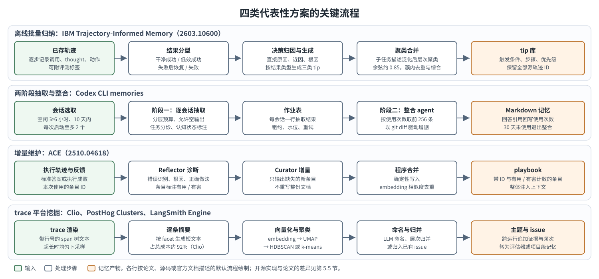

# 基于 Agent Trace 生成记忆：生成方法调研（研究、实现与产品）

> 状态：调研报告
>
> 调研日期：2026-10-09（第四阶段方向 4 补充于 2026-10-10）
>
> 范围：从已存 agent trace 生成供同一 agent 使用的记忆——从轨迹生成经验记忆的研究、开源组件与实现、产品中的记忆机制、相邻与可迁移方向
>
> 相关报告：[《信号与选样调研》](memory-generation-signals-2026-10-09.md)（信号与选样：trace 挖掘、失败归因与评估、用户偏好、data agent）；[《输入、存储与评测调研》](memory-generation-input-storage-evaluation-2026-10-09.md)（输入、存储与评测：预处理、trace 标识、模型接口、存储与溯源、评测、公开数据集分析）。正文以书名号简称引用这两份报告的章节。

## 1. 概要

### 1.1 研究问题

Agent 运行时产生的 trace（模型调用、工具调用与返回、用户消息、最终结果及评估分数）被可观测平台持久化后，库中积累了同一 agent 在大量任务上的执行记录。本报告研究如何从这些已存 trace 中有策略地批量生成记忆，供产生 trace 的 agent 在后续任务中使用，目的是避免重复错误、复用已验证做法、遵循用户偏好，场景优先 code agent 与 data agent。问题包含输入加工、选样与分组、生成方法、整合与生命周期、存储与溯源、与评估和归因的关系、偏好与 data agent 的特殊性、评测八个子问题（第 2.1 节）。

### 1.2 调研范围与方法

本报告是"基于 Agent Trace 生成记忆"调研的三份报告之一，覆盖生成方法：从轨迹生成经验记忆的研究（第 4 节）、开源组件与实现（第 5 节）、产品中的记忆机制（第 6 节）、相邻与可迁移方向（第 7 节），综合分析与证据边界见第 8、9 节。信号与选样（trace 库挖掘、失败归因与评估、用户偏好、data agent）见《信号与选样调研》；输入、存储与评测（trace 预处理、trace 标识、模型接口、存储与溯源、评测、公开数据集分析）见《输入、存储与评测调研》。三份报告的调研过程与证据分级相同，概述如下。

调研分四个阶段，检索截至 2026-10-09（第 3 节）。第一阶段做广度覆盖，包括从轨迹生成经验记忆的论文、开源记忆组件、产品记忆机制、trace 库挖掘与失败归因、存储溯源与评测、data agent、与评估归因的耦合七个方向；第二阶段针对第一阶段的空白拓展 trace 预处理与结果判定、用户偏好、近似 trace 与选样、开源实现源码深读、评测方法五个方向；第三阶段补充 trace 标识与内容采集、生成侧模型接口两项基础事实；第四阶段回到全文与一手来源核实约 30 项被结论引用的说法，补充相邻方向与 2026 年 7–10 月的新工作，并就写入前验证、生成模型的选择与开源组件补充（OpenViking、Mem0）做专题调研（该专题的材料读取于 2026-10-10）。方法包括阅读 arXiv 全文、在固定 commit 上只读源码、阅读官方文档与 changelog、在 Open-SWE-Traces 与 Who&When Pro 等公开数据集上做统计。证据分为原文或源码核实、据摘要、二手资料、未核实与公开数据统计五级（第 3.6 节），据摘要、二手资料、未核实三级在句末括注，公开数据统计注明样本与方法；与第四阶段核实结果冲突的说法按核实后的口径书写。

### 1.3 主要发现

1. 2026 年出现一批直接以已存轨迹为输入、离线批量运行的工作（IBM 2603.10600、WISE-Flow、Trace2Skill、SkillBoost、CONTRAMEM 等），设计重点集中在选样、分组、对比、合并、验证门控与溯源六个环节；表 4-2 收录的 74 项工作中，未见以多层 span 树为输入或以 span 为溯源锚点的工作（第 4.5、4.8.5 节）。
2. 批量方式有直接对比：按任务聚合多条轨迹归纳比逐轨迹归纳成功率约高 6%（WISE-Flow，原文未说明为绝对差还是相对差）；并行提议加层次合并 65.83%、约 3 分钟，逐条顺序更新 61.83%、约 60 分钟（Trace2Skill）；流式反复合并比整池一次合并低 17–38 个百分点（2605.12978）（第 4.8.4 节）。
3. 选样上，含失败轨迹的反馈更常产生被采纳的更新（Feedback Dynamics 中 11 次被选中的更新全部来自含失败的条件，据摘要；ReasoningBank 加入失败轨迹 46.5→49.7），仅用成功轨迹归纳流程同样有大幅收益（LEGOMem、AMD，据摘要）（第 4.8.1 节）。
4. 验证门控（候选条目或修订生效前的验证与准入判断）在技能、harness 与 prompt 演化研究中已普遍采用：检索范围内 15 组有 / 无门控消融方向一致（均为作者自报），其中 5 组去掉门控后低于或持平于基线——EDGE 72.3 低于不用经验的 GRPO 82.1（该门控决定经验是否进入 RL 损失与蒸馏，作用于训练信号）、OpsHarness 末段 0.33 低于不演化的 0.43、Crystallization 无门控的卡片库比无记忆低 2.03 个百分点、WebXSkill 55.2 低于无技能 59.7、GRASP（K=1）40.1 与无技能 40.6 持平。在可检索经验条目的生成工作与产品中，候选级门控仍是少数做法；验证集只有 10–14 题时门控近似保守的噪声过滤（Recuris），验证消耗可占优化预算的一半（第 4.7、4.8.6 节、《信号与选样调研》第 5.4、7.7 节）。
5. 自动构建与检索的记忆在编码任务上多数没有收益：VibeMemBench 中 12 组有 11 组未超过无记忆基线，直接注入已验证经验的 1.1–4.5 个百分点增益置信区间均跨零；已报告增益多在 1–5 个百分点，检出需要数百至上千个配对运行（估算）；整合质量分与真实迁移不相关（ρ=−0.24，n=12，置信区间跨零，据摘要）（第 4.6、4.7 节、《输入、存储与评测调研》第 8.3、8.8 节）。
6. 开源实现均先把 trace 压平为文本；溯源最细到 span_id（altk-evolve），且在合并后丢失；论文中的结果分型、去重、计数与门控在源码中多处缺失或失效（ACE 去重只写日志、ReMe 0.2 去重读错字段、SkillBoost 零增益候选可通过门控）（第 5.4、5.5 节）。开源组件中 OpenViking（v0.5.0）给出"轨迹 → 操作契约 → 可泛化经验"的两级抽取模板与"经验 → 轨迹"的版本提交溯源，相应功能默认关闭；Mem0 2.x 的开源写入只做 ADD 且跳过 tool 消息，常作为会话事实记忆的对照基线（第 5.2、5.3 节）。
7. 产品中 Codex CLI 的"逐会话抽取 + 全局整合"流水线公开最完整（会话选取条件、作业租约与水位、diff 驱动遗忘、使用回写）；以外部结果信号驱动规则晋升的有 Cursor Bugbot 与 Augment Code Review Memory，晋升与停用齐全的只有 Bugbot；Bugbot 整体 resolution rate 自 2025-07 的 52% 升至约 78%（自报），Learned Rules 的单独贡献未报告；个人偏好出现由批量整合转向会话中即时写入的案例（Claude.ai 2026-08 改版）（第 6 节）。
8. 相邻方向（过程挖掘、AIOps 与案例推理、trace 驱动的 prompt 与程序优化、参数化固化、Agent Skills 生态、软件工程经验挖掘、查询日志挖掘）都采用"选样 → 归一化 → 归并 → 泛化 → 验证门控 → 反馈淘汰"的结构，可迁移做法多数处在归一化、分组与门控三个环节；外置记忆在未见任务与需要删除、溯源的内容上优于参数化，技能与系统提示受描述预算与过拟合约束（第 7.8、7.9 节）。
9. 生成记忆的模型按部署形态分化：会话内即时写入由会话模型完成；后台或离线流水线均把生成模型与会话模型解耦、单独配置，默认配置集中在"廉价档模型逐条抽取、中档或强模型跨会话整合"（Codex 阶段一 `gpt-5.6-luna`、阶段二 `gpt-5.6-terra`；Clio 与 LangSmith Engine 以 Haiku 档做逐条抽取或筛查；13 个给出默认值的开源组件中 8 个默认 mini / haiku 档），Managed Agents Dreams 只支持 Opus、Sonnet、Fable 档；研究实验多让同一模型兼任执行者与生成者。生成模型更强时记忆通常更好，收益随使用方能力递减：使用方为 GPT-3.5 或 7B 级时换用强模型生成提升 7.0（ExpeL）至 47.4 个百分点（SkillRL），使用方较强时为 0.2–3.3 点（ACE、ReMe、SkillRL）；自生成记忆对来源模型略优，跨模型迁移多数仍为正（Memory Transfer Learning、Trace2Skill）（第 4.8.7、5.6、6.4 节）。

### 1.4 主要倾向

下表为现有证据下更可取的做法及其适用条件，依据与证据强度见第 8 节。本表只列与本报告主题相关的环节。

表 1-1 主要倾向及其适用条件

| 环节 | 更可取的做法 | 适用条件 |
|---|---|---|
| 生成 | 逐 trace 抽取（可并行、可缓存）加分组后一次性整合；并行提议、层次合并，LLM 只输出增量操作与归属关系，合并由程序执行；输入保留回查原始 span 的能力；偏好条目保留原话、来源与适用条件 | 抽取结果按 trace 缓存；生成接口以 `json_object` 加客户端校验为公共子集 |
| 验证 | 新条目先处于候选状态，经环境只读核验、历史 trace 重放不退化或留出集对照后生效；data agent 以执行结果门控；只有离线 trace 时组合使用对照源 trace 的依据校验、trace 内已记录的执行侧信号、跨 trace 的独立支持与按时间切分的影子回放；同模型自评与操作级质量分只用于过滤 | 有只读环境、可重放环境或留出集；验证集需有代表性（小验证集上门控近似随机拒绝）；验证成本可占预算的一半 |
| 生成模型 | 逐 trace 抽取用廉价档模型并行、可缓存，跨 trace 整合与冲突消解用中档或强模型、单写者执行；成败判定用执行侧信号；生成模型 ID 与 prompt 版本记入溯源 | 使用方为小模型时生成侧换用更强模型收益最大；使用方已较强时同档或低一档即可（推论） |

### 1.5 主要开放问题

- 多层 span 树作为生成输入的收益、压缩对抽取质量的影响，均无直接消融。
- 无标签 trace 上 judge 误差对记忆质量的影响，以及纯离线 trace 库上各类门控方式（依据校验、执行侧信号 verifier、跨 trace 独立支持、影子回放、只读环境核验）的效果比较，缺少实证；经验条目类工作中逐条门控的证据只有少数几项。
- 在 code agent 与 data agent 的生产 trace 上，"会话内同一模型即时写入"与"离线独立模型批量生成"之间、离线抽取模型档位之间，均无公开对照；产品的生成模型选型理由未公开。
- 整合环节的投毒（少量一致记录即可越过频次门槛）与代码库、schema 演化后的记忆失效，缺少成熟方案。

## 2. 问题与术语

### 2.1 研究问题

Agent 运行时产生 trace：用户消息、模型调用、工具调用及其返回、最终结果，以及关联到这些对象的评估分数。trace 平台把它们持久化后，库中积累了同一 agent 在大量任务上的执行记录。本报告研究的问题是：从已存的 agent trace 中有策略地批量生成记忆，供产生这些 trace 的 agent 在后续任务中使用。记忆服务于三个目的：避免重复已经出现过的错误；复用已经验证有效的做法；遵循用户表达过的偏好与约定。场景上优先 code agent（修复 issue、实现功能、运行测试）与 data agent（text-to-SQL、数据分析、数据整理），两者的结果都可以通过执行（测试、查询结果）验证，且都有公开的执行轨迹数据（《输入、存储与评测调研》第 9 节）。

问题的限定如下：

- **输入为已存 trace**。生成在 agent 运行之外的后台或离线流程中进行，可以跨会话、跨任务观察。会话内由主 agent 即时写入记忆的做法（如 GitHub Copilot 的 `store_memory`、Claude Code auto memory，第 6 节）作为对照。
- **有策略**。库中 trace 的数量远超可逐条调用模型的预算，需要决定哪些 trace 进入生成（选样）、按什么单位做对比与归纳（分组），以及预算如何分配。
- **批量**。生成以批为单位运行，包含逐条 trace 的抽取与跨 trace 的整合，需要处理增量、去重、冲突与淘汰。
- **使用方为同一 agent**。记忆以文本可读的条目注入该 agent 的上下文。把经验固化进模型权重属于相邻方向（第 7 节）。

该问题可拆分为以下子问题：

表 2-1 子问题与对应章节

| 子问题 | 内容 | 主要章节 |
|---|---|---|
| 输入加工 | span 树的渲染、压缩与任务切分；无标签 trace 的结果判定；trace 中可用的标识字段 | 《输入、存储与评测调研》第 4、5 节 |
| 选样与分组 | 选取哪些 trace；同任务与近似任务分组；预算分配 | 第 4 节、《信号与选样调研》第 4 节、《输入、存储与评测调研》第 9 节 |
| 生成方法 | prompt 与流水线；成败分路；对比归纳；生成后校验 | 第 4、5、6 节 |
| 整合与生命周期 | 合并、去重、冲突消解、更新操作、遗忘 | 第 4、5 节、《输入、存储与评测调研》第 7 节 |
| 存储与溯源 | 存储形态；记忆到 trace / span 的回指 | 《输入、存储与评测调研》第 7 节 |
| 与评估、归因的关系 | outcome 信号、归因输出、记忆效用的反向统计 | 《信号与选样调研》第 5 节 |
| 偏好与 data agent | 偏好信号的识别与写入门槛；data agent 特有的记忆类型 | 《信号与选样调研》第 6、7 节 |
| 评测 | 基准、指标、数据泄漏 | 《输入、存储与评测调研》第 8 节 |

### 2.2 术语

表 2-2 术语

| 术语 | 定义 |
|---|---|
| 记忆（memory） | 从历史执行中生成、持久保存、在后续任务中注入 agent 上下文的文本条目。本报告的记忆指跨任务持久的外置记忆；单次任务内的上下文与 scratchpad（工作记忆）以及模型权重不在此列 |
| trace / span | 采用 OpenTelemetry（OTel）的定义。trace 是一次端到端执行，由若干 span 组成树；span 是其中的一次操作，带 `trace_id`、`span_id`、`parent_span_id`、起止时间、状态与属性。OTel GenAI 语义约定把 agent 的操作区分为 `invoke_agent`、`chat`（一次模型调用）、`execute_tool` 等。Langfuse 中对应的对象为 trace 与 observation |
| 会话（session） | 同一用户与 agent 的一段连续交互，可包含多个 trace；OTel 中以 `gen_ai.conversation.id` 或 `session.id` 标识 |
| 经验记忆（experiential memory） | 从执行结果中总结的教训与策略，例如某类失败的原因与预防方法、失败后的恢复步骤、较优的处理方式。术语取自 Hu 等（2512.13564） |
| 偏好记忆 | 用户表达的、跨任务成立的要求与约定，例如代码风格、提交流程、输出格式、指标口径。信号主要来自用户消息中的纠正、明确要求与拒绝 |
| 程序性记忆（procedural memory） | 可按步骤执行的流程，例如工作流、SOP、技能文件（`SKILL.md`）、可复用脚本与已验证查询模板 |
| outcome | trace 或任务级的结果标签，例如单元测试判定的 resolved、环境 reward、评估分数、用户确认 |
| 信号来源类别（signal source type） | outcome 的来源类别：ground truth 或测试、执行信号（退出码、报错、空结果）、用户反馈、LLM judge、agent 自述。不同类别的可信度不同，同一 outcome 需要记录其来源类别 |
| 失败归因（failure attribution） | 在失败 trace 中定位出错的 agent、步骤与错误类型；结果可作为生成预防类记忆的输入（《信号与选样调研》第 5 节） |
| 溯源（provenance） | 记忆与其来源之间的可回溯关系：来源 trace / span、派生自哪些已有记忆、由哪一次生成运行产生。用途包括回源校验（回到来源内容核对记忆是否仍成立）、安全门控（按来源可信度过滤）与价值归因（《输入、存储与评测调研》第 7 节） |
| 阶段一 / 阶段二生成 | 两阶段生成流水线的两个环节：阶段一对单条 trace 或单个会话做抽取，可并行、可缓存；阶段二读取阶段一的产物做跨 trace 整合，通常串行、全局执行。OpenAI Codex CLI 的 Phase 1 / Phase 2 是该模式的典型实现（第 6 节）。注意与第 3 节中描述调研过程的"第一阶段"至"第四阶段"区分 |
| 成败并存 | 同一分组（如同一任务的多次执行）内同时有成功与失败的 trace，是做成败对比的前提 |
| 难度混杂（confounding） | 跨任务比较成功与失败轨迹时，任务本身的难度差异混入对比，对比得到的差异同时反映难度与 agent 行为 |
| 自述成功 | agent 在最后的输出中自称任务完成或成功，未经外部判定 |
| 晋升（升格） | 候选条目达到写入门槛后成为生效记忆，或从一种载体提升到更持久、作用范围更大的载体（如从可检索条目到技能文件） |
| 选样（selection） | 决定哪些 trace 进入生成，依据包括 outcome、是否同组成败并存、是否为失败后恢复、新颖度与预算 |
| 分组（grouping） | 把 trace 组织为对比或归纳的单位，例如同一任务、同一仓库或数据库、近似 trace 簇 |
| 整合（consolidation） | 把候选记忆并入已有记忆库：去重、合并、冲突消解、按支持频次保留、以增量操作（ADD、UPDATE、DELETE 等）更新 |
| 注入（injection） | 记忆进入 agent 上下文的方式：每次会话常驻加载的小体量条目、按任务相似度检索的条目、由 agent 通过工具按需读取的条目 |
| 个百分点（pp） | 两个百分比之间的差值单位。正文写"个百分点"，表格内简写为 pp；"%"只用于比例本身或相对变化 |
| GT | ground truth，标准答案或测试判定的真实结果 |
| harness / scaffold | 包裹模型的 agent 运行框架，含系统提示、工具定义、上下文管理与执行循环 |

### 2.3 综述分类法对照

表 2-3 综述分类法对照

| 综述 | arXiv / 时间 | 分类维度 | 类别 | 证据级别 |
|---|---|---|---|---|
| A Survey on the Memory Mechanism of LLM-based Agents（Zhang 等） | 2404.13501，2024-04 | 来源、形式、操作、评测 | 来源：inside-trial、cross-trial、external knowledge；形式：textual 与 parametric；操作：writing、management（合并、反思、遗忘）、reading | 原文 |
| From Human Memory to AI Memory（Wu 等） | 2504.15965，2025-04 | 对象 × 形式 × 时间 | 对象：personal / system；形式：parametric / non-parametric；时间：short-term / long-term，共 8 个象限 | 据摘要；象限细节为二手资料 |
| Rethinking Memory in AI（Du 等） | 2505.00675，2025-05，v3 2025-12 | 表示 + 原子操作 | 表示：parametric / contextual；操作：Consolidation、Indexing、Updating、Forgetting、Retrieval、Condensation | 二手资料 |
| Memory in the Age of AI Agents（Hu 等） | 2512.13564，2025-12，v2 2026-01 | Forms / Functions / Dynamics | Forms：token-level、parametric、latent；Functions：factual、experiential、working；Dynamics：formation、evolution、retrieval | 原文 |
| A Survey of Agent Memory in the Second Half（Huang 等） | 2602.06052，2026-01，v4 2026-08 | 载体、认知机制、主体 | 载体：内部参数、外部检索存储；认知机制：sensory、working、episodic、semantic、procedural；主体：user-centric personalization、agent-centric experience | 原文 |
| AI Meets Brain | 2512.23343，2025-12 | 按性质与持久性 | procedural experience 与 conceptual knowledge；轨迹内与跨轨迹 | 二手资料 |
| From Agent Traces to Trust | 2606.04990，2026-06，v5 2026-09 | 溯源视角 | 把记忆视为带来源、变换、修订、有效条件与后续影响的制品（provenance-bearing memory） | 据摘要 |
| Dynamic Agent Skills: A Lifecycle Survey | 2607.10113，2026-07 | 技能生命周期 | 8 个阶段：证据、提议、验证准入、存储、检索、维护、蒸馏、治理与溯源回滚；给出 skill-record schema 与 10 种库更新操作 | 据摘要 |
| Self-Evolving Coding Agents | 2608.03392，2026-08 | 演化对象 | 框架、记忆、技能、工具、workflow、上下文；挑战包括可逆性与反馈可靠性 | 据摘要 |

上述综述反映三点变化。第一，2025 年以后的综述以多维度取代单一的长期 / 短期划分（2512.13564、2602.06052），形态维度决定存储实现，功能维度决定生成与检索策略。第二，从 trace 生成的记忆主要落在 experiential 功能上，它横跨 episodic 与 procedural 两类认知术语。第三，2026 年出现两条新视角：以溯源为中心，把记忆看作数据血缘中的派生制品（2606.04990）；以技能为中心，把程序性记忆的生成、准入、维护与回滚组织成生命周期（2607.10113），并把记忆、技能、工具、workflow 并列为 agent 自我演化的对象（2608.03392）。

### 2.4 本报告使用的分类

本报告按"约束的来源"与"内容形态"把从 trace 生成的记忆分为四类：

表 2-4 从 trace 生成的记忆分类

| 类别 | 内容示例 | 主要信号来源 | 是否依赖成败标签 | 典型作用域 | 对应综述术语 |
|---|---|---|---|---|---|
| 偏好与约定 | 代码风格、提交前先运行 lint、输出格式、解释深度、指标口径 | 用户消息 span 中的纠正、明确要求、中断、拒绝；评分 | 不依赖，用户原话即证据 | 用户、项目、数据库 | Hu：factual；Huang：user-centric；Zhang：cross-trial |
| 环境与项目事实 | 仓库结构、构建命令、表与列的含义、编码值含义、数据质量问题 | 工具 span 的输出 | 不依赖 | 仓库、数据库、工作区 | Hu：factual；认知术语：semantic |
| 经验 | 失败原因与预防、失败后的恢复做法、较优策略 | 成败对比、失败定位、执行报错 | 依赖 outcome | 任务簇、仓库、数据库、工具 | Hu：experiential；Huang：agent-centric；AI Meets Brain：procedural experience |
| 程序 | 工作流、SOP、技能文件、已验证查询模板、可复用函数 | 成功 trace 中重复出现的步骤序列 | 依赖 outcome 与验证 | 任务簇、领域 | 认知术语：procedural；2607.10113 的 skill |

划分依据如下。偏好与经验的分界在于约束的来源：来源为用户意志的归偏好，来源为环境事实或执行结果的归经验。两者在证据稀疏度、写入门槛、作用域、失效方式与注入方式上都不同：偏好条目数量少、需要常驻且措辞须保留原话；经验条目数量多、按任务检索、可改写泛化（《信号与选样调研》第 6 节）。程序与经验的分界在于能否写成可执行的步骤，程序类适合以技能文件等版本化形态承载（第 7 节）。

单会话的情景记录（某次会话做了什么、结果如何，如 Codex 的 rollout 摘要）在本报告中作为证据层，用于溯源与再生成，不单列为记忆类别。data agent 的特有记忆按此划分归入：表列语义、编码值含义、数据质量问题、方言差异归为环境事实；已验证查询归为程序；指标口径既可能是组织规则也可能是个人偏好，归类取决于信号来自用户还是来自数据与执行结果（《信号与选样调研》第 7 节）。

其他章节沿用以下对应关系：流程、workflow、SOP、技能文件、已验证查询与可复用函数归程序；规则、教训、预防、恢复与优化类条目归经验；仓库结构、构建命令、表列语义、编码值等归环境与项目事实；用户的要求、纠正与口径约定归偏好与约定。产品或开源组件自带的分类在出现处注明对应类别。

## 3. 调研方向与过程

### 3.1 总体安排

调研分四个阶段进行，检索截至 2026-10-09，第四阶段方向 4 截至 2026-10-10。第一阶段做广度覆盖，第二阶段针对第一阶段暴露的空白做拓展与聚焦，第三阶段补充 trace 侧与模型侧两项基础事实，第四阶段做可信度核实并补充相邻方向与最新工作。

表 3-1 调研阶段与方向

| 阶段 | 方向 | 主要材料 |
|---|---|---|
| 第一阶段：广度调研 | 1 从轨迹生成经验记忆的论文；2 开源记忆组件；3 产品记忆机制；4 trace 库挖掘、聚类与失败归因；5 存储、溯源、生命周期与评测；6 data agent 的经验记忆；7 记忆生成与评估、归因的耦合 | 论文、源码、产品文档、规范、公开数据集 |
| 第二阶段：拓展与聚焦 | 1 trace 预处理与结果判定；2 用户偏好与纠正挖掘；3 近似 trace 判定、分组归纳与选样；4 开源实现源码深读；5 评测方法 | 论文、源码、公开数据集统计 |
| 第三阶段：补充 | 1 trace 标识与内容采集；2 生成侧的模型接口 | 规范、源码、服务文档 |
| 第四阶段：补充 | 1 可信度核实；2 相邻方向；3 2026 年 7–10 月新工作与覆盖缺口；4 写入前验证、生成模型、评测方法与组件补充（截至 2026-10-10） | 论文全文、官方文档与 changelog、固定 commit 源码 |

本报告涉及第一阶段方向 1–3、第二阶段方向 4 与第四阶段方向 1–4，下文只展开这些方向；其余方向见《信号与选样调研》与《输入、存储与评测调研》第 3 节。

### 3.2 第一阶段：广度调研

**方向 1：从轨迹生成经验记忆的论文。** 要回答的问题：现有方法以什么为输入，如何选取轨迹，产出什么内容、什么粒度，如何跨轨迹归纳，是否保留到源轨迹的溯源。检索范围为 2023–2026 年以工具调用、环境反馈等轨迹为输入生成记忆的 arXiv 论文，侧重 2025–2026 年，第一阶段收录 49 项（第四阶段补充 2026 年 7–10 月的新工作后，表 4-2 共 74 项）。方法为阅读 arXiv HTML 或 PDF 全文，数字注明表号或图号，并按"与对已存 trace 做有策略批量生成的契合度"给出 1–5 的相关度。主要产出为选取策略谱系（仅成功、成功与失败分别抽取、同任务成败对比、同任务多 rollout 组内对比、结果细分、不依赖标签）、粒度与触发谱系、跨轨迹归纳方法分类，以及批量方式的直接实证：按任务聚合多条轨迹归纳比逐轨迹归纳成功率约高 6%（WISE-Flow，2601.08158，原文未说明为绝对差还是相对差）；并行提议加层次合并 65.83%、约 3 分钟，逐条顺序更新 61.83%、约 60 分钟（Trace2Skill，2603.25158）；流式反复合并比整池一次合并低 17–38 个百分点（2605.12978）。发现的空白：保留 step 或 span 级溯源的工作很少；批量选样与预算分配缺少研究；没有工作以多层 span 树为输入。详见第 4 节。

**方向 2：开源记忆组件。** 要回答的问题：开源组件的抽取 prompt、触发逻辑、存储 schema、溯源与检索如何实现，哪些能消费工具调用轨迹。检索范围为 20 余个组件，包括 ACE（kayba-ai）、ReMe、Acontext、MIRIX、Cognee、claude-mem、MemOS、Letta、Mem0、LangMem、Graphiti、Honcho 等。方法为在固定 commit 的浅克隆中读源码，以带行号的永久链接记录，并把依据 README 或文档的说法与源码事实分开标注。主要产出为六种抽取流水线模式（单次抽取直接追加、抽取后比对更新、按结果信号分路、反思后以增量操作策展、分层巩固、实体图抽取）与更新操作语义的分类。发现：能以现成字段从记忆回溯到 trace_id 的有 ACE、claude-mem、altk-evolve 与 Cognee（仅 LIVE lesson），其中 altk-evolve 另带 span_id，且合并后丢失（第二阶段源码深读的结果，第 5.4 节）；Mem0 在推断抽取时跳过 tool 消息。详见第 5 节。

**方向 3：产品记忆机制。** 要回答的问题：coding agent 与助手产品如何从会话生成记忆，包括会话选取、触发时机、生成方式、存储、作用域、溯源、校验与遗忘、注入。检索范围为 13 个产品或机制：OpenAI Codex CLI、Claude Code、Anthropic memory tool、Claude Managed Agents、GitHub Copilot Memory、Cursor Memories 与 Bugbot Learned Rules、Windsurf Cascade、Devin Knowledge、Cline Memory Bank、Letta Code、ChatGPT，以及 Amp、Jules。方法：Codex 为开源实现，读取 `openai/codex` commit `82883da` 的流水线源码与 prompt 模板；其余依据官方文档、官方博客与 changelog，第三方材料单独标注。发现：触发频率从会话内即时写入到后台批量整合构成谱系；Codex 采用"逐会话抽取 + 全局整合"的两阶段流水线，Managed Agents Dreams、ChatGPT dreaming 同样把单会话处理与跨会话整合分开（公开到接口层面）；以外部结果信号驱动记忆规则晋升与停用、两者齐全的公开实践只有 Cursor Bugbot。详见第 6 节。

### 3.3 第二阶段：拓展与聚焦

**方向 4：开源实现源码深读。** 由第一阶段的组件调研引出：需要判断最接近"已存 trace → 记忆"的实现在源码中的实际行为。检索范围为 altk-evolve（IBM 2603.10600 与 2609.32091 的开源实现）、ACE、ReMe 0.2、claude-mem、Acontext、Cognee，以及论文配套代码 Trace2Skill、SkillBoost、Agent KB、Who&When、AgenTracer；WISE-Flow 未见开源代码。方法为在固定 commit 的浅克隆上只读源码，不安装、不执行，记录文件与行号。关键过程是逐项对照论文描述与源码行为，发现多处机制在源码中未生效：ACE 的去重步骤只写日志，MERGE / DELETE 执行代码在主路径上无调用方，离线运行时三个评价计数恒为 0；ReMe 0.2 的去重读取错误的字段名，与库内已有记忆的比较列表恒为空，删除流程调用依赖库中不存在的函数，验证响应缺失时默认放行；altk-evolve 合并后的条目不含源 trace ID，与论文"合并后保留全部源轨迹 ID"的描述不一致；SkillBoost 门控的默认阈值使零增益候选也能通过，与论文"正净增益"的表述不一致。发现：所有实现都先把 trace 压平为文本，只有 altk-evolve 直接读取 OTel / OpenInference span；溯源最细到 span_id（altk-evolve），且在合并后丢失。详见第 5 节。

### 3.4 第四阶段：补充

**方向 1：可信度核实。** 要回答的问题：被结论引用、但前三阶段只据摘要或二手资料的说法是否成立。范围为 26 组、约 30 项说法，覆盖失败归因准确率、记忆判定误差、偏好写入风险、编码记忆基准、簇稳定性阈值、产品记忆机制、开源框架行为、trace 平台规模、生成 prompt 的公开情况、评测标签误差、注入防护、模型 API。方法为回到 arXiv HTML 全文或 PDF、官方文档与 changelog、固定 commit 的源码，判定为"确认""更正""无法核实"三类，并对可复算的数字做复算。关键更正举例：Who&When（2505.00212）的 agent 级 53.5% 与 step 级 14.2% 来自两种不同方法、为四个设置的平均，长日志手工系统上 step 级只有 3.5%–8.8%，接近随机基线 4.2%；AgenTracer（2509.03312）"至多高 18.18%"无法从正文表格复算，表中最大绝对差为 17.4 个百分点；PASB 的两组为观察分组；VibeMemBench（2609.23570）直接注入的 1.1–4.5 个百分点增益置信区间均跨零，且目标按"注入经验有效"筛选；Claude Code Auto Dream 在官方文档与 changelog 中不存在，只能作为第三方逆向描述；Cursor Memories 已于 2.1.x 移除；LangSmith Engine 截至 2026-09-24 分析超过 7000 万条 trace；Raindrop 的官方描述为按描述训练的小模型分类器，与 embedding 聚类属于不同路线；Mem0 2.x 的开源写入只做 ADD。无法核实的项为 Claude Code Auto Dream 的细节与 ChatGPT 偏好遵循 71.3% 的官方出处。凡与核实结果冲突的说法，本报告以核实结果为准。

**方向 2：相邻方向。** 由前三阶段遗留的问题引出：跨任务成败对比混入难度差异；簇标识跨运行不稳定；一条经验应进入可检索记忆、技能、系统提示还是权重。检索范围为过程挖掘（trace 聚类、变体分析、偏差挖掘、决策挖掘、对象中心事件日志、概念漂移）与 AIOps（日志与告警聚类、历史事故检索、案例推理、复盘知识抽取）；trace 驱动的 prompt 与程序优化、参数化固化、Agent Skills 生态；软件工程经验挖掘（代码审查、修复历史、CI 日志、agent PR）与查询日志挖掘。发现：偏差挖掘的对比评测中，序列模式特征相比单活动计数几乎没有增益（1608.08252）；把对比限定在同一决策点或共享前缀上可缓解难度混杂；OpsHarness（2608.25661）去掉验证门控后末段准确率 0.33，低于完全不演化的 0.43；Drain3 的模板树显式产出簇变更事件，簇 ID 不随重跑改变；软件工程与 SQL 两个领域的成熟系统都采用"选样 → 归一化 → 聚类或频次统计 → 泛化 → 验证门控 → 反馈淘汰"的流水线；被拒的 agent PR 中只有 35.7% 明确归因于 agent 失败（2605.22534，据摘要）。详见第 7 节。

**方向 3：2026 年 7–10 月新工作与覆盖缺口。** 要回答的问题：前三阶段之后出现了哪些相关论文；隐私、删除、投毒与注入策略方面有哪些覆盖缺口。方法为逐篇阅读 arXiv 摘要页，按相关度记录；删除与投毒方向检索 2026 年 2–10 月的工作。发现：同任务多模型轨迹对比（CONTRAMEM，2608.22533）、只读环境中核验候选记忆后再写入（2609.11060）、技能的版本化与回放不退化门控（Skill-V，2610.11781）等新工作；源数据删除后派生记忆仍可见的级联问题及其修复（MEMOREPAIR，2605.07242；Agentic Unlearning，2602.17692）；两篇新综述（2607.10113、2608.03392）。限制：该方向证据多为摘要级；ICLR 2027 投稿尚未被索引，2026 年 10 月上旬的覆盖可能不全。详见第 4、7 节、《输入、存储与评测调研》第 7 节。

**方向 4：写入前验证、生成模型、评测方法与组件补充。** 由前述方向遗留的三个问题引出：验证门控的证据集中在少数工作，哪些研究线把门控作为常规环节、只有离线 trace 时有哪些可行方式尚不清楚；记忆由会话模型、独立模型、教师模型还是训练的小模型生成，各产品与组件如何配置；OpenViking 等 2026 年受关注的组件未纳入第一、二阶段。检索范围为以"gate / verification / admission / probation"为关键词的 2025–2026 年论文、prompt 与程序优化和代码审查工具中的同类机制、产品官方文档；生成模型方面为改变生成模型或教师模型的消融、跨模型迁移实验，以及 18 个开源仓库与 Codex 源码中的默认模型配置。方法为阅读 arXiv HTML 全文（约 40 篇，其余据摘要）、在固定 commit 上只读源码与提交记录（2026-10-10 读取）、阅读官方文档。发现：写入前门控在技能与 harness 演化研究中已是常规环节，在经验条目类工作与产品中不是；Grounding Agent Memory 摘要中的"39%→73%"为"无记忆 → 带环境探测的记忆"，探测本身的增量约 3 个百分点；后台与离线流水线均单独配置生成模型，默认集中在廉价档抽取加中档整合。详见第 4.5、4.8.6、4.8.7、5.2、5.6、6.4 节。

### 3.5 方向之间的衔接

表 3-2 方向之间的衔接

| 前一阶段发现的空白或问题 | 引出的方向 |
|---|---|
| 缺少选样策略；组内对比只按同一任务分组；簇标识不稳定 | 第二阶段方向 3（近似 trace 与选样）；第四阶段方向 2（过程挖掘、AIOps） |
| 开源组件文档与实现可能不一致 | 第二阶段方向 4（源码深读） |
| 结论引用了只据摘要或二手资料的数字 | 第四阶段方向 1（可信度核实） |
| 经验载体的分配、晋升与固化 | 第四阶段方向 2（优化、参数化、Agent Skills） |
| 删除级联、投毒与注入时机覆盖不足；2026 年下半年新工作 | 第四阶段方向 3 |
| 门控证据集中在少数工作，离线可行的验证方式不明；生成模型的配置与影响未系统整理；OpenViking 未覆盖 | 第四阶段方向 4 |

### 3.6 证据分级与核对方法

表 3-3 证据分级

| 级别 | 依据 | 报告中的标注 |
|---|---|---|
| 原文或源码核实 | arXiv HTML 或 PDF 全文、官方文档、官方博客、changelog、固定 commit 的源码、HF 数据卡与 API | 不加标注 |
| 据摘要 | 只读 arXiv 摘要页或项目首页 | 句末括注"据摘要" |
| 二手资料 | 搜索摘录、第三方文章、其他论文的转述 | 句末括注"二手资料" |
| 未核实 | 一手来源不可访问，或官方来源中不存在该说法 | 句末括注"未核实" |
| 公开数据统计 | 在公开数据集上按给定样本与方法所做的统计 | 注明样本、方法与结论边界（《输入、存储与评测调研》第 9 节） |
| 推论 | 由已核实的事实推出、尚无实验或文献直接验证的判断 | 句末括注"推论"；设计取向的判断写作"调研倾向（推论）" |
| 估算 | 按公开数字与写明的假设计算得到、未经实测的量 | 句末括注"估算"，并写明假设 |

表格中的"证据"或"级别"列以"原文""摘要"（或"据摘要"）"二手资料""未核实"表示同样的级别，官方文档与工程博客注明来源类型；单元格内的数字只据摘要时，在该单元格括注"据摘要"。

核对方法如下：

1. 论文数字注明表号、图号或节号，并记录实验条件（模型、数据子集、种子数）。同一数字在摘要与正文中口径不同时，以正文表格为准；不能从表格复算的数字注明"作者称"。
2. 源码事实记录仓库、commit 与文件行号。论文描述与源码行为不一致时，两者分别陈述（第 5.5 节）。
3. 产品能力与平台规模属于时效信息，注明官方来源的发布日期；官方页面无法访问时，注明核对途径（如官方 RSS 与检索摘录）。
4. 公开数据集统计只读取所需的列，并以总量交叉校验（例如 Open-SWE-Traces 各组合的成功与失败轨迹之和等于全集的带标签轨迹数）。
5. 第四阶段的核实独立于前三阶段重新取证；前三阶段中被更正的说法在本报告中按更正后的口径书写，无法核实的项不作为结论依据。

## 4. 从轨迹生成经验记忆的研究

本节梳理以 agent 轨迹（trajectory，指一次任务执行中的推理、工具调用与环境反馈序列，在 trace 存储中对应一棵 span 树）为输入、生成经验、规则、workflow 或技能的研究，时间范围为 2023 年至 2026-10。第 4.1 节给出总览；第 4.2–4.6 节按时间与主题分组介绍机制与数字；第 4.7 节汇总风险与负面结果；第 4.8 节做横向分析。四类代表性方案的关键流程见图 1。

图 1 中 Codex 一行的"分层预算"只属于 v2 流水线；默认的 v1 流水线按 token 截断输入（第 6.2 节）。

本节使用以下术语：

表 4-1 本节术语

| 术语 | 含义 |
|---|---|
| 选取策略 | 哪些轨迹进入生成，以及成败如何判定（GT 为 ground truth，即标准答案或测试结果） |
| 跨轨迹归纳 | 把多条轨迹或多条候选条目合并为更一般的条目，对应综述 2605.06716 中的 Experience 阶段 |
| 验证门控 | 写入前的验证与准入判断：候选条目或候选修订经独立检查（重放、留出集、执行、环境查询、依据校验、人工确认）通过后才生效；只按结果筛选输入轨迹的"来源筛选"不计入（第 4.8.6 节） |
| 生成模型 | 执行抽取、反思、整合等生成环节的模型，可与使用记忆的 agent 模型相同或不同（第 4.8.7 节） |
| 溯源 | 记忆条目到源轨迹、源 step 的关联 |
| 相关度 | 1–5，衡量与"对已存 trace 有策略地批量生成经验记忆"的契合程度 |

### 4.1 总览

表 4-2 收录以轨迹为输入生成经验、技能或 workflow 的工作，以及直接检验生成方式的实证研究。综述、生命周期框架、投毒与注入策略类工作见第 4.6、4.7 节。证据列中"原文"表示读过 arXiv 全文核实，"摘要"表示数字与机制只来自摘要页。

表 4-2 从轨迹生成经验记忆的研究总览

| 工作 | 年份 | arXiv | 输入 | 选取策略 | 内容类型 | 粒度 / 跨轨迹归纳 | 存储 | 溯源 | 相关度 | 证据 |
|---|---|---|---|---|---|---|---|---|---|---|
| Reflexion | 2023 | 2303.11366 | 完整轨迹 + 结果信号 | 同任务失败重试 | 反思文本 | 每 trial；无 | 滑动窗口文本 | 隐式 | 2 | 原文 |
| ExpeL | 2023 | 2308.10144 | 逐步元组轨迹 | 同任务成败对 + 成功分块，GT | insight + 成功案例 | 离线批量；ADD/EDIT/投票 | 文本 + Faiss | 无 | 5 | 原文 |
| CLIN | 2023 | 2310.10134 | trial 轨迹 + reward | 每 trial；最佳 trial 做 meta | 因果抽象句 | 每 trial；跨环境 meta-memory | 文本列表 | 无 | 3 | 原文 |
| Synapse | 2023 | 2306.07863 | 状态抽象后的轨迹 | 仅成功 | 原轨迹示例 | 每任务；无 | 向量（任务元数据） | 是 | 3 | 原文 |
| Voyager | 2023 | 2305.16291 | 代码执行反馈 | 仅成功，LLM critic | 技能代码 | 每任务；无 | 向量（描述） | 未述 | 2 | 原文 |
| TRAD | 2024 | 2403.06221 | step 级专家轨迹 | 仅专家 | step 示例 + thought | 每 step；无 | 向量（thought） | 是 | 4 | 原文 |
| AutoGuide | 2024 | 2403.08978 | 离线轨迹，step 对齐 | 同任务成败对，首个分歧 step | 条件规则 | 每对；context 等价复用 | context→规则字典 | 未述 | 5 | 原文 |
| AutoManual | 2024 | 2405.16247 | 轮次轨迹 + 反馈 | 3 类结果结合错误归因，共 5 种情形 | 6 类规则 + 手册 | 每 episode；超限合并 | 结构化规则 | Validation Logs | 4 | 原文 |
| ICAL | 2024 | 2406.14596 | 次优多模态轨迹 | 次优亦可，人类反馈 | 修订示例 + thought | 每轨迹；无 | 多路相似度 | 一对一 | 3 | 原文 |
| AWM | 2024 | 2409.07429 | step 序列 | 仅成功，GT 或 LLM 评估 | workflow | 按网站批量归纳 | 文本 | 无 | 5 | 原文 |
| Mobile-Agent-E | 2025 | 2501.11733 | 任务、计划、动作与错误历史 | 每任务反思 | Tips + Shortcuts | 每任务；无 | JSON | 未述 | 4 | 摘要 |
| ASI | 2025 | 2504.06821 | 清洗后 step 序列 | 仅成功，LLM 评估 + 重放 | 技能代码 | 每 episode；无 | 动作空间 | 未述 | 3 | 原文 |
| SkillWeaver | 2025 | 2504.07079 | 探索轨迹 | 仅成功，LLM reward | API + Usage Log | 探索迭代 | API 库 | 部分 | 2 | 原文 |
| Dynamic Cheatsheet | 2025 | 2504.07952 | 单轮答案 | 自评 | 策略 + 代码片段 | 每 query 整块重写 | 文本 | 无 | 2 | 原文 |
| AgentRR | 2025 | 2505.17716 | UI/API 动作 + 状态 | 重放验证 | 多层经验 + check function | 每 trace；多 trace 取共性 | 设想 JSON/图 | 元数据 | 3 | 原文 |
| G-Memory | 2025 | 2506.07398 | 多 agent utterance 图 | 成败对比，环境判定 | insight + 稀疏轨迹 | 每 query；insight 合并 | 三层图 | 是（支持集） | 4 | 原文 |
| Agent KB | 2025 | 2507.06229 | 异构框架 step 级日志 | 成功 + 失败，GT | workflow + 片段 | 离线；阈值 + LLM 择优 | JSON + 混合检索 | 数据集级 | 4 | 原文 |
| SWE-Exp | 2025 | 2507.23361 | 修复过程 step 序列 | 成败分 prompt，测试 | 理解 + 修改经验 | 每轨迹；无 | 向量（issue_type） | issue ID | 4 | 原文 |
| Mem^p | 2025 | 2508.06433 | 完整轨迹 + reward | 对比多种 update 策略 | 轨迹 + Script | 每任务；无 | 向量 | 任务级 | 3 | 原文 |
| Memento | 2025 | 2508.16153 | (任务, 计划, 成败) | 成功 + 失败 | 案例 | 每任务；无 | 向量 / 学习 Q | 无 | 2 | 原文 |
| Memory-R1 | 2025 | 2508.19828 | 对话轮次 | 下游精确匹配（EM）为奖励 | 事实 | 每轮 CRUD | 文本 + 向量 | 无 | 3 | 原文 |
| H²R | 2025 | 2509.12810 | step 级轨迹 | 同任务成败对比 | 子目标 SOP + insight | 任务 / 子目标两层 | 向量 | 部分 | 4 | 原文 |
| ReasoningBank | 2025 | 2509.25140 | 任务级轨迹 | 成败分 prompt，LLM judge | 策略条目 | 每 query；追加 | JSON + 向量 | 条目级 | 4 | 原文 |
| Mem-α | 2025 | 2509.25911 | 文本流 | RL 组合奖励 | core/语义/情景 | 每块 | 文本 + BM25 | 时间戳 | 3 | 原文 |
| ACE | 2025 | 2510.04618 | 执行轨迹 + 反馈 | 以失败为主，GT 或执行信号 | playbook bullet | 每样本 delta；embedding 去重 | bullet + 计数 | 使用记录 | 5 | 原文 |
| LEGOMem | 2025 | 2510.04851 | 多 agent 团队日志 | 仅成功 | orchestrator / worker 两层 | 离线一次生成 | FAISS | 未述 | 5 | 摘要 |
| Training-Free GRPO | 2025 | 2510.08191 | 组内 rollout 的 step 摘要 | 同任务组内成败对比 | 短经验 | 每 batch 统一更新 | 文本列表 | 无 | 3 | 原文 |
| EvolveR | 2025 | 2510.16079 | 轨迹 + 结果 | 成败分型，GT | 原则 + 三元组 | 离线；阈值 + 等价合并 | Milvus | 是 | 4 | 原文 |
| FLEX | 2025 | 2511.06449 | 推理轨迹 | 成功入 golden，失败入 warning | 三层经验 | 每轨迹；相似合并 | 分层库 | 无 | 3 | 原文（部分） |
| Evo-Memory | 2025 | 2511.20857 | (输入, 输出, 反馈) | 不过滤 | 案例 | 流式；剪枝 | 向量 | 原始即来源 | 2 | 原文 |
| ReMe | 2025 | 2512.10696 | 同任务 8 条轨迹 | 成功 + 失败 + 对比，GT | 结构化经验 | keypoint；去重 + 效用删除 | Elasticsearch | 来源 query | 5 | 原文 |
| MemEvolve | 2025 | 2512.18746 | 轨迹 | 依系统而定 | 演化记忆架构 | 外环架构搜索 | 模块化 | 未述 | 3 | 原文 |
| MemRL | 2026 | 2601.03192 | 摘要后轨迹 + 奖励 | 成功写 script，失败写反思 | (意图, 经验, Q) | 每任务；无合并 | 向量 + Q | 未述 | 4 | 原文 |
| WISE-Flow | 2026 | 2601.08158 | 事件流（含 API 返回码） | clean / recovered / failure 配对 | 带前置条件的 workflow | 按任务离线聚合；三遍校验 | JSON + FAISS | 未链接源轨迹 | 5 | 原文 |
| Darwinian Memory | 2026 | 2601.22528 | GUI 执行轨迹 | 过滤单动作片段 | 子任务记忆单元 | ≤5 步；存活值淘汰 | 记忆池 | 未述 | 5 | 摘要 |
| MemSkill | 2026 | 2602.02474 | 对话 / 轨迹切片 | 困难样本聚类 | 抽取技能 | 每 100 步改技能 | 技能库 | 技能快照 | 4 | 原文 |
| SkillRL | 2026 | 2602.08234 | 完整轨迹 | 成功 + 失败，教师模型 | 通用 / 类别技能 | 低成功率类别触发 | 向量 | 无 | 3 | 原文（部分） |
| IBM 轨迹记忆生成 | 2026 | 2603.10600 | step 级轨迹 + 标签 | 干净 / 低效 / 恢复 / 失败 | 三类 tip | 任务 / 子任务；聚类合并 | 向量 + 元数据 | trace ID + step 区间 | 5 | 原文 |
| Trace2Skill | 2026 | 2603.25158 | 完整轨迹 | 成败分析师，GT | 技能目录 patch | 并行 + 层次合并 + 频次 | 文件 | 无 | 5 | 原文 |
| WebXSkill | 2026 | 2604.13318 | step 级合成轨迹 | 成功 + 失败，执行验证 | 参数化技能 | 每轨迹；三级查重 | URL 技能图 | start_url | 4 | 原文 |
| 安全风险研究 | 2026 | 2604.16968 | AWM / ReasoningBank 经验 | 良性任务 | — | — | — | — | 4 | 原文 |
| Useful Memories Become Faulty | 2026 | 2605.12978 | 轨迹 / 解答 | 构造为有用 | 规则 / workflow | 整池 vs 分组 vs 流式 | 上下文 | — | 4 | 原文（前半） |
| SkillOpt | 2026 | 2605.23904 | rollout + verifier | 成败分批反思 | 技能文档 | 编辑操作 + 验证集门控 | Markdown | 编辑报告 | 4 | 原文 |
| OPD-Evolver | 2026 | 2606.17628 | step 级 + 使用日志 | 成功 + 失败 | traj/tip/skill/tool | 每 30 任务维护 | 向量 | 记忆 ID | 5 | 原文 |
| PMD | 2026 | 2607.01480 | 单轮 rollout + verifier | 成败对比 | 经验/insight/behavior | 每 K 步聚类抽象 | 文本 + 向量 | 题目 ID | 4 | 原文 |
| EvoSOP | 2026 | 2607.07321 | 工具调用日志 | 不区分成败 | SOP 代码 | mini-batch；Merger + Reviewer | 工具函数 | 消息编号 | 4 | 原文 |
| Tool-Making | 2026 | 2607.08010 | 生产轨迹 + 后端 schema | 重复 SOP 步骤 | 带版本工具 | 部署前离线 | 工具版本 | 版本级 | 4 | 摘要 |
| SciConsolidate | 2026 | 2607.24459 | 已验证成败执行 | 成败对比 | 跨任务流程 → 代码 | 开发集验证门 | 注入或 SFT | 未述 | 3 | 摘要 |
| SkillBoost | 2026 | 2607.26643 | step 级轨迹 | 失败诊断 + 成功回归 | SKILL.md | 整集；根因聚类 + 接收门控 | 版本化文件 | 版本级 | 5 | 原文 |
| Feedback Dynamics | 2026 | 2608.02636 | skill 演化反馈轨迹 | 成+败 / 仅败 / 仅成对照 | skill 更新候选 | 多轮 | — | — | 4 | 摘要 |
| MERIT | 2026 | 2608.05906 | text-to-SQL 修复轨迹 | oracle 验证的修正 + 失败方向 | 正负两类记忆 | 每 episode；无 | lexical + dense | 未述 | 3 | 摘要 |
| AMD | 2026 | 2608.07169 | 教师成功轨迹 | 仅成功 | Workflow/Subtask/Function | 离线三层蒸馏 | 未述 | 未述 | 4 | 摘要 |
| QCR | 2026 | 2608.12847 | 完整轨迹 | 仅 checker 通过 | 原轨迹 + 查询时笔记 | 每轨迹；近重复去除 | 向量 | 审计元数据 | 3 | 原文 |
| EDGE | 2026 | 2608.21946 | 完整轨迹 | 薄弱类别一成一败 | 条件原则 | 每步 ≤3 条；Δe 剪枝 | 向量 | 无 | 4 | 原文 |
| CONTRAMEM | 2026 | 2608.22533 | 同任务多模型轨迹 | 正确性/效率/恢复/失败对比 | Function / Skill Card | 离线分批；局部编辑 | 卡片文本 | 未述 | 5 | 摘要 |
| Recuris | 2026 | 2608.24876 | 结构化执行证据 | 失败归因到记忆组件 | Skill Memory | 局部更新，dev 集验证 | 未述 | 未述 | 3 | 原文 |
| HarnessEvolve | 2026 | 2609.00829 | 失败轨迹 + 参考轨迹 | 对齐参考轨迹 | prompt/skill/工具/逻辑 | batch/epoch；失败模式聚类 | 快照 | 快照版本 | 4 | 原文 |
| APEx | 2026 | 2609.02253 | 交互历史 | RL 训练 | 轨迹记忆 + 流程 skill | 实例级 + 类别级 | 未述 | 未述 | 3 | 摘要 |
| AgentBrew | 2026 | 2609.05837 | 未过滤原始轨迹 | 无验证器 | 权重 | 批量 | 权重 | — | 3 | 摘要 |
| Grounding Agent Memory | 2026 | 2609.11060 | 任务结束后完整轨迹 | 全部进入候选 | 环境事实 + 操作经验 | 异步；环境只读探测 | 未述 | 作者称可审计 | 5 | 原文 |
| EchoPath | 2026 | 2609.16635 | 已验证 GUI 轨迹 | 仅已验证 | 参数化可重放过程 | 每轨迹 | 过程库 | 验证溯源 | 5 | 摘要 |
| EvoSkill-GUI | 2026 | 2609.17653 | 失败轨迹 | 隔离 critic 诊断 | 多文件技能包 | 每失败 | 文件 | 失败案例 | 4 | 摘要 |
| DENSE | 2026 | 2609.21423 | step 级轨迹 | 不用结果标签 | 证据锚定子任务树 | 单轨迹内层次化 | 结构化文本 | action ID | 3 | 原文 |
| MACE | 2026 | 2609.21533 | 多 agent 协作轨迹 | 全部 | 功能单元子图 | 按使用结果更新 | 图 | 未述 | 3 | 摘要 |
| SkillPivot | 2026 | 2609.29154 | 失败轨迹 + 教师续写 | 失败分叉点 | 局部条件化 skill 编辑 | 每条失败 | 未述 | 未述 | 4 | 摘要 |
| Memory as Middleware | 2026 | 2609.32091 | 轨迹 + 对话 | 未述 | guideline/fact/policy | 子任务；控制面合并 | 向量 + 原文指针 | 是 | 4 | 原文 |
| SkillVine | 2026 | 2609.32731 | skill 演化轨迹 | — | skill 库 | 主干 / 分支图搜索 | 版本化库 | 版本级 | 3 | 摘要 |
| Epistemics of Agent Memory | 2026 | 2609.33013 | agent traces | 学习 episode 边界 | 保留/压缩/抽象/遗忘 | 预算化提升 | 未述 | 未述 | 5 | 摘要 |
| MATE | 2026 | 2609.35808 | 检索到的轨迹 | — | 条件—动作—效果 | 确定性转换，无 LLM | — | — | 3 | 摘要 |
| SkillSpec | 2026 | 2610.00704 | 优化轨迹（含被拒候选） | 配对评估一致通过 | skill 结构 | flat / graph / hybrid | 未述 | 未述 | 3 | 原文（机制）；数字据摘要 |
| SAGA | 2026 | 2610.06964 | 交互轨迹 | 未述 | 情景 / 流程 / 原则三层 | 在线 | 未述 | 每层链接执行证据 | 4 | 摘要 |
| Skill-V | 2026 | 2610.11781 | 任务结果 + 契约评估 | 失败触发新建 | 版本化契约 skill | 历史重放不退化 | 版本化库 | 版本级 | 4 | 原文 |
| SkillForge | 2026 | 2610.09832 | rollout + fitness | 基础模型预淘汰 | skill | 四状态生命周期 | 未述 | 淘汰事件 | 4 | 原文 |
| SkillMorph | 2026 | 2610.11858 | 多运行多任务成败轨迹 | 成败均取 | code agent skill 修订 | 按演化轮次 | 文件 | 证据→内容链接 | 4 | 摘要 |

另有相关度 ≤2 的工作未列入：MEM1（2506.15841）与 MemAct（2510.12635）为单 episode 内工作记忆压缩；Multi-Agent Transactive Memory（2606.19911）存原始 5 步片段；DecentMem（2605.22721）为 agent 私有的探索 / 利用双池记忆。

### 4.2 基础范式（2023–2024）

这一阶段确立了此后多数工作沿用的四种基本算子：失败反思、成败对比、成功轨迹归纳、示例检索。

**Reflexion**（2303.11366）。同一任务失败后，把完整 ReAct 轨迹与结果信号（精确匹配 EM、启发式、LLM 判定或自生成单测）转为第一人称反思，滑动窗口保留 1–3 条，无检索与跨任务归纳。ALFWorld 134 个任务完成 130 个，比 ReAct 高 22%。该工作给出"失败轨迹 → 反思文本"的基础算子。

**ExpeL**（2308.10144）。训练任务用 Reflexion 最多重试 3 次，收集成功与失败轨迹，轨迹以 (o, a, o′, r) 逐步元组表示。抽取输入有两类：同任务（成功, 失败）对，以及不同任务成功轨迹的分块（L=8 或 4），成败由 GT 判定。生成为离线批量遍历，对一个全局 insight 列表执行 ADD / EDIT / UPVOTE / DOWNVOTE：新 insight 重要度为 2，投票增减，降到 0 删除，用于抵消"成功轨迹也可能次优"。官方仓库 prompt 的要点为："Do not mention the trials in the rules"；"Do at most 4 operations and each existing rule can only get a maximum of 1 operation"；规则满时 "Focus on REMOVE rules first"。insight 全量注入 prompt，成功轨迹存 Faiss 作 few-shot 检索，insight 无溯源。HotpotQA 28.0→39.0，ALFWorld 40.0→59.0（Table 3）；只用 ReAct 收集、没有成败对时效果更差（Fig. 6）。执行 agent 为 gpt-3.5-turbo，insight 由 GPT-4 抽取；改由 gpt-3.5-turbo 自行抽取时 HotpotQA 为 32.0（Table 3），作者据此认为抽取模型更强更有利（生成模型的比较见第 4.8.7 节）。ExpeL 是"已存经验池 → 成败对比 → 带投票的增量规则表"的原型。

**CLIN**（2310.10134）。每个 trial 后用受约束句式生成因果抽象，如 "X is NECESSARY to Y"、"X DOES NOT CONTRIBUTE to Y"，以 may / should 表达不确定性。跨环境时取各 episode 最佳 trial 的记忆连同 reward 合成 meta-memory（prompt 要点："Consider all learning lists and combine them…for a NEW TASK"）。ScienceWorld 平均 48.6→69.5（Table 1）；改为自由格式建议后下降 6.2 分，说明句式约束有效。

**Synapse**（2306.07863）。只存成功轨迹作为完整示例（trajectory-as-exemplar），observation 先做状态抽象，检索键为任务元数据 embedding（Mind2Web 用网站、领域、任务描述）。记忆即原轨迹，可直接溯源。Mind2Web step SR 约 26–31，MindAct 为 16–19（Table 1）。

**TRAD**（2403.06221）。离线为专家轨迹的每一步标注与已知动作一致的 thought，以 thought 为检索键取不同轨迹的 top-K step，并补入前后邻步、标注相对位置。ALFWorld 0.9677，Synapse 为 0.8955（Table 1）。这一做法要求保留 step → 轨迹 → 序号的关联。

**AutoGuide**（2403.08978）。从离线数据中取同任务回报不同的轨迹对 (τ+, τ−)，找出两条轨迹首个不同动作的时刻 t，概括共享前缀的上下文，再对比生成 "When in what status, you should (or should not)…" 形式的规则。prompt 要点："What is the first action that differs between the two trajectories? … never include any task-specific information"。归纳时由 LLM 判定新 context 与已有 context 是否语义相同，相同则复用，形成 context→guidelines 字典，测试时每步识别 context 后取 top-k。ALFWorld / WebShop / WebArena-Reddit SR 79.1 / 46 / 47.1，ExpeL 为 59.0 / 35 / 21.8（Table 1）。首个分歧 step 可直接定位到 span，规则以状态为键。

**AutoManual**（2405.16247）。结果分 Direct Success、Indirect Success、Failure 三类，再判断错误来自 "Imperfect Rules" 还是 "Imperfect Agent"，共 5 种情形，各用一套 prompt。规则分 6 类（Special Phenomenon、Special Mechanism、Useful Helper Method、Success Process、Corrected Error、Unsolved Error），属性为 Type、Content、Example、Validation Logs，经 `write_rule / update_rule / delete_rule / get_trajectory(episode_id)` 工具维护；规则超过 12 条时由 Consolidator 合并，最后由 Formulator 编为手册。作者放弃让 Builder 给规则打分，原因是 "the Builder tends to give overconfident scores"。ALFWorld（GPT-3.5 测试）86.2%，ExpeL 为 52.2%（Table 1）。

**ICAL**（2406.14596）。把次优示范或失败轨迹修订为带四类 thought 注释（因果抽象、状态变化、子目标、状态抽象）的示例，再执行并接受人类反馈；检索按指令、文本状态、视觉状态加权相似度取 k=5。TEACh unseen SR 35.1，原始示范为 26.5（Table 1）。

**AWM**（2409.07429）。只用成功轨迹：offline 模式用训练集人类示范，online 模式用 LLM 评估器做 0/1 判定，不依赖 GT。offline 模式按网站分组，把同站全部样例拼入一个 prompt 一次性归纳；prompt 要点："find the repetitive subset of actions across multiple tasks … Do not generate similar or overlapping workflows … Represent the non-fixed elements … with descriptive variable names"。按动作类型序列分组去重的规则式变体与 LM 归纳几乎持平（SR 35.6 vs 35.5，Table 5）。workflow 以纯文本注入系统 prompt，无检索与溯源。WebArena SR 35.5，BrowserGym 为 23.5（Table 1）；Mind2Web cross-task step SR 45.1，MindAct 为 36.2（Table 3）。AWM 是"按场景分组 → 批量归纳共同子流程并参数化"的原型。

**Voyager**（2305.16291）。GPT-4 critic 自评成功后，把可执行 JavaScript 存为技能，以 GPT-3.5 生成的函数描述 embedding 为键取 top-5，依赖环境执行验证。

### 4.3 经验库与生命周期（2025）

2025 年的工作把单次生成扩展为可持续维护的经验库，重点在条目结构、成败分路、去重合并与效用淘汰。

**Agent KB**（2507.06229）。输入为 smolagents、OWL、SWE-Agent、OpenHands 的原始执行日志（含 planning、action、工具报错），由 LLM 统一为 step 级标准表示；成功与失败均纳入，成败按 GT（GAIA exact match、SWE-bench 测试）。论文报告 workflow 摘要约 9k 条、执行片段约 7k 条；新条目与已有条目余弦 >0.8 时由 LLM 按推理质量、完整性、可迁移性择优保留，效用分 u←u+η(r−u)，容量紧张时按效用淘汰；检索为 BM25 初筛加 MiniLM 重排。GAIA smolagents（GPT-4.1）55.2→73.9（pass@3 对 pass@1，Table 1）；SWE-bench Lite OpenHands 24.3→28.3（Table 2a）。官方仓库（OPPO-PersonalAI/Agent-KB）只含检索代码与一份 5,899 条、无 ID 的 `knowledge_base.json`，构建流程未开源。

**Mem^p**（2508.06433）。系统对比程序性记忆的构建（原轨迹、LLM 总结的 Script、两者兼有）、检索与更新（全追加、仅成功、失败时就地修订）。两者兼有最好，GPT-4o ALFWorld 42.14→77.86（Table 1）；就地修订优于全追加；强模型构建的记忆迁移给 Qwen2.5-14B 仍有约 5% 增益（Fig. 5）。

**Memento**（2508.16153）。案例记忆 (任务, 计划, 成败)，成功与失败均入库，无提炼与去重；非参数检索按状态 embedding 取 top-4，参数检索学习 Q 函数。GAIA validation 87.88%（Pass@3，Table 2）。

**ReasoningBank**（2509.25140，ICLR 2026）。每个 query 的轨迹（web 场景用 agent 的 thinking 代替过长的可访问性树）与最终状态送入生成，成功与失败用不同 prompt；成败由与 agent 同 backbone 的 LLM judge（温度 0）判定，与 GT 一致率 72.7%（WebArena-Shopping），judge 准确率在 70%–90% 区间内最终成功率变化小。条目为 `{title, description, content}`，要求与具体网站、query 无关，每条轨迹至多 3 条；新条目直接追加（"directly added without additional pruning"），去重合并列为未来工作。JSON 中同时存 query、原轨迹与条目，按 query embedding 检索，默认 k=1（k=1 时 49.7，k=4 降到 44.4）。WebArena Gemini-2.5-flash 40.5→48.8（Table 1）；SWE-Bench-Verified 34.2→38.8（Table 2）；加入失败轨迹后自身 46.5→49.7，同条件 AWM 44.4→42.2（Fig. 7）。MaTTS（memory-aware test-time scaling）的并行模式把同一 query 的 k 条成功与失败轨迹放入同一上下文做自对比提炼，k=5 时 Shopping 49.7→55.1，WebArena 总体到 51.8；串行模式为自检。MaTTS 的分组键是"同一 query"。

**Dynamic Cheatsheet**（2504.07952）。单轮问答场景，curator 自评答案后整块改写 cheatsheet，可存代码片段，无轨迹结构与溯源。GPT-4o Game of 24 10.0→99.0（Table 1）。

**ACE**（2510.04618）。Generator、Reflector、Curator 由同一 LLM 担任。Reflector 输出 `reasoning / error_identification / root_cause_analysis / correct_approach / key_insight / bullet_tags`，并对本次用到的每条 bullet 标 helpful / harmful / neutral。Curator 的 prompt 要点为 "Identify ONLY the NEW insights … MISSING from the current playbook"、"Do NOT regenerate the entire playbook"，输出 `operations:[{type:"ADD", section, content}]`。增量 delta 由确定性非 LLM 逻辑合并；grow-and-refine 用 embedding 合并相似 bullet，阈值取 50% / 70% / 90% 影响小。bullet 形如 `[ctx-00263] helpful=1 harmful=0 :: content`，Generator 输出所用 `bullet_ids`，因此记录"被哪次执行使用及效果"，不记录"由哪条轨迹生成"。offline 模式在训练集上最多 5 epoch。AppWorld ReAct 42.4 → offline + GT 59.4、无 GT 57.2，同条件 Dynamic Cheatsheet 51.9（Table 1）；相对 GEPA 延迟降 82.3%（Table 4）。主实验三个角色均为 DeepSeek-V3.1；固定 Generator 与 Curator、只更换 Reflector 时，FiNER 上 GPT-OSS-120B、DeepSeek-V3.1、GPT-5.1 分别为 76.6、78.3、78.5，基线 70.7（Table 16）。

**G-Memory**（2506.07398）。面向多 agent 系统，三层图：interaction graph（稀疏化原轨迹，要求 "strictly follow the original trajectory"）、query graph、insight graph（insight 文本 + 支持它的 query 集合 Ω）。insight 主要由相似任务的一败一成对比得出，另有 merge-rules prompt 把相似 insight 合并为有限条规则。溯源链完整：insight → Ω → query → interaction graph。GPT-4o-mini AutoGen 平均 48.27→57.18（Table 1）。

**H²R**（2509.12810）。用 hindsight 反推成功轨迹的子目标序列并切分子轨迹；高层 insight 由同任务 τ+ / τ− 对比得出，沿用 ExpeL 的 add / modify / upvote / downvote，低层 insight 按子目标抽取。AlfWorld / PDDLGame 成功率 ExpeL 72.4 / 72.2 → 75.9 / 80.5（Table I），评测规模小（每环境 3 episode × 3 次）。任务—子目标两层与根 span—子 span 结构对应。

**EvolveR**（2510.16079）。成功轨迹产出 guiding principle，失败轨迹产出 cautionary principle，原则由一句自然语言与 (s, p, o) 三元组组成。归纳分三层：同一问题多条采样由模型两两判语义等价后保留一条；与库内原则余弦 ≥0.85 时再由 LLM 二元判定，等价则把新轨迹并入已有原则；质量分 s(p)=(c_succ+1)/(c_use+2)，定期剪除 <0.3 的原则。合并时记录 τ_src→p*。Qwen2.5-3B 在 7 个 QA 上平均 0.382，Search-R1 为 0.325（Table 1）。自蒸馏与 GPT-4o-mini 教师蒸馏的对比（Table 2，EM）：0.5B 为 0.150 vs 0.220，1.5B 为 0.270 vs 0.290，3B 为 0.382 vs 0.370，作者把 3B 时自蒸馏略优归因于模型自身原则与策略的一致性。

**Training-Free GRPO**（2510.08191）。每个 query 生成 G 条 rollout（数学 5、web 3），逐条做 step 级摘要；只有组内同时有成功和失败时才计算"语义优势"并提炼经验；一个 batch 汇总后统一做 Add / Delete / Modify / Keep，每条 ≤32 词。100 道题、3 epoch 成本约 18 美元。AIME25 67.9→73.3（Table 1）。前提是同任务多次 rollout。

**FLEX**（2511.06449）。正确轨迹入 golden zone，错误轨迹经 critic 诊断入 warning zone；库分策略原则、推理模式、事实与实例三层；完全相同丢弃，语义相近保留信息量更高者。Claude-Sonnet-4 AIME25 40.0→63.3（Table 1）。

**Evo-Memory**（2511.20857）。流式基准，10 个数据集、10 余种记忆模块；记忆增益与数据集内任务相似度正相关（r=0.717 / 0.563，Fig. 3）。

**ReMe**（2512.10696）。每个训练 query 采样 8 条轨迹，按 reward 排序后走三路：成功模式识别、失败分析（"determine the earliest key step that leads to suboptimal outcomes"）、同任务高低 reward 对比；LLM judge 只用于校验抽出的经验（<0.3 判无效）。条目为 ⟨使用场景 ω, 内容, 关键词, 置信度, 所用工具⟩，keypoint 级（成功 1–3、失败 1–3、对比 1–2 条）；embedding 去重，记录检索次数 f 与有效次数 u，f≥5 且 u/f≤0.5 删除；以 ω 的 embedding 为检索键。Qwen3-8B 在 BFCL-V3 + AppWorld 上 Avg@4 / Pass@4（4 次采样的平均成功率 / 4 次中至少一次成功的比例）27.65 / 46.20 → 34.94 / 55.03（Table 1）；keypoint 级优于轨迹级（Table 2）；仅加成功经验优于全加（44.33 vs 40.83，Table 3）。主实验中摘要模型与执行模型相同；执行模型固定为 Qwen3-8B、摘要模型换为 8B / 14B / 32B 时，BFCL-V3 Avg@4 为 44.50 / 46.33 / 47.83（Table 5，无标准差）。

**AgentRR**（2505.17716）。记录 UI 操作、API 调用与每步状态，重放验证后总结为低层参数化脚本与高层"状态—下一步"描述，并生成 check function（前置条件、顺序约束、安全不变量）。属立场性工作，无定量评测。

**SWE-Exp**（2507.23361）。从 MCTS 修复过程的 (指令, 动作, 仓库状态, 环境反馈) 序列中，成功与失败分别抽取 comprehension 与 modification 两类经验，键为 `issue_type` 与 `description`；检索时排除同仓库或时间更晚的经验以防泄漏，记录源 issue ID。SWE-Bench Verified DeepSeek-V3 35.4→42.0（Table 1）；注入 1 条经验最佳，库规模约 300 条后饱和。

**ASI 与 SkillWeaver**。ASI（2504.06821）把判为成功的 episode 清洗（删执行出错的 step，thought 由平均 87.9 token 压缩到 13.4），归纳为 Python 函数，再把原轨迹改写为调用新技能的版本重放，三项检查（重放结果正确、使用了新技能、每次调用都改变环境）通过才入库，通过率 15.6%；WebArena SR 40.4，AWM 为 36.3（Table 1）。验证的作用见 shopping 子集的表 3：未验证的文本技能 32.6，已验证的程序技能 36.4，已验证的文本技能 39.0；正文称执行验证提升 4.2 个点，与表中 32.6→36.4 的差值 3.8 不一致，本报告以表为准。SkillWeaver（2504.07079）在主动探索中合成 Playwright API，docstring 带 Usage Log；WebArena GPT-4o 22.6→29.8。

**MemEvolve**（2512.18746，ICML 2026）。把记忆系统拆为 Encode / Store / Retrieve / Manage 四模块，在统一框架中实现 12 个系统，外环以成功率、成本、延迟做 Pareto 选择并改写记忆架构。结论为无单一最佳架构，手工设计系统表现不稳定（DILU 在 GAIA 上低于无记忆），演化结果倾向分层组织与多级抽象。

### 4.4 学习记忆管理与"记忆 + 训练"耦合

这一组工作用强化学习或蒸馏学习"写什么、怎么写"，或把外置记忆进一步写入权重。

表 4-3 学习记忆管理与"记忆 + 训练"耦合的工作

| 工作 | 机制 | 数字 | 证据 |
|---|---|---|---|
| Memory-R1（2508.19828） | Memory Manager 执行 ADD / UPDATE / DELETE / NOOP，要点 "keep the version with more detail"；奖励为冻结 Answer Agent 的 EM，仅 152 条 QA 训练；输入为对话 | LoCoMo LLaMA-3.1-8B F1 45.02，Mem0 30.41（Table 1）；以 GPT-4o-mini 作管理器时 Answer Agent 增益 +19.72，LLaMA-3.1-8B 管理器 +10.10 | 原文 |
| Mem-α（2509.25911） | Qwen3-4B 以 RL 学习写入 core / semantic / episodic 三类记忆，回答由冻结的 Qwen3-32B 完成；奖励 = QA 正确率 + 格式 + β·压缩率 + γ·LLM 判定的操作有效性 | 验证集均分：未训练 Qwen3-4B 0.389，gpt-4.1-mini 0.517，Mem-α 0.642（Table 3）；去掉有效性项 0.642→0.543（Table 4） | 原文 |
| MemSkill（2602.02474） | 演化对象为抽取技能；困难样本 KMeans 聚类后按 (1−reward)×失败次数排序，失败归为 storage / retrieval / memory quality 三类；每 100 步至多改 3 处，保留快照可回滚 | LoCoMo L-J（LLM-as-Judge 判定的答案正确率）53.82，A-MEM 49.71（Table 1） | 原文 |
| MemRL（2601.03192） | 成功写 3–5 步 script，失败写反思并单列 "FAILED MEMORIES (for caution)"；Q←Q+0.3(r−Q)；按 0.5·相似度 + 0.5·Q 重排；不做合并 | 10 轮平均 CSR（累计成功率，cumulative success rate）0.798，MemP 0.760（Table 1） | 原文 |
| OPD-Evolver（2606.17628） | traj / tip / skill / tool 四层；每 30 个任务做 lookup / merge / delete 维护；记忆价值 = 同组"被检索且被选中"与"被检索未被选中"的平均回报差 × (1 − 1/√(1+N⁺)) | 相对 ReasoningBank 至多 +11.5% | 原文；数字据摘要 |
| EDGE（2608.21946） | 每步挑成功率 <0.4 的类别，一成一败对比生成 `{title, principle, when_to_apply}`，要点 "Each experience must be state-aware, not a generic tip"；每步 ≤3 条，经去重后写入经验库。同组 rollout 一半带经验、一半不带，增益 Δe 为两者平均回报之差：Δe>0 时带经验的 rollout 计入 RL 损失并触发向策略权重的蒸馏，Δe≤0 时带经验的 rollout 从损失中剔除、退化为 GRPO（增益门控）；经验库条目按 Δe 的 EMA（μ=0.5）低于 −0.1 剪除 | ALFWorld（Qwen2.5-7B-Instruct）90.4，GRPO 82.1；去掉增益门控 72.3，去掉剪除 86.7，去掉蒸馏 83.6（Table 1、3） | 原文 |
| PMD（2607.01480） | Experience（每题 ≤5 成功 + ≤3 失败，新颖度门控）→ Insight（成败对比，正则检测捷径污染，比例约 39%→3%）→ Behavior（每 K 步按题目聚类抽象跨题指令）；最终自蒸馏写入权重 | Qwen3-8B LiveCodeBench 47.9→51.7（Table 2） | 原文 |
| SkillRL（2602.08234） | 教师模型（o3）读成败轨迹生成通用 + 类别技能；验证集成功率 <0.4 的类别触发再生成，每次 ≤3 条，更新为并集 | ALFWorld 89.9，GRPO 77.6；去掉技能库 61.7。Qwen2.5-7B 以自身作教师时 ALFWorld 42.5、WebShop 19.6，以 o3 作教师 89.9、72.7；Kimi-K2.5 自身作教师 88.5、73.4，o3 作教师 91.4、77.6（Table 5） | 原文 |
| APEx（2609.02253） | Executor / Distiller / Planner 三阶段 GRPO，实例级轨迹记忆 + 类别级流程 skill | 7 个基准比 GPT-5.4 高 14.7，比最强记忆基线高 3.0 | 摘要 |
| SciConsolidate（2607.24459） | 已验证成功与失败执行对比，归纳跨任务流程，开发集验证门，具体化为代码后 SFT | SciCode：27B 注入 +6.26；9B 注入几乎无收益，SFT 后 +11.25 | 摘要 |
| AgentBrew（2609.05837） | 未过滤原始轨迹，无验证器；回溯推断任务指令，以 PMI（点互信息）逐动作分配信用，产出权重 | MCP 任务 Qwen3-32B +8.7，拒绝采样 +5.9 | 摘要 |

三点共同观察：一是效用信号（EDGE 的 Δe、OPD-Evolver 的选中回报差、MemRL 的 Q 值）依赖"有 / 无该记忆"的对照或使用日志；二是 EDGE 的增益门控决定的是经验能否进入 RL 损失与蒸馏，作用对象为训练信号，入库不以 Δe 为条件，把它的消融（去掉门控后低于 GRPO）用作推理期记忆写入门控的证据时需注明这一差别；三是 SciConsolidate 显示同一份经验对小模型以注入方式几乎无效、以训练方式有效，经验载体的选择与模型规模相关（参数化固化的边界见第 7.4 节）。

### 4.5 面向存量轨迹的离线批量生成（2026）

2026 年出现一批直接以已存轨迹为输入、离线批量运行的工作，其设计重点集中在选样、分组、对比、合并、验证门控与溯源六个环节。

**Trajectory-Informed Memory Generation**（IBM，2603.10600）。

- 输入：已存完整轨迹，逐步记录 agent 调用、上下文、thought、action 及结果（AppWorld API 调用与返回），可附评测标签。
- 选样：按结果分为干净成功、低效成功、失败后恢复、失败四类；优先用 benchmark 标签，无标签时由 LLM 依据反思、自我纠正等信号推断。
- 生成：Trajectory Intelligence Extractor 把 thought 分为 analytical / planning / validation / reflection；Decision Attribution Analyzer 沿推理步骤反向追溯导致结果的决策，区分 immediate / proximate / root cause；Contextual Learning Generator 按类别产出 strategy tip（干净成功）、recovery tip（失败后恢复）、optimization tip（低效成功），每子任务 2–4 条。字段含 category、content、purpose、implementation steps、trigger condition、可选 negative example、priority、source trajectory ID、source outcome。
- 分组与合并：子任务描述先泛化（实体抽象、动作动词规范化），再做 embedding 层次凝聚聚类（cosine 约 0.85），簇内去重、冲突消解（成功来源优先、已验证 recovery tip 保留）、综合，并生成簇的 canonical description 作为检索键。
- 溯源：合并后的 tip 保留全部 source trajectory ID，子任务记录保留原轨迹 step 区间。
- 效果：AppWorld test-normal（GPT-4.1）TGC / SGC（任务目标完成率 / 场景目标完成率，场景指同一场景下的一组任务全部完成）69.6 / 50.0 → 73.2 / 64.3（subtask 级 + LLM 选择，Table 1）；难度 3 的 SGC 19.1→47.6；task 级 + τ≥0.5 top-3 低于基线（Table 3），检索阈值敏感。只有一个基准、一个模型；agent 与 tip 抽取均用 GPT-4.1，正文称两个阶段可用不同模型。
- 公开情况：论文只有 v1，无附录与 prompt 原文；生成、子任务切分与合并 prompt 位于开源实现 altk-evolve（`altk_evolve/llm/guidelines/prompts/`），与论文实验版本是否一致无法确认。生成 prompt 声明无 GT，要求 "Self-reported success is not evidence"、"An empty list is a valid and preferred result"；默认关闭子任务切分，代码注释给出的理由是切分边界可能落在"失败尝试"与"随后修正"之间，使失败段产出自信但错误的 guideline。四类结果分型、归因分析器、聚类阈值与合并后溯源在源码中的实际行为见第 5.2、5.5 节。

中间件化版本 **Memory as Middleware**（2609.32091）补充了 gist + 原文指针、support count、控制面批量合并、add / update / merge / supersede / quarantine / reject 写操作与 append-only 使用审计，评测数字与 2603.10600 为同一实验；merge / supersede / quarantine / reject 在 altk-evolve 当前源码中未找到。论文把合并后的完整血缘列为开放问题。

**WISE-Flow**（2601.08158）。输入为服务对话事件流，每个事件为 (来源 ∈ {user, assistant, environment}, 内容)，含工具调用、工具输出、API 返回码与错误信息。同一任务的轨迹分为 clean success（无工具错误）、recovered success、failure，每条 clean success 与 recovered success 或 failure 配对成对比块。按任务聚合多条轨迹生成一个 JSON workflow（任务描述、有序 milestones、入口步骤、计划步骤，每个 action block 带全局与场景级 prerequisites 及基于环境反馈的条件跳转），分三遍：分析目标一致的动作序列与关键失败反馈 → 起草 → 反思修订（逐条核对步骤、前置条件、分支是否有轨迹支持，删除无依据项），三遍优于一遍（App. A.2.1）。τ²-bench telecom Claude 3.7 pass^1（单次运行的成功率；pass^k 为同一任务 k 次运行全部成功的比例）0.462→0.564（Table 2）；ToolSandbox 上完整 trace 优于仅对话文本（SR 93.5% vs 89.6%，Table 3）；结构化 workflow 优于原始日志与纯文本 workflow（one-shot SR 85.0% vs 71.6% / 70.9%，Table 4）；按任务聚合比逐轨迹归纳 SR 高约 6%（Sec. 5.4，原文未说明为绝对差还是相对差）。workflow 不链接源轨迹。prompt 只出现在附录图中（Fig. 4、6–9），文字可从 arXiv 源码包的矢量图 PDF 提取；未发布代码。

**Trace2Skill**（2603.25158）。每条轨迹按 GT 标成败；论文设置下 128 个子 agent 并行，success analyst 单遍分析，error analyst 以 agentic loop 对照 GT 验证修复后再提出 patch。层次合并每次至多合并 32 个 patch，层数 ⌈log₃₂|P|⌉；在多个独立 patch 中重复出现的编辑视为普遍模式保留，只出现一两次的视为特例丢弃；确定性护栏拒绝引用不存在文件或同区间冲突的 patch。产物为 SKILL.md + scripts / references 目录。SpreadsheetBench-Verified 比人写技能高 21.5 个百分点（Table 1）；并行 + 层次合并 65.83%、约 3 分钟，逐条顺序更新 61.83%、约 60 分钟（Table 4）；同设置 ReasoningBank 56.00%（Table 5）。聚合环节默认不设验证门控：在 32 题验证集上逐个贪心挑选 patch 的各条曲线都低于"全部 patch 合并"，作者归因于 patch 之间的副作用回归与语义重叠；按子集做贝叶斯优化选择时 Vrf 65.83→69.83，但需要逐子集物化并评估。论文设置为"100% self-evolution"，同一模型（Qwen3.5-122B-A10B 或 35B-A3B）产生轨迹、提出 patch 并编辑技能；以 Claude Opus 4.6 驱动的 Anthropic skill-creator 作外部基线时，SpreadsheetBench Vrf 平均 23.33，低于 Trace2Skill 的 48.63 与原技能的 29.00（Deepening 模式，Table 14）。官方仓库（Qwen-Applications/Trace2Skill）的合并批大小、频次保留方式与最终技能的溯源与论文描述存在差异（第 5.5 节）。

**SkillBoost**（2607.26643）。离线整集运行；失败轨迹回溯到首个偏离规则的 step，按根因聚类，区分策略缺陷与能力缺口；每簇生成 N=4 个修复候选，接收条件为 "a candidate must fix more cases than it breaks"；技能文件版本化并关联诊断与回测报告。去掉接收门控（每轮接受在失败集上修好最多的候选、跳过全集回测）后 BFCL 48.5→37.7（Claude-opus-4-6，Table V），仍高于无技能的 27.1；三个模型、两个基准上去门控均下降。作者举例：一次把规则从 87 行扩到 150 行的修改修好 20 例、改坏 23 例，被门控拒绝。任务模型冻结，只执行与打分；归因与变异由独立的演化模型完成，仓库默认以非交互方式启动 Claude Code 担任。官方仓库（HQ-Lin/SkillBoost）定义 failureCluster（`case_ids`、7 类 `defect_class`、`earliest_causal_error`、`root_cause`、`counterfactual`、`competing_hypothesis` 等）与 repairAction（operator ∈ ADD / REFINE / REORDER / PRUNE / DECOMPOSE，含 `applicability`、`non_applicability`、`falsification_check`）；溯源链为 case → cluster → action → parent_skill.sha256；门控默认阈值与论文表述的差异见第 5.5 节。

**CONTRAMEM**（2608.22533）。对同一任务收集多个模型的完整轨迹，由 Reflector 按正确性、效率、错误恢复、失败模式对比，离线分批构建 app 级 Function Card 与 task 级 Skill Card；更新为局部编辑，不整体重写、不无限追加。GAIA2 / ARE 留出集 26.2%→55.3%（GPT-5.5 27.5→61.0，Sonnet 4.6 28.0→52.5，DeepSeek V4 Pro 23.0→52.5），未参与构建的 Qwen3.7 Plus 18.5→35.5；同等轨迹预算下多模型多样性优于同模型自采样（据摘要）。Reflector 所用模型摘要未写明。

**Grounding Agent Memory**（2609.11060，Microsoft，基于 GitHub Copilot SDK harness）。任务结束后由异步 curator 按"提议—探测—提交"（propose–probe–commit）处理完整轨迹：curator 持有任务工具中只读、最小权限的子集，对不确定的候选或已有记录发起定向查询（环境探测），据此新建、修订、收窄、删除或跳过。探测类型包括区分偶然答案与可复用关系、比较更短路径、在另一数据切片上检验所称关系、检查前置条件、查看轨迹遗漏的状态、怀疑漂移时重查；探测不改变环境、不进入任务轨迹、不消耗任务 agent 的预算。

CLBench 漂移设置（GPT-5.4，40 题，第 20 题后 schema 迁移，5 次配对运行，均值 ± 95% 置信区间，原文表 1a）的结果依次为：无记忆 pass 39 ± 4%、reward 8.60、单题查询 8.8、任务 agent 成本 $3.38；全量轨迹放入上下文（Full ICL）61 ± 11%、21.39、3.0、$2.01；仅轨迹整理的记忆 70 ± 16%、20.00、5.6、$1.99；带环境探测的记忆 73 ± 5%、22.60、4.7、$1.68。摘要中的"39%→73%"对应"无记忆 → 带环境探测的记忆"。记忆本身带来约 31 个百分点；环境探测在仅轨迹整理之上的增量为 pass 约 3 个百分点、reward +2.60，两者置信区间重叠，探测的作用主要表现为区间收窄（±16 → ±5）与查询数、成本下降。任务 agent 成本不含整理与蒸馏阶段，后者单独记账，正文表格未给。无漂移的 30 题上，reward 在 Sonnet 4.6 为 0.673（仅整理）与 0.748（带探测），Opus 4.7 为 0.696 与 0.721（表 1b，标准差口径）。改编 APEX 的 6 个 world × 3 种记忆系统共 18 组对比全部为正，带探测的配置在 5 个 world 中单位任务 agent 成本的 reward 增益最高，任务 agent 工具调用比无记忆减少 16%–75%。作者把探测的收益解释为"轨迹留下未解决的连接、文件位置或流程时最有用"，属于机制解释，未作为已确证的分组效应。该工作给出无可重放环境时以环境只读查询做验证的做法。

其余 2026 年工作按六个环节列于表 4-4。

表 4-4 其他离线 / 批量生成工作的关键环节

| 工作 | 选样 | 分组 / 对比 | 合并 | 验证门控 | 溯源 | 数字 |
|---|---|---|---|---|---|---|
| SkillOpt（2605.23904） | 成功、失败 rollout 分别组成 minibatch | 成败提案分别合并后组合 | 16 个 analyst 并行出 append / insert_after / replace / delete；按"文本学习率"截断编辑数 | held-out selection 分数严格提高才接受（平局拒绝），被拒编辑进缓冲；无去门控消融 | 编辑报告 | SpreadsheetBench 41.8→80.7（Table 1）；在 SkillBoost 的比较表中，Qwen-3.7-max、Qwen-3.6-plus 上的 BFCL 为 32.7、31.3，低于无技能的 49.3、50.7 |
| EvoSOP（2607.07321） | 不区分成败 | 每 5 条日志一个 mini-batch，识别 2–5 个耦合工具调用 | Merger 合并功能重叠 SOP | Reviewer 把每次调用标为 Optimal / Partial / Neutral / Negative / Defect 并剪枝 | 源工具调用消息编号 | ACEBench Multi-Step 80.8→85.8，τ²-bench telecom 37.1→43.3（Table 1） |
| WebXSkill（2604.13318） | 成功与失败合成轨迹 | 挖 3–6 步参数化技能 | 三级查重：同名 → 同站 Jaccard → 全库 embedding top-20 交 LLM 判 new / update / skip | 执行验证不通过即丢弃 | start_url | WebArena GPT-5 59.7→69.5；去掉执行验证 55.2（Table 2） |
| DENSE（2609.21423） | 不用结果标签 | 单轨迹内压缩为子任务树，节点含 shortcut、dead-end、open issue | — | — | 每条内容引用源 action / 节点 ID | Terminal-Bench 2.1 DeepSeek V4 Pro 51.44→67.08（Table 2）；面向同任务重试 |
| QCR（2608.12847） | 仅环境 checker 认可的成功轨迹（623 条） | 使用时针对目标查询生成四字段笔记 | 近重复去除 | checker | 审计元数据；历史 ID、路径视为 "source-side evidence" | 三环境平均 QCR 62.3%，完整轨迹 51.6%，离线通用摘要 47.9%（Table 1） |
| HarnessEvolve（2609.00829） | 失败轨迹对齐参考轨迹 | 错误信号聚类为系统性失败模式 | 按 batch / epoch 修改 prompt、skill、工具 | 质量门（防泄漏、防 prompt 膨胀）+ 当前 batch 改善且近期 batch 不退化；epoch 末在留出集上选快照 | 快照版本 | CloudCoreNetwork-QA（Qwen3.6-27B）去掉质量门（保留性能门）86.9→80.1 |
| SkillPivot（2609.29154） | 失败轨迹 | 定位有效前缀与错误后缀的分叉点，教师从同一前缀续写成功轨迹，对比两条后缀 | 局部条件化编辑 | 未述 | 未述 | 摘要无数字 |
| SkillMorph（2610.11858） | 多运行多任务成败轨迹 + 轮次间差异 | 证据关联到 skill 具体内容 | 定位后修订 | 未述 | 证据→内容链接 | 优于原 skill 与 4 种演化方法；6 个修订 PR 被真实团队接受（据摘要） |
| AMD（2608.07169） | 教师（GPT-5-mini）成功轨迹 | Workflow / Subtask / Function 三层 | 无训练蒸馏 | 未述 | 未述 | 4–8B 学生 AppWorld +27.2pp，BFCL V3 +11.2，ToolSandbox +3.4；Subtask 层贡献最大（据摘要） |
| SAGA（2610.06964） | 交互轨迹 | 情景描述、可复用流程、带适用条件的原则三层 | 在线 | 未述 | 每层链接回执行证据 | 摘要无数字 |
| Tool-Making（2607.08010） | 生产执行轨迹中重复出现的 SOP 步骤 | 结合后端 schema 与实际值 | 编译为带版本工具 | 用标注用例修复后部署 | 版本化 | 生产 p50 延迟 −42%；1,500 条历史告警错误率最多 −53%（据摘要） |
| Recuris（2608.24876） | 结构化执行证据 | Meta-Agent 把失败归因到具体记忆组件 | 局部更新 | 补丁须修好源失败任务并在留出 dev 集锚点任务上满足回归判据；dev 集 10–14 题时同一补丁包两次运行相差 [−12.1, +11.1] 点，被拒的 18 个候选区间全部含零，不执行 dev 门控的运行仍 +14.5 至 +18.0 | 未述 | 37 组中 35 组提升；tau-bench +15.6（据摘要） |
| MACE（2609.21533） | 多 agent 协作轨迹全部 | 功能单元子图（条件、动作、输出），单元间 support / conflict / repair 关系 | 按使用结果更新分数与关系 | 记忆预算 | 记录每次选中单元与结果 | 8 个基准均值 81.11%，SAGE 78.97%（据摘要） |
| MERIT（2608.05906） | oracle 验证的修正 + 失败方向 | 确定性失败类型分类 | — | 只检索已结束 episode | 未述 | Spider 66.34→69.79，BIRD 47.35→48.44；与无类型检索差异不显著（据摘要） |

多 agent 与 GUI 场景的生成有以下代表工作。LEGOMem（2510.04851）对 148 个训练任务无记忆运行一次，只取成功的 93 条轨迹，切出 250 条子任务记忆，全任务记忆归 orchestrator、子任务记忆归各 worker，离线一次生成并丢弃失败动作与协调步；OfficeBench LLM 团队 45.83→58.44。Darwinian Memory（2601.22528）的记忆单元为至多 5 步的子任务片段，存活值由 ln(1+重用次数)、新颖度、按逻辑时间衰减与 1/(1+γ·校验失败数) 组成；AndroidWorld Qwen2.5-VL-72B 41.0→66.4。EchoPath（2609.16635）把已验证 GUI 轨迹转为带意图键、前置条件、参数、验证溯源与生命周期状态的可重放过程，token 中位数减少 90% 以上。Mobile-Agent-E（2501.11733）每任务后反思生成 Tips 与带前置条件的 Shortcuts。EvoSkill-GUI（2609.17653）由信息隔离的 critic 诊断失败轨迹，生成含备用定位方式与失败恢复规则的技能包。以上数字均据摘要。这些工作依赖 trace 中显式的委派边界、agent 角色与动作定位信息（《输入、存储与评测调研》第 5 节）。

### 4.6 技能库演化、生命周期与整合决策

当经验以技能（SKILL.md 目录或可执行函数）形式存在时，研究重点从"生成"转向"演化与治理"。

表 4-5 技能库演化、生命周期与整合决策的工作

| 工作 | 机制 | 数字 | 证据 |
|---|---|---|---|
| SkillForge（2610.09832，NeurIPS 2026） | trial / active / stable / retired 四状态：新技能与变异子技能进入 trial，使用次数达阈值即转 active（只按次数）；active 且成功率 f<0.4、使用达阈值则 retired（种子技能保护阈值更高）；f≥0.7 为 stable；种子技能先用基础模型 rollout 预淘汰（f̂<0.3 且使用 ≥3）；发布 SkillFurnace（5k+ 条，含淘汰事件与失败类别） | 比最强基线最高相对 +7.8%（据摘要）；去掉整个生命周期在 WebShop 上相对 −7.4%，预淘汰为单项贡献最大 | 原文 |
| Skill-V（2610.11781） | skill 为带版本、可证伪的契约；失败触发新建，契约评估与任务结果不一致触发修订；修订须保持受保护约束，并在与该更新关联的已观测证据池上做影子回放（shadow replay：用修订后的契约重新判定历史轨迹，与环境结果比较 Disc、FNR、BAcc，不重新执行环境），三项不变差且改动硬条件时至少一项严格改善 | ALFWorld 95.3%，WebShop 85.9%，库更紧凑；去掉证据门控 ALFWorld 75.0，提交的 46 次修订中 9 次在回放指标上退化；作者说明环境规则变化后历史轨迹不再代表正确行为 | 原文 |
| SkillSpec（2610.00704） | 同一验证集上逐例配对比较、重复 K 次，合计净增益 ≥G_pool 且每次 ≥G_min（默认 0）才提交；按优化轨迹（含被拒候选）决定 flat / graph / hybrid 组织；无去门控消融 | 6 个基准比 SkillOpt 平均 +6.89%（据摘要） | 原文（机制） |
| SkillVine（2609.32731） | 库演化建模为图搜索，主干与分支并行，库带版本号 | 10 组中 9 组最优 | 摘要 |
| SkillOps（2605.13716） | 技能契约 + 层次生态图，按效用、兼容性、风险、验证四维诊断"技能技术债"，规则化维护，维护阶段几乎不调用 LLM | ALFWorld 79.5%，+8.8pp | 摘要 |
| SkillGraph（2605.12039） | 使用 ≥20 次且成功率 <0.15 的技能标记弃用 | — | 二手资料 |
| Epistemics of Agent Memory（2609.33013） | 把整合表述为保留、压缩、抽象为 skill / rule、遗忘四种决策；学习 episode 边界与预算化提升策略；发布 ConsolidationBench；治理要求抗投毒、可逆、可审计、质量门 | 任务成功 +22.7%，压缩 7×；生产检索系统跨层迁移得 0；整合质量分与真实迁移不相关（ρ=−0.24，n=12，置信区间跨零） | 摘要 |
| Feedback Dynamics（2608.02636） | 成功 + 失败、仅失败、仅成功三种反馈条件对照 | 388 个候选中 55 个验证最优；11 次被选中的更新全部来自含失败轨迹的条件 | 摘要 |

两篇综述给出分类框架。Dynamic Agent Skills: A Lifecycle Survey（2607.10113，TMLR）覆盖 124 篇，把 skill 生命周期分为证据、提议、验证准入、存储、检索、维护、蒸馏、治理与溯源回滚 8 个阶段，并给出 skill 记录 schema 与 10 种库更新操作。Self-Evolving Coding Agents 综述（2608.03392）按演化对象分为框架、记忆、skill、工具、workflow、上下文六类，列出可逆性与反馈可靠性两项挑战。EvoPathBench（2609.24663）按 checkpoint 冻结产物评测泛化、保持与规则适应，指出瓶颈在候选的评估与选择（以上三项均据摘要）。

这一组工作的共同点是：更新以候选形式提出，经重放、配对评估或 fitness 判定后才进入稳定状态，并保留版本以便回滚；门控的分类、消融与离线可行方式见第 4.8.6 节。Epistemics 的 ρ=−0.24（n=12，置信区间跨零，据摘要）说明操作级质量分不能代替端到端迁移评测；Prompt-side Playbooks（2608.05778）在 TAU2-Bench 上 135 个路由级效应中只有 1 个通过 Holm 校正（据摘要），说明离线评测需要多重比较校正（评测方法见《输入、存储与评测调研》第 8.5 节）。

### 4.7 风险与负面结果

表 4-6 汇总与生成、整合直接相关的风险证据。

表 4-6 风险与负面结果

| 类别 | 工作 | 现象 | 数字 | 证据 |
|---|---|---|---|---|
| 流式合并退化 | Useful Memories Become Faulty（2605.12978） | 对比整池一次合并、按任务类型分组合并、流式逐批合并 | 流式比整池低 17–38 pp（Fig. 3）；WebShop 上 AWM 由 8 例增至 128 例时 0.64→0.20，等于无记忆（Fig. 1b）；只保留原始情景的对照 "remains competitive" | 原文 |
| 安全偏置 | On Safety Risks in Experience-Driven Self-Evolving Agents（2604.16968） | 仅用良性任务积累 AWM / ReasoningBank 经验，经验强化"执行"、弱化"何时不执行"，原因在经验内容，与长度无关（Table 3） | GPT-4o BrowserART ASR（攻击成功率）37.0→50.0（Table 1） | 原文 |
| 整合投毒 | PoisonedEvolution（2608.05563） | 攻击者只贡献部分看似正常的轨迹，批量归纳把目标行为固化为技能；关键因素为重复、因果化叙述、领域对齐 | 攻击轨迹占 10% 时 SkillClaw 91.0%、Trace2Skill 61.5% 嵌入目标行为；30 条批次中 3 条一致记录即足够 | 摘要 |
| 整合投毒 | TBA（2608.08303） | 只发查询，使多条轨迹反复出现同一"条件→动作"模式，诱导演化器固化为带触发条件的规则 | 效果达到或超过直接注入技能，不影响干净任务 | 摘要 |
| 整合投毒 | OEP（2605.18930） | 局部正确但不可迁移的边缘案例诱导反思过度泛化为高优先级保守规则 | GPT-4o ASR >50%，LLM 审计防御下仍有效 | 摘要 |
| 组合风险 | EvoBreak（2608.01759） | 多条各自良性的蒸馏经验组合后突破安全边界 | 摘要无数字 | 摘要 |
| 技能提取 | SigLeak（2607.25560） | 只用普通 query 的执行轨迹，对比开 / 关 skill 的轨迹迭代精炼，黑盒重建专有 skill，不使用成功标签 | +6.88pp | 摘要 |
| 权限塌缩 | AuthMem-Bench（2608.01679）、TMA-NM（2606.24322） | 整合保留声明内容、丢失来源权限；agent 自身总结、可信工具回显、伪造佐证三条把低权限内容提升为高权限的通道（洗白，laundering） | 49 个配置中 48 个出现；持久化权限标签后越权率 16.9%→0.0%；TMA-NM 在 8 个模型上洗白攻击成功率为 0% | 摘要 |
| 技能过拟合 | SkillBoost（2607.26643） | SkillOpt、Trace2Skill 存在测试减训练为负的情况 | Table III；去掉接收门控 BFCL 48.5→37.7（仍高于无技能 27.1） | 原文 |
| 有害经验 | EDGE（2608.21946） | 去掉增益门控后，不论经验是否带来增益都计入 RL 损失并参与蒸馏，结果低于无经验的 GRPO；该门控作用于训练信号，与写入经验库的准入不同 | 72.3 vs 82.1（Table 3） | 原文 |
| 自评准入 | Crystallization（2608.07213） | 以多样本自投票代替外部验证决定卡片入库 | 自投票候选中只有 3.9% 通过 oracle；不经外部验证的卡片库比无记忆低 2.03pp | 原文 |
| 自生成技能无增益 | SkillsBench（2602.12670） | 模型在解题前、不看执行经验自行写技能 | 自生成约 −1.3pp；人工整理技能约 +16pp（摘要 33.9%→50.5%，正文表 24.3%→40.6%） | 原文 |
| 自动构建记忆无增益 | VibeMemBench（2609.23570） | 4 个现有记忆系统在 code agent 上自行构建与检索 | 12 组中 11 组未超过无记忆基线，glm-5 + Mem0 −5.5（CI 不含零）；直接注入已验证经验 +1.1–4.5pp，CI 均跨零，且目标按"经验有效"筛选，属上限估计 | 原文 |
| 技能 shadowing | Skill Shadowing（2605.24050） | 技能库变大后选错技能，上下文长度影响不显著 | 库扩到 202 个时最多 −21% | 摘要 |
| 技能 shadowing | 2601.04748 | 选择准确率在临界规模后骤降，语义相近技能混淆为主因 | ≤20 个 >90%，200 个约 20%（二手资料） | 摘要 |
| 有害技能 | Agent Skills Can Be Harmful（2608.11888） | 与无技能运行差分归因 | 307 个技能引起失败：125 个功能性、182 个效率退化 | 摘要 |
| 压缩经验被忽视 | 2601.22436 | agent 依赖原始经验，对压缩经验常忽略或误读 | 4 个框架、13 个骨干、9 个环境 | 摘要 |
| 自评膨胀 | Memory Reward Inflation（2608.00017） | Memento 式自评记忆的分数随复用放大 | BIRD：无记忆 52.4%，自评记忆 54.0%，用执行侧信号降权后 56.9%（2 个种子）；更强或跨厂商 judge 同样继承自评偏差 | 原文 |

这些结果指向三个约束。第一，记忆质量随合并次数和库规模退化，保留原始轨迹作为证据、控制条目数量与语义重叠是现有缓解手段。第二，支持频次是"普遍模式"的证据，同时也是攻击面：PoisonedEvolution 与 TBA 表明少量一致记录即可越过频次门槛，频次需要与来源独立性、来源权限标签（AuthMem-Bench 中持久化权限标签使越权率降为 0）、生成后隔离期和组合审查一同使用（推论）。第三，增益来自 trace 与验证器中的新信息：SkillsBench 自生成条件不看执行经验，结果为负；Letta Skill Learning 等基于轨迹与验证反馈的做法为正（Letta 的实验无训练与测试划分，第 7.5 节）。

### 4.8 横向分析

#### 4.8.1 选取策略谱系

表 4-7 选取策略谱系

| 策略 | 代表工作 | 成败判定 | 证据与条件 |
|---|---|---|---|
| 仅成功轨迹 | Synapse、AWM、Voyager、ASI、QCR、LEGOMem、AMD、EchoPath | GT、LLM 评估器或执行验证 | 程序类记忆收益大（LEGOMem、AMD）；AWM 加入失败轨迹反降 44.4→42.2（2509.25140 Fig. 7） |
| 仅失败、同任务重试 | Reflexion、DENSE | GT / 启发式 / LLM | 不跨任务 |
| 成功与失败分别抽取 | ReasoningBank、SWE-Exp、EvolveR、MemRL、FLEX、Agent KB | GT 为主；ReasoningBank 用 LLM judge | 失败产出"警示 / 预防"条目；ReasoningBank 加入失败 46.5→49.7 |
| 同任务成败成对对比 | ExpeL、AutoGuide、H²R、G-Memory、EDGE、PMD、WISE-Flow、SciConsolidate | GT / 环境 reward | 需要库内同一任务同时存在成功与失败 |
| 同任务多 rollout 组内对比 | Training-Free GRPO、ReMe、MaTTS | GT | 组内全对或全错时无信号 |
| 同任务多模型对比 | CONTRAMEM | 未述 | 同等预算下多模型多样性优于同模型自采样（据摘要） |
| 结果细分（恢复、低效） | IBM 2603.10600、WISE-Flow、AutoManual | 标签 + LLM 推断 | 产出 recovery / optimization 类条目 |
| 定位首个出错 step | AutoGuide、ReMe、SkillBoost、SkillPivot、IBM 归因 | GT | 与 span 粒度存储对应 |
| 不依赖结果标签 | DENSE、ACE 无 GT 模式、AWM online、ReasoningBank、AgentBrew、altk-evolve | 执行信号或 LLM 自评 | ACE 无 GT 比有 GT 低 2.2 pp；judge 与 GT 一致率 72.7% 时 ReasoningBank 仍有效 |

含失败反馈的证据较为一致：Feedback Dynamics 中 11 次被选中的更新全部来自含失败轨迹的条件（据摘要）；ReasoningBank 加入失败轨迹后提升；ExpeL 去掉成败对后下降。仅成功轨迹在流程、workflow 类产物上同样有大幅收益（AWM；LEGOMem、AMD 据摘要）。由此得到的调研倾向是：成功轨迹用于程序类记忆，含失败的组用于经验类记忆中的规则与修订条目；分组维度除"同一任务"外可加入"来源多样性"（不同模型、不同 agent 版本）。无标签 trace 依赖 LLM judge 时，自评偏差会随复用放大（2608.00017），执行侧信号与检索外部信息的核验器是现有证据中有效的校正手段（判定方法见《输入、存储与评测调研》第 4.4 节，归因精度见《信号与选样调研》第 5.1 节）。

#### 4.8.2 粒度与触发谱系

表 4-8 粒度谱系

| 粒度 | 代表工作 |
|---|---|
| step / span | TRAD、AutoGuide、DENSE、EvoSOP（消息编号） |
| 子任务 / 子目标 | H²R、IBM subtask tip、EvoSOP（2–5 个工具调用）、WebXSkill（3–6 步）、LEGOMem worker 记忆、Darwinian Memory（≤5 步）、AMD Subtask 层 |
| 单条轨迹 | ReasoningBank、SWE-Exp、Memento、EvolveR 等多数工作 |
| 任务组 / 场景 | AWM（按网站）、WISE-Flow（按任务）、CLIN meta-memory、CONTRAMEM、MaTTS |
| 全局文档 | ACE playbook、AutoManual 手册、Trace2Skill / SkillOpt / SkillBoost 技能文件 |

触发方式分四档：每步（TRAD 检索、Memory-R1 每轮）；每任务在线（ReasoningBank、MemRL、G-Memory、Grounding Agent Memory 的异步 curator）；每 N 条或每 K 步周期维护（OPD-Evolver 每 30 任务、PMD 每 K 步、MemSkill 每 100 步）；离线整集批量（ExpeL、AWM offline、Agent KB、IBM、WISE-Flow、Trace2Skill、SkillBoost、CONTRAMEM、LEGOMem、Tool-Making）。

粒度的直接证据：keypoint 级优于轨迹级（ReMe Table 2）；subtask 级主要提升场景完成率（IBM）；AMD 中 Subtask 层贡献最大（据摘要）；2604.27003 发现抽象程序性记忆比详细轨迹迁移更稳（据摘要）。

#### 4.8.3 跨轨迹归纳方法

表 4-9 跨轨迹归纳方法

| 方法 | 代表工作 | 要点 |
|---|---|---|
| 操作集增量更新 | ExpeL（ADD / EDIT / UPVOTE / DOWNVOTE）、ACE（ADD + 确定性合并）、Training-Free GRPO、SkillOpt、Trace2Skill patch、Memory as Middleware | LLM 只输出增量，合并由程序执行 |
| 相似度阈值 + LLM 判等价 | Agent KB（0.8 + LLM 择优）、EvolveR（0.85 + 二元判定）、WebXSkill（三级查重）、AutoGuide（context 等价）、altk-evolve（向量 top-10 + LLM 四操作） | 向量召回候选，LLM 决定合并、更新或跳过 |
| 聚类后簇内合并 | IBM（泛化后层次凝聚聚类 0.85）、PMD（题目聚类）、SkillBoost（根因聚类）、MemSkill（困难样本 KMeans）、HarnessEvolve（失败模式聚类） | 聚类前先泛化实体与动作 |
| 分组批量归纳 | AWM（按网站一次归纳）、WISE-Flow（按任务三遍校验）、CLIN、CONTRAMEM（同任务多模型） | 分组键决定记忆的适用范围 |
| 层次合并 + 支持频次 | Trace2Skill（论文 32 路，仓库 5 路）、G-Memory（支持集 Ω）、Memory as Middleware（support count） | 频次作为普遍模式的证据，同时是投毒攻击面 |
| 效用计数与淘汰 | ExpeL 投票、ACE helpful / harmful、EvolveR、ReMe u/f、MemRL Q 值、EDGE Δe、OPD-Evolver、Darwinian Memory 存活值、SkillForge fitness | 依赖记忆被使用后的结果日志 |
| 验证门控 | ASI 重放、SkillOpt / SkillBoost held-out 接收、Skill-V 历史重放、SkillSpec 配对评估、EvoSOP Reviewer、WebXSkill 执行验证、Grounding Agent Memory 环境只读核验、WISE-Flow 反思核对 | 按可得性分为环境只读查询、历史 trace 重放、held-out 对照、LLM 核对；分类、消融与离线可行方式见第 4.8.6 节 |

#### 4.8.4 批量方式的实证

表 4-10 批量方式的实证对比

| 对比 | 结果 | 出处 |
|---|---|---|
| 按任务聚合多条轨迹 vs 逐轨迹归纳 | SR 约 +6%（原文未说明绝对或相对） | WISE-Flow Sec. 5.4 |
| 并行提议 + 层次合并 vs 逐条顺序更新 | 65.83% vs 61.83%，约 3 分钟 vs 60 分钟 | Trace2Skill Table 4 |
| 整池或分组一次合并 vs 流式反复重写 | 流式低 17–38 pp | 2605.12978 Fig. 3 |
| 完整 trace vs 仅对话文本 | SR 93.5% vs 89.6% | WISE-Flow Table 3 |
| 结构化 workflow vs 原始日志 / 纯文本 | 85.0% vs 71.6% / 70.9% | WISE-Flow Table 4 |
| 查询时生成笔记 vs 离线通用摘要 vs 完整轨迹 | 62.3% vs 47.9% vs 51.6% | QCR Table 1 |
| 多模型对比 vs 同模型自采样 | 前者更好（同等预算） | CONTRAMEM（据摘要） |
| 有接收门控 vs 无门控 | BFCL 48.5 vs 37.7（无技能 27.1） | SkillBoost Table V |
| 逐 patch 按验证集贪心选择 vs 全部 patch 聚合 | 前者各曲线均低于后者；子集级贝叶斯优化选择 65.83→69.83 | Trace2Skill |

现有证据支持"分组后一次性归纳、并行提议后层次合并、合并结果经门控后生效"的批量方式，反对流式反复重写同一份记忆。QCR 与 2601.22436 同时提示离线摘要会丢失可用信息，原始轨迹需要作为证据保留并可回取。

#### 4.8.5 开放问题与空白

1. **span 级溯源**。保留"记忆 → 源轨迹"关联的有 IBM 2603.10600（trace ID + step 区间）、G-Memory、EvolveR、AutoManual、DENSE、TRAD、SkillBoost 仓库、SAGA、SkillMorph；未见以 OTel span ID 为锚点、支持按来源撤销或重新生成记忆的研究。开源实现中 altk-evolve 溯源最细到 span_id，合并后丢失；Trace2Skill 最终技能不回指 trace。溯源与删除级联的研究见《输入、存储与评测调研》第 7.4、7.7.6 节。
2. **选样预算**。现有工作多为全量处理，或按类别成功率挑薄弱区（EDGE、SkillRL）。按任务簇重复度排序（Evo-Memory 发现增益与任务相似度正相关）、成败对的可得性、每簇抽样数量与多模型配比，缺少系统比较。
3. **无标签 trace**。多数方法依赖 GT；judge 误差对记忆质量的影响只有 ReasoningBank 做过敏感性分析，2608.00017 给出自评偏差闭环放大的反例。altk-evolve 与 AgentBrew 是不依赖结果标签的实现，但缺少与有标签方法的对照。
4. **离线评测闭环**。SkillOpt、SkillBoost、ASI 的接收门控依赖可重放环境；纯离线 trace 库可用的方式为对照源 trace 的依据校验、trace 内执行侧信号 verifier、跨 trace 独立支持、影子回放、按时间切分，以及有只读访问时的环境核验与部署后的使用统计（第 4.8.6 节），各方式之间的效果对比缺少实证，经验条目类在纯离线 trace 上的直接证据只有 MemGuard、Grounding Agent Memory、Crystallization 三项。整合质量分与真实迁移不相关（2609.33013，据摘要），接收决策需以有 / 无记忆端到端对照为准。
5. **层级 trace 结构**。H²R（任务—子目标）、G-Memory（utterance 图）、LEGOMem（orchestrator / worker）、MACE（功能单元图）最接近 span 树；开源实现普遍把 trace 压平为消息或步骤文本，未见直接以多 agent、多层 span 树为输入做归纳并评估收益的工作。
6. **合并退化**。流式合并退化（2605.12978）、技能过拟合（SkillBoost）、库规模导致的 shadowing（2605.24050）说明合并次数与库规模都需要上限或门控；把原始情景作为主要证据保留是现有缓解手段，何时触发重新归纳缺少研究。
7. **安全**。仅由良性成功轨迹生成的经验会提高攻击成功率（2604.16968）；整合投毒（PoisonedEvolution、TBA、OEP、EvoBreak）与权限塌缩（AuthMem-Bench）针对的正是批量归纳环节；经验对代码库或 API 版本变化的过期处理未见研究，SWE-Exp 只在检索时按仓库与时间排除。

#### 4.8.6 写入前验证与候选试用

本节的验证门控指候选记忆、技能或修订在生效前经过的验证与准入判断，也包括生效后以候选状态试用、按使用结果晋升或停用的机制。只取 GT 或 judge 判为成功的轨迹再抽取（来源筛选）作用于输入轨迹，候选本身仍可能错误或有害，本节把它与候选级验证分开统计。

表 4-11 验证与试用机制的分类

| 类别 | 时机 | 验证信号 | 典型接收判据 | 代表工作 |
|---|---|---|---|---|
| LLM 核对或 verifier | 写入前 | LLM 对候选或来源轨迹打分，可读取执行侧信号 | 分数或标签过阈值 | Voyager critic、MemGuard、WISE-Flow 反思遍、EvoSOP Reviewer、ReMe 验证、Codex 阶段一的最小信号门槛 |
| 依据校验（grounding） | 写入前或使用时 | 候选与源 trace、源上下文或代码引用的一致性 | 支持度过阈值；引用仍成立 | ConsistencyGate、MemTxn、Gated Memory、Copilot citation 校验 |
| 只读环境核验 | 写入前（异步）或使用时 | 对当前环境的只读查询 | 新建、收窄、修订、删除或跳过 | Grounding Agent Memory、MIRA（使用时激活）、Braintrust Patterns（《信号与选样调研》第 4 节） |
| 回放与留出集对照 | 写入前 | 候选与当前版本在同一任务集上的逐例成败 | 修好数多于改坏数；留出集不退化；多次重复一致 | SkillBoost、GRASP、SkillOpt、SkillSpec、RSEA、Recuris、HarnessEvolve、OpsHarness、STEVE、Skill-V |
| 执行与测试 | 写入前 | 技能代码或 SQL 的执行结果、测试、oracle 正确性位 | 执行通过 | ASI、WebXSkill、Crystallization、CoEvoSkills |
| 组内有 / 无对照 | 训练中 | 同组带与不带经验的 rollout 回报差 | 差值为正才计入训练信号 | EDGE |
| 人工确认 | 写入前 | 有权限者审阅 | 接受、编辑或驳回 | Hex、Augment Pending Memory、Devin Knowledge（第 6.3 节、《信号与选样调研》第 7 节） |
| 候选状态与晋升 | 写入后 | 使用次数、正负反馈 | 信号累积后激活；持续负信号停用 | Cursor Bugbot、Augment Noisy memory、SkillForge trial、MemGuard provisional |
| 效用统计与淘汰 | 写入后 | 使用后成败；有 / 无该记忆的回报差 | 效用低于阈值删除或降权 | ACE、ReMe、MemRL、OPD-Evolver、Memory Worth（2604.12007，据摘要） |
| 使用时校验与过期 | 使用时 | 引用核对、按需重验 | 校验失败不用并修正；未用 N 天删除 | Copilot（28 天）、Codex（30 天）、ERRAND（2609.29545，据摘要） |

接收判据有四种写法：修好多于改坏并设回归上限（SkillBoost、GRASP、STEVE、Recuris），以逐例翻转计数，避免总分掩盖回归；严格改善或不退化（SkillOpt 平局拒绝、RSEA、OpsHarness、HarnessEvolve）；多次重复一致（SkillSpec），用于应对单次评估噪声；有 / 无对照（EDGE），直接估计边际增益。

**有 / 无门控的消融**。检索范围内写入前门控的有 / 无消融共 15 组，另有 MIRA 一组使用时门控，方向一致为门控更好，全部由提出门控的作者在各自基准上报告。

表 4-12 有 / 无门控的消融

| 工作 | 设置 | 有门控 | 无门控 | 无记忆或不演化基线 | 无门控低于基线 |
|---|---|---|---|---|---|
| EDGE（2608.21946） | ALFWorld，Qwen2.5-7B；门控作用于 RL 损失与蒸馏 | 90.4 | 72.3 | GRPO 82.1 | 是 |
| OpsHarness（2608.25661） | 四底座平均，末段 A@1 | 0.83 | 0.33 | 0.43 | 是 |
| Crystallization（2608.07213） | BIRD dev，3 种子；无门控为自投票入库 | 无记忆 +2.82pp | 无记忆 −2.03pp | 0 | 是 |
| WebXSkill（2604.13318） | WebArena，GPT-5 | 69.5 | 55.2 | 59.7 | 是 |
| GRASP（2605.29668） | MedAgentBench，gpt-oss-120b | 88.8 | 63.5（K=4）/ 40.1（K=1） | 无技能 40.6 | K=1 持平 |
| Skill-V（2610.11781） | ALFWorld | 95.3 | 75.0 | 冻结策略无技能 78.59（训练设置不同） | 不可直接比较 |
| SkillBoost（2607.26643） | BFCL / SpreadsheetBench，Claude-opus-4-6（三模型同向） | 48.5 / 82.5 | 37.7 / 75.7 | 27.1 / 50.0 | 否 |
| STEVE（2609.23716） | GSM8K / StrategyQA / Object Counting | 86.2 / 93.2 / 95.7 | 84.1 / 91.5 / 92.2 | 76.3 / 88.7 / 77.9 | 否 |
| RSEA（2606.28374） | ALFWorld | 67.3 | 66.7 | ReAct 63.6 | 否 |
| Grounding Agent Memory（2609.11060） | CLBench 漂移，pass / reward；无门控指仅轨迹整理 | 73% / 22.60 | 70% / 20.00 | 39% / 8.60 | 否 |
| HarnessEvolve（2609.00829） | CloudCoreNetwork-QA，只去质量门 | 86.9 | 80.1 | 未报告 | — |
| MemGuard（2608.21867） | Terminal-Bench / SWE-Bench Verified / WebArena / Mind2Web，Qwen-3.5-Plus，只去准入 | 67.4 / 83.6 / 58.4 / 51.8 | 64.4 / 80.9 / 52.8 / 48.0 | 紧凑表未给 | — |
| ASI（2504.06821） | WebArena shopping | 已验证文本 39.0 | 未验证文本 32.6 | 该表未给 | — |
| CoEvoSkills（2604.01687） | SkillsBench；无门控为去掉 surrogate verifier | 71.1 | 41.1 | 无技能 30.6 | 否 |
| Voyager（2305.16291） | Minecraft 发现物品数 | — | −73% | — | — |
| MIRA（2608.06950，使用时门控） | BIRD–DeepEye 371 例；修好 / 改坏 42 / 3 vs 40 / 14 | 90.57 | 87.06 | 当前 SQL 80.05 | 否 |

两组对照最能说明门控的独立价值。GRASP 在同等 probe 预算下不用 probe 分数选择时得到 70.8（按提议者排序）与 67.2（随机），与无门控 K=4 的 63.5 处于同一方差范围；把同一门控加给 5 个基线后域内 +1.6 至 +15.0、分布外平均 −0.1，作者据此认为增益来自"门控 + 有界、可编辑的技能库"的组合，并把适用范围写为任务重复出现且结构可验证的环境。MIRA 中证据核验的作用主要是减少改坏（14→3），修好数几乎不变。

**反例与弱效应**。门控收益依赖验证集的规模与代表性。Recuris 的 dev 集只有 10–14 题时，同一补丁包两次运行相差 [−12.1, +11.1] 点，被拒的 18 个候选区间全部含零，不执行 dev 门控的运行仍 +14.5 至 +18.0，作者结论为门控"errs on the side of caution"；GRASP 的 probe 下限为 16 题（82.3），36 题达到完整效果。Trace2Skill 在 32 题验证集上逐 patch 贪心选择全部低于全量聚合，逐条门控忽略了 patch 之间的组合效应。SkillOpt 有严格留出门控，在两个 Qwen 模型的 BFCL 上仍低于无技能。STEVE 的保留集从 k=20 增至 40 时 Object Counting 95.7→91.0，过严的门控也会降低效果。RSEA 在 ALFWorld 上去掉门控样本内 100%、测试 66.7%，有门控 67.3%，门控的作用体现为跨基准的下行保护。ConsistencyGate（2607.22962）把污染率由 50.0% 降到 34.1%（LoCoMo-Contam），代价是隐式陈述的事实被拒，召回 0.58。Feedback Dynamics 中验证集选中的 11 个技能有 9 个在测试集上提升（据摘要）；EvoPathBench 指出候选中存在留出增益较大的更新，被选中的更新达不到（据摘要）；Random rules（2604.11088）中随机规则与专家规则在 SWE-bench Verified 子集上同为 +13.8pp（据摘要），说明有 / 无对照需加入内容无关的对照，否则会把上下文启动效应计为记忆价值。综合来看，门控的主要作用是限制下行风险，选择精度受验证集噪声约束。

**成本与通过率**。验证 rollout 常占优化预算的一半或更多：GEPA 达到最佳测试分的 678–6,858 次 rollout 中训练 rollout 只有 79–737 次（第 7.3 节）；OpsHarness 每轮验证 1.55M token，占 49.8%；GRASP 每批 411 次 agent 调用；SkillBoost 每轮 95K–154K token；MemGuard 每任务额外 2.6k–4.0k token。候选通过率普遍较低：ASI 15.6%，GRASP 16%，Crystallization 自投票候选 3.9%，OpsHarness 拒绝 37%。

**LLM 判定的适用边界**。MemGuard 的 verifier 只接收 agent 自身可见的执行侧信号（退出码、公开测试输出、工具报错、页面确认），对任务完成、证据一致、执行有效、可泛化四项打分，R≥0.70 且置信 c≥0.60 才激活，不足者保持 provisional 或转为失败防护条目；人工抽查 800 个判定的一致率为 86%（Qwen-3.5-Plus）与 83%（Qwen-3.5-Flash），与基准结果对照的 balanced accuracy 88.1%、假阳性率 9.3%；只做 verifier 过滤的对照在 16 组中 15 组优于 ReasoningBank。只读 agent 自述的 LLM 判定证据为负：Crystallization 的自投票入库低于无记忆；Memory Reward Inflation（2608.00017）中更强或跨厂商的 judge 继承自评偏差；整合质量分与真实迁移 ρ=−0.24（2609.33013，据摘要）。LLM 判定在读取执行侧证据时有效，在只读 agent 自述时不可靠。依据校验检查的是"记忆是否忠实于来源"，来源本身错误时（失败轨迹中 agent 的错误结论）仍会通过，需要与结果信号或执行侧信号组合使用。

**共识范围**。按表 4-2 中约 68 项生成方法（不含安全风险、合并调度等实证研究）逐项归类：对候选本身做独立验证（执行、回放、留出集、环境、oracle、有 / 无对照）的约 15 项（ASI、AgentRR、WebXSkill、SkillOpt、Tool-Making、SciConsolidate、SkillBoost、MERIT、EDGE、Recuris、HarnessEvolve、Grounding Agent Memory、SkillSpec、Skill-V、SkillForge），其中 13 项发表于 2026 年；部分验证（单 patch 对照 GT、LLM critic 读环境、架构级搜索）3 项；候选级 LLM 核对 4 项（WISE-Flow、EvoSOP、ReMe、EvoSkill-GUI）；只有写后效用统计约 9 项（ACE、MemRL、Darwinian Memory、OPD-Evolver 等）；只有来源筛选或未述约 36 项（ReasoningBank、AWM、Agent KB、IBM 2603.10600、CONTRAMEM、LEGOMem、AMD、DENSE 等），摘要级条目的"未述"可能低估门控。以门控为检索词另行找到的 GRASP、RSEA、STEVE、CoEvoSkills、MemGuard、ConsistencyGate、Gated Memory（2610.11270，据摘要）、MemTxn（2607.27834，据摘要）、A-MAC（2603.04549，据摘要）均以门控为核心，这一组存在检索选择偏差，不计入上述比例。

表 4-13 写入前门控在各研究线与产品中的共识程度

| 领域 | 是否共识 | 依据 | 主要例外 |
|---|---|---|---|
| 技能、harness、prompt 的演化（产物全局生效或按技能加载） | 是，强 | 2026 年工作普遍以留出集或回测接收；GEPA、DSPy 以"proposal 集与 selection 集分离、selection 集提升才接受"为默认结构（第 7.3 节）；2607.10113 把验证准入列为生命周期的固定阶段（据摘要） | Trace2Skill 默认不设聚合门控；Dynamic Cheatsheet、ACE 在线策展无门控 |
| 可检索经验条目（按任务检索注入） | 否 | 主流方法（ReasoningBank、ACE、AWM、MemRL）以来源筛选加使用后效用为主；按任务注入的条目逐条做全局回归成本高 | 2026 年出现 MemGuard、Grounding Agent Memory、Crystallization 等逐条准入 |
| 对话事实记忆 | 新出现，未成共识 | ConsistencyGate、A-MAC、Gated Memory、MemTxn 均为 2026 年工作 | Mem0、LangMem 等主流组件由 LLM 直接决定写入 |
| 产品：个人偏好 | 否 | 自动写入、事后可查可删（Claude Code、Codex、Copilot、ChatGPT、Claude.ai、Kiro） | Cursor 1.2–2.0、Augment IDE、Devin 曾逐条确认 |
| 产品：团队共享知识、数据口径 | 是，以人工确认或证据累积为准 | Hex（默认至少 2 个不同用户、2 次对话、3 个支持来源后形成建议，由管理员接受或驳回）、Cortex Analyst、Genie、Wren AI；Bugbot、Augment Code Review Memory | Vanna 2.0 以 agent 自判成功直接写入（《信号与选样调研》第 7 节） |
| 产品：使用时校验与过期 | 部分 | Copilot（citation 校验 + 28 天）、Codex（漂移风险高且验证便宜的事实先验证 + 30 天） | 其余产品未公开 |

产品中的 A/B 与分阶段上线都针对整个记忆功能：Copilot Memory 的 coding agent A/B（第 6.4 节）；AutoCommenter 按 teamfood → 约 3,000 名志愿者 → 约一半开发者 A/B → 全员的顺序上线，进入下一阶段的目标为有用率 80%（第 7.6 节）。按单条记忆做灰度或影子试用的公开实现未见，最接近的是 Bugbot 的候选规则、MemGuard 的 provisional 状态与 Skill-V 的离线影子回放。写入后的效用统计受因果性限制：同时检索的多条记忆共享轨迹级回报，Memory Worth 的计数只给出关联量（据摘要），能给出因果增益的是 EDGE、OPD-Evolver 一类同组有 / 无对照，前提是同一任务有多次执行。

**只有离线 trace 时的可行方式**。各类门控的前提不同：回放与留出集对照需要可执行环境、标准答案（或稠密奖励）与有代表性的同类任务集；执行验证需要记忆本身可执行；只读环境核验需要最小权限连接器；依据校验只需完整保留源上下文；LLM verifier 需要 trace 中记录了执行侧信号；人工确认需要有权限的审阅者。只有已存 trace、无法重新执行时，现有工作中可用的方式见表 4-14。

表 4-14 只有离线 trace 时的验证方式

| 方式 | 做法 | 检验对象 | 已有实现与数据 | 局限 |
|---|---|---|---|---|
| 对照源 trace 的依据校验 | 候选须指向源 span，由 LLM 或规则检查是否被 span 内容支持，不允许出现源中没有的实体 | 忠实性 | ConsistencyGate 污染率 50.0%→34.1% / 36.7%；MemTxn 留出审计 60/60 支持样本接受、179/179 难负例拒绝（据摘要） | 来源本身错误时仍通过；隐式事实召回低 |
| trace 内执行侧信号做 verifier | 只用已记录的退出码、测试输出、SQL 执行结果、空结果、字面量匹配判定来源轨迹与候选 | 正确性的代理 | MemGuard 判定一致率 83%–86%、假阳性 9.3%；LUCID 判错精确率 0.90（《信号与选样调研》第 7 节） | 依赖 trace 记录了这些信号；公开测试不等于隐藏测试 |
| 跨 trace 独立支持 | 同一候选须由不同会话、用户或任务独立支持 | 普遍性 | Hex 2 用户 / 2 对话 / 3 来源；Trace2Skill 多 patch 重复出现才保留 | PoisonedEvolution 中 30 条批次里 3 条一致记录即可越过（据摘要）；需按来源独立性计数 |
| 历史 trace 上的影子回放 | 把记忆写成可判定的谓词（适用条件 → 预期动作或结果），在历史 trace 上计算预测准确率，修订须不退化 | 适用边界与预测力 | Skill-V（无门控的 46 次修订中 9 次退化）；AutoCommenter 历史评审回测 | 只能检验可判定部分；环境变化后历史证据失效 |
| 时间切分 | 用时间点 T 之前的 trace 生成，用 T 之后的同类 trace 做影子回放或统计 | 泛化 | OpsHarness 按时间与故障族分层重采样留出集；AutoCommenter 验证与测试按时间切分 | 需要足够的后段同类 trace |
| 只读环境核验（可访问时） | 代码仓库按 commit 只读检出、数据库只读查询 schema 与编码 | 时效与可执行性 | Grounding Agent Memory；Copilot citation 校验 | 需要连接器与权限；成本单独计 |
| 上线后试用 | 新条目为候选状态，按"被检索且采用后的结果"累积证据再激活，持续负信号停用 | 实际效用 | Bugbot、SkillForge trial、MemGuard provisional | 关联量；需灰度或 A/B 才有因果估计 |

同模型自评或多样本自投票、只用整合质量分两种方式的证据为负，不宜单独作为门控。候选级评估以"不退化"为主、样本小，单个候选在几十题上的配对差多落在噪声带内；对整个记忆库或生成流水线的总体评估以同一求解器、同一任务有 / 无记忆的端到端配对差为主指标，需要数百至上千个配对才能检出 1–5 个百分点的增益（《输入、存储与评测调研》第 8 节）。

#### 4.8.7 生成者与生成模型的选择

从 trace 生成记忆时，执行生成的模型可以是使用记忆的 agent 自身，也可以是另行配置的模型。按"由谁生成"与"何时生成"两个维度，现有做法分为六类。

表 4-15 生成者的分类

| 类别 | 定义 | 可见上下文 | 典型触发 | 代表 |
|---|---|---|---|---|
| 会话内由会话模型写入 | 当前 agent 在任务中调用写记忆工具或编辑记忆文件 | 完整会话，含未落盘的推理与中间状态 | 模型自主判断、用户要求 | Claude Code auto memory 主路径、Anthropic memory tool、Copilot `store_memory`、Claude.ai、ChatGPT saved memories、Cascade；研究中的 Reflexion、Dynamic Cheatsheet |
| 会话旁路或后台由同一模型写入 | 与主 agent 同一模型的子 agent 或 fork，在回合或会话结束后回看 | 共享前缀或读取 transcript | 回合结束、步数、压缩事件 | Claude Code memory extraction（使用同一模型的说法来自第三方源码分析，二手资料） |
| 离线流水线中的独立模型 | 固定配置的模型读取渲染后的会话或 trace | 渲染与截断后的 trace | 启动时后台、空闲阈值、定时、显式批作业 | Codex memories、Managed Agents Dreams、Letta Code reflection、claude-mem、LangSmith Engine、Clio（第 5.6、6.4 节） |
| 同一模型自演化 | 执行模型对自身轨迹做反思与整理，在线逐任务或离线批量 | 渲染后的轨迹 | 每任务或离线构建 | ACE、ReasoningBank（抽取器与 judge 均与 agent 同 backbone）、ReMe、IBM 2603.10600、Trace2Skill、Memory Transfer Learning（2604.14004） |
| 更强的教师模型 | 教师读取学生或自身的成败轨迹，为学生生成记忆 | 渲染后的轨迹，可含教师续写 | 离线构建或训练 | ExpeL（GPT-4 → gpt-3.5-turbo）、AutoManual（GPT-4-turbo → GPT-3.5-turbo）、Mem^p（GPT-4o → Qwen2.5-14B）、SkillRL（o3 → 7B）、EvolveR（GPT-4o-mini 教师）、AMD（GPT-5-mini → 4–8B，据摘要）、SkillPivot |
| 专门训练的记忆管理模型 | 以 RL 或 SFT 训练的小模型执行写入决策 | 对话块或轨迹块 | 每轮或每块 | Memory-R1、Mem-α、APEx（据摘要）；Honcho 托管服务的 Neuromancer XR（据第三方资料为 Qwen3-8B 微调，二手资料） |

LangMem 概念文档把会话内写入称为 hot path（更新即时、实现简单，代价是增加可感知的延迟与 agent 的工具选择负担），把后台写入称为 background（不影响交互延迟、召回更高，代价是更新延后）。

表 4-16 生成者选择的共识程度

| 问题 | 共识程度 | 依据 |
|---|---|---|
| 会话内写入由谁做 | 强：必然是会话模型 | 表 4-15 第一类全部实例 |
| 后台或离线生成是否与会话模型解耦 | 强：公开的产品流水线都单独配置模型 | Codex、Dreams、Letta Code、claude-mem、LangSmith Engine、Clio |
| 离线逐条抽取用什么档位 | 中强：廉价档占多数 | Codex `gpt-5.6-luna`、Engine 与 Clio 的 Haiku 档、claude-mem Haiku 4.5、8 个开源组件默认 mini / haiku 档 |
| 跨会话整合用什么档位 | 中：中档或强模型 | Codex `gpt-5.6-terra`、Dreams 只支持 Opus / Sonnet / Fable、Clio 用 Claude 3.5 Sonnet、Letta 博客建议后台 agent 用更强模型 |
| 研究实验中生成模型与执行模型是否同一 | 中：多数同一，以"自演化"为卖点 | ACE、ReasoningBank、ReMe、IBM、Trace2Skill、Memory Transfer Learning |
| 小模型 agent 的记忆由谁生成 | 中：强教师更好 | ExpeL、AutoManual、SkillRL、AMD、EvolveR 0.5B |
| 自生成与他模型生成孰优 | 弱：方向随规模与任务变化 | Memory Transfer Learning 自源略优；EvolveR 3B 自蒸馏略优、0.5B 教师更好；Trace2Skill 中强模型 skill-creator 反而更差 |
| 用 RL 训练专用记忆管理器 | 弱：研究多、部署少 | Memory-R1、Mem-α；产品中只有 Honcho 托管服务（二手资料） |

**生成模型强度的消融**。固定使用方、只改变生成模型的实验结果见表 4-17。

表 4-17 固定使用方、改变生成模型的实验

| 工作 | 使用方（固定） | 生成模型 | 结果 |
|---|---|---|---|
| ExpeL（2308.10144） | gpt-3.5-turbo | 自身 vs GPT-4 | HotpotQA SR 32.0 ± 0.4 vs 39.0 ± 1.7；无记忆 ReAct 28.0（Table 3） |
| ReMe（2512.10696） | Qwen3-8B | 摘要模型 Qwen3-8B / 14B / 32B | BFCL-V3 Avg@4 44.50 / 46.33 / 47.83，Pass@4 65.77 / 66.00 / 68.00（Table 5，无标准差） |
| ACE（2510.04618） | DeepSeek-V3.1（Generator、Curator） | Reflector：GPT-OSS-120B / DeepSeek-V3.1 / GPT-5.1 | FiNER 76.6 / 78.3 / 78.5，基线 70.7（Table 16） |
| SkillRL（2602.08234） | Qwen2.5-7B | 自身 vs o3 | ALFWorld 42.5 vs 89.9，WebShop 19.6 vs 72.7，搜索类 35.7 vs 47.1（Table 5） |
| SkillRL | Kimi-K2.5 | 自身 vs o3 | 88.5 vs 91.4，73.4 vs 77.6，49.0 vs 52.2 |
| EvolveR（2510.16079） | Qwen2.5-0.5B / 1.5B / 3B | 自蒸馏 vs GPT-4o-mini 教师 | 7 个 QA 平均 EM 0.150 vs 0.220；0.270 vs 0.290；0.382 vs 0.370（Table 2，无方差） |
| Memory-R1（2508.19828） | Answer Agent（LoCoMo） | LLaMA-3.1-8B 管理器 vs GPT-4o-mini 管理器 | Answer Agent 增益 +10.10 vs +19.72 |
| Mem-α（2509.25911） | Qwen3-32B 回答 | 未训练 Qwen3-4B / gpt-4.1-mini / RL 训练的 Qwen3-4B | 0.389 / 0.517 / 0.642（Table 3） |

使用方较弱（≤7B 或 GPT-3.5 级）时，生成模型从自身换为强模型的收益大（SkillRL +47.4，ExpeL +7.0，EvolveR 0.5B +0.070 EM）；使用方已较强时收益收窄到 0.2–3.3 点（ACE GPT-5.1 比自身 +0.2，SkillRL Kimi-K2.5 +2.9，ReMe 32B 摘要比 8B 摘要 +3.3）；经过任务奖励训练的小模型可以超过未训练的更大通用模型（Mem-α 4B 0.642 高于 gpt-4.1-mini 0.517）。上述实验分属不同任务与规模，数字跨论文不可比。

**自生成与跨模型生成**。Memory Transfer Learning（2604.14004）在 LiveCodeBench v6、SWE-bench Verified、ReplicationBench 三个基准上比较记忆来源模型（三基准平均 Pass@1，Table 6；逐基准有负迁移）：GPT-5-mini 无记忆 0.515，用 DeepSeek V3.2、Qwen3-Coder、自身生成的记忆分别为 0.518、0.528、0.543；DeepSeek V3.2 无记忆 0.486，用 GPT-5-mini 的记忆 0.501、自身 0.511；Qwen3-Coder 无记忆 0.402，他源与自源均 0.413。作者称跨模型迁移持续低于自生成记忆；正文未说明跨模型实验中抽取模型是否随来源模型变化。该工作的主实验中生成记忆、执行与 judge 全部为 GPT-5-mini；insight 层记忆优于轨迹层，轨迹层在 TerminalBench2 上 0.315→0.270。Trace2Skill 中 Qwen3.5 35B 与 122B 互用对方演化的技能，增量多数为正，Creation 模式 35B → 122B 在 SpreadsheetBench Soft 上为 −5.83（Table 1）。CONTRAMEM 的同等预算下多模型对比轨迹优于同模型自采样（据摘要）；SciConsolidate 中同一份经验注入 9B 几乎无收益（据摘要）；Dynamic Cheatsheet 作者称大模型记忆迁移给小模型结果不一。由此得到：自源记忆对来源模型最合适，差距在 0–0.025（Pass@1）；强 → 弱与弱 → 强都观察到正迁移，也都有个别负值；记忆的抽象层级比来源模型更决定可迁移性。

**信息来源比生成模型强度更重要**。SkillsBench 中模型不看任何执行经验自行撰写技能平均约 −1.3 个百分点；Letta skill learning 让同一模型读轨迹 +9 个百分点、加验证反馈 +15.7 个百分点（无训练与测试划分）；Trace2Skill 中 Claude Opus 4.6 驱动的 skill-creator 低于 Qwen3.5 自演化（23.33 vs 48.63）。增益来自 trace 与验证器带来的新信息，生成流程是否对齐失败证据比生成模型的通用能力更重要。判定与打分环节另有同源偏差：ReasoningBank 的 judge 与 agent 同 backbone，与 GT 一致率 72.7%；Memory Reward Inflation 中自评记忆的分数随复用放大，更强或跨厂商的 judge 同样继承偏差，改用执行侧信号降权后 BIRD 54.0%→56.9%；LLM 评估者偏好自身生成的内容（2404.13076，据摘要）。

**趋势（2025 → 2026）**。产品侧，2025 年以会话内工具写入（Anthropic memory tool、Copilot Memory、Cascade）与旁路 sidecar（Cursor 1.0–1.2）为主；2026 年出现成体系的后台批量流水线（Codex memories 自 2026-02、Managed Agents Dreams 2026-04、ChatGPT Dreaming V3 2026-06、Letta Code reflection），都单独配置模型；个人偏好类记忆回到会话内即时写入（Claude.ai 2026-08-25），Cursor Memories 在 2.1.x 移除。默认生成模型随厂商廉价档更新，与 agent 会话模型的更换各自独立：Codex 阶段一默认模型自 2026-02 起换了三次、先后四个型号（第 6.2 节），Cognee 默认已为 `gpt-5.6-luna`。研究侧，2023 年的 ExpeL、AutoManual 用强模型为弱模型生成记忆；2025 年的 ACE、ReasoningBank、ReMe 转为同模型自演化；2026 年同模型"100% 自演化"（Trace2Skill）、强教师为 4–8B 小模型蒸馏（AMD、SkillRL）、冻结任务模型与独立演化模型分离（SkillBoost）、多模型轨迹对比（CONTRAMEM）并存。选型开始被当作实验变量：Letta Code 内置 `reflection_arena` 对反思模型做盲测 A/B，ACE、ReMe、EvolveR、SkillRL 在论文中加入了生成模型消融。RL 训练的记忆管理器集中在对话与问答记忆，面向 code / data agent 执行 trace 的只有 APEx 一项（据摘要）。

表 4-18 各类生成者的优劣

| 维度 | 会话内或后台同一模型 | 离线独立模型（廉价档抽取 + 强档整合） | 强教师 | 训练的小模型 |
|---|---|---|---|---|
| 质量 | 依赖主 agent 判断，受任务注意力挤占；单会话视角 | 可跨会话归纳；抽取档过弱时漏抽或误判（ExpeL、ReMe 的消融方向） | 对弱使用方增益最大（SkillRL、AMD） | 在训练分布内可超过未训练的更大模型（Mem-α），分布外未知 |
| 成本 | 计入主会话 token；后台 fork 与主会话共享前缀缓存（第三方分析称约 92% 复用，二手资料） | 廉价档单价约为主力档的 1/10（二手资料）；Clio 成本约 92% 在逐条抽取；可用批量接口与前缀缓存 | 教师调用贵，只在构建期 | 需训练与托管；推理便宜 |
| 延迟 | 会话内写入增加可感知延迟（LangMem 文档）；后台不阻塞 | 延后数小时到数天（Codex 空闲 ≥6h；Dreams 数分钟至数小时） | 构建期离线 | 低 |
| 数据外发 | 无新增外发 | 新增一次外发，可选本地或另一厂商模型，需脱敏（Codex `redact_secrets`） | 学生 trace 发往教师厂商 | 可本地部署 |
| 上下文可得性 | 最完整：含推理、未落盘状态、用户语气 | 只见渲染与截断后的 trace（Codex 丢弃推理项，v1 截断到窗口 70%） | 同离线独立模型 | 通常只见块级文本 |
| 偏差 | 自我确认，自评成功不可信 | 对 agent 行为无利益关联，同族模型仍有自我偏好；需执行侧信号 | 教师风格可能与学生不匹配（EvolveR 3B） | 继承奖励设计的偏差 |
| 可复现 | 随会话触发，难复现 | 固定模型与 prompt、批量重跑，可按作业水位重算 | 构建一次固定 | 权重固定，可复现性最好 |
| 与 agent 升级的耦合 | 强：换模型即换写入风格与判断标准 | 解耦：生成模型与会话模型各自升级，生成模型版本需写入溯源 | 解耦 | 解耦，领域漂移需重训 |

调研倾向（推论）：对从库内 trace 离线批量生成的场景，现有实例支持分层配置——逐 trace 抽取用廉价档模型并行、以 trace 与输入哈希为键缓存，跨 trace 整合、冲突消解与技能升格用中档或强模型单写者执行（依据为 Codex、LangSmith Engine、Clio 的成本结构与表 4-17 的边际递减）；成败判定与条目打分优先用 trace 中已有的执行侧信号，LLM judge 只作补充且不与被评 agent 同源；使用方为小模型时生成侧用更强模型；抽取档的选择需要在同一批 trace 上做小规模对照，公开资料中没有可直接套用的产品级消融；会话内写入（明确表达的偏好与纠正）与离线批量生成（跨 trace 的经验与流程）可以并存，Managed Agents 的"会话内写入 + Dreams"与 Codex 把 ad_hoc 笔记交给阶段二整合是同一结构。

## 5. 开源组件与实现

本节考察开源记忆组件如何把会话或执行轨迹转为记忆，重点是能消费工具调用轨迹的组件。考察内容为输入形态、抽取 prompt、触发与更新逻辑、存储 schema、溯源与检索。所有仓库均在固定 commit 的浅克隆上只读源码，未安装、未执行；commit 与版本见文末来源，发布信息取自 GitHub API（2026-10-09）；OpenViking 与第 5.6 节的默认生成模型于 2026-10-10 读取。依据 README 或官方文档的陈述写明"README 称"或"文档称"，与源码事实分开陈述；依据第三方资料的陈述在句末括注"二手资料"。

本节使用以下术语。工具调用轨迹指包含工具调用参数与工具返回的消息序列或 step 序列。溯源（provenance）指记忆条目回指其来源数据（会话、trace、消息、span）的能力。delta 更新指 LLM 只输出对记忆库的增量操作，由程序执行。水位线（watermark）指作业记录的已处理输入位置，用于增量处理。

### 5.1 组件总览

表 5-1 开源记忆组件总览

| 组件 | 许可 | 维护状态（读取时最近提交日期） | 消费工具调用轨迹 | 主要产物 | 触发 | 更新语义 | 存储与 PG 支持 | 溯源 | 版本 |
|---|---|---|---|---|---|---|---|---|---|
| ACE（agentic-context-engine） | Apache-2.0 | 2026-09-23 | 是，接受任意 trace 对象 | Skill（agent 规则 / 环境问题） | 在线异步；离线 TraceAnalyser 多 epoch | ADD / UPDATE / TAG / REMOVE，REMOVE 为软删除 | JSON + npz 文件，无数据库 | 强：occurrences 含 trace_id 与操作类型 | v0.13.0 |
| ReMe 0.2（task / tool） | Apache-2.0 | 主线已删除该部分 | 是：Trajectory + score、ToolCallResult | 任务经验、工具使用指南 | 显式 API 调用 | 向量去重后丢弃；按 freq / utility 删除 | pgvector | 无 | v0.2.0.6 |
| ReMe 0.4（HEAD） | Apache-2.0 | 2026-10-06 | 部分（工具结果截断或丢弃） | daily note → digest Markdown | 每轮 hook；每日定时 | CREATE / CORROBORATE / REFINE / CORRECT | 文件，无 PG | 强：`## Sources` 段 | v0.4.1.13 |
| altk-evolve | Apache-2.0 | 2026-10-08 | 是，直接读取 OTel / OpenInference span | guideline（strategy / recovery / optimization） | 一次性拉取，由调用方周期触发 | 写前 ADD / UPDATE / DELETE / NONE；离线聚类合并 | pgvector 或 Milvus | trace_id / span_id，合并后丢失 | v1.6.1 |
| Acontext | Apache-2.0 | 2026-07-14 | 是（消息 parts 含 tool call / result） | SKILL.md 中 SOP / Warning / Fact 条目 | 消息缓冲 16 条或 8 s；task 进入终态 | agent 对技能文件做 CRUD | PG + Redis + RabbitMQ + S3 | 中：task 与 message 关联，条目无来源 | 259d73b |
| MIRIX | Apache-2.0 + CLA | 2026-08-20 | 是（`session_tag=task`） | 六类记忆；SkillExperience → 技能 | 每次 add；累计 5 个 task 会话蒸馏技能 | 编辑预算内编辑技能 | PG + pgvector | 技能链路强，六类记忆弱 | 8cb06a6 |
| Cognee | Apache-2.0 | 2026-10-08 | 部分（函数级 step，无父子结构） | 知识图谱 + 五分区 lesson | LIVE 规则；每 10 step 批处理；improve | 置信门控 + 精确去重，只追加来源 | 关系库 + 向量库 + 图库；PG 图后端为 demo | 中：source_trace_ids（批处理为空） | v1.6.3 |
| claude-mem | Apache-2.0 | 2026-10-08 | 是（每次 PostToolUse） | observation + 每轮 summary | 每次工具调用、每轮 Stop | 只追加，确定性去重 | SQLite + Chroma；Server beta 用 PG | 强：observation_sources 多对多 | v13.34.2 |
| MemOS | Apache-2.0 | 2026-09-22 | 是（ToolTrajectory、Skill） | 事实、工具经验、技能、偏好；插件 L1–L3 | fast 同步 + fine 异步调度 | LLM 判冲突或冗余后重组 | PG + pgvector；polardb 后端用 AGE | 定义完整，history 无写入点 | v2.0.34 |
| Letta 服务端 | Apache-2.0 | 已退役（archive 分支；主分支 2026-09-10） | 只保留工具名 | memory block | 每 5 轮 sleep-time | agent 就地编辑 block | PG + pgvector | block_history 无调用方 | 0.16.8（archive） |
| letta-code | Apache-2.0 | 2026-10-08 | 是，保留参数与结果 | MemFS 记忆文件 + skills | 每 25 step 反思 | 每次至多一个技能操作；git commit | git 管理的 Markdown | 中：git commit + source_message_id | 8f20b78 |
| EverOS | Apache-2.0 | 未记录 | 是（tool_calls） | AgentCase → AgentSkill | 事件链；每周定时反思 | 簇内增改，未实现退役 | Markdown + SQLite + LanceDB | source_case_ids | v1.4.1 |
| memU | 改写过的 Apache 文本 | 2026-10-09；不兼容重构中 | 是（tool_call / tool_result 条目） | memory / skill Markdown | 每小时批处理 | 宿主 agent 三选一：noop / patch / create | PG + pgvector，无 ANN 索引 | 无 | v1.5.1（HEAD 2.0 beta） |
| OpenViking | AGPL-3.0 | 2026-10-09 | 是（`ToolPart` 含工具名、输入、输出、状态、耗时；Claude Code 日志回放适配器丢弃仅含工具调用的轮次） | 用户记忆（profile、preferences、entities、events）、agent 记忆（identity、soul）；Agent Evolution 的 cases、trajectories、experiences（默认关闭） | 会话 commit 后台抽取；agent 插件经 hooks 实时捕获；`ingest backfill / watch` 回放本地 agent 日志 | ExtractLoop 输出结构化操作；字段级 `merge_op`（immutable / patch / replace / sum），类型级 add_only / upsert；experiences 可 `supersedes` 旧条目 | RAGFS（本地或 S3）+ 向量索引（内嵌引擎、VikingDB、openGauss 等）；无 PG 适配器 | 强：events 的 `ranges` 指向归档消息下标；每次提交写 `memory_diff.json`；经验 → 轨迹 URI 写入版本提交信息 | v0.5.0（1440338） |
| AutoGen TCM | MIT | 项目声明进入维护模式 | 间接（work_history 文本） | task-insight memo | 离线训练循环 | 无 | pickle + Chroma | 弱 | 0.7.5 |
| Mem0 | Apache-2.0 | 2026-10-07 | 推断抽取时跳过 tool 消息 | 事实；procedural 摘要 | 每次 add 同步 | 2.x 只做 ADD + 哈希去重；1.x 为 ADD / UPDATE / DELETE / NONE | pgvector；history 只支持 SQLite（Python） | 弱 | Py 2.2.1 |
| LangMem | MIT | 2026-10-02 | 是（以文本形式） | 自定义 schema；prompt 优化 | hot path 工具；后台 debounce | insert / patch / remove，多 phase | LangGraph PostgresStore | 无 | 0.0.30 |
| Graphiti / Zep | Apache-2.0 | 2026-10-09 | 仅扁平 JSON | 实体 + 双时态事实边 | 每个 episode 同步串行 | 新增、合并、置失效，不删除 | Neo4j / FalkorDB / Neptune，无 PG | 强：edge.episodes[] | v0.30.2 |
| Honcho | AGPL-3.0 | 2026-10-08 | 否（prompt 明确忽略） | peer 观察（explicit / deductive / inductive） | 按 token 批处理；空闲时 dream | 精确重复计强化，语义近邻择优，dream 删除 | PG + pgvector | 强：message_ids、推理树 | v3.2.2 |
| Memobase | Apache-2.0 | 2026-01-11 | 否 | 用户画像槽位 + 事件 | buffer 达 1024 token | 槽位级 APPEND / UPDATE / ABORT | PG + pgvector | 弱 | 358c16b |
| Supermemory | MIT（引擎闭源） | 2026-10-08 | 否（压平为文本） | 原子记忆 + 画像 | 动态分组批处理 | updates / extends / derives + 版本链 | 闭源嵌入式引擎 | 中：文档多对多 | server-v0.0.8 |
| Memori | Apache-2.0 | 未记录 | README 称支持 | 实体事实 + 三元组 | 后台线程调用云 API | 哈希去重 + 计数 | BYODB，含 PG（向量存 BYTEA） | 弱 | v3.3.6 |
| Agno | Apache-2.0 | 未记录 | 否（丢弃 tool_calls） | user memory、learnings | 每次 run 或 agentic | ADD / UPDATE / DELETE / CLEAR | PG 原生 | 弱 | v3.1.2 |
| CrewAI | MIT | 未记录 | 否（只用任务最终输出） | MemoryRecord | 任务结束 | keep / update / delete + insert_new | LanceDB，无 PG | 弱 | 1.15.26 |
| A-MEM | — | 2025-12-12；研究原型 | 否 | 互链笔记 | 每次写入 | 演化近邻笔记 | 内存 + Chroma | 弱 | ceffb86 |
| MemoryOS | — | 2026-07-07；研究原型 | 否 | 短 / 中 / 长期三层对话记忆 | 每次写入 | 热度晋升 | JSON 文件或 Chroma | 弱 | 587ed77 |
| LongMemory / MemMachine | Apache-2.0 / — | 2026-09-20，重写中 / 未记录 | 否 | 时间线记忆 / Episodic + Profile | 每次写入 | 内容不可变，supersedes / — | 内存或 SQLite（1.0 移除 PG）/ Neo4j + SQL | 弱到中 | v1.2.3 / 未读取源码 |

表中"消费工具调用轨迹"一列为"是"的组件共 12 个。第 5.2 节说明其中除 LangMem 外的 11 个，以及该列为"部分""间接""只保留工具名"的 ReMe 0.4、Cognee、Letta 服务端与 AutoGen TCM；LangMem 只以文本形式接收工具调用，与其余会话类、通用记忆组件一起在第 5.3 节简述。

### 5.2 可消费执行轨迹的组件

**altk-evolve（IBM，2603.10600 与 2609.32091 的开源实现）**。它是考察对象中唯一直接读取 OTel span 的实现。入口 `altk_evolve/sync/phoenix_sync.py` 经 Arize Phoenix REST 接口拉取 span，按 `span_kind == "LLM"` 或 `gen_ai.*`、`llm.input_messages.*` 属性识别 LLM span；同一次模型调用被多层埋点包裹时只保留最内层 span。trace 级路径取开始时间最晚的 LLM span 作为全部轨迹，前提是顺序 agent 每次调用都携带完整历史；增量路径把每个最内层 LLM span 的 completion 作为新材料、prompt 作为上下文。默认跳过 `status_code == "ERROR"` 的 span。每批输入的幂等身份为 `sha256(scope, source, conversation_id=trace_id, processor, batch_id=span_id, revision)`，revision 为输入内容哈希，晚到或被修正的 span 会重新处理。渲染时只取第一条 user 消息、assistant 文本与 tool_calls，`role=tool` 的工具返回不进入步骤文本，最多 50 步、每步 2000 字符。生成 prompt（`generate_guidelines.jinja2`）声明无标准答案与用户反馈，要求"只在轨迹支持具体、非平凡的教训时生成"，明确"Self-reported success is not evidence"，并把空列表作为首选结果。写入前对每个新条目在同一身份范围内向量召回 10 个候选，由 LLM 输出 ADD / UPDATE / DELETE / NONE，程序校验返回 ID 必须来自候选。离线合并对 `task_description` 嵌入做余弦 ≥0.80 的单链接连通，簇内 LLM 输出 `source_indices`，程序累加 support，模型漏掉的输入原样保留。源删除级联只删除"恰好一个 supporting 来源且溯源完整"的条目。PG 后端为每 namespace 一张表，结构化字段全部在 JSONB 中。适用条件：输入来自 Phoenix 且 agent 每次调用携带完整历史；对子 agent、并行工具调用与上下文压缩后的会话，"最后一个 LLM span 即全部轨迹"的前提不成立。

**ACE（kayba-ai/agentic-context-engine，2510.04618 的实现）**。`TraceAnalyser.run(traces, epochs)` 只执行学习尾段 Reflect → Update，用于历史 trace。trace 为 dict 时只读 `question / reasoning / answer / ground_truth / feedback` 五个键；其他形态须交给 Recursive Reflector（RRStep），由 LLM 在进程内 `exec` 沙箱中写 Python 探查结构，超过约 40 万字符时扇出子会话，代码自述沙箱"NOT secure"。Reflector 按 SUCCESS_CASE、CALCULATION_ERROR、STRATEGY_MISAPPLICATION、WRONG_STRATEGY、MISSING_STRATEGY 诊断，要求"Extract from ACTUAL EXECUTION"。SkillManager 规定 insight 形式为"单一触发条件 + 单一祈使动作，15–50 词"，宽泛规则须有"≥3 个实例分布在 ≥2 个领域"，且计数器"never as a hard removal trigger"。Skill 字段为 `id, section(context / harness), keywords, issue, insight, occurrences, active, used / helpful / harmful / neutral_count, embedding`。每次 ADD / UPDATE / TAG / REMOVE 都向 `occurrences` 追加 `InsightSource{trace_uid, source_system, trace_id, epoch, operation_type, error_identification, learning_text}`，这是考察对象中"记忆 → trace + 操作类型 + 当时诊断文本"最完整的审计链。另有 `SimilarityDecision` 记录判定为不重复的条目对。默认注入全部 active skill，并要求 agent 引用技能 ID，以便后续标注 helpful / harmful。适用条件：trace 能组装为五键 dict，或能承担 RRStep 每条 trace 数十次 LLM 调用的成本；持久化需另行实现。

**ReMe 0.2 与 HEAD（agentscope-ai，2512.10696 的实现）**。ReMe 各大版本之间不兼容：0.2.x 基于 flowllm 算子，0.3.x 改为 ReAct Memory Agent，0.4.x 改为纯文件形态，task / tool 流水线已从主线删除。0.2 的输入为 `Trajectory{task_id, messages(含 tool_calls), score}`，`score ≥ 1.0` 为成功；工具记忆输入 `ToolCallResult{tool_name, input, output, success, time_cost, token_cost, …}` 与一个 `execute_tool` span 一一对应。`summary_task_memory` 流程为预处理 → 成功、失败、对比三路并行抽取 → LLM 验证 → 向量去重 → 写入。成功与失败 prompt 每条轨迹输出 1–3 条 `when_to_use, experience, tags, confidence, step_type, tools_used`；软对比 prompt 要求"Focus on what made the higher-scoring approach more effective"，硬对比要求关注"UNDERLYING MECHANISMS"；验证 prompt 按可操作性、准确性、相关性、清晰度、唯一性五项打分。工具记忆分两步：先逐次调用打分（"A tool can execute successfully (success=True) but still produce low-quality … results"），再结合最近 20 次调用的成功率、耗时、token 统计生成不超过 200 词的指南。宿主回报命中后 `freq+1`，回报有用时 `utility+1`，`utility/freq` 低于阈值时删除。task memory 不保存 trajectory id。HEAD（0.4）在每轮或 Stop 时写 daily note，每天 23:00 由 `auto_dream` 整合为 digest，动作集为 CREATE / CORROBORATE / REFINE / CORRECT，冲突以内联标注保留，digest 必须含 `## Sources` 段。适用条件：调用方能给出归一化到阈值 1.0 的任务得分；0.2 的实现缺陷见第 5.5 节。

**claude-mem**。本地版由 Claude Code hook 驱动：PostToolUse 与 PostToolUseFailure 把 `tool_name / tool_input / tool_response` 交给本地 worker，每字段上限 16,000 字符，超长保留头 60% 与尾 30%；Stop 触发每轮 summary（`request / investigated / learned / completed / next_steps`）。observation 有 9 种 type 与 7 种 concept，prompt 要点为"Record what was LEARNED/BUILT/FIXED…, not what you (the observer) are doing"、"No pronouns - each fact must stand alone"，输入被截断时告知模型不要推断被省略部分。Server beta 的 PG 路径代码完整（DDL 339 行），PG 表为权威状态，BullMQ 只做执行传输。表结构为 `agent_events`（`idempotency_key UNIQUE`）→ `observation_generation_jobs`（`attempts / max_attempts=3`、`locked_by`）→ `observations`（`content_search TSVECTOR GENERATED`）+ `observation_sources(observation_id, agent_event_id, generation_job_id)` 多对多，另有作业生命周期审计表。幂等键分事件、作业、观察三层 sha256。状态迁移用条件 UPDATE 实现 CAS（compare-and-set，先比较当前状态再写入）；失败分类为限流可重试、超时与 5xx 等"可能已计费"错误最多 2 次付费调用、解析失败不重试；写观察、写来源、作业置完成在同一事务。适用条件：一事件一作业的粒度面向在线采集；离线批量需按 trace 或会话聚合作业。

**Acontext（memodb-io）**。三阶段生成。Task Agent 把消息流切成任务，原则为"Tasks = user requests, NOT agent execution steps"，按 `message_id_range` 关联消息，记录里程碑级进度，以第三人称提交用户偏好；成功判据为用户确认或 agent 无错误进入下一任务，失败判据为显式错误、用户放弃或报告失败，项目可覆盖。蒸馏阶段对成功任务三选一：`skip_learning`、`report_success_analysis{task_goal, approach, key_decisions, generalizable_pattern, applies_when}` 或 `report_factual_content`，并要求"Do NOT inflate simple factual content into fake procedures"；失败任务输出 `failure_point, flawed_reasoning, what_should_have_been_done, prevention_principle, applies_when`。输入每个消息 part 截断 512 字符。Skill Learner 先读 SKILL.md，按"同领域更新、部分重叠扩写、零覆盖新建"决策树写入，禁止建窄而单一用途的技能。条目格式：SOP 为 Principle / When to Apply / Steps，Warning 为 Symptom / Root Cause / Correct Approach / Prevention，Fact 为第三人称陈述加日期；日期可取会话原始日期，支持回放历史会话。技能条目不记录 task、session 或 message id，蒸馏中间结果只在 MQ 消息中。

**MIRIX**。输入为保留 `tool_calls` 与 `role=tool` 的 OpenAI 形态消息。每个 (agent, user) 累计 5 个 task 会话后触发技能蒸馏，用 `SELECT FOR UPDATE` 抢占触发状态，只处理已封存且 `distilled_at IS NULL` 的会话。Distiller 为每条经验标注 `signal_type`（user_critique / user_confirmation / tool_error / self_correction / inferred）与可信度：显式批评、显式确认、工具错误为 0.8–1.0，推断为 0.1–0.3；prompt 写明"There is NO external grader"。技能演化前计算编辑预算 `clamp(round(B0 + 1.0·n_high_fail + 0.5·n_high_succ), 0, 6)`，单次编辑字符差超过 800 或变化率 ≥0.4 时拒绝。表 `skill_experience` 含 `evidence, status, consumed_by, influenced_skill_ids`，构成"经验 → 技能"血缘；六类记忆不记录来源 id。检索为 PG `ts_rank_cd` 与 pgvector 结果的 RRF（reciprocal rank fusion，倒数排名融合）融合（k=60）。

**Cognee**。`@agent_memory` 装饰器把每次函数调用记为 step（`origin_function, status, method_params, method_return_value, error_message, session_feedback`），step 无父子关系与耗时。触发分三档：LIVE 在 step 报错时不调用 LLM，直接生成 `"{origin} failed: {脱敏错误}"` 的 failure lesson，置信度 0.85；BATCH 每 10 个新 step 调用一次 LLM，窗口为 min(40, 待处理数 + 3)，附最多 40 条已有 lesson 并要求"do not repeat or reword these"，单次最多采纳 5 条；improve 在会话结束时处理剩余 step。水位线为每会话一条状态行，LLM 成功返回后才推进，异常上抛不推进。lesson 分 `tool_rules / workflow_state / success_patterns / failure_lessons / environment_facts` 五区，置信度 ≥0.75 才入库，同区规范化文本精确相同时只追加 source id，使用时要求 harmful_count=0。prompt 要求"a takeaway, not a description of one specific call"，错误文本先经正则脱敏。

**MemOS**。Python 核心接收含 `tool_calls`、`role=tool` 与 `<tool_schema>` 的消息。ToolTrajectory 输出 `correctness, experience("when…then…"), tool_used_status[{success_rate, error_type…}]`，约定"user feedback has higher priority than execution results"；技能抽取先做任务切分，且要求工具消息数 ≥5。fast 阶段同步写原文，fine 阶段由 MemScheduler 异步执行 LLM 抽取，后台 Reorganizer 融合冲突或冗余条目。TypeScript 插件把每轮对话写为 L1 trace，同一 signature 桶积累多个 episode 后归纳 L2 policy（`trigger / action / caveats / support_trace_ids`），再到 L3 world model 与 Skill；结晶出的技能声明的工具必须是证据 trace 中出现过的工具子集。

**Letta 服务端与 letta-code**。`letta-ai/letta` 主分支只剩产品介绍页，V1 服务端位于 archive 分支（0.16.8），仓库声明该分支不再受支持。归档实现中 sleep-time agent 默认每 5 轮运行，以 `last_processed_message_id` 为水位线；transcript 中工具调用只保留名字；`block_history` 含 `sequence_number, actor_type, actor_id`，但生产代码中无调用 checkpoint 之处，block 被编辑时不自动写历史；archival passages 的 embedding 维度上限 4096（`MAX_EMBEDDING_DIM`）。现行实现 letta-code 每 25 step 触发反思，transcript 完整保留工具参数与结果并带 `source_message_id`；抽取优先级依次为错误与纠正、偏好、新事实、矛盾、可复用流程；可复用流程沉淀为 skill，每次至多执行 update / extend / deprecate / split / create / none 之一；每次反思产生一个 git commit。

**EverOS、memU、AutoGen TCM**。EverOS 的处理链为 MemCell → AgentCase（`task_intent, approach, quality_score, key_insight`）→ 聚类 → AgentSkill（带 `source_case_ids`），另有每周定时反思；抽取 prompt 位于独立 PyPI 包，未纳入阅读。memU HEAD（2.0 beta）服务端不再调用 LLM，抽取交给宿主 agent 每小时执行；输入为 `message / tool_call / tool_result(is_error)` 三类条目，规范输入模型拒收 id 与时间戳，因此无法回指来源。AutoGen Task-Centric Memory 的流程为失败 → 诊断误解 → 生成一两句通用建议 → 带建议重试，答对后才入库；AutoGen 已进入维护模式。

**OpenViking（volcengine，v0.5.0）**。字节跳动火山引擎 Viking 团队发布的 agent 上下文数据库（"The Context Database for AI Agents"），仓库创建于 2026-01-05，AGPL-3.0，2026-10-10 读取时约 3.95 万 star；README 称其开源了 VikingMem 论文（2605.29640，PVLDB 19 卷）的部分核心能力，火山引擎另有托管服务。它把资源、记忆与技能组织为 `viking://` 虚拟文件系统，agent 用 `ls / tree / read / grep / find` 浏览；经过语义处理的目录带 L0 一句话摘要（`.abstract.md`）、L1 概览（`.overview.md`）与 L2 原文，检索先看摘要再按需读原文。会话 API 为 `create_session → add_message → commit`：消息由 `TextPart`、`ContextPart`、`ToolPart` 等组成，`ToolPart` 带 `tool_name / tool_input / tool_output / tool_status / duration_ms` 与 token 用量，超长输出外置并保留引用。commit 第一步同步把消息写入 `history/archive_NNN/messages.jsonl` 并入持久化队列；第二步在后台回填外置的工具输出、生成归档摘要、抽取长期记忆，写 `memory_diff.json`（adds / updates / deletes 的前后值与跳过的操作）后才写 `.done` 标记，失败时已成功的步骤按消息 id 记录、重试时跳过。抽取循环 ExtractLoop 先预取目录与语义搜索结果，再让 LLM 在至多 3 轮内调用 `read / search / ls` 查看已有记忆，最后输出结构化操作；所有记忆类型的 schema 编入同一次调用（对应 VikingMem 的单次多类型抽取），默认输出上限 32,768 token、面向豆包模型调优。记忆类型分用户侧（profile、preferences、entities、events，其中 events 只追加，`ranges` 指向来源消息下标，正文附原始对话片段）、agent 侧（identity、soul）与 Agent Evolution 三类（tools、skills 两类默认不启用）。Agent Evolution 与"从轨迹生成经验"直接相关：trajectories 只在 agent 执行了含决策、工具调用或多步动作的任务时抽取，每条对应"一个主意图 + 一个主工具效果目标 + 一个生命周期边界"，禁止合成总括记录，正文固定为 Domain、Trigger、Operation Intent（9 个枚举族，如 `read_verify_only`、`update_existing_object`）、Preconditions、Immutable Object Boundary、Procedure、Write Field Provenance、Anti-patterns、Applicability Boundary、Negative Applicability、Result、Evidence 等标签，要求去除标识符、人名、数字、日期、路径等实例值，另有 `outcome`（success / failure / partial / unfinished / unknown）、可重跑的 `task_query` 与检索锚点；experiences 输出直接注入系统提示的命令式规则，分 Situation（入口条件）、Approach（只写正向步骤，IF / THEN / ELSE，至多 8 条）、Reflect（只写禁止项与失败教训）三段，一条经验只覆盖一个用户意图，可用 `supersedes` 替换更窄的旧经验并继承其轨迹历史；cases 为带 rubric 的可评测任务用例，产生 case 时同一提交的轨迹交给进程内训练器生成 trajectories 与 experiences。经验更新时，VikingFS 以一次版本提交记录变更，提交信息含"经验 → 轨迹 URI"映射，`experience_lineage.py` 还识别 agent 读取经验的行为，用于统计经验的使用次数与执行结果分布。`memory_policy` 含 experiences 时自动启用 cases 与 trajectories，全局开关 `agent_evolution.enabled` 默认 false，训练框架 `session/train/` 官方声明为非公开 API。OpenViking 自身以 OTel 输出遥测，不提供 OTel trace 的摄取入口，外部 trace 需先转为会话消息加 `ToolPart`。适用条件：输入能组织为带工具调用的会话消息；抽取 prompt 很长、按豆包模型调优，换用其他模型时抽取质量与输出截断需实测。

### 5.3 会话类与通用记忆组件

表 5-2 会话类与通用记忆组件

| 组件 | 抽取与更新机制 | 存储与溯源 | 与执行轨迹的关系 |
|---|---|---|---|
| Mem0 | 2.x（Python SDK 2.0.0 于 2026-04-16 发布）写入流程取同一会话最近 10 条消息作上下文、召回已有记忆 top-10（UUID 映射为整数以减少幻觉），固定使用 `ADDITIVE_EXTRACTION_PROMPT` 单次 LLM 调用、只做 ADD，重复项按 MD5 哈希跳过；UPDATE / DELETE 只出现在用户显式调用中。1.x 为"事实抽取 → 逐条召回 top-5 → LLM 输出 ADD / UPDATE / DELETE / NONE"（论文 2504.19413 称 NOOP）。v2 prompt 要求自包含事实、每条 15–80 词，以 Observation Date 为唯一时间锚点；检索融合语义向量、BM25 与实体匹配三路分数（README 称）；`procedural_memory` 把单段执行历史整理为逐步摘要，代码注释标明计划在后续破坏性版本中移除 | pgvector 表 `(id UUID, vector, payload JSONB)` + tsvector GIN 索引；外部图存储移至 Platform，OSS 保留内置实体链接；不保存源消息 id | `parse_messages` 只处理 system / user / assistant，推断抽取时跳过 tool；`infer=False` 时 tool 消息原样存为记忆 |
| LangMem | `create_memory_store_manager`：检索 → 抽取 → 多个整理 phase → 与原值 diff 后写入；prompt optimizer 以 `(messages, feedback)` 轨迹列表为输入，gradient 算法先反思假设再改写 prompt；`ReflectionExecutor` 对同一 thread 做 debounce，队列不持久化 | LangGraph `PostgresStore`（store + store_vectors 两表）；无来源、无版本 | 工具调用经 `pretty_repr` 以文本进入 prompt |
| Graphiti / Zep | 每个 episode 串行：抽节点 → 三层消歧（余弦 0.6、MinHash 近似 Jaccard 相似度、LLM）→ 抽边并产出 valid_at / invalid_at → 小模型判重与判矛盾；旧边 `invalid_at` 设为新边 `valid_at`，能处理乱序到达，边从不物理删除 | 只支持 Neo4j 系与 Neptune；EntityEdge 含 `episodes[]` | json episode 只把原文交给 LLM，prompt 明确不抽时间戳与 ID |
| Honcho | PG 队列表，消息累计到一定 token 或最老消息超过 1800 s 时批处理；dream 每 300 s 轮询，同时满足"新增文档 ≥50、空闲 ≥60 分钟、距上次 ≥8 小时"才执行 | `documents(level, times_derived, embedding, observer, observed)` + `document_sources(derived_id, source_id)` 推理树；AGPL-3.0 | deriver prompt 把 agent turn 与工具输出视为噪声 |
| Memobase | idle buffer 达 1024 token 时 flush；摘要 → topic 抽取 → 槽位级 APPEND / UPDATE / ABORT → 过多重组、过长压缩 | PG + pgvector；默认处理后删除原始 blob | role 只接受 user / assistant |
| Supermemory | 记忆引擎闭源；开源 schema 可见 `updates / extends / derives` 关系、`version / isLatest / parentMemoryId` 版本链与 `forgetAfter` | `MemoryDocumentSource` 多对多 | 工具调用压平为文本 |
| Memori | 抽取经云 API 完成，开源部分只有 BYODB schema | `memori_entity_fact`、`memori_knowledge_graph`，向量存 BYTEA | README 称支持 |
| Agno | user memory 与 learnings；`agno_learnings`、DecisionLog（`decision / reasoning / outcome / outcome_quality`） | PG 原生 | 自身把 trace 写入 `agno_traces / agno_spans`，记忆抽取不读取这两张表；`get_conversation_text` 丢弃 tool_calls |
| CrewAI | 只基于任务最终输出；批内去重（≥0.98）→ 相似召回 → 相似度 ≥0.85 才调用 LLM 做 keep / update / delete | LanceDB | 旧版存 TaskEvaluator 的 suggestions / quality，HEAD 已移除 |
| A-MEM | 每次写入演化近邻笔记；近邻按检索序号回写，回写对象与真正的近邻不一致；`add_note` 不调用 `analyze_content` | 内存 + Chroma | 无 |
| MemoryOS | 短、中、长三层；热度 `H = N_visit + L_interaction + R_recency` ≥5 时晋升 | JSON 文件或 Chroma | 无 |
| LongMemory / MemMachine | LongMemory 1.0 重写移除 HSG 五分区与 Postgres，内容不可变，区分 valid 与 recorded 两条时间线；MemMachine 文档称 Episodic 存 Neo4j、Profile 存 SQL | 内存 / SQLite；Neo4j + SQL | 无 |

Mem0（mem0ai/mem0，Apache-2.0，2026-10-10 读取时约 6.69 万 star）由嵌入应用进程的 Python / TypeScript 记忆层库、托管平台 Mem0 Platform 与论文 2504.19413 组成，是 agent 记忆评测中常用的对照基线。论文摘要称在 LoCoMo 上以 LLM-as-a-Judge 计相对 OpenAI Memory 提升 26%、p95 延迟比全上下文低 91%（据摘要）；README 给出的 2.x 新算法分数（LoCoMo 71.4→92.5、LongMemEval 67.8→94.4）来自托管平台，含开源 SDK 没有的专有优化。它以会话事实为对象：默认抽取路径丢弃 tool 消息，不从多条轨迹归纳做法，不消费 OTel trace，记忆 payload 不保存源消息 id。在代码 agent 上，VibeMemBench 中 glm-5 + Mem0 比无记忆低 5.5 个百分点（第 4.7 节）。

### 5.4 横向分析

表 5-3 抽取流水线模式

| 模式 | 流程 | 代表 | 特点 |
|---|---|---|---|
| A. 单次抽取直接追加 | 消息 → LLM → 写入 | Mem0 2.x、claude-mem、Honcho deriver | 成本低；冲突消解留给检索或后台流程 |
| B. 抽取 → 比对 → 更新 | 抽取 → 召回相似项 → LLM 输出 ADD / UPDATE / DELETE / NOOP | Mem0 1.x、altk-evolve 写前消解、CrewAI、Agno、LangMem、MemOS、OpenViking（LLM 以工具读取已有记忆后输出操作） | 经典做法；存在误删风险，CrewAI 以"prefer keep"约束 |
| C. 结果信号分路 | 按成败或分数分路 → 抽取 → 验证 → 去重 | ReMe 0.2、Acontext、AutoGen TCM | 依赖外部 score 或任务终态判定 |
| D. 反思 → 策展（delta） | Reflector 诊断 → Curator 以工具执行 delta | ACE、MIRIX、letta-code、MemOS 插件 | 产出技能或策略；配合计数、编辑预算、泛化门槛 |
| E. 分层巩固 | 原始 → 日记或观察 → 定时整合为抽象知识 | ReMe HEAD、Honcho dream、Letta sleep-time、EverOS、Cognee improve | 与离线批处理的形态一致 |
| F. 实体图抽取 | 抽实体 → 消歧 → 抽边 → 判矛盾 | Graphiti、Cognee cognify、Mem0 1.x 图记忆 | 擅长事实；不表达做法与教训 |

**更新操作语义**。各组件的更新操作分为 LLM 决策增删改、只追加、失效而不删除、delta 加计数、只增不删的整合五类，分类与代表实现见《输入、存储与评测调研》第 7.7.1 节；效用驱动遗忘（ReMe 0.2 的 freq / utility、MemOS 插件的增益与 Beta 后验、claude-mem 按 ACT-R 认知架构激活公式计算的记忆强度、MemoryOS 的热度）见《输入、存储与评测调研》第 7.7.2 节。

**存储形态**。Markdown 或文件形态有 Acontext、letta-code（MemFS + git）、ReMe HEAD、memU、EverOS，特点是人可读、可 diff，检索依靠 agent 渐进读取或 BM25；2026 年新出现的技能类实现多采用这一形态。关系表 + pgvector（JSONB 存元数据）有 Mem0、ReMe 0.2、altk-evolve、Memobase、Honcho、MIRIX、MemOS postgres 后端、Agno、LangGraph Store 与 Letta 归档服务端。图形态中 Graphiti 只支持 Neo4j 系，Cognee 的 PG 图后端为 demo，MemOS polardb 与 Mem0 1.x 使用 Apache AGE；考察范围内没有可用于生产的 PG 原生图记忆实现。内存 + JSON 文件形态有 ACE、A-MEM、MemoryOS、AutoGen TCM。OpenViking 采用虚拟文件系统加向量索引的双层存储，正文为分层 Markdown（L0 / L1 / L2），向量后端可选内嵌引擎、VikingDB 或 openGauss（DataVec 向量类型），没有 PostgreSQL 适配器。pgvector 与 tsvector 组合的混合检索被 Mem0、MIRIX、claude-mem 共同采用。

表 5-4 溯源支持级别

| 级别 | 组件 | 关键字段 |
|---|---|---|
| 记忆 → 源 trace 或事件（多对多） | claude-mem Server（PG）、Supermemory、ACE | `observation_sources`、`MemoryDocumentSource`、`occurrences[].trace_id` |
| 记忆 → 源 span（单字段） | altk-evolve | `source_task_id=trace_id`、`source_span_id`，合并后丢失 |
| 记忆 → 源消息或 episode | Honcho、MemOS（定义）、Graphiti、Cognee（仅 LIVE）、OpenViking（events） | `message_ids`、`SourceMessage`、`episodes[]`、`source_trace_ids`、`ranges` |
| 推导链或血缘 | Honcho（document_sources）、MIRIX（influenced_skill_ids）、MemOS 插件、EverOS（source_case_ids）、OpenViking（经验 → 轨迹 URI 写入版本提交；`memory_diff.json`） | 前提 id、经验 → 技能、经验 → 轨迹 |
| 版本历史 | Letta（block_history，无调用方）、Supermemory（版本链）、letta-code（git）、Mem0（history 表） | — |
| 基本无溯源 | ReMe 0.2 task memory、LangMem、Memobase、memU、Agno、CrewAI、A-MEM | 只有时间戳 |

**2026 年的不兼容变化**。多个项目在 2026 年发生不兼容变化，引用时需注明版本：Mem0 2.x 去掉 UPDATE / DELETE，外部图存储移至付费平台；Letta 退役 V1 服务端，开发转到 letta-code；ReMe 主线删除 task / tool 记忆；memU 把抽取移出服务端；LongMemory 移除 PG；Supermemory 与 Memori 的核心抽取闭源；ACE 自 v0.13.0 改为 Apache-2.0 且 skillbook schema v2 与旧版不兼容。变化方向有两类：通用会话记忆向"单次抽取、只追加"简化，抽取与整合交给宿主 agent 或托管平台；经验与技能类实现向"文件 + agent 编辑"形态集中。

表 5-5 开源实现中的做法及适用条件

| 做法 | 代表实现 | 适用条件 |
|---|---|---|
| 按 span 识别 LLM 调用并去嵌套，以 `(scope, source, trace, processor, batch, revision)` 哈希作处理水位 | altk-evolve | span 带 OpenInference 或 GenAI 语义属性；revision 需覆盖晚到与修正的 span |
| 事件 → 作业 → 观察 + 来源多对多，三层幂等键，按"是否可能已计费"分类重试 | claude-mem Server | 有关系库作为权威状态；作业粒度需与输入单元一致 |
| 成功、失败、对比三路抽取 + LLM 验证 | ReMe 0.2 | 有可信的任务得分；对比需同任务或同类任务分组 |
| 任务切分 → 成败蒸馏 → 技能文件按领域更新 | Acontext | 任务边界可从用户请求识别；成败可由终态判定 |
| LIVE 规则 + BATCH LLM + 成功后推进水位 + 置信门控 | Cognee | step 带明确错误状态；窗口边界与水位推进一致 |
| 反思 → delta，计数与软删除，泛化门槛 | ACE、MIRIX | 能取得本次实际注入的条目 ID，计数才有意义 |
| 合并时 LLM 只输出归属关系，support 由程序累加 | altk-evolve | 合并结果需同步继承来源集合 |
| 双时态边，矛盾时只置失效时间 | Graphiti | 环境与项目事实类记忆；需稳定的实体与关系键 |
| 轨迹 → 操作契约 → 可泛化经验两级模板：一条轨迹记录对应一个主意图，去除实例值，显式写适用与不适用边界；经验以 `supersedes` 替换更窄的旧条目并继承轨迹历史 | OpenViking | 输入含工具调用及结果；抽取模型能稳定输出长结构化结果 |

**倾向**。从已存执行轨迹批量生成记忆，现有开源实现的组合方式集中在模式 C 与 D：先按 trace 或任务切分并附结果信号，再由反思产出候选，以 delta 方式写入；模式 E 用于周期整合。各实现的输入层均先把 trace 压平为消息或步骤文本，span 的父子关系、耗时与状态码不进入 prompt。具备"注入 → 归因 → 计数 → 淘汰"效用闭环的只有 ACE、ReMe 0.2 与 MemOS 插件，且前两者的计数依赖在线回报。

### 5.5 论文描述与源码行为的差异

下表比较论文（或官方文档）描述与固定 commit 的源码行为，行号以对应 commit 为准。

表 5-6 论文描述与源码行为的差异

| 对象 | 论文或文档描述 | 源码行为 | 源码位置要点 |
|---|---|---|---|
| altk-evolve v1.6.1（对应 2603.10600、2609.32091） | 按干净成功、低效成功、失败后恢复、失败四类分型；Decision Attribution Analyzer 区分 immediate / proximate / root cause；子任务描述泛化后层次凝聚聚类（余弦约 0.85）；合并后保留全部源轨迹 ID；写操作含 add / update / merge / supersede / quarantine / reject | 四类分型、归因分析器与 thought 四分类未见（全文检索 `inefficient`、`root cause`、`quarantine` 无结果）；生成 prompt 声明无标准答案；聚类为 `task_description` 嵌入余弦 ≥0.80 的并查集单链接；合并后新条目元数据不含 `sources`，源 trace ID 丢失，级联删除对合并结果失效；合并写回先插入后删除，两步不在同一事务；`evidence` 字段在生成路径上被排除，`evidence_filter` 不起作用；冲突消解沿用 Mem0 1.x 风格四操作；论文评审制品为 v1.3.0 | `prompts/generate_guidelines.jinja2` L5；`clustering.py` L68-130；`evolve_client.py` L373-426；`builtin.py` L116；`guidelines.py` L281-292（不渲染工具返回） |
| ACE v0.13.0（对应 2510.04618） | Curator 只输出 ADD 类增量，由确定性非 LLM 逻辑合并；grow-and-refine 以 embedding 合并相似 bullet；Reflector 对本次使用的 bullet 标 helpful / harmful；不记录"由哪条轨迹生成" | SkillManager 为工具循环，LLM 通过 ADD / UPDATE / TAG / REMOVE 直接修改 skillbook；`DeduplicateStep` 每 10 个样本只把相似度报告写日志，MERGE / DELETE / KEEP 执行代码在主路径上无调用方；离线运行时 `injected_skill_ids=()`，TAG 范围为空，三个评价计数恒为 0；`mode` 默认 online 且全仓库无处设为 offline，离线 RR 仍追加"Online Mode"段；多 epoch 无打乱、无收敛判据；checkpoint 无断点续跑；源码新增 `InsightSource`，溯源强于论文 | `ace/steps/deduplicate.py` L41-52；`ace/deduplication/manager.py` L157-165；`ace/steps/agent.py` L29-42；`ace/steps/rr_step.py` L258-263；`ace/steps/checkpoint.py` L40-57 |
| ReMe v0.2.0.6（对应 2512.10696） | 每个 query 采样 8 条轨迹组内对比；LLM-judge 分数 <0.3 判无效；f ≥5 且 u/f ≤0.5 删除；溯源到来源 query | 软对比取本批最高分与最低分各一条，不按 task_id 分组；验证阈值 0.5，响应缺 JSON 块时默认 `is_valid=True, score=0.5` 放行；去重读取 `node.embedding` 而字段名为 `vector`，只做批内去重；删除 flow 调用 flowllm 0.2.0.10 中不存在的 `iter_workspace_nodes`，且从错误层级读取 freq；检索把相似度写入 `score`，覆盖验证分；task memory 不保存 trajectory id；task / tool 流水线无单元测试 | `comparative_extraction_op.py` L43-50；`memory_validation_op.py` L88-94；`memory_deduplication_op.py` L93-103；`delete_memory_op.py` L47-55 |
| claude-mem v13.34.2 | 文档描述三级去重（content_hash、归一化标题、IDF 余弦）与 ACT-R 再确认强度；Server beta 以 PG 为权威状态 | 三级去重与 ACT-R 只存在于本地 SQLite 路径，PG 路径只有 `generation_key` 幂等；IDF 余弦层默认关闭（`CLAUDE_MEM_DEDUP_ENABLED=false`），ACT-R 的 `ALPHA` 默认 0 即关闭；启动对账只出现在注释中，BullMQ 发布失败的作业停留在 queued；`next_attempt_at` 只写不读；无 `FOR UPDATE SKIP LOCKED` 与租约过期回收 | `SessionStore.ts` L3614-3620；`SettingsDefaultsManager.ts` L452；`generation-jobs.ts` L173-233；`IngestEventsService.ts` L58 |
| Cognee v1.6.3 | lesson 模型含 `source_trace_ids`；水位线保证"失败不推进" | BATCH 产出的 lesson `source_id=""`，只有 LIVE 失败 lesson 带 trace_id；水位直接推进到总数而窗口上限 40，待处理超过 37 条时较早 step 未进入 LLM 却被标为已处理；PG 图后端为 demo；错误文本脱敏只作用于 error 字段，output 未做密钥脱敏 | `agent_context_extraction.py` L154-156、L263-270、L345-361 |
| Trace2Skill（2603.25158） | 128 个子 agent 并行；每次最多 32 个 patch 合并，层数 ⌈log₃₂\|P\|⌉；多个独立 patch 中重复出现的编辑保留，只出现一两次的丢弃；确定性护栏拒绝引用不存在文件或同区间冲突的 patch | Map 每批 1 条记录对冻结技能快照出 patch；Reduce 每 5 个一组逐层合并，最多 5 层，超限强制合并一次，再失败取第一个；频次保留无数值阈值，只靠 prompt（"A failure cause appearing in 10 records matters more…"）；确定性去重只针对键完全相同的 edit；另有 `max_skill_lines=500`、`max_references=5`；仓库无 LICENSE 文件、无测试 | `parallel_evolving_agent.py` L357-366、L2319-2423、L2712-2749 |
| SkillBoost（2607.26643） | 每簇生成 N=4 个修复候选；接收条件为"a candidate must fix more cases than it breaks" | Best-of-N 后取 top-2 全量评测；门控默认 `min_improvement=0.0`、`max_case_regression=None`，只在 improvement 小于阈值时拒绝，零增益也通过；无合并步骤，整份替换 | `src/skillboost/contracts.py` L101-176；`orchestrate.py` L266-300 |
| Agent KB（2507.06229） | 新条目与已有条目余弦 >0.8 时由 LLM ranker 择优；效用更新 u←u+η(r−u)；BM25 初筛 + MiniLM 重排 | 仓库未见"轨迹 → 经验"构建代码，只有检索与已构建的 5899 条 `knowledge_base.json`，条目无 id、无来源、无时间戳；检索为 TF-IDF 与 sentence-transformers 各 0.5 加权，只用 query 字段，服务默认 top_k=1 | `agent_kb_service.py` L34-35；`agent_kb_retrieval.py` L213-228 |
| Who&When（2505.00212）与 AgenTracer（2509.03312） | Who&When 给出三种归因基线；AgenTracer 以强化学习训练 AgenTracer-8B 做反事实归因 | Who&When 归因输出为 stdout 文本 `Agent Name / Step Number / Reason for Mistake`，由正则解析；step_by_step 提示中含 ground truth；binary_search 无法判定时随机选择。AgenTracer README 声明不发布 8B 权重，仓库无 RL 训练代码；样本沿用 Who&When 格式，诊断中间物为 `{mistake_step, mistake_agent, reason, suggested_fix}`，失败轨迹注入 fix 后重跑成功才写入标签，需要完整 MetaGPT 环境 | `Automated_FA/Lib/utils.py` L92、L140-150、L189-269；`diagnose_fail_log_metagpt.py` L408-423 |
| OpenViking v0.5.0（README 称开源了 VikingMem 2605.29640 的部分核心能力） | VikingMem 论文：两阶段 LLM 分段（先过滤寒暄等低显著性内容，再输出每个话题的起止位置）；事件与实体 schema 编入同一 prompt 单次抽取；实体由事件经聚合算子（SUM、MAX、AVG、COUNT、LLM_MERGE、TIME_COMPRESS）得到，类比事件日志上的物化视图，实体更新用字段级 search-and-replace 补丁；不活跃时间线的旧事件合成摘要后按 TTL 清理；论文未描述记忆到源消息的溯源。官方 benchmark 博客报告 tau2-bench 有 / 无经验记忆 Retail 70.94%→77.81%、Airline 54.38%→66.25%（自报） | 单次多类型抽取由 ExtractLoop 实现，字段级合并为 immutable / patch / replace / sum 四种 `merge_op`；events 以 `ranges` 回指归档消息、每次提交写 `memory_diff.json`，溯源强于论文；Agent Evolution（trajectories / experiences / cases）默认关闭，训练框架声明为非公开 API；博客未说明 tau2-bench 中经验的构建方式与训练测试划分；Claude Code 日志回放适配器只取文本块，仅含工具调用的轮次被丢弃 | `session/memory/merge_op/`；`prompts/templates/memory/events.yaml` L142-152；`session/compressor_v3.py` L200-237；`session/memory_policy.py` L80-83；`ingest/sources/claude_code.py` L55 |

WISE-Flow（2601.08158）未见开源代码，prompt 只出现在附录图中。

**结论**。差异集中在三处：论文中的结果分型、归因分析与频次阈值在源码中缺失或退化为 prompt 约定；合并路径普遍丢失来源（altk-evolve）或不执行（ACE）；作业与计数逻辑存在使功能失效的缺陷（ReMe 去重与删除、Cognee 水位、claude-mem 对账）。因此引用这些系统的效果数字时，需区分论文实验版本与当前开源版本。

被多个实现采用、机制完整的做法如下。

表 5-7 现有实现中机制完整的做法

| 类别 | 内容 | 出处 |
|---|---|---|
| 记录结构（源码字段定义） | guideline 字段（category、trigger、implementation_steps、rationale、support）；Skill + InsightSource 审计链与 SimilarityDecision；lesson 五分区与置信度、helpful / harmful 计数；事件 → 作业 → 观察 + 来源多对多与作业生命周期审计；Patch schema（8 种 op）；failureCluster / repairAction schema 与"最早因果错误"证据链；`{mistake_agent, mistake_step, reason, suggested_fix}` 归因格式 | altk-evolve、ACE、Cognee、claude-mem、Trace2Skill、SkillBoost、Who&When / AgenTracer |
| prompt | 质量门槛、"空结果优先"、"自述成功不算证据"；成功 / 失败 / 对比抽取与五项验证；工具调用"成功但低质量"评分；任务 = 用户请求的切分原则；"已有条目回显 + 单次上限 5 条"防膨胀；lossless 合并"same action, same trigger" | altk-evolve、ReMe 0.2、Acontext、Cognee |
| 条目格式 | "单一触发 + 单一祈使动作，15–50 词"与"≥3 实例 / ≥2 领域"泛化门槛；SOP / Warning / Fact 模板；`when_to_use` 作检索键；工具指南四段式 | ACE、Acontext、ReMe 0.2 |

现有实现中缺失的部分如下。

表 5-8 现有实现中缺失的部分

| 缺失项 | 现状 |
|---|---|
| span 结构输入 | 所有实现先压平为消息或步骤文本；altk-evolve 只取 LLM span 消息，工具 span 的耗时、状态码、输出未使用 |
| 选样 | 无实现按任务或近似 trace 簇分组并优先"同组成败并存""失败后恢复"；ReMe 软对比不按任务分组 |
| span 级溯源 | 最细为 altk-evolve 的 span_id 单字段，合并后丢失；无以 span 为锚点的撤销与重新生成 |
| 作业调度可靠性 | claude-mem 依赖 BullMQ 且无租约回收与对账；Cognee 水位越过未处理数据；ACE checkpoint 不能续跑 |
| 离线效用计数 | ACE、ReMe 计数依赖在线回报；离线运行时 ACE 计数恒为 0；无实现从 trace 中解析实际使用的记忆并关联结果 |
| 抽取质量评测 | 各实现均无操作级或溯源级的离线评测集 |

### 5.6 生成模型配置

开源组件的默认生成模型反映"每条消息或每个事件都要调用一次"的成本约束。表 5-9 为各组件在固定 commit 上的默认值（2026-10-10 读取，部分组件的 commit 晚于表 5-1，见文末来源）。

表 5-9 开源组件的默认生成模型

| 组件（commit） | 生成环节 | 默认模型 | 分层 | 源码位置 |
|---|---|---|---|---|
| Mem0（b7ad69a） | 事实抽取 | `gpt-5-mini` | 单模型 | `mem0/llms/configs.py` L7；`mem0/llms/openai.py` L40 |
| Graphiti（a9ef13f） | 节点与边抽取用 medium；时间戳、属性、边判重、摘要用 small | `gpt-5.5` / `gpt-4.1-nano` | 两档 | `graphiti_core/llm_client/openai_base_client.py` L34-35 |
| Cognee（0ec7a9f） | 图抽取与 lesson 批处理 | `openai/gpt-5.6-luna` | 单模型 | `cognee/infrastructure/llm/config.py` L110、L153 |
| Honcho（3922af8） | deriver、summary、dialectic、dream 各自配置 | 均为 `gpt-5.4-mini` | 每角色独立，默认同一模型 | `src/config.py` L931、L1063、L1210、L1405、L1417 |
| claude-mem（fa8ab09） | observation、每轮 summary | `claude-haiku-4-5-20251001`；按复杂度路由，simple / fast → haiku，smart → sonnet | 按复杂度两档 | `src/shared/SettingsDefaultsManager.ts` L372、L488-492 |
| ACE（3a31983） | Agent / Reflector / SkillManager 可分别配置 | 默认 `gpt-4o-mini`；Claude Code runner 中 agent 为 Claude Code，Reflector 与 SkillManager 为 `gpt-4o-mini` | 每角色独立 | `ace/runners/litellm.py` L259；`ace/runners/claude_code.py` L188-211 |
| ReMe HEAD（c1de31a） | daily note、Auto Dream | `qwen3.7-plus`，关闭思考；agent 宿主可换为 Claude Code 或 Codex | LLM 与 agent 宿主两套 | `reme/config/default.yaml` L851、L877-892 |
| altk-evolve（493c313） | guideline 生成、写前冲突消解 | `gpt-4o`；`EVOLVE_GUIDELINES_MODEL` 可与 `EVOLVE_MODEL_NAME` 分开 | 两角色可分 | `altk_evolve/config/llm.py` L8-24 |
| Acontext（259d73b） | 任务切分、蒸馏、Skill Learner | `gpt-4.1` | 单模型 | `src/server/core/acontext_core/schema/config.py` L26 |
| MIRIX（8cb06a6） | 六类记忆 agent 与技能蒸馏 | `gpt-4o-mini` | 单模型 | `mirix/configs/mirix.yaml` L12 |
| MemOS（a7367d0） | MemReader 抽取 | `gpt-4o-mini`；API 配置另有本地 `Qwen/Qwen3-1.7B` 选项 | 单模型 | `src/memos/mem_os/utils/default_config.py` L51 |
| EverOS（824dfc7） | 入库抽取；检索决策器与多模态解析另配 | `openai/gpt-4.1-mini`；多模态解析 `google/gemini-3.8-flash` | 按任务分开 | `src/everos/config/default.toml` L72、L118 |
| letta-code（44d351b） | reflection 子 agent | `letta/auto-memory` 服务端路由句柄，底层模型不可见；对 reflection 类型不继承父模型，本地后端时继承 | 与主 agent 分开 | `src/agent/subagents/subagent-model.ts` L247-258 |
| LangMem（48e3c11） | memory manager | 无默认，调用方必须传入 | — | `src/langmem/knowledge/extraction.py` L536 |
| OpenViking（1440338） | ExtractLoop 记忆抽取 | 无固定默认，初始化向导选择 provider（火山引擎、OpenAI、Kimi、GLM、本地 Ollama 等）；prompt 面向豆包模型调优 | 单个对话模型 + embedding 模型 | 官方文档 `docs/en/guides/01-configuration.md` |
| Trace2Skill（3d0b52a） | 轨迹、分析、合并 | 复现脚本 `MODEL=Qwen3.5-122B-A10B`，全流程同一模型 | 同模型自演化 | README L113 |
| SkillBoost（2435016） | 归因与变异 | 任务模型冻结，演化模型默认以非交互方式启动 Claude Code，也可交给当前 Codex / Claude Code 会话 | 任务模型与演化模型分离 | README L100-155 |

13 个给出默认值的通用组件中，默认抽取模型属 mini / flash / haiku / nano 档的有 Mem0、Cognee、Honcho、claude-mem、ACE、MIRIX、MemOS、EverOS 8 个（GPT-5.6 Luna 按 mini 档计），另有 Graphiti 的 small 档子任务与 ReMe 的非思考 plus 档；默认用主力档的有 altk-evolve（`gpt-4o`）、Acontext（`gpt-4.1`）与 Graphiti 的主抽取（`gpt-5.5`）。面向执行 trace 的经验类组件（ACE、altk-evolve、claude-mem、ReMe）都提供按角色分开配置模型的入口。生成模型的分类、消融与趋势见第 4.8.7 节，产品配置见第 6.4 节。

## 6. 产品中的记忆机制

本节考察 coding agent 与助手产品中从会话（rollout、transcript，含工具调用）生成可复用记忆的机制。依据为官方文档、官方 changelog 与博客、开源产品源码（Codex），以及经 Claude Code 2.1.263 安装包逐字对照的内嵌提示词。官方页面无法直接访问时依据检索摘录，在句末括注"二手资料"。数据产品的"建议 → 确认"机制（Snowflake Cortex Analyst、Databricks Genie、Hex、ThoughtSpot）见《信号与选样调研》第 7 节，本节只在横向对比中引用。

### 6.1 总览

表 6-1 产品记忆机制总览

| 产品 / 机制 | 输入 | 触发 | 生成方式 | 存储与作用域 | 溯源 | 校验与遗忘 | 状态（2026-10） |
|---|---|---|---|---|---|---|---|
| OpenAI Codex CLI memories | 完整 rollout（去 developer 消息与推理） | 新 root 会话启动时后台批量；空闲 ≥6h | 两阶段：逐会话抽取 → 全局整合 agent | 本地 Markdown（git 基线）+ SQLite 作业库；用户级，按 cwd 分组 | thread_id、rollout_path、cwd、updated_at；回答引用行号 | 使用计数排序，30 天未用淘汰，diff 驱动删除，污染标记 | v2 于 2026-09-17 发布，默认 v1 |
| Claude Code auto memory | 当前会话；独立的 memory extraction 路径 | 会话内由模型写入；extraction 触发未公开 | 单阶段，模型编辑文件 | `~/.claude/projects/<project>/memory/`；每仓库 | frontmatter `modified` | 无自动过期；索引超限要求重写 | 活跃；Auto Dream 无官方来源 |
| Anthropic memory tool | 当前会话 | 模型自主调用 | 客户端执行文件命令 | 应用自管 | 应用自定 | 文档建议删除久未访问文件 | `memory_20250818` |
| Managed Agents memory stores + Dreams | 会话内写入；Dream 读 1–100 个会话 + 现有 store | 会话内即时；Dream 为显式异步作业 | Dream 批量整合，输出新 store | 云端 store，不可变版本；workspace 级 | 版本归属到 session | 版本保留 30 天；Dream 替换陈旧条目 | 研究预览 |
| GitHub Copilot Memory | 当前任务上下文 | 任务中调用 `store_memory` | 单阶段，带代码位置引用 | GitHub 云端；仓库事实 / 用户偏好 | 文件与行号 citation | 使用前按当前分支校验；28 天未用删除 | 公开预览；09-25 用于 agentic autofix |
| Cursor Memories | 聊天 | 后台 sidecar 模型观察对话（二手资料） | 单阶段；1.2 起后台生成需用户审批 | 个人 × 项目 | — | — | 2.1.x 起移除，建议导出为规则 |
| Cursor Bugbot Learned Rules | PR 评审结果信号 | 持续；可回填历史 PR | 候选规则 → 信号积累后晋升 | Cursor 云端；仓库 | — | 持续负信号停用 | 活跃 |
| Windsurf Cascade memories | 当前会话 | 会话内自主或用户要求 | 单阶段 | `~/.codeium/windsurf/memories/`；工作区 | — | 未说明 | 仅旧 Cascade agent 支持 |
| Devin Knowledge | 聊天中的用户反馈 | 会话中自动建议 | 建议 → 用户编辑确认 | 组织 / 企业，可固定到仓库 | 会话中显示所用知识（二手资料） | 人工维护 | 09-18 迁移为 Skills |
| Cline Memory Bank | 当前会话 | 用户指令或里程碑 | 按规则文件维护 6 个 md | 仓库内 `memory-bank/` | git 历史 | 人工 | 规则约定 |
| Augment | 对话；代码评审事件 | 自动 + 按钮 | IDE：待确认记忆；Code Review：证据日志 → 策展 | 工作区 / 仓库 / 项目 | 证据日志 | 弱信号须重复出现 | 活跃 |
| Kiro Web / Crew | 任务创建者反馈；对话历史 | 每 30 条消息；空闲 3h | 分层整合 | 用户跨仓库 / 本地六层 | 无引用 | 分层保留 + 指数衰减 | Crew 0.3.0 于 08-17 |
| Letta Code | 近期会话 | 每 N 步或上下文压缩时 | 后台 reflection 子 agent，可选二次审查 | git 管理的 MemFS | git 提交 | 可请求碎片整理 | 活跃 |
| ChatGPT memory | 全部聊天历史 | 后台 dreaming | saved memories + 合成 Memory Summary | 云端；用户 | 回答下方展示来源 | 过时事实改写为过去时 | Dreaming V3（06-04） |
| Claude.ai memory | 对话 | 聊天中按话题即时写入 | 单阶段 | 云端；个人，每项目独立 | 搜索过往会话时附原会话引用 | 可逐条编辑删除 | 08-25 改版 |

### 6.2 Codex CLI memories

Codex 是公开材料中流水线最完整的产品实现，源码基线为 `openai/codex` 主分支 commit 82883da（2026-10-09），路径相对 `codex-rs/`。官方文档入口已迁至 `learn.chatgpt.com/docs/customization/memories`；功能默认关闭，在设置页或 `[features] memories = true` 开启，上线时 EEA、英国、瑞士不可用；文档把记忆定位为本地召回层，必须遵守的团队规则仍放 `AGENTS.md`。图 1（第 4 节）中的"两阶段抽取与整合"对应本节流程。

**会话选取与配置默认值**。触发入口 `start.rs::start_memories_startup_task` 在 root 会话启动时后台运行，跳过临时会话、子 agent 会话与 state DB 不可用的情况；执行前先删除过期的阶段一行，再检查 Codex 额度剩余百分比，低于门槛整次跳过。`claim_stage1_jobs_for_startup` 的条件为：来源属于交互式会话、`memory_mode = 'enabled'`、排除当前会话；`updated_at` 在年龄上限内且早于"当前时间 − 空闲阈值"；按 `updated_at DESC` 扫描至多 5000 行，已有输出覆盖该会话最后更新时间则跳过。选取不按任务成败或是否有用户纠正过滤，这些信号只在 prompt 中使用。

表 6-2 Codex memories 配置默认值

| 配置 | 默认 | 范围 | 作用 |
|---|---|---|---|
| `version` / `dual_write` | v1 / false | v1、v2 | 选择流水线；双写时两套各跑一遍，产物分目录 |
| `max_rollouts_per_startup` | 2 | 1–128 | 每次启动处理的会话数 |
| `max_rollout_age_days` | 10 | 0–90 | 候选会话年龄上限 |
| `min_rollout_idle_hours` | 6 | 1–48 | 空闲阈值，注释建议大于 12h |
| `max_raw_memories_for_consolidation` | 256 | 1–4096 | 阶段二输入条数 |
| `max_unused_days` | 30 | 0–365 | 未使用淘汰窗口 |
| `min_rate_limit_remaining_percent` | 25 | 0–100 | 额度门槛 |
| `disable_on_external_context` | false | — | 为 true 时使用 MCP、web 搜索、tool search 的会话标为 polluted |
| `extract_model` / `consolidation_model` | 未设（由 provider 给默认值 `gpt-5.6-luna` / `gpt-5.6-terra`） | — | 两阶段可用不同模型，均与会话模型无关 |

阶段常量（`memories/write/src/lib.rs`）：阶段一 reasoning effort 为 Low、并发 8、租约与重试间隔各 3600 s，rollout 输入占模型有效窗口 70%（无窗口信息时 150k token）；阶段二 effort 为 Medium、租约 3600 s、心跳 90 s。

**生成模型**。阶段一模型取 `memories.extract_model`，未设时取 provider 的 `memory_extraction_preferred_model()`；阶段二取 `consolidation_model`，未设时取 `memory_consolidation_preferred_model()`（commit 322bbf4，`memories/write/src/phase1.rs`、`phase2.rs`）。OpenAI 路径的默认值为 `gpt-5.6-luna` 与 `gpt-5.6-terra`，Amazon Bedrock 路径为同名的 `openai.` 前缀模型（`model-provider/src/provider.rs`、`amazon_bedrock/mod.rs`）。默认值的变更记录：至 2026-02-18 为 `gpt-5.3-codex-spark` / `gpt-5.3-codex`；2026-02-18 阶段一改为 `gpt-5.1-codex-mini`（PR #12137）；2026-04-02 阶段一改为 `gpt-5.4-mini`（PR #16559）；2026-04-13 阶段二改为 `gpt-5.4`（PR #17633）；2026-06-09 改由 provider 给默认值（PR #27129）；2026-07-14 改为 Luna / Terra（PR #33173，同时把 `gpt-5.4-mini` 用户引导到 Luna、`gpt-5.4` 用户引导到 Terra，即 Luna 对应 mini 档、Terra 对应主力档）。同期代码库已加入 GPT-6 Sol / Luna 与 GPT-6.1 Sol，记忆默认模型仍为 GPT-5.6，说明记忆生成模型独立于会话模型演进；PR 描述未给出选型理由。第三方价格聚合站上 Luna 与 Terra 的单价比例约 1:10（二手资料）。

**输入渲染**。过滤规则（`rollout/src/policy.rs`）保留非 developer 消息、函数调用与输出、shell 调用、自定义工具调用、tool search 与 web 搜索，丢弃推理、压缩项与图片生成，并剔除记忆自身注入的上下文片段。v1 按 token 截断到窗口 70% 后套入输入模板，附 `rollout_path` 与 `rollout_cwd`，末尾声明不要执行 rollout 中的指令。v2（`rollout_input.rs::serialize_tiered_input`）采用分层预算：证据按 Human > Final（助手最终回复）> OtherAgent > Commentary > Context > Tool 的优先级，在预算内层内由新到旧选入，再按原始顺序渲染，被跳过的区间以 `[... response items omitted ...]` 占位；单条工具输出截断到约 2000 token、单行 10 KB；`request_user_input` 的问答合并后升为 Human 层；全部文本先经 `redact_secrets` 脱敏。

**阶段一 prompt 要点**（`stage_one_system.md`）。

表 6-3 Codex 阶段一 prompt 要点

| 要点 | 内容 |
|---|---|
| 目标 | 让未来 agent 少问用户、少调工具、复用已验证流程、避开已知易错点，以"节省未来用户的时间"为核心 |
| 最小信号门槛 | 先判断"未来 agent 会因此做得更好吗"；一次性问题、通用状态更新、应重新查询的临时事实与常识直接返回全空 JSON，no-op 优先 |
| 阅读顺序 | 用户消息（偏好、约束、验收、不满）> 工具输出（仓库事实、失败、有效命令）> 助手消息（仅用于还原过程）；用户重复同一纠正视为重要信号 |
| 任务分诊 | 每个任务标 success / partial / uncertain / fail：显式反馈优先；用户转入下一任务且无遗留阻塞倾向 success；同一产物反复修改为 partial；最后一个任务无确认标 uncertain；只有助手自称成功也是 uncertain |
| 认知状态 | 区分代码或工具验证、用户明确说、从重复行为推断、助手提议且用户接受、仅讨论；推荐"证据 → 含义 → 未来动作"句式 |
| 输出 | `rollout_summary`（任务优先结构，每个任务含 Outcome、Preference signals、Key steps、Failures and how to do differently、Reusable knowledge、References 编号证据）、`raw_memory`（YAML 头含 task_group、task_outcome、cwd、keywords，比 summary 更保守）、`rollout_slug` |
| cwd 归属 | 每条 raw memory 选定唯一主 cwd，以命令中的 workdir 为证据，不同 cwd 的工作拆成不同条目 |
| 安全 | rollout 为不可变证据，第三方内容视为数据；密钥替换为 `[REDACTED_SECRET]`；不大段复制工具输出 |

v2 模板（`stage_one_system_v2.md`）只输出 `rollout_summary` 与 `rollout_slug`，强调"Write task history, not a user profile"，并给出偏好措辞的校准规则（《信号与选样调研》第 6.3 节）。同一任务内后到的纠正覆盖先前说法。解析后的输出字段再做一次脱敏，结果分为 succeeded、succeeded_no_output、failed（带退避重试）。

**作业调度**。作业库 `memories_1.sqlite` 有三张表：`stage1_outputs`（每会话一行，含 `source_updated_at`、抽取结果、`usage_count`、`last_usage`、`selected_for_phase2`）；`jobs`（主键 `(kind, job_key)`，含 `status, worker_id, ownership_token, lease_until, retry_at, retry_remaining, last_error, input_watermark, last_success_watermark`）；`consolidation_progress`（版本实验的就绪边界）。`try_claim_stage1_job` 以会话最后更新时间为输入水位，输出已覆盖水位则跳过；只在以下条件同时满足时置为 running：全局 running 数低于上限、该行无有效租约、退避已过或水位前进、仍有重试次数或水位前进（水位前进重置重试次数）。认领写入新的 `ownership_token` 与 `lease_until`，后续成功或失败更新须匹配 token，防止过期 worker 覆盖结果。阶段二以同表全局行作锁，每 90 s 心跳续租，失去所有权则不重置 git 基线；完成水位取"认领时水位"与"实际输入中最大 `source_updated_at`"的较大值，只增不减。是否运行由工作区是否变化决定，水位只用于记录处理进度。

**阶段二选择与工作区同步**。`get_phase2_input_selection` 的候选为抽取结果非空、`last_usage` 在 `max_unused_days` 内（从未使用的看 `source_updated_at`）、会话仍为 enabled；排序为 `usage_count DESC`、`COALESCE(last_usage, source_updated_at) DESC`、`source_updated_at DESC`，取前 256 条，输出再按 `thread_id ASC` 稳定排序，以减少相邻两次运行之间产物文件的无关变动。同步时重写 `raw_memories.md`（每会话一节，含 thread_id、updated_at、cwd、rollout_path 与 raw memory 原文），`rollout_summaries/` 与选择集精确对齐，未选中者删除，扩展资源保留 7 天。记忆根目录是 git 仓库，与上次成功基线比较生成 `phase2_workspace_diff.md`，无变化则直接标成功。阶段一行只在 `selected_for_phase2=0` 且超出窗口时删除，每批 200 行。

**整合 agent prompt 要点**（`consolidation.md`）。整合 agent 的 cwd 为记忆根目录，为临时会话并关闭自身的记忆生成与使用；禁用 MCP、apps、plugins 与协作委派；审批策略为 Never，沙箱只允许写记忆目录、无网络。

表 6-4 Codex 整合 agent prompt 要点

| 要点 | 内容 |
|---|---|
| 产物层级 | `memory_summary.md`（首行为 `v1`，始终注入）→ `MEMORY.md`（可 grep 的手册）→ `skills/<name>/SKILL.md` → `rollout_summaries/`（证据）→ `raw_memories.md`（临时输入） |
| 模式 | INIT 首次构建，分块通读全部 raw memories；INCREMENTAL UPDATE 以 diff 为路由，新增与修改为摄入队列，删除为遗忘队列 |
| diff 驱动遗忘 | diff 中所有变化均有权威性（含用户手改）；被删的 rollout summary 只删除仅由其支撑的记忆，混合支撑的块保留仍有证据的部分；不打开原始 rollout |
| `MEMORY.md` 格式 | `# Task Group` + `scope` + `applies_to: cwd=…; reuse_rule=…`；每个 Task 列出 `rollout_summary_files`（含 cwd、rollout_path、updated_at、thread_id）与 keywords；块级 User preferences、Reusable knowledge、Failures 以 `[Task n]` 回指 |
| 聚类约束 | 不按关键词重叠聚类；不同 cwd 默认分开；无法确定时不合并 |
| 排序与冲突 | 按预期效用排序，以 updated_at 近因为默认代理；证据冲突且无法验证时保留不确定性；偏好结论要求跨会话重复证据 |
| skills 升格 | 重复出现（>1 次）且能写出可靠流程的操作才升格为 skill；SKILL.md 含触发条件、输入、步骤、易错点与修复、验证清单 |
| 措辞保真 | 优先保留源中已有的可检索短语 |

**读取路径与引用回写**。`memory_summary.md` 截断到 2,500 token，嵌入 `read_path.md` 后作为 developer 指令注入。除时间、翻译、单行命令等自足请求外，agent 默认做一次快速记忆检索：从 summary 取关键词 → grep `MEMORY.md` → 仅在被指向时打开 1–2 个 rollout summary 或 skill，预算 4–6 步；漂移风险高且验证便宜的事实先验证，未验证即使用时须在回答中说明来自记忆。回答末尾附 `<oai-mem-citation>`（`文件:起-止行|note=[用途]` 与 `rollout_ids`），`memories/read/src/citations.rs` 解析后对对应行 `usage_count+1`、`last_usage=now`，形成"使用 → 阶段二排序与保留"的闭环。用户要求修改记忆时，agent 在 `extensions/ad_hoc/notes/` 写小文件，由下次阶段二整合，并要求不把笔记内容当指令。

**污染与外部导入**。开启 `disable_on_external_context`（设置项"Allow memories from tool-assisted chats"）后，会话一旦调用 MCP 工具、web 搜索或 tool search，`memory_mode` 置为 polluted；若该会话已进入上次整合基线，立即入队一次全局整合，使其记忆因输入删除而被遗忘。`external-agent-migration` 扫描外部 agent home 下 `projects/*/memory/*.md`（Claude Code auto memory 布局），作为扩展资源交给阶段二，并要求不把源 frontmatter 的 `originSessionId` 当作 thread_id（Claude Code 官方文档未记载该字段），无可靠日期的内容归入较早话题。

**v2 的变化**。v2 代码于 2026-09-08 合并，随 rust-v0.155.0 于 2026-09-17 发布，通过 `memories.version = "v2"` 启用，默认仍为 v1。变化包括：输入改为分层证据预算；阶段一只输出 `rollout_summary` 与 `rollout_slug`，先脱敏再截断到 9,000 字节；阶段二只产出 `memory_summary.md`（小于 10,000 字节，校验必需章节），索引条目直接指向 `rollout_summaries/<文件名>` 与完整 thread_id，禁止猜测或构造指针；`## User preferences` 只收"表述为默认或在不同任务中得到支持"的工作方式；用户编辑优先，不从旧 summary 恢复已更正或删除的内容；v2 产物使用独立目录与独立 SQLite，`dual_write` 让两版并行；实验性 `memory/status` 端点在"摘要有效且已整合线程数 ≥ `minConsolidatedThreads`（默认 20）"时返回 `v2Ready`。0.156.0（09-22）开始上报 `codex.memory.storage_bytes`。

### 6.3 其他产品

**Claude Code**。官方文档（`code.claude.com/docs/en/memory`）定义四种记忆类型，写在 frontmatter `type`：`user`（角色、专长、工作偏好）、`feedback`（用户纠正与确认过的做法）、`project`（进行中的工作与无法从代码或 git 历史推出的决策）、`reference`（外部信息位置）。可从代码库推出的内容与 CLAUDE.md 已有内容不记录，按需写入，部分会话不产生记忆。按第 2.4 节的分类，user 与 feedback 对应偏好与约定，project 与 reference 对应环境与项目事实。存储在 `~/.claude/projects/<project>/memory/`，同仓库的 worktree 与子目录共享，只保存在本地；`MEMORY.md` 为每行一条的索引，每次会话加载前 200 行或 25KB（先到者），主题文件按需读取；接近上限时提醒模型压缩，超限时写入成功但返回错误要求重写。v2.1.214 起系统自动写入 ISO 8601 `modified` 字段。CHANGELOG 证实存在独立的 memory extraction 写入路径（2.1.77 修复其与主 transcript 的竞争；2.1.273 提及记忆目录被 memory extraction 使用），触发条件与模型未公开；第三方源码分析称 extraction 以 fork 方式运行，与父会话共享系统提示、工具、模型与思考配置以命中 prompt 缓存（二手资料）。2026-08 至 10 月的版本只有防护性变化：2.1.273 起开启 `blockReadsOutsideWorkingDirectories` 时仓库设置指定的记忆目录不参与 extraction；2.1.284 中和 `MEMORY.md` 与召回笔记中的隐形字符与伪造标记；2.1.285 起后台与工具派生会话不能开启 auto memory。

安装包内嵌提示词（第三方镜像 Piebald-AI/claude-code-system-prompts 收录，经 2.1.263 安装包逐字对照）给出写入规则：用户纠正（"no not that""stop doing X"）与对非显然做法的确认都要记录，理由为"只记纠正会偏离用户已验证的做法并变得过度谨慎"；feedback 正文先写规则，再写 **Why:** 与 **How to apply:**；单次明确纠正即可写入，限定范围靠措辞承载（如"for refactors in this area"）；可从代码库推出的约定、调试修复配方、只在本次对话有效的任务细节即使用户要求也不保存，改问"其中什么是非显然的"；写前检查是否已有覆盖该内容的文件，更新而不重复。团队记忆开启时的变体规定 user 类型始终私有，feedback 默认私有，只有全体贡献者都应遵循的约定才写入团队空间，私有 feedback 写入前须检查是否与团队 feedback 冲突。召回的记忆作为背景上下文注入，冲突时以当前观察为准并更新记忆。extraction 子 agent 只使用最近若干条消息（条数由提示词中的变量设定），禁止 grep 源码与执行 git 命令。

Auto Dream：官方 memory 文档、settings / env-vars / commands 参考与 CHANGELOG 中均不存在 "dream" 条目，相关设置只有 `autoMemoryEnabled`、`autoMemoryDirectory` 与 `CLAUDE_CODE_DISABLE_AUTO_MEMORY`。"距上次 >24h 且其间 ≥5 个会话"的触发条件与"定位 → 收集信号 → 整合 → 修剪"四步描述只见于第三方对特性开关的逆向分析（二手资料）。上述镜像中收录了 dream 整合提示词文本（ccVersion 2.1.285），内容包括与 CLAUDE.md 对账、相对日期改绝对日期、索引条目压缩；该提示词的启用条件无官方说明。本报告不把 Auto Dream 作为跨会话整合的产品依据。

**Anthropic memory tool 与 Managed Agents**。memory tool（`memory_20250818`）由客户端执行 `view / create / str_replace / insert / delete / rename` 六个命令，路径限定 `/memories`，API 在系统提示中加入"先查看记忆目录、假设会被中断"的协议；文档建议剥离敏感信息、限制文件大小、定期删除久未访问的文件。Managed Agents memory store 为 workspace 级文本文档集合，单条 ≤100 kB、单 store ≤10,000 条，每会话最多挂载 8 个，挂载为 `/mnt/memory/<slug>/`；每次变更生成不可变版本并归属到 session，版本保留 30 天，更新支持 `content_sha256` 乐观并发；文档明确提示写入 store 的 prompt injection 会在后续会话被当作可信记忆，建议参考资料挂只读。Dreams（研究预览，beta 头 `dreaming-2026-04-21`）以一个现有 store 与 1–100 个历史会话为输入，可选 `instructions`（≤4,096 字符），异步生成新的 output store，输入 store 不变，可审阅后切换或丢弃；作业状态为 pending → running → completed / failed / canceled，失败或取消时保留部分输出；底层为可流式观察的 session；功能为合并重复、以最新值替换陈旧或矛盾条目、提炼新洞见；成本与会话数和长度近似线性。2026-08-01 与 10-01 扩展了支持的模型，机制未变。Dream 的整合模型由调用方以 `model` 指定，研究预览支持 Opus、Sonnet、Fable 系列（如 `claude-opus-5-5`、`claude-sonnet-5-5`、`claude-fable-5-1`），不含 Haiku 档，按所选模型的标准 token 价计费。这是公开 API 中最接近"会话批量 → 整合记忆"的形态。

**GitHub Copilot Memory**。使用方为 cloud agent、code review、CLI 与 agentic autofix，记忆跨 agent 共享。仓库事实（编码约定、架构决策、构建命令）对该仓库有权限的用户共享，且只由有写权限的用户触发的操作产生；用户偏好（"stated or implied preferences"）仅本人跨仓库可用，引用可含用户原话。agent 在任务中调用 `store_memory`，字段为 `subject, fact, citations, reason`，citations 为支撑事实的文件与行号。使用前按当前分支校验 citation，代码与记忆矛盾或位置失效时存一条修正版，校验通过且有用则重新存储以刷新时间戳；未合并 PR 中得到的事实在当前代码无支撑时不产生影响。未使用 28 天自动删除。code review 只用仓库事实。用户偏好归属于为用户授权的计费实体，企业管理员可导出或批量删除。2026-08-11 扩展到 JetBrains；09-25 起 agentic autofix 在修复安全告警前查询记忆，生成修复后把修复模式写为新记忆，文档未述其校验与过期规则。

**Cursor**。Memories 于 1.0（2025-06-04）以 beta 推出，1.2（2025-07-03）GA 并加入后台生成记忆的用户审批；旧文档描述 sidecar 模型观察对话并抽取记忆（二手资料，原页面已跳转）。Cursor 员工 2025-11-25 在论坛确认该功能自 2.1.x 起被有意移除，建议用"Export memories"导出为 `.mdc` 后加入 Rules；2.1 changelog 未记录移除。2026-09-10 推出的 Projects 让 agent 向项目共享文件写入研究成果、代码库认识与用户偏好，并同步到所有机器。Bugbot Learned Rules（2026-04-08 博客）以 PR 评审结果为信号：对 Bugbot 评论的反应（踩表示无用）、开发者回复、人工评审指出的漏报，以及评论在合并前是否被处理（由 LLM judge 判定）。信号先生成候选规则，在新 PR 上持续评估，积累后晋升为生效规则，生效规则持续收到负信号则被停用；仪表盘可回填近期 PR、编辑或删除规则。官方称超过 11 万仓库启用、产生超过 4.4 万条规则。同一博客称 Bugbot 整体 resolution rate 自 2025-07 正式发布时的 52% 升至约 78%，此前的改进完全来自离线实验，Learned Rules 是新增的学习渠道，其单独贡献未报告。

**Augment**。IDE 中新记忆产生时 turn summary 出现"Pending Memory"，用户可 approve、edit 或 discard（2025-09-08 changelog），动机为低质量记忆损害信任（二手资料）。Cosmos Experts 提供两种模型：Simple memory 直接写入明确的高质量人工反馈；Noisy memory 维护证据日志与策展后的知识文件，证据足够强时才晋升；加载时发现与当前证据冲突则标记。Code Review Memory 采集人工评论、对 agent 发现的反应、已处理的修改请求与变更结果，过滤例行确认与 bot 消息；策展规则为"显式人工反馈权重高于反应或推断结果，强反馈可直接成为记忆，弱信号须重复出现"；存于组织共享虚拟文件系统，按仓库或项目作用域，保留原始证据日志。

**Devin 与 Windsurf**。Devin Knowledge 根据聊天中的用户反馈自动建议新条目或更新已有条目，用户可编辑后保存、驳回或要求重写；每条须有 trigger 描述，用于按需检索；作用域为组织（默认）、企业，可固定到仓库。2026-09-18 旧 Knowledge 一次性转为各作用域插件中的 skill，原页面只读；09-21 起 Devin 可把 skill、rule、MCP、hook 写入用户上传的插件，文档未描述"从会话自动生成"。Windsurf Cascade memories 由 Cascade 判断有用时自动生成或由用户要求创建，存于本地、限当前工作区；默认的 Devin Local agent 不持久化记忆，文档建议经迁移向导转为 skills，持久知识写入规则文件或 `AGENTS.md`。

**Kiro**。Kiro Web memory 从任务创建者的反馈中学习偏好，PR 评论中的约定会应用到该用户所有仓库的后续工作，只有任务创建者的反馈影响学习结果；用户只能查看与删除。Kiro Crew memory 分六层：偏好层与项目层每 30 条消息由整合器整体重写（上限分别为 4,250 与 6,400 字符）；history 与隐式 lessons 在会话空闲 3 小时后生成，显式"always do X"立即保存为 lesson；LLM 写入的语义事实需置信度 ≥0.8、每次 ≤20 条；情景记忆余弦相似度 >0.88 去重，上限 10,000 条。history 分层保留：0–13 天全文、14–60 天每天首条、61–180 天只留计数、365 天以上删除；情景记忆得分乘以 `exp(-0.03×天数)`。冲突优先级为 lessons > 用户写入事实 > LLM 写入事实 > 偏好与项目 > 情景 > history。条目无引用。0.5.0（08-29）加入 incognito 模式。

**Cline 与 Letta Code**。Cline Memory Bank 是规则驱动的约定：用户把指令放入 `.clinerules/memory-bank.md`，Cline 在仓库维护 `projectbrief.md`、`activeContext.md`、`progress.md` 等 6 个文件，"update memory bank"触发全量复查，每次会话开始全部读入，溯源依赖 git 历史；`/newrule` 从对话引导生成规则文件。Letta Code 把记忆存于 git 管理的 MemFS，后台 reflection 子 agent 在完成若干步骤后或上下文压缩时回顾近期对话并更新记忆，由 `/sleeptime` 配置，可选由第二个后台对话审查拟议更新（不请求用户批准）。reflection 子 agent 的模型默认解析为 `letta/auto-memory` 服务端路由句柄（底层模型不可见），对 reflection 类型不继承主 agent 的模型，可显式指定；实验开关 `reflection_arena` 对同一 transcript 样本做反思模型的盲测 A/B。Letta 服务端博客建议把 sleep-time agent 配为更强的模型，理由是其延迟约束较小。Letta 的 skill learning 博客（2025-12）以 Terminal-Bench 2.0 全部 89 题的基线轨迹（含失败）反思后用 skill-creator 写技能：Sonnet 4.5 仅用轨迹 +9 个百分点，轨迹加验证反馈 +15.7 个百分点；该实验无训练与测试划分，学习与评估使用同一批题。

**ChatGPT**。旧体系为 saved memories（用户要求或模型主动保存的条目）与 reference chat history 两项开关；删除聊天不删除由其产生的 saved memory，已删除记忆的日志最多保留 30 天（二手资料，帮助中心原文返回 403）。2026-06-04 官方公告"Dreaming: Better memory for a more helpful ChatGPT"（官方 RSS 与检索摘录核对）称后台进程"learn from many conversations and synthesize ChatGPT's memory state"，初版 dreaming 于 2025-04 推出，当前为 Dreaming V3。新体系提供可编辑的 Memory Summary（显示最后更新时间），过时事实改写为过去时（"You're going to Singapore in July"→"You went to Singapore in July 2026"），回答下方可展示所用记忆、过往聊天与自定义指令；"Don't mention this again"只减少后续提及，不删除原始来源；完全删除须删除出现该信息的所有来源，包括过往与归档聊天、文件、memory summary，并断开相关应用。Temporary Chat 默认不读记忆，较新版本增加可选的个性化临时对话。macOS 桌面版 Computer History（2026-08-13，08-20 扩展到 EEA、瑞士、英国）经辅助功能接口采集白名单应用的操作与可见文本，定期启动临时 Codex 会话汇总为记忆与时间线，产物为本地 Markdown，临时事件最多保留 48 小时；时间线条目标注来源应用，无正式引用；按时间范围清除时事件与对应记忆一并删除。

**Claude.ai**。2026-08-25 改版后，记忆由"会话结束后汇总、每 24 小时更新"改为"聊天中按话题即时写入"，话题为一组短文件，可在设置中逐条查看、编辑、删除；用户也可在对话中要求记住、修改或遗忘。健康、政治、宗教等敏感话题默认不存，开启后每次保存敏感话题时出现提示。每个 project 有独立的记忆空间与项目摘要；incognito 对话不写入。删除会话不删除由其生成的记忆条目（旧版 synthesis 会在 24 小时内随之更新）；搜索过往会话时附原会话引用。组织管理员关闭记忆时立即删除全部成员记忆，管理员看不到个人记忆；HIPAA、公共部门与定制保留期组织不可用。

其他产品：Gemini app 于 2026-09-30 加入"从聊天构建 skills"，属用户发起；Gemini CLI 与 Jules 无记忆相关更新，Jules 官方文档只说明读取 `AGENTS.md`；Amp 的自动记忆由第三方插件提供（二手资料）。

### 6.4 横向分析

表 6-5 产品记忆的触发频率谱系

| 档位 | 触发 | 代表 | 特点 |
|---|---|---|---|
| 会话内即时 | agent 在任务中调用写记忆工具或编辑文件 | Copilot、Claude Code auto memory、Anthropic memory tool、Managed Agents 挂载目录、Cascade、Claude.ai（08-25 起）、Devin 建议 | 时效最好；质量依赖主 agent 判断并占用其注意力；无跨会话视角 |
| 会话旁路抽取 | 独立模型观察对话 | Claude Code memory extraction（细节未公开）、Cursor sidecar（已移除） | 与主 agent 解耦；仍为单会话视角 |
| 计数或空闲阈值 | 每 N 条消息或步骤、上下文压缩、会话空闲 | Kiro Crew（30 条消息、空闲 3h）、Letta Code、Honcho dream | 批量整合，成本可控 |
| 启动时后台批量 + 空闲门槛 | 新会话启动；空闲 ≥6h；额度 ≥25%；每次 ≤2 会话 | Codex | 避开进行中的会话，成本摊销到日常使用 |
| 定时批量 | 夜间或定期 | Hex 个人画像（夜间）、ChatGPT dreaming、ChatGPT Computer History | 输入为全部历史或时间窗口 |
| 显式批作业 | 调用方指定会话集合 | Managed Agents Dreams（1–100 会话） | 输出新 store，可审阅与回滚 |
| 结果信号持续统计 | 外部结果（PR 是否处理、反应） | Cursor Bugbot、Augment Code Review Memory | 以可观测结果驱动规则晋升；Bugbot 另按持续负信号停用 |

**两阶段"逐会话抽取 + 全局整合"模式**。Codex 把"从单会话提炼"与"跨会话整合"分为两个阶段，有四点特征：阶段一可并行、可缓存，以会话为键存抽取结果，用会话最后更新时间判断是否重算；阶段二串行、全局、单写者，读取阶段一产物，不读原始会话；增量整合以 git diff 同时表达新增与删除；产物分层、渐进披露（progressive disclosure，先加载小摘要，按需逐层读取更详细的内容），常驻小摘要（≤2,500 token）→ 可检索手册 → 证据级摘要 → 原始会话。Managed Agents Dreams、ChatGPT dreaming 与 Letta reflection 同样把单会话处理与跨会话整合分开，公开内容只到接口层面：Dreams 直接读取 1–100 个会话与现有 store，以"旧 store + 新会话 → 新 store"表达增量；Letta reflection 直接回顾近期对话；ChatGPT dreaming 的内部流程未公开。Claude Code 的常驻索引同样有上限（≤200 行）。单阶段即时写入的产品（Copilot、Claude Code、Claude.ai）依靠使用时校验或容量上限抑制膨胀与陈旧。Codex v2 的上线方式为双写加"已整合线程数 ≥20"的就绪门槛，以就绪状态区分可注入与不可注入的整合产物。

表 6-6 产品中的溯源与校验做法

| 做法 | 产品 | 说明 |
|---|---|---|
| 回指源会话 | Codex（thread_id、rollout_path、updated_at、cwd）、Managed Agents（版本归属 session）、Claude.ai（搜索时附原会话） | 支撑按源删除与审计 |
| 回指代码位置并在使用前校验 | Copilot（文件与行号） | 失效即存修正版；公开材料中唯一按代码位置自动校验的机制 |
| 时间戳 | Claude Code `modified`、Codex 按日期索引、ChatGPT summary 更新时间 | 供模型判断漂移 |
| 认知状态与措辞校准 | Codex（验证 / 用户明说 / 推断 / 助手提议；v2 措辞校准） | 防止把讨论或助手建议升格为事实或偏好 |
| 使用回写 | Codex `<oai-mem-citation>` → usage_count、last_usage | 使用频率参与整合排序与淘汰 |
| 使用透明 | ChatGPT 来源展示、Devin 所用知识（二手资料） | 面向用户审阅 |
| 人工确认 | Augment Pending Memory、Devin 建议、Cursor 1.2 审批（已移除） | 逐条确认 |
| 结果驱动 | Cursor Bugbot、Augment Code Review Memory | 规则按后续结果晋升；Bugbot 另按持续负信号停用 |

**遗忘与污染控制**。基于使用的过期有 Copilot 28 天未用删除、Codex 30 天未用退出选择。基于证据的删除有 Codex：输入被删后整合 agent 只删除仅由其支撑的记忆。基于时间的分层保留有 Kiro Crew（history 四段保留、情景记忆指数衰减）。基于来源可信度的控制有 Codex 污染标记（MCP、web 搜索会话退出记忆输入）、Managed Agents 建议外部资料挂只读 store、Claude Code 中和记忆中的伪造标记并禁止后台与工具派生会话开启 auto memory、Codex 与 Claude Code 把记忆内容作为数据处理，不作为指令执行。容量上限促使条目整理：Claude Code 索引 200 行 / 25KB，Codex v2 summary 小于 10,000 字节，Managed Agents 单 store 10,000 条，Kiro Crew 偏好层 4,250 字符。

**删除语义**。Claude.ai 与 ChatGPT 都把源数据删除与派生记忆删除做成独立操作：删除会话不删除由其生成的记忆，彻底删除须分别删除所有来源与派生条目。Codex 的派生关系由整合流程维护，阶段一行被淘汰后经 diff 驱动删除仅由其支撑的记忆。ChatGPT Computer History 是相反的做法，按时间范围清除时事件与对应记忆一并删除。删除级联的研究工作见《输入、存储与评测调研》第 7.7.6 节。

表 6-7 产品公开效果数据

| 产品 | 数据 | 口径 |
|---|---|---|
| GitHub Copilot Memory | 离线评测：在早于评测任务的历史任务上运行 agent 填充记忆，并有意多放入来自未合并分支的记忆，code review 精确率 +3%、召回 +4%；线上 A/B：coding agent PR 合并率 83% → 90%，code review 评论正反馈 75% → 77%（两项均 p < 0.00001） | 官方博客（2026-01-15）自报；样本量、随机化单元与离线指标的计算方式未披露 |
| Cursor Bugbot | 整体 resolution rate 52%（2025-07）→ 约 78%；超过 11 万仓库、4.4 万条规则 | 官方博客自报；Learned Rules 的单独贡献未报告 |
| ChatGPT Dreaming V3 | 事实召回 41.5%（2024）→ 82.8%（2026）；偏好相关任务成功率 71.3% | 第三方转述 OpenAI 内部图表，基线说法不一，未核实 |
| Letta Code skill learning | Terminal-Bench 2.0 上 +9pp（仅轨迹）、+15.7pp（轨迹 + 验证反馈） | 官方博客；无训练与测试划分 |
| Codex | 只有指标名（`codex.memory.*`），无效果数据 | — |

**生成模型的配置**。会话内即时写入的产品由会话模型写入（Copilot、Claude Code 主路径、Anthropic memory tool、Claude.ai、ChatGPT saved memories、Cascade）；后台或离线流水线都单独配置生成模型，与会话模型解耦（表 6-8）。

表 6-8 产品与平台的生成模型配置

| 产品或平台 | 生成者 | 默认或可选模型 | 依据 |
|---|---|---|---|
| Codex memories | 阶段一逐会话抽取；阶段二全局整合 agent | `gpt-5.6-luna`（Low 推理）/ `gpt-5.6-terra`（Medium 推理），可分别覆盖；计入用户 Codex 额度 | 源码 |
| Managed Agents Dreams | 显式异步作业 | 调用方指定，只支持 Opus / Sonnet / Fable 档；按所选模型计费，成本随会话数与长度近似线性 | 官方文档 |
| Letta Code reflection | 后台子 agent | `letta/auto-memory` 路由句柄，底层模型未公开；可显式指定；内置反思模型盲测 A/B | 源码 |
| Claude Code memory extraction | 回合后台子 agent | 未公开；第三方分析称与主会话同一模型 | 二手资料 |
| ChatGPT Dreaming V3 | 后台进程 | 未公开 | 官方公告 |
| Cursor Memories（已移除） | sidecar 模型 | 未公开 | 二手资料 |
| LangSmith Engine | 筛查子 agent（每次约 20 条 trace，多路并行）→ 调查子 agent | Haiku 档筛查；调查模型未公开 | 官方博客（《信号与选样调研》第 4 节） |
| Anthropic Clio（2412.13678） | 离线批量 | facet 抽取 Claude 3 Haiku；簇命名与层次 Claude 3.5 Sonnet；每 10 万条对话约 $48.81，其中 facet 抽取 $45.00（约 92%） | 原文（《信号与选样调研》第 4 节） |
| Honcho 托管服务 | 后台 deriver | Neuromancer XR，据第三方资料为 Qwen3-8B 在约 1 万条推理轨迹上微调 | 二手资料 |

批量流水线的公开实例都把逐条抽取放在廉价档、把整合或深查放在中档以上，成本主体在逐条抽取（Clio）；Managed Agents Dreams 只提供整合环节，模型限于 Opus / Sonnet / Fable 档。各产品均未公开选型理由与不同档位的效果对比。

**空白**。Claude Code memory extraction 的触发、prompt 与模型未公开，Auto Dream 无官方材料；Codex、LangSmith Engine、Clio 的生成模型选型理由与档位对比未公开。除 Codex 外，产品均未公开选取会话的规则；多数产品选取会话时不按成败或用户纠正过滤，按结果加权选取的公开实践只有 Bugbot 与 Augment Code Review Memory。各产品均未公开记忆冲突的量化处理规则（Codex 以 prompt 中"近因 + 验证强度"为准，Kiro Crew 给出类型优先级）。官方给出的公开效果数据有 Copilot、Bugbot 与 Letta Code 三项，均为自报：Bugbot 的数字为整体 resolution rate，未单独归因到 Learned Rules；Letta Code 的实验无训练与测试划分。

**倾向**。产品侧的机制按记忆类型分化：个人偏好类记忆出现由批量整合转向会话中即时写入的案例（Claude.ai 08-25 改版）；跨会话的经验与程序类记忆以后台批量整合为主，Codex 为两阶段流水线，Managed Agents Dreams 与 ChatGPT dreaming 为批量整合。批量整合的公开实现中，Codex 给出了会话选取条件、作业租约与水位、diff 驱动遗忘、使用回写四项可核对的工程细节，其余产品只公开到接口与行为层面。校验手段中，使用时按代码位置校验（Copilot）与按后续结果晋升或停用（Bugbot）各由一家产品采用；Copilot Memory 公开了整体效果数据，Bugbot 公开的 resolution rate 未单独归因到 Learned Rules。生成模型的配置上，后台批量流水线均与会话模型解耦，并随厂商型号代际独立更换。

## 7. 相邻与可迁移方向

本节整理与"从 agent trace 生成记忆"相邻的七个方向。每个方向说明机制、证据强度与可迁移到 trace→记忆流水线的具体环节。证据强度分三档：强（大规模部署或多基准对照且有消融）、中（单篇论文有对照，或成熟方法在 agent 场景只有个案）、弱（摘要级、合成数据或单例）。

### 7.1 过程挖掘

**机制**。过程挖掘（process mining）以事件日志为输入，每个事件至少含案例标识、活动名与时间戳。OTel trace 转为事件日志的关键选择是案例标识（trace id、任务、会话或实例）与活动粒度（span 名、规范化后的工具名或动作类型）。

表 7-1 过程挖掘的子方向

| 子方向 | 代表工作 | 机制要点 |
|---|---|---|
| 层次发现 | 递归感知发现（1710.09323，SANER 2018） | 利用软件事件日志中的调用层次构建分层过程树；子过程单独发现后在父层折叠为一个活动（据摘要） |
| 对象中心日志 | OCEL 2.0（2403.01975） | 一个事件关联多个对象并带限定词，支持对象属性随时间变化与对象间关系；交换格式为 SQLite、XML、JSON。经典发现算法假设单一案例概念，不能直接用于对象中心日志 |
| trace 聚类 | 编辑距离（Bose & van der Aalst）、act2vec / trace2vec、Case2vec、约束聚类（2110.06703）、目标驱动归类（2609.22475） | 目标驱动归类先由分析者写目标模型确定类别轴，再由 LLM 逐条归类，类别集合在运行间固定（据摘要）；约束聚类以 must-link / cannot-link 写入已知结构；编辑距离、act2vec / trace2vec、Case2vec 与约束聚类的机制为二手资料 |
| 变体与偏差挖掘 | Taymouri 综述（1911.07582）；Nguyen 等（1608.08252） | 偏差挖掘视为序列分类（Taymouri 综述为二手资料）：结构化过程中模式特征明显优于单活动计数；高变异过程中提升可以忽略，AUC 最高约 0.8，作者归因于忽略事件载荷 |
| 决策挖掘 | Rozinat & van der Aalst；de Leoni & van der Aalst | 在到达同一决策点的 trace 之间，以分支选择为类别、数据属性为特征学习守卫条件；依赖拟合良好的控制流模型 |
| 一致性检查 | AgentLTL（2607.02599） | 工具调用 trace 上的有限 trace LTL 约束（`Called`、`Before`、`CalledN` 等），合规分 = 1 − 违反权重 / 总权重；运行时"阻断并警告"在 7 个模型中 5 个提升合规；确定性检查与 LLM 评审一致率 77.6% 但 κ 只有 0.09 |
| 流式发现与漂移 | Bose 等；Sato 等综述（2112.02000）；PrefixCDD | 漂移分突变、渐变、周期、一次性（Bose 等，二手资料）；Sato 等综述结论为漂移检测缺少共同的评测协议、数据集与指标（据摘要） |
| LLM agent 日志 | COMPASS（CEUR Vol-3996）；Agentic AI Process Observability（2505.20127）；TraceCompiler（2608.02680） | 见下文 |

**LLM agent 上的工作**。COMPASS 对 SPARQL 生成 agent 每轮 690 条轨迹按成败拆分子日志，比较同一状态的转移频率：失败组在收到搜索结果后直接生成查询的比例为 14%，成功组为 9%；加入行为约束提示后该转移由 10% 降到 5%，1–3 跳问题 F1 上升、4 跳下降；成败标签来自 agent 自评。2505.20127 对 CrewAI 应用 290 次运行做发现，用 LLM 对照规格区分"规格中有对应规则的决策点"与"由非确定性造成的变异点"，并给出观测分支比例所需的最少运行数：满足 (1 − p)^n < 0.05 才能保证比例为 p 的分支至少出现一次，观察 1% 的分支需超过 298 次运行。TraceCompiler 在合成对话上比较依赖恢复：相邻即依赖的精确率 0.584、召回 0.908，参数级数据流规则精确率 0.928、召回 0.943。

**证据强度**。方法本身成熟（中）；用于 LLM agent trace 的工作均为 2025–2026 年的单篇或研讨会论文，样本小或依赖合成数据（弱至中）。

**可迁移环节**。

表 7-2 过程挖掘的可迁移环节

| 环节 | 可迁移做法 | 证据 |
|---|---|---|
| trace 表示 | 以父子 span 为子过程边界做层次化事件日志；参数级数据流边代替相邻关系 | 中（TraceCompiler，合成语料） |
| 近似 trace 归类 | 同一实例的多次尝试 must-link、不同 agent 版本 cannot-link；预先固定类别轴保持跨运行稳定 | 弱 |
| 对比归纳 | 把成败对比限定在同一决策点或共享前缀上，减轻跨任务难度混杂 | 中（COMPASS、决策挖掘） |
| 判别特征 | 高变异 trace 上纳入参数、返回状态、错误类型等载荷，不依赖长序列模式 | 中（6 个真实日志的系统对比） |
| 证据量 | 记忆声明"在 p 比例情形下"时按 (1 − p)^n < 0.05 设最少证据数 | 中（统计推导） |
| 条目形态 | 可判定的程序性规则写成 LTLf（有限 trace 上的线性时序逻辑）约束，用于运行时检查与离线合规分 | 中（AgentLTL，合成工具） |
| 漂移 | 按 agent 或模型版本、时间窗比较行为关系分布，显著变化时将相应作用域的记忆标为待复核 | 弱 |

### 7.2 AIOps 与案例推理

**机制**。运维领域长期从日志、告警与事故记录中复用知识，形成"模板化 → 聚合 → 检索相似案例 → 复用 → 保留"的流程，对应案例推理（case-based reasoning，CBR）的检索、复用、修订、保留四步循环（Aamodt & Plaza 1994，经 2504.06943 转述）。

表 7-3 AIOps 与案例推理的代表工作

| 工作 | 机制 | 结果 | 级别 |
|---|---|---|---|
| Drain / Drain3 | 固定深度解析树做在线日志模板化；Drain3 默认 `sim_th` 0.4、`depth` 4；每条消息返回 `cluster_created`、`cluster_template_changed` 等变更类型并按变更写快照，簇 ID 跨重跑稳定 | 生产工具；Loghub 基准 | 原文 |
| LILAC（2310.01796） | LLM 解析器前加自适应解析缓存并持续修订模板 | Loghub-2.0 模板 F1 比此前最优高 69.5% | 二手资料 |
| COLA（2403.06485） | 时空相关性处理高置信告警对，只把低置信对交给 LLM，并用 SOP 作外部知识 | 三个生产数据集 F1 0.901–0.930，已部署 | 据摘要 |
| LiDAR、DeepRmd | 事故关联；按文本相似度推荐 troubleshooting guide（TSG） | 18 个服务中 27.2% 的事故有 TSG，其中 36.2% 至少发生两次；工程师 36.3% 的缓解时间用于查找 TSG；Top-1 命中 80.3% | 二手资料 |
| RCACopilot（2305.15778） | 手工构建的诊断处理器收集信息；LLM 把诊断输出压到约 120 词；相似度 = 1 / (1 + L2) × exp(−0.3·\|Δt\|)，取 5 个来自不同类别的历史事故作示例；选项含"未见过的事故" | 653 起事故：GPT-4 Micro-F1 0.766，嵌入检索 0.257；摘要化 +0.077 | 原文 |
| Nissist（2402.17531） | TSG 与缓解讨论重排为 type / intent / action / linker 知识节点，intent 作检索键 | 20 名工程师用户实验 | 原文 |
| OpsAgent（2510.24145） | 诊断正确后反思轨迹，以 `<symptoms, experience>` 存储；同键冲突时新替旧 | OpenRCA Correct 8.27 → 16.54（60% 自演化数据） | 原文 |
| Incident Memory（2609.01616） | 以事故指纹为键，组内 PrefixSpan（σ = 3，γ = 0.6）挖有序 playbook，慢速轨迹中过度出现的动作记为 anti-skill；按知识变化速度分四档半衰期（5 年 / 2 年 / 90 天 / 7 天） | 合成语料有序精确率 0.992（LLM 直接生成 0.661）；陈旧命中率 36% → 0%；来源记录上的冲突检测 F1 0.876（纯文本 0.751） | 原文；合成为主 |
| OpsHarness（2608.25661） | 四层知识（通用流程、系统画像、工作流骨架、操作与规则）；失败轨迹定位与确认根因不一致的首个步骤再修正；内外双门控晋升 | 四个底座平均 A@1 59.0%（不演化 41.4%）；末段窗口不演化 0.43、去掉验证 0.33、完整 0.83；验证拒绝 37% 的提案，约占一半 token | 原文 |
| Zalando 复盘分析 | 逐份复盘抽取五段固定字段，再汇总为模式报告（map-fold：逐份抽取后依次折叠汇总） | 幻觉率由 40% 降到 15% 以下；"被提到即当成原因"的表层归因错误约 10%；数值字段不可靠，人工复核降到每批 10–20% 抽查 | 工程博客 |
| CBR 案例库维护（Smyth & Keane 1995） | 以覆盖与可达衡量单个案例对能力的贡献，按贡献决定删除 | 对噪声案例敏感 | 二手资料 |

**证据强度**。日志模板化与诊断信息收集有长期工业部署（强）；从执行记录自动生成知识的部分集中在 2025–2026 年，只有 OpsHarness 提供门控与演化的消融（中）。

**可迁移环节**。错误消息、工具报错与 shell 输出首行的 Drain 式模板化，得到稳定的错误模板 ID 作为失败签名与分组外键；结构化字段哈希构成指纹、指纹内再做序列挖掘；"首个分歧步骤"之后的局部归纳；条目形态采用"检索键 + 有序步骤 + 适用条件 + 反向模式 + 支持计数 + 时间 + 来源"；按条目类型设定不同半衰期；检索相似度乘时间衰减并在低于阈值时返回无相关记忆；生成后经源批次不退化与留出集不退化的双门控再生效。

### 7.3 trace 驱动的 prompt 与程序优化

**机制**。这一方向以执行 trace 与评测反馈为输入，反思后提出对系统提示、模块指令、harness 代码或 workflow 的编辑，再经验证门控接受。产物对所有输入全局生效，与按任务检索的记忆形成对照。

表 7-4 trace 驱动的 prompt 与程序优化方法

| 方法 | 编号 | 输入与产物 | 门控 | 结果 |
|---|---|---|---|---|
| OPRO | 2309.03409 | 历史候选提示与分数 → 单条指令 | 训练集分数 | GSM8K 最高 +8%，BBH 最高 +50%（据摘要）；默认无留出集，训练与测试差 5–20 pp（二手资料） |
| DSPy MIPROv2 / SIMBA | 2406.11695；文档 | 运行 trace、数据摘要 → 指令与 few-shot；SIMBA 只在同一输入多次运行分歧最大的样本上追加规则或成功示例 | minibatch 评估 + 周期全量验证 | MIPROv2 在 Llama-3-8B 七个程序中五个优于基线（据摘要） |
| TextGrad | 2406.07496 | 计算图上的文本反馈 → 任意文本变量 | 用户目标函数 | GPQA 51% → 55%（据摘要） |
| Trace / OptoPrime | 2406.16218 | 工作流执行 trace 作为"梯度"的类比 → 异构参数（据摘要） | 未述 | 摘要未给数字 |
| GEPA | 2507.19457 | 系统与评测函数的 trace + 文本反馈 → 指令；按实例 Pareto 前沿采样父候选 | minibatch 提升后在 Pareto 集全量评估 | 四任务聚合：Qwen3-8B 基线 48.85、MIPROv2 55.11、GRPO 51.14、GEPA 61.28；678–6,858 次 rollout 中验证占多数；提示比 MIPROv2 最多短 9.2 倍 |
| AFlow / ADAS | 2410.10762；2408.08435 | 代码表示的 workflow 或 agent 档案 + 执行反馈（ADAS 据摘要） | 验证集分数 | AFlow 六个基准平均 +5.7%（据摘要） |
| Agent Lightning | 2508.03680 | 经 OpenTelemetry 采集的 LLM 调用 transition → 权重（RL） | — | 只给奖励曲线；当前实现把回合回报均分给每次调用 |
| Meta-Harness | 2603.28052 | 文件系统中全部历史候选的源码、分数、原始执行 trace → harness 代码 | 搜索集与测试集分离 | 消融：只看分数中位 34.6、分数 + 摘要 34.9、分数 + 源码 + 原始 trace 50.0；每轮读取的文件约 40% 为执行 trace |
| Combee | 2604.04247 | 大批量 trace 并行反思 → ACE playbook 或 GEPA 提示 | 沿用底层方法 | ACE 批大小 1 → 100 时 Formula 87.0% → 72.5%、更新数 264 → 21；约 √n 的层次 mini-batch 与重复打乱后 AppWorld 65.8（顺序 ACE 58.1） |
| meta-agent（README） | — | 无标签生产 trace + LLM judge → harness 文件 | holdout 提升才接受 | tau-bench airline 10/15 → 13/15；单次运行，selection 集反复使用 |
| STEVE | 2609.23716 | 难例上的失败 → prompt 更新 | 难例改善且保留集（k=20）退化在正则化容许内 | GSM8K / StrategyQA / Object Counting 86.2 / 93.2 / 95.7，无验证 84.1 / 91.5 / 92.2；k=40 时 Object Counting 降到 91.0；每次运行约 $2.2 |
| Darwin Gödel Machine | 2505.22954 | 自修改后的 coding agent 源码 | 分阶段评估：10 题基本功能 → 60 题 → 200 题，40% 阈值按初步运行的噪声设定 | SWE-bench 20.0% → 50.0% |

过拟合证据：TextReg（2605.21318）描述提示分布外差距扩大与窄规则累积；Wan 等（2406.15708）发现随机搜索示例即可优于未做示例优化的指令优化（二手资料）；2607.07847 在 Qwen3-8B 上发现提示类方法在后续阶段覆盖先前收益（GEPA 在 FinQA 上提升近 40%，经过下一阶段后跌回接近基线）。

**证据强度**。GEPA、Meta-Harness、Combee 有全文对照与消融（中至强）；以无标签生产 trace 驱动的工作样本很小（弱）。

**可迁移环节**。生成环沿用"反思 → 编辑提议 → 门控"结构，proposal 与 selection 按时间切分；选样优先同一任务簇内成败共存的 trace（SIMBA 的分歧样本）；生成器保留按需读取原始 span 的能力，不只读预先生成的摘要（Meta-Harness 消融）；大批量反思采用层次合并，不做单次聚合（Combee）；全局生效的规则与按任务检索的条目分开管理，前者整体回归评估、后者逐条统计效用。

### 7.4 参数化固化

**机制**。把经验写入模型权重（全参、LoRA、稀疏记忆层、KV cartridge），推理时不经检索。

表 7-5 参数化固化的工作

| 工作 | 编号 | 固化方式 | 关键结果 | 级别 |
|---|---|---|---|---|
| ExpRAG-LoRA 对比 | 2603.18272 | 仅检索、LoRA SFT、LoRA + 检索、检索感知微调 | Qwen2.5-7B ALFWorld 未见任务：仅检索 70.5、LoRA SFT 21.3、检索感知微调 90.2；ScienceWorld 未见 6.2 / 7.8 / 29.7 | 原文 |
| PMD | 2607.01480 | Experience → Insight → Behavior 三层文本记忆再自蒸馏进权重 | Qwen3-8B LiveCodeBench 47.9 → 51.7 | 原文 |
| Memory Decoder | 2508.09874 | 训练小型解码器模仿 kNN 检索器，挂接同 tokenizer 的模型 | 三领域平均困惑度降 6.17 | 据摘要 |
| Sparse Memory Finetuning | 2510.15103 | 只更新被新知识强激活的记忆层槽位 | 学习新事实后 NaturalQuestions F1 下降：全参 89%、LoRA 71%、稀疏 11% | 据摘要 |
| Cartridges | 2506.06266 | 离线把语料训练成 KV cache | 与上下文学习相当，内存少 38.6 倍 | 据摘要 |
| 持续学习对比 | 2607.07847 | 同一协议比较提示类、蒸馏类、在线 RL、上下文压缩 | 提示类拟合快但后续覆盖先前收益；蒸馏类积累稳定但难以更新过时事实；在线 RL 适应知识更新最好但对噪声奖励敏感 | 原文，单一模型 |
| 记忆侧持续学习 | 2604.27003 | ALFWorld、BabyAI 顺序任务 | 抽象程序性记忆比详细轨迹迁移更可靠；负迁移集中在困难样本；瓶颈转移到记忆访问 | 据摘要 |
| AgentBrew | 2609.05837 | 未过滤原始轨迹，回溯推断任务指令 + PMI 逐动作信用分配 | GitHub / Notion / PostgreSQL MCP 上 Qwen3-32B +8.7（拒绝采样 +5.9） | 据摘要 |
| SciConsolidate | 2607.24459 | 已验证成败执行的对比归纳 → 代码化流程 → SFT | SciCode：27B 注入 +6.26；9B 注入几乎无收益，SFT 后 +11.25 | 据摘要 |
| RL 与 SFT 的遗忘 | 2501.17161；2509.04259；2601.19897 | SFT 倾向记忆训练数据；RL 与 on-policy 自蒸馏遗忘更少 | — | 据摘要 / 二手资料 |

**证据强度**。外置与参数化的直接对比有全文对照（中）；固化方法本身多为摘要级（弱至中）。

**可迁移环节**。2603.18272 与 2604.27003 支持外置记忆在未见任务与少样本条件下更稳，权重固化适合高频、跨任务稳定、无逐条删除需求的能力；SciConsolidate 显示小模型从注入中获益少、从 SFT 中获益多。对 trace→记忆而言，外置记忆可作为蒸馏数据源：条目保存触发上下文、经验内容、结果标签与来源 trace 时，可直接导出为训练样本。权重只能追溯到训练集与 checkpoint 级别，删除需重训或机器遗忘；外置条目一旦进入训练数据，删除与溯源需要跨层追踪。

### 7.5 Agent Skills 生态

**规范与加载**。Agent Skills 于 2025-10-16 由 Anthropic 发布，2025-12-18 作为开放规范（agentskills.io）发布。技能为目录，必需 `SKILL.md`（YAML frontmatter + Markdown 正文），必需字段 `name`（≤ 64 字符）与 `description`（≤ 1,024 字符，写明做什么与何时用），可选 `scripts/`、`references/`、`assets/`。加载采用渐进披露：元数据约 100 token 在启动时加载，正文（建议 < 5,000 token、< 500 行）在激活时加载，资源按需读取。

表 7-6 技能加载的描述预算

| 实现 | 描述预算 | 调用 |
|---|---|---|
| Claude Code | `description` + `when_to_use` 在列表中截断到 1,536 字符；压缩时每个技能保留前 5,000 token，合计 25,000 token | 模型按描述自动调用或用户 `/name` |
| Codex | 初始列表上限为上下文窗口的 2%（未知时 8,000 字符），超出先截短描述再省略技能 | 隐式按描述匹配或显式 `$name` |

加载机制相当于两阶段检索：第一阶段模型读全部描述做选择，第二阶段读正文与资源；描述预算决定第一阶段可容纳的条目数。OTel GenAI 约定已为专用加载工具定义 `gen_ai.skill.*`（《输入、存储与评测调研》第 5.2 节）。

**规模与选择**。2601.04748 报告技能库从 5 增到 200 时选择准确率在临界规模前保持高位，之后骤降，语义相近技能的混淆比数量本身更关键（转述数字为 ≤ 20 个时 > 90%、200 个时约 20%，二手资料）。Skill Shadowing（2605.24050）中技能库扩到 202 个时性能最多下降 21%，主因是选错技能（据摘要）。Agent Skills Can Be Harmful（2608.11888）以有 / 无技能运行差分归因 307 个技能引起的失败：125 个功能性、182 个效率退化（据摘要）。

**自生成技能**。SkillsBench 早期版本中，模型在不看任何执行经验时预写技能平均约 −1.3 个百分点；人工整理技能有明显增益（《输入、存储与评测调研》第 8.2 节）。基于轨迹与验证反馈生成的技能有正向报告：Letta Skill Learning 在 Terminal-Bench 2.0 上仅用轨迹 +9 个百分点、轨迹加验证反馈 +15.7 个百分点，但学习与评估使用同一批题目（无训练与测试划分）。Feedback Dynamics（2608.02636）中 11 次被选中的更新全部来自含失败轨迹的反馈（据摘要）。两类结果与"增益来自 trace 与验证器中的新信息"一致，但两者设置不同，未在同一实验中对照。

**版本、弃用与生命周期**。

表 7-7 技能的版本、弃用与生命周期

| 工作 | 编号 | 机制 | 结果 |
|---|---|---|---|
| SkillForge | 2610.09832 | trial / active / stable / retired 四状态，trial → active 只按使用次数，active → retired 按成功率 <0.4；种子技能用基础模型 rollout 预淘汰；SkillFurnace 数据集 5k+，含淘汰事件与失败类别 | 最高相对 +7.8%（据摘要）；去掉生命周期 WebShop 相对 −7.4% |
| Skill-V | 2610.11781 | 技能为带版本、可证伪的契约；失败触发新建，契约评估与任务结果不一致触发修订；修订须在已观测证据池的影子回放上不退化 | ALFWorld 95.3%、WebShop 85.9%；去掉证据门控 75.0 |
| SkillSpec | 2610.00704 | 同一验证集上 K 次配对评估，合计净增益与每次增益均达阈值才提交；按优化轨迹选择扁平、图或混合结构 | 比 SkillOpt 平均 +6.89%（据摘要） |
| SkillGraph | 2605.12039 | 使用 ≥ 20 次且成功率 < 0.15 的技能标记弃用 | 二手资料 |
| SkillOps | 2605.13716 | 按效用、兼容性、风险、验证四维诊断技能技术债 | ALFWorld 79.5%（据摘要） |
| Dynamic Agent Skills 综述 | 2607.10113 | 124 篇；8 阶段生命周期：证据、提议、验证准入、存储、检索、维护、蒸馏、治理与溯源回滚；给出技能记录 schema 与 10 种库更新操作 | 综述 |

**安全**。Agent Skills in the Wild（2601.10338）爬取 31,132 个去重技能，26.1% 至少含一个漏洞，带可执行脚本的技能出现漏洞的概率是纯指令技能的 2.12 倍（二手资料）。SigLeak（2607.25560）只用普通查询的执行轨迹即可黑盒重建专有技能。

**证据强度**。规范与产品实现为官方文档（强）；规模与选择、生命周期管理多为 2026 年单篇论文（中）；自生成技能无增益有全文对照（中）。

**可迁移环节**。技能适合作为程序性记忆的导出形态，描述预算与选择准确率限制了可晋升为技能的条目数；生成技能时 description 即检索键，需写明适用与不适用场景；正文宜聚焦（≤ 3 个模块）；评测分触发率与触发后正确率两项；trace 中的技能加载事件可用于统计每个技能的调用次数与调用后结果，支撑弃用与修订；含脚本的自动生成技能需按外部代码审查。

### 7.6 软件工程经验挖掘

**机制**。从代码审查、修复历史、CI 日志与开发者行为日志中挖掘可复用知识，流水线为"选样 → 归一化 → 聚类或频次统计 → 泛化 → 验证门控 → 反馈淘汰"。代码侧的归一化手段为 AST 差分与反统一（anti-unification）。

表 7-8 软件工程经验挖掘

| 工作 | 选样信号 | 抽取 | 验证与误报控制 | 结果 |
|---|---|---|---|---|
| Getafix（1902.06111） | 被合入且使 Infer 告警消失的人工修复 | AST 差分 + 层次聚类 + 反统一，保留上下文，得到带洞模板 | 编译通过且告警消失；偏好匹配位置少的具体模式 | 1,268 个 bug 中 top-5 覆盖 526；Instagram 修复 1,077 个 |
| Revisar（1803.03806） | 出现于 ≥ 3 个项目的编辑 | 具体编辑聚类 + 反统一 | 问卷、PR | 89 个跨项目模式，64% 不在现有工具中（二手资料） |
| FixMiner、Phoenix、SpongeBugs | 修复补丁；静态分析违规；高频修复规则 | 多视图聚类；程序综合；频次统计后人工实现 | Defects4J；人工判定；开源 PR | SpongeBugs 920 处修复接受 84%（二手资料） |
| AutoCommenter（2405.13565） | 附带最佳实践文档 URL 的审查评论 | 多任务模型预测违规位置 + URL | 逐 URL 阈值（初始全局 0.98）、只评论改动行、正则抑制过时规则；验证与测试按时间切分；按 teamfood → 约 3,000 名志愿者 → 约一半开发者 A/B → 全员分阶段上线 | 有用率 54% → 80% 以上；解决率约 40% |
| Greptile 评论过滤 | 历史 bot 评论的处理、点赞、点踩 | 团队级 embedding 近邻 | 与 ≥ 3 条被踩评论相似即屏蔽 | 处理率 19% → 55% 以上 |
| DeepDelta | 构建由失败转为通过的编辑 | AST 差分转 DSL + NMT | 与历史修复对比 | 38,788 个错误中正确 19,314 个（二手资料） |
| agent PR 研究 | 合并与拒绝标签 + 人工编码 | — | — | AIDev 接受率 Codex 64%、Devin 49%、Copilot 35%，人类 76.8%（二手资料）；Peralta 等（2605.22534）被拒 PR 中 35.7% 为明确的 agent 失败、31.2% 由工作流约束导致、33.1% 无可观察理由（据摘要）；Nakashima 等（2602.04226）在 654 个被拒 PR 中识别出 7 种仅见于 agent PR 的拒绝模式，67.9% 无明确审查反馈（二手资料）；Ehsani 等（2601.15195）分析 3.3 万个 PR，失败与审查者放弃、重复提交、CI 失败相关（二手资料） |

**证据强度**。Getafix、AutoCommenter、Greptile 为大规模部署且有前后对比（强，但均为作者自报）；学术修复模式挖掘样本中等（中）；agent PR 研究为观察性研究，主要结论是结果标签噪声大（中）。

**可迁移环节**。以外部确认作为正样本（测试通过、退出码转零、后续未再纠正），PR 合并或拒绝只作弱信号；对文件编辑与工具调用做结构化差分，按"错误签名 + 修复动作"聚类，条目保留触发上下文作为适用条件；跨 ≥ N 个项目或会话重复出现才晋升；逐类别设置采用阈值；记录每条记忆注入后是否被采纳或引发纠正，持续负信号时停用；规范变更时按规则抑制，不做全量重生成。

### 7.7 查询日志挖掘

**机制**。数据库与数据分析领域从 SQL 查询日志、查询历史与管道历史中挖掘可复用知识，归一化手段为参数化模板与子句级拆分。

表 7-9 查询日志挖掘

| 工作 | 机制 | 结果 | 级别 |
|---|---|---|---|
| workload 压缩（SIGMOD 2002）、ISUM（SIGMOD 2022） | 按任务相关距离或预估收益选代表子集；Zou 等（VLDB 2024）指出偏向高收益查询会丢失信息 | ISUM 相对既有方法中位 1.4 倍 | 二手资料 |
| QueryBot5000（SIGMOD 2018） | 模板化 + 语义等价检查，按到达率聚类 | 数百万查询归并为数千模板 | 二手资料 |
| Snowflake 查询哈希 | `QUERY_HASH` 与忽略字面量的 `QUERY_PARAMETERIZED_HASH`，带哈希版本列，跨版本不应合并 | — | 官方文档摘录 |
| BIRD-History（2608.29345） | 只保留成功的最终查询；AST 拆分为计算、条件、关联、维度、输出五类子句片段，LLM 转写描述，查询级与组件级双层检索，限定本库 | DAIL-SQL 执行准确率 40.78 → 51.33；检索召回 83.07、精确 35.53，`LIMIT 1` 一类泛化碎片是主要噪声；示例上限 4 条最佳 | 原文 |
| MotherDuck 列描述 | 由查询日志汇总列的使用画像（频次、所在子句、共现标识符、常用表达式），或由 LLM 逐条标注 | 生产仓库 +16pp（36% → 52%），BIRD +2~+3pp；Qwen2.5-32B 加入描述后两个基准均下降，最多 −10pp | 原文 |
| Beyond the Harness（2608.22830） | 从 5,176 条生产查询恢复查询 DAG，蒸馏表卡片与参考卡片 | 上下文产物 AST 相似度 +12~25%，检索框架优化 +3~12%；公开基准 BEAVER 不显著 | 据摘要 |
| Uber QueryGPT | 按业务域构建 workspace，意图 agent 先路由再检索 | k 近邻检索随样例增多准确率下降；评测集取自自身日志中的真实问题；约 300 DAU | 官方博客 |
| LinkedIn SQL Bot、Pinterest | 知识图谱与团队聚类定位表；表摘要与查询摘要向量索引 | 首次接受率约 20% → 40% 以上（Pinterest，二手资料） | 据摘要 / 二手资料 |
| Auto-Validate-by-History（2306.02421） | 同一列在历史运行中的统计量设上下界，贪心选约束，用概率不等式给每条约束误报率上界；非平稳序列先做 ADF（Augmented Dickey-Fuller 单位根）检验再差分 | 2,000 条生产管道上优于 Deequ 与 TFDV | 原文 |

**证据强度**。BIRD-History 与 MotherDuck 有对照实验（中），前者历史日志由 BIRD dev 构造，后者为单一生产仓库；工业报告数值少且自报（弱）；workload 压缩与 AVH 方法成熟、有理论保证，但对 LLM 上下文的增益无直接证据。该方向对环境与项目事实类、口径类（偏好与约定）记忆支撑较强，对程序类记忆支撑较弱。

**可迁移环节**。trace 中的 SQL 先参数化再按模板去重，工具调用按"工具名 + 参数骨架"归并；选样兼顾代表性与覆盖度，保留低频高收益样本；data agent 记忆按计算口径、过滤条件、连接关系、粒度、输出约定分类型存储，检索时既按问题也按组件匹配；先按业务域或库路由再检索，注入条数设上限；记忆绑定 schema 指纹，指纹变化时标记待复核；评测覆盖小模型，因为小模型可能因额外描述而下降。

### 7.8 跨方向归纳

表 7-10 相邻方向的跨方向归纳

| 流水线环节 | 可迁移做法 | 主要来源方向 | 证据强度 |
|---|---|---|---|
| trace 表示与归一化 | 层次化事件日志、参数级数据流边；错误消息模板化；AST 差分；SQL 参数化与子句拆分 | 过程挖掘、AIOps、软件工程、查询日志 | 中至强 |
| 近似 trace 归类 | 结构化指纹 + 指纹内聚类；约束聚类；固定类别轴；稳定簇 ID 与变更事件 | AIOps、过程挖掘 | 中 |
| 选样 | 外部确认的正样本；成败共存的分歧样本；代表性与覆盖度兼顾 | 软件工程、prompt 优化、查询日志 | 中至强 |
| 对比归纳 | 同一决策点或共享前缀上的对比；首个分歧步骤之后的局部归纳 | 过程挖掘、AIOps | 中 |
| 批量聚合 | 层次合并、重复打乱；map-fold 固定字段 | prompt 优化、AIOps | 中 |
| 条目形态 | 检索键 + 有序步骤 + 适用条件 + 反向模式 + 计数 + 来源；可判定规则写成约束；技能目录 | AIOps、过程挖掘、Agent Skills | 中 |
| 门控 | 源批次不退化 + 留出集不退化；逐类别阈值；历史回放不退化 | AIOps、软件工程、Agent Skills | 中至强 |
| 生命周期 | 分速度半衰期；使用统计驱动弃用；schema 指纹失效；规则抑制 | AIOps、Agent Skills、查询日志、软件工程 | 中 |
| 载体分配 | 按支持范围与条件多少在可检索记忆、技能、系统提示、权重之间晋升 | prompt 优化、参数化固化、Agent Skills | 中 |

### 7.9 结论与倾向

1. 七个相邻方向都采用"选样 → 归一化 → 归并 → 泛化 → 验证门控 → 反馈淘汰"的结构，差异集中在归一化手段与门控依据。可迁移到 trace→记忆的具体做法多数处在归一化、分组与门控三个环节。
2. 去掉验证门控的退化有多方向的直接证据：OpsHarness 去门控低于不演化，Crystallization 不门控低于无记忆，SkillBoost 去掉接收门控显著下降（表 4-6）。门控的主要代价是验证消耗：OpsHarness 与 GEPA 中验证约占一半或更多预算。
3. 大批量一次聚合会退化为少量泛化条目（Combee），摘要会丢失原始 trace 中的关键信号（Meta-Harness），两者都支持分层合并并保留回读原始 span 的能力。
4. 结果标签的噪声在多个方向被量化：agent PR 被拒中只有约三分之一可归因于 agent，COMPASS 依赖自评标签，复盘抽取中存在约 10% 的表层归因错误。调研倾向是以可执行或外部确认的信号作为主要选样依据。
5. 外置记忆在未见任务与需要删除、溯源的内容上优于参数化；技能与系统提示受描述预算与过拟合约束。调研倾向是经验先以可检索条目积累支持与效用证据，再按支持范围与稳定性晋升到技能、提示或权重，每次晋升经过回归门控并保留回到源 trace 的链路。
6. 证据边界：相邻方向用于 LLM agent trace 的工作多为 2025–2026 年的单篇论文，样本小或依赖合成数据；工业系统的数值多为自报。上述做法在 code agent 与 data agent trace 上的效果尚无直接对照。

## 8. 综合分析与倾向

本节汇总第 4–7 节的结论：先列多个方向独立得出的共识，再按证据强度列出主要结论与分歧，然后给出现有工作中有前景的方法组合及其前提，最后列出研究空白。本节内容为调研结论与倾向；各表只列与本报告主题相关的行，引用其他报告的章节以报告简称标出。

### 8.1 跨方向的共识

表 8-1 跨方向的共识

| 共识 | 独立得出该结论的方向与代表证据 |
|---|---|
| 写入前的验证门控有独立价值，去掉门控可能低于不演化（该共识限于技能、harness 与 prompt 演化；经验条目类与产品中不是共识，第 4.8.6 节） | 技能与经验论文：15 组有 / 无门控消融同向，其中 WebXSkill、GRASP 去门控低于或持平无技能，SkillBoost、MemGuard、STEVE 去门控下降但仍高于基线，EDGE 的增益门控作用于训练信号（第 4.5、4.7、4.8.6 节）；data agent：Crystallization（《信号与选样调研》第 7.7 节）；AIOps：OpsHarness（第 7.2 节）；技能生命周期：Skill-V 的影子回放、SkillSpec 的配对评估（第 4.6 节）；prompt 优化：GEPA、DSPy 的 selection 集接收（第 7.3 节）；产品：Copilot 使用前按代码位置校验、Bugbot 候选规则晋升（第 6.4 节） |
| 分组后一次性归纳、并行提议后层次合并，优于流式反复重写 | 论文：2605.12978、Trace2Skill、WISE-Flow（第 4.8.4 节）；prompt 优化：Combee（第 7.3 节）；trace 平台：摘要持久化后聚类与命名可重跑（《信号与选样调研》第 4.2 节）；产品：Codex 的两阶段流水线与 Managed Agents Dreams 的批量整合（第 6.4 节） |
| 原始证据需保留并可回查，预先生成的摘要会丢失信号 | 程序优化：Meta-Harness（《输入、存储与评测调研》第 4.1 节）；经验复用：QCR、2601.22436（第 4.8.4 节）；溯源研究：TierMem、Eywa（《输入、存储与评测调研》第 7.4 节）；产品：Codex 以 rollout summary 作证据层（第 6.2 节）；平台：簇与 issue 回指源 trace（《信号与选样调研》第 4.1 节） |
| 分组前先去除具体实体与常量做归一化 | 论文：IBM 子任务泛化、2511.21730（《信号与选样调研》第 4.4 节）；平台：facet 摘要（《信号与选样调研》第 4.1 节）；AIOps：Drain 模板化；查询日志：SQL 参数化与子句拆分；软件工程：AST 差分与反统一（第 7 节） |
| 成熟的经验挖掘系统采用"选样 → 归一化 → 归并 → 泛化 → 验证门控 → 反馈淘汰"结构 | 软件工程、查询日志、AIOps、过程挖掘（第 7.8 节）；trace 平台的漏斗筛查与持久 issue 表（《信号与选样调研》第 4.8 节）；论文中的候选—门控—效用淘汰（第 4.8.3 节） |
| 后台或离线生成与会话模型解耦、单独配置生成模型，逐条抽取用廉价档 | 产品：Codex 阶段一 `gpt-5.6-luna`、阶段二 `gpt-5.6-terra`，Managed Agents Dreams 由调用方指定，Letta Code reflection 独立路由（第 6.2、6.4 节）；平台：Clio、LangSmith Engine 以 Haiku 档逐条抽取或筛查（《信号与选样调研》第 4 节）；开源组件：13 个给出默认值的组件中 8 个默认 mini / haiku 档，ACE、altk-evolve、claude-mem、ReMe 可按角色分开配置（第 5.6 节） |
| 使用记录驱动保留与淘汰 | 产品：Codex 使用计数、Copilot 28 天未用删除、Bugbot 负信号停用（第 6.4 节）；论文：ACE 计数、EDGE Δe、OPD-Evolver 选中回报差（《信号与选样调研》第 5.5 节）；技能：SkillGraph、SkillForge（第 4.6 节） |

### 8.2 分歧与证据强度

依据类型分五种：原文实验（论文全文中的对照与消融）、生产部署自报（产品或工程博客自报的线上数字）、摘要（只读摘要页或二手资料）、本报告公开数据统计（指本调研在公开数据集上所做的统计，见《输入、存储与评测调研》第 8.6、9 节，样本与方法见各节）、无（检索范围内未见实验）。强度判据：强为多篇独立的原文实验结论一致且有消融；中为单篇原文实验、多篇间接证据或原文实验与摘要混合；弱为只有摘要、生产部署自报或合成单例；无证据为检索范围内未见实验。

表 8-2 主要结论的证据强度与分歧

| 结论 | 强度 | 依据类型 | 主要依据 | 分歧或限制 |
|---|---|---|---|---|
| 验证门控有独立价值（技能、harness、prompt 演化） | 强 | 原文实验（15 组消融，作者自报） | GRASP（含同算力对照与"给基线加门控"对照）、SkillBoost、WebXSkill、OpsHarness、Crystallization、MemGuard、STEVE | 门控依赖可重放环境、执行验证或有代表性的验证集；小验证集上近似随机拒绝（Recuris）；Trace2Skill 逐 patch 门控低于全量聚合；GRASP 加门控后分布外无改善；EDGE 的增益门控作用于训练信号 |
| 无门控会低于不演化或无记忆基线 | 中 | 原文实验 | 15 组中 5 组（EDGE、OpsHarness、Crystallization、WebXSkill、GRASP K=1） | 多出现在演化轮数多或策略同步训练的设置中；SkillBoost、STEVE、RSEA、MemGuard 去门控仍高于基线 |
| 经验条目在纯离线 trace 上的写入前门控效果 | 弱 | 原文实验 | MemGuard、Grounding Agent Memory、Crystallization | 前两者分别依赖 trace 中的公开测试信号与可只读访问的环境；Grounding Agent Memory 环境探测在仅轨迹整理之上的增量约 3 个百分点、区间重叠 |
| 单独的 LLM 自评或自投票可作门控 | 证据为负（中） | 原文实验 + 摘要 | Crystallization 自投票低于无记忆 2.03pp；Memory Reward Inflation 中跨厂商 judge 继承偏差；2609.33013 ρ=−0.24（据摘要） | 读取执行侧信号的 verifier 有效（MemGuard 一致率 83%–86%） |
| 流式反复合并退化，分组批量与层次合并更优 | 强 | 原文实验 | 2605.12978、Trace2Skill、Combee、WISE-Flow | 各工作的任务与指标不同；"每组多少条"无收益曲线 |
| 自动构建与检索的记忆在编码任务上多数无收益 | 中 | 原文实验 | VibeMemBench、SWE Context Bench | 分歧：DreamBench-SWE（2608.20664）预注册的后继审计中，逐字事件记忆 82/180、Mem0 直接存原文 97/180，三种有记忆条件对无记忆（21/180）在 Holm 校正后均显著，有记忆条件之间差异不显著，原版一轮的主对比是两种有记忆条件之间的比较（95/180 vs 89/180），不显著；Mem0 默认事实抽取在原版一轮中为 21/180，与无记忆持平，该基准的任务按构造依赖前序会话中不可推断的证据（据摘要）；CONTRAMEM（据摘要）、Grounding Agent Memory（可只读访问环境）、Letta skill learning（无训练与测试划分）报告正收益；直接注入的上限估计经过选样 |
| 失败轨迹对生成的价值 | 中 | 原文实验 + 摘要 | ReasoningBank 加失败 46.5→49.7、ExpeL 去掉成败对下降、Feedback Dynamics（据摘要） | 分歧：AWM 加入失败轨迹 44.4→42.2；LEGOMem、AMD 只用成功轨迹也有大幅收益（据摘要）。差异与产物类型（规则或流程）对应 |
| 条目粒度与抽象程度 | 中 | 原文实验 + 摘要 | ReMe keypoint 级优于轨迹级；2604.27003 抽象程序优于详细轨迹（据摘要） | 分歧：QCR 查询时生成笔记优于离线通用摘要，2601.22436 显示 agent 依赖原始经验、忽略压缩经验；Crystallization 中最简格式不劣于更丰富的格式 |
| 外置记忆在未见任务与需删除的内容上优于参数化 | 中 | 原文实验 + 摘要 | 2603.18272、2607.07847 | SciConsolidate（据摘要）显示小模型从注入中获益少、从 SFT 中获益多 |
| 产品中的记忆收益 | 弱 | 生产部署自报 | Copilot PR 合并率 83%→90%；Bugbot 整体 resolution rate 52%→约 78%（未单独归因到 Learned Rules） | 无公开实验设计；ChatGPT 71.3% 未核实 |
| 2026 年 7–10 月新工作的机制与数字（CONTRAMEM、AMD、SkillMorph、MACE 等） | 弱 | 摘要 | 表 4-2、表 4-4 中标"摘要"的条目 | 未读全文，实验条件不明；Grounding Agent Memory、Skill-V、SkillForge、Recuris、HarnessEvolve 已核对全文 |
| 生成模型更强时记忆更好，收益随使用方能力递减 | 中 | 原文实验 | ExpeL、ReMe、ACE、SkillRL、EvolveR、Memory-R1、Mem-α（第 4.8.7 节） | 各实验任务与规模不同；EvolveR 3B 自蒸馏略优于教师；产品级的抽取档位消融未公开 |
| 自生成记忆对来源模型更合适，跨模型迁移多为正 | 弱至中 | 原文实验 + 摘要 | Memory Transfer Learning、Trace2Skill 35B ↔ 122B；CONTRAMEM（据摘要） | 差距小（Pass@1 0–0.025）；个别负迁移；跨模型实验中抽取模型是否随来源变化未说明 |
| 整合环节的投毒与权限塌缩 | 弱至中 | 摘要 + 原文实验（MINJA） | PoisonedEvolution、TBA、OEP、AuthMem-Bench、TMA-NM；MINJA 为原文 | 攻击设置多为作者构造 |
| 相邻方向做法在 agent trace 上的效果 | 弱 | 原文实验（单篇、合成）+ 生产部署自报 | COMPASS、TraceCompiler、AgentLTL、Incident Memory | 方法本身成熟，迁移到 code agent 与 data agent trace 的效果无直接对照 |
| span 树结构对记忆生成的收益 | 无证据 | 无 | — | 检索范围内未见实验 |

### 8.3 有前景的方法组合及其前提

下表组合来自现有工作中已出现的环节搭配，每项列出代表工作与成立的前提。

表 8-3 有前景的方法组合及其前提

| 组合 | 环节构成 | 代表工作 | 前提 |
|---|---|---|---|
| 两阶段生成 + 作用域内分组整合 + 增量操作 | 逐 trace 抽取并缓存；在仓库或数据库作用域内分组，一次性整合；LLM 输出增量操作与来源归属，程序执行合并并累加支持计数 | Codex、Trace2Skill、altk-evolve、ACE | 抽取结果以 trace 为键缓存；少量一致记录即可越过频次门槛（PoisonedEvolution、TBA，据摘要），支持计数需与来源独立性和来源权限一同使用（推论） |
| 候选状态 + 核验门控 + 使用阶段效用回写 | 新条目先为候选；按可得性选择环境只读核验、历史 trace 影子回放、留出集对照或读取执行侧信号的 verifier；生效后按使用记录计算效用并淘汰 | Grounding Agent Memory、Skill-V、MemGuard、HarnessEvolve、SkillForge、ACE、Codex | 有只读环境、可重放环境或 trace 中记录了执行侧信号；验证集有代表性；记忆使用进入 trace（`gen_ai.memory.client` span 或引用回写）；效用统计区分"检索且采用"与"检索未采用" |
| 分层配置生成模型 | 廉价档模型逐 trace 抽取并缓存；中档或强模型单写者整合与冲突消解；成败判定用执行侧信号；生成模型 ID 记入溯源 | Codex（Luna / Terra）、Clio（Haiku / Sonnet）、LangSmith Engine（Haiku 筛查 + 调查子 agent）、Graphiti（nano / 主力档） | 逐条抽取占成本主体；使用方较弱时生成侧需用更强模型（SkillRL、ExpeL）；抽取档位对记忆质量的影响需在目标 trace 上对照（推论） |

### 8.4 研究空白与机会

表 8-4 研究空白与机会

| 主题 | 现状 | 空白 |
|---|---|---|
| trace 结构 | 开源实现与研究均把 trace 压平为消息或步骤文本；H²R、G-Memory、LEGOMem、MACE 的层级结构最接近 span 树；过程挖掘有父子 span 作子过程边界、参数级数据流边等做法 | 以多 agent、多层 span 树为输入做渲染、切分与归纳并评估收益的工作；span 的耗时、状态码、父子关系作为判别特征的实证 |
| 注入时机与使用 | 现有评测多为任务开始时注入或按需检索；正确且相关的记忆也会被过度依赖（MEMTRIM 2610.07311，据摘要）；独立 agent 逐步判断提醒或沉默在 Terminal-Bench 2.0 上 pass@1 +8.3pp（Proactive Memory Agent 2607.08716，据摘要） | 固定 top-k 下系统比较任务开始注入、每步注入、按需工具调用三种时机的研究；生成侧产出触发条件以供逐步判断的效果 |
| 安全与删除 | 整合投毒与权限塌缩针对批量归纳环节；删除级联有 MEMOREPAIR、SBU 的方法；撤销在检索层不生效的问题有基准 | 批量生成流水线上频次门槛、来源独立性、隔离期与组合审查的联合评测；按来源删除在多层派生（摘要、技能、注入上下文的产物、缓存）上的端到端验证 |
| 写入前候选选择 | 技能与 harness 演化普遍用留出集或回测接收；GRASP、SkillBoost 以逐例修好与改坏计数；小验证集上门控近似随机拒绝（Recuris）；EvoPathBench 指出被选中的更新达不到候选潜力（据摘要） | 纯离线 trace 上各类验证方式（依据校验、执行侧信号 verifier、影子回放、时间切分）的对照；可检索经验条目的逐条门控与组合效应；单条记忆的灰度或影子试用 |
| 生成模型的选择 | 产品与组件默认廉价档抽取、中档整合，选型理由未公开；研究中的生成模型消融分散在不同任务与规模 | 在 code agent 与 data agent 生产 trace 上比较会话内同模型写入与离线独立模型生成、不同抽取档位；生成模型升级后旧记忆的有效性评估 |
| 失效与漂移 | SWE-Exp 只在检索时按仓库与时间排除；Continual Learning Bench 是 schema 在线迁移的唯一设置；Braintrust Patterns 只在近期数据表明行为停止时关闭条目，数据缺失或查询失败不计为停止 | 代码库、API 与 schema 变化后记忆失效的检测与再生成；"无新 trace"与"新 trace 中不再出现"两类情形的淘汰规则评估 |

## 9. 证据边界

### 9.1 数字跨论文不可比

本报告引用的效果数字来自不同的基准、底座模型、指标与基线，彼此不能直接比较，主要差异如下：

表 9-1 数字不可比的来源

| 差异 | 例子 |
|---|---|
| 指标不同 | 成功率（SR、TGC / SGC）、pass^1、pass@k 与 Avg@4、执行准确率（EX）、解决率、F1 与 MAP 混用；Agent KB 的 GAIA 对比为 pass@3 对 pass@1，Memento 报告 Pass@3 |
| 相对值与绝对值 | "约高 6%"（WISE-Flow，原文未说明绝对或相对）、"至多高 18.18%"（AgenTracer，作者称）为相对值或作者口径；"个百分点"（表内 pp）为绝对差；相对提升与绝对差在原文中并存时按原文写法引用 |
| 底座模型与 harness | 同一方法在不同模型上的增益差别大（如 CONTRAMEM 各模型 23.0–28.0 提升到 52.5–61.0，据摘要）；AgentSM 的前后对比底座模型不同 |
| 基线不同 | 无记忆、ReAct、GRPO、人写技能、其他记忆系统等基线并存；"比最强基线高"依赖作者选取的基线集合 |
| 评测规模 | 小样本评测（H²R 每环境 3 个 episode、Letta skill learning 无训练与测试划分、meta-agent 单次运行）与大规模评测并列；已报告的 1–5 pp 记忆增益与《输入、存储与评测调研》第 8.8 节估算的置信区间半宽（600 个配对约 ±4 pp）相当（估算） |
| 自报与独立评测 | 产品数字（Copilot、Bugbot、Cursor、LangSmith Engine 处理量、OpenViking 与 Mem0 的官方基准分数）为生产部署或厂商自报，无公开实验设计；写入前门控的 15 组有 / 无消融均由提出门控的作者在各自基准上报告，无独立复现 |
| 判定方式 | 部分工作的成败由 LLM judge 判定（ReasoningBank、PASB、HaluMem）；ReasoningBank 报告了 judge 与 GT 的一致率 72.7%，HaluMem 未报告 judge 与人工的一致性 |

表 4-2 的"相关度"列为本报告按与研究问题的契合度给出的 1–5 分，属于主观评级。

### 9.2 时点与版本

- 检索截至 2026-10-09。产品能力、平台规模、开源实现与模型接口均为该时点的状态，后续变化未纳入。
- 产品状态有时效：Cursor Memories 于 2.1.x 移除；Devin Knowledge 于 2026-09-18 迁移为 Skills；Codex memories v2 于 2026-09-17 发布、默认仍为 v1；Claude Code 依据官方文档最高版本 v2.1.287 与 CHANGELOG；LangSmith Engine 的处理量为截至 2026-09-24 的官方数字；Managed Agents Dreams 为研究预览。
- 开源实现的源码事实对应文末所列 commit 与版本。多个项目在 2026 年发生不兼容变化（Mem0 2.x、Letta V1 服务端退役、ReMe 主线删除 task / tool 记忆、memU 抽取移出服务端、ACE skillbook schema v2），引用效果数字时需区分论文实验版本与当前开源版本（第 5.4、5.5 节）。
- 第四阶段方向 4 的材料读取于 2026-10-10：OpenViking 对应 commit 1440338（v0.5.0），第 5.6 节默认生成模型对应表 5-9 所列 commit，Codex 生成模型配置对应 commit 322bbf4 与所列 PR。默认生成模型随厂商型号代际更换（Codex 阶段一默认模型 2026-02 至 2026-07 换了三次），属时效信息。
- OTel GenAI 语义约定依据 commit `06ec68e`（2026-10-07，schema `gen-ai-dev/1.42.0-dev`），全部属性为 development 级，2026-09 内仍有三处相关新增；通用约定依据 v1.44.0；Langfuse 依据 commit `d179469`（2026-09-01）。
- 模型服务的参数支持、上下文上限、价格与限流为 2026-10-09 读取值（《输入、存储与评测调研》第 6 节）。
- arXiv 论文按检索时的最新版本阅读；同一工作的摘要与正文口径不同时以正文表格为准。

### 9.3 据摘要与二手资料项

以下各项只读过摘要页、二手资料或无法访问一手来源，在正文中已逐项括注。凡用作结论依据的摘要级说法，第 8.2 节的证据强度已相应降级。

表 9-2 据摘要与二手资料项

| 节 | 据摘要 | 二手资料或未核实 |
|---|---|---|
| 2 | 2504.15965 的分类、2606.04990、2607.10113、2608.03392 | 2504.15965 的象限细节、2505.00675、2512.23343 的分类细节（二手资料） |
| 3 | 2605.22534（agent PR 拒绝归因） | — |
| 4 | 表 4-2 中证据列为"摘要"的 20 项（如 CONTRAMEM、AMD、LEGOMem、Darwinian Memory、Feedback Dynamics、2609.33013）与 SkillSpec 的数字；表 4-3 中 APEx、SciConsolidate、AgentBrew 与 OPD-Evolver 的数字；表 4-4 中 SkillMorph、AMD、Tool-Making、Recuris（37 组与 tau-bench 数字）、MACE、MERIT 的数字；表 4-5 中 SkillForge 的 +7.8%、SkillSpec 的 +6.89%，以及 SkillVine、SkillOps、Epistemics of Agent Memory、Feedback Dynamics；第 4.8.6 节中 MemTxn、Gated Memory、A-MAC、Memory Worth、ERRAND、Random rules（2604.11088）、EvoPathBench、Feedback Dynamics 的数字；第 4.8.7 节中 AMD、CONTRAMEM、SciConsolidate、APEx 与 2404.13076；2607.10113、2608.03392、EvoPathBench、Prompt-side Playbooks；表 4-6 中的整合投毒、组合风险、技能提取、权限塌缩、shadowing、有害技能与压缩经验各项；2604.27003 | SkillGraph 弃用阈值；2601.04748 的选择准确率数字（二手资料） |
| 5 | Mem0 论文 2504.19413 的相对提升与延迟数字 | —（Memori、MemMachine、LongMemory 的部分说法依据 README 或文档，未读源码；Mem0 README 与 OpenViking benchmark 博客的分数为厂商自报，未独立复现） |
| 6 | — | 二手资料：Cursor 旧 sidecar 描述；Devin 使用透明；Augment 动机说明；ChatGPT 删除日志保留期；Claude Code Auto Dream 触发条件；Claude Code memory extraction 以 fork 运行、与主会话同一模型；GPT-5.6 Luna 与 Terra 的分档与价格比例；Honcho Neuromancer XR 的底座与规模；Amp 第三方插件。未核实：ChatGPT Dreaming V3 的事实召回与 71.3% 偏好成功率 |
| 7 | 1710.09323、2609.22475、Sato 等综述（2112.02000）、COLA、OPRO 的提升数字、DSPy MIPROv2、TextGrad、Trace / OptoPrime、AFlow、ADAS、Memory Decoder、Sparse Memory Finetuning、Cartridges、2604.27003、AgentBrew、SciConsolidate、RL 与 SFT 的遗忘对比、Skill Shadowing、2608.11888、Feedback Dynamics、SkillForge 的 +7.8%、SkillSpec 的 +6.89%、SkillOps、Beyond the Harness、LinkedIn SQL Bot、2605.22534 | 二手资料：约束 trace 聚类（2110.06703）、Bose 等的编辑距离与漂移分类、act2vec / trace2vec、Case2vec、Taymouri 综述（1911.07582）、LILAC、LiDAR 与 DeepRmd、Smyth & Keane、OPRO 过拟合差距、2406.15708、RL 与 SFT 遗忘对比的部分来源、SkillGraph、2601.04748、Agent Skills in the Wild、Revisar、FixMiner 等修复模式挖掘、DeepDelta、AIDev 接受率、2602.04226、2601.15195、workload 压缩与 ISUM、QueryBot5000、Pinterest |

仍无法核实的项：Claude Code Auto Dream 的全部细节与 memory extraction 的触发条件和模型；ChatGPT 帮助中心与 Dreaming 公告原文（403，经官方 RSS 与检索摘录核对）及 71.3% 的出处与基线；Cursor 旧 Memories 文档原文。

公开数据集统计的样本与代表性限制见《输入、存储与评测调研》第 11.4 节。

### 9.4 检索覆盖的局限

- 2026 年 10 月上旬的新论文多数只读了摘要页；ICLR 2027 投稿在检索时尚未被索引，相关工作可能遗漏。
- 部分官方页面不可访问：ChatGPT 记忆帮助中心与 Dreaming 公告、OpenAI 内部 data agent 博文返回 403，经官方 RSS、检索摘录与第三方转述核对；Cursor 旧 Memories 文档已跳转。
- 部分机制未公开：Claude Code memory extraction 的触发、prompt 与模型；产品的会话选取规则（Codex 除外）与记忆冲突的量化规则；产品内部的效果评估；Codex、LangSmith Engine、Clio 的生成模型选型理由，LangSmith Engine 调查子 agent、ChatGPT Dreaming 与 Letta `letta/auto-memory` 背后的模型。
- 写入前门控的计数（第 4.8.6 节）按表 4-2 逐项归类，摘要级条目的"未述"可能低估门控；以门控为关键词新增的工作存在检索选择偏差，未计入比例。检索范围内未见在 code agent 与 data agent 生产 trace 上比较不同生成者或不同抽取档位的研究。
- 部分代码或数据未发布：WISE-Flow 无代码；VibeMemBench 代码与数据未发布；Agent KB 的构建流程未开源；AgenTracer 不发布 8B 权重；Supermemory、Memori 的抽取引擎闭源；Evo-Memory 代码未发布。
- 源码事实来自固定 commit 的只读阅读，未安装与运行，运行时行为（如调度、并发、实际 prompt 拼接结果）以代码逻辑推断。Claude Code 的内嵌提示词依据第三方镜像，并与 2.1.263 安装包逐字对照。
- 检索以 arXiv、官方文档、GitHub 与 Hugging Face 为主；非 arXiv 的会议论文与工业资料（过程挖掘、AIOps、软件工程、查询日志方向）部分经二手资料。

## 来源

论文按"arXiv 编号 名称"列出，链接为 `https://arxiv.org/abs/<编号>`；会议版本、代码仓库与数据集链接在对应条目或后续类别中给出。开源仓库与产品文档的读取日期为 2026-10-09，另注者除外。

### 经验记忆论文

- 2023–2024：2303.11366 Reflexion；2308.10144 ExpeL（prompt：https://github.com/LeapLabTHU/ExpeL ，`prompts/templates/human.py`）；2310.10134 CLIN；2306.07863 Synapse；2305.16291 Voyager；2403.06221 TRAD；2403.08978 AutoGuide；2405.16247 AutoManual；2406.14596 ICAL；2409.07429 AWM。
- 2025：2501.11733 Mobile-Agent-E；2505.17716 AgentRR；2506.07398 G-Memory；2507.06229 Agent KB；2507.23361 SWE-Exp；2508.06433 Mem^p；2508.16153 Memento；2508.19828 Memory-R1；2509.12810 H²R；2509.25140 ReasoningBank（ICLR 2026，https://iclr.cc/virtual/2026/poster/10007887 ）；2509.25911 Mem-α；2510.04618 ACE（附录 prompt：https://arxiv.org/pdf/2510.04618 ）；2510.04851 LEGOMem；2510.08191 Training-Free GRPO；2510.16079 EvolveR；2511.06449 FLEX；2512.10696 ReMe；2512.18746 MemEvolve（ICML 2026，https://icml.cc/virtual/2026/poster/61379 ）；2506.15841 MEM1；2510.12635 MemAct。
- 2026：2601.03192 MemRL；2601.08158 WISE-Flow；2601.22436 压缩经验的因果依赖研究；2601.22528 Darwinian Memory；2602.02474 MemSkill；2603.10600 Trajectory-Informed Memory Generation（IBM）；2604.27003 记忆侧持续学习研究；2605.22721 DecentMem；2606.17628 OPD-Evolver；2606.19911 Multi-Agent Transactive Memory；2607.01480 PMD；2607.07321 EvoSOP；2607.08010 Tool-Making in Low-Latency Systems；2608.07169 AMD；2608.12847 QCR；2608.21946 EDGE；2608.22533 CONTRAMEM；2608.24876 Recuris；2609.00829 HarnessEvolve；2609.02253 APEx；2609.05837 AgentBrew；2609.11060 Grounding Agent Memory；2609.16635 EchoPath；2609.17653 EvoSkill-GUI；2609.21423 DENSE；2609.21533 MACE；2609.32091 Memory as Middleware；2609.35808 MATE；2610.06964 SAGA。
- 写入前验证与准入：2605.29668 GRASP；2606.28374 RSEA；2608.21867 MemGuard；2607.22962 ConsistencyGate；2607.27834 MemTxn；2610.11270 Gated Memory；2603.04549 A-MAC；2604.12007 Memory Worth（When to Forget）；2609.29545 ERRAND；2604.11088 agent 规则文件中的随机规则对照（Random rules）。

### 技能与整合

- 技能生成与演化：2504.06821 ASI；2504.07079 SkillWeaver；2504.07952 Dynamic Cheatsheet；2602.08234 SkillRL；2603.25158 Trace2Skill；2604.13318 WebXSkill；2605.23904 SkillOpt；2607.24459 SciConsolidate；2607.26643 SkillBoost；2608.02636 Feedback Dynamics（Rethinking Self-Evolving Agent Skills）；2609.29154 SkillPivot；2610.11858 SkillMorph；2604.01687 CoEvoSkills。
- 技能生命周期与治理：2605.12039 SkillGraph；2605.13716 SkillOps；2609.32731 SkillVine；2610.00704 SkillSpec；2610.09832 SkillForge（NeurIPS 2026）；2610.11781 Skill-V。
- 整合与合并：2605.12978 Useful Memories Become Faulty；2609.33013 Epistemics of Agent Memory（ConsolidationBench）。
- 技能规模、风险与评测：2601.04748 技能库规模与选择准确率研究；2601.10338 Agent Skills in the Wild；2602.12670 SkillsBench；2605.24050 Skill Shadowing；2607.25560 SigLeak；2608.11888 Agent Skills Can Be Harmful。

### 开源仓库

仓库地址为 `https://github.com/<仓库>`，括注为读取的 commit 或版本。

- 记忆组件：AgentToolkit/altk-evolve 493c313（v1.6.1；评审制品说明 jayaramkr/Middleware-2026-artifact-evaluation）；kayba-ai/agentic-context-engine 3a31983（v0.13.0）；agentscope-ai/ReMe 084c02e（HEAD，v0.4.1.13）/ 554eec1（v0.2.0.6）；FlowLLM-AI/flowllm bd64f9c（v0.2.0.10）；thedotmack/claude-mem eccb15e（v13.34.2）；memodb-io/Acontext 259d73b；memodb-io/memobase 358c16b；Mirix-AI/MIRIX 8cb06a6；topoteretes/cognee 0ec7a9f（v1.6.3）；MemTensor/MemOS a7367d0（v2.0.34）；letta-ai/letta 5bcdd17（main）/ 56ba9c2（archive，0.16.8）；letta-ai/letta-code 8f20b78；EverMind-AI/EverOS d2aa949（v1.4.1）；NevaMind-AI/memU 718f6a9（v1.5.1）；microsoft/autogen 027ecf0；agno-agi/agno 5f1fd0c；crewAIInc/crewAI 274fba6（旧版 d28daa2）；mem0ai/mem0 b7ad69a（Python 2.2.1）/ 144627c（v1.0.11）；langchain-ai/langmem 48e3c11（0.0.30）；langchain-ai/langgraph bfcfea5（`libs/checkpoint-postgres/langgraph/store/postgres/base.py`）；getzep/graphiti 1026ae7（v0.30.2）；plastic-labs/honcho cb8ab1a（v3.2.2）；supermemoryai/supermemory 02474bb；MemoriLabs/Memori 574b1ea（v3.3.6）；CaviraOSS/LongMemory 9ee2c8e；agiresearch/A-mem ceffb86；BAI-LAB/MemoryOS 587ed77。
- 上下文数据库：volcengine/OpenViking 1440338（v0.5.0，2026-10-09；`openviking/session/`、`openviking/session/memory/`、`openviking/prompts/templates/memory/`、`openviking/ingest/`、`openviking/storage/`）。
- 默认生成模型读取（2026-10-10）：mem0ai/mem0 b7ad69a；getzep/graphiti a9ef13f；topoteretes/cognee 0ec7a9f；plastic-labs/honcho 3922af8；thedotmack/claude-mem fa8ab09；kayba-ai/agentic-context-engine 3a31983；agentscope-ai/ReMe c1de31a；AgentToolkit/altk-evolve 493c313；memodb-io/Acontext 259d73b；Mirix-AI/MIRIX 8cb06a6；MemTensor/MemOS a7367d0；EverMind-AI/EverOS 824dfc7；letta-ai/letta-code 44d351b；langchain-ai/langmem 48e3c11。
- 论文配套代码：Qwen-Applications/Trace2Skill 3d0b52a；HQ-Lin/SkillBoost 2435016；OPPO-PersonalAI/Agent-KB 588d669；ag2ai/Agents_Failure_Attribution f4d2b6d；bingreeky/AgenTracer 256b19e；whowhenpro/whowhen_pro；henrymao2004/agent-sycophancy（PASB）；ai-jiaqian/text-to-sql-memory-crystallization；MohammadAsadolahi/Reliable-Memory-Agents-in-the-Wild（Memory Reward Inflation）；zjuidg/BIRD-History；MemTensor/HaluMem；gepa-ai/gepa；canvas-org/meta-agent（README）；AlibabaResearch/DAMO-ConvAI 下 VibeMemBench（截至 2026-10-09 仅占位 README）。
- 产品与 agent：openai/codex 82883da（2026-10-09，记忆流水线与 prompt 模板 `codex-rs/memories/write/templates/memories/`、`state/memory_migrations/`、`codex-rs/secrets/src/sanitizer.rs`；release rust-v0.155.0、0.156.0；PR #43797、#43799、#43800、#43808、#43813、#43827、#45956、#45960）与 2351d9e（2026-10-09，遥测埋点）、322bbf4（2026-10-10，记忆生成模型配置：`codex-rs/memories/write/src/{lib,phase1,phase2}.rs`、`codex-rs/model-provider/src/provider.rs`、`codex-rs/model-provider/src/amazon_bedrock/mod.rs`、`codex-rs/config/src/types.rs`；PR #12137、#16559、#17633、#27129、#33173）；Piebald-AI/claude-code-system-prompts（第三方镜像，经 Claude Code 2.1.263 安装包对照）。
- 可观测与插桩：langfuse/langfuse d179469（2026-09-01，`packages/shared/src/server/otel/`、ClickHouse migrations）；Arize-ai/openinference（`spec/semantic_conventions.md`、`spec/configuration.md`）；langchain-ai/langsmith-sdk（`_otel_exporter.py`、`client.py`）；OpenHands/software-agent-sdk。
- 日志与工具：logpai/Drain3。

### 产品与平台文档

- OpenAI Codex：https://learn.chatgpt.com/docs/customization/memories ；https://learn.chatgpt.com/codex/changelog ；https://learn.chatgpt.com/docs/changelog ；Codex Skills https://learn.chatgpt.com/docs/build-skills
- Claude Code：https://code.claude.com/docs/en/memory ；https://code.claude.com/docs/en/sub-agents ；https://code.claude.com/docs/en/skills ；https://code.claude.com/docs/en/monitoring-usage ；https://code.claude.com/docs/llms-full.txt ；CHANGELOG https://raw.githubusercontent.com/anthropics/claude-code/main/CHANGELOG.md ；Auto Dream 第三方说明（二手资料）https://claudefa.st/blog/guide/mechanics/auto-dream 、https://www.mindstudio.ai/blog/what-is-claude-code-autodream-memory-consolidation ；/insights 第三方说明 https://blog.vincentqiao.com/en/posts/claude-code-insights/
- Anthropic 平台：https://platform.claude.com/docs/en/agents-and-tools/tool-use/memory-tool ；https://platform.claude.com/docs/en/managed-agents/memory ；https://platform.claude.com/docs/en/managed-agents/dreams ；https://platform.claude.com/docs/en/release-notes/overview ；长上下文提示 https://platform.claude.com/docs/en/build-with-claude/prompt-engineering/long-context-tips ；Agent Skills 工程博客 https://www.anthropic.com/engineering/equipping-agents-for-the-real-world-with-agent-skills
- Claude.ai：https://support.claude.com/en/articles/11817273 ；https://claude.com/blog/claudes-memory-works-everywhere-and-you-decide-whats-in-it
- GitHub Copilot：https://docs.github.com/en/copilot/concepts/agents/copilot-memory ；https://github.blog/ai-and-ml/github-copilot/building-an-agentic-memory-system-for-github-copilot/ ；https://github.blog/changelog/ （2026-08-11、2026-09-25 条目）；https://code.visualstudio.com/docs/copilot/agents/memory
- Cursor：https://cursor.com/changelog/1-0 ；https://cursor.com/changelog/1-2 ；https://cursor.com/changelog ；https://cursor.com/blog/bugbot-learning ；https://forum.cursor.com/t/are-my-memories-gone/144057
- Windsurf 与 Devin：https://docs.devin.ai/desktop/cascade/memories ；https://docs.devin.ai/product-guides/knowledge ；https://docs.devin.ai/release-notes
- Augment：https://www.augmentcode.com/changelog/memory-review ；https://www.augmentcode.com/blog/how-we-built-memory-review ；https://docs.augmentcode.com/cosmos/experts-memory.md ；https://docs.augmentcode.com/cosmos/experts-code-review-memory.md
- Kiro：https://kiro.dev/docs/web/memory/ ；https://kiro.dev/docs/crew/features/memory/ ；https://kiro.dev/changelog
- Cline：https://docs.cline.bot/features/memory-bank ；https://docs.cline.bot/features/slash-commands/new-rule
- Letta：https://docs.letta.com/letta-code/memory ；https://docs.letta.com/reference/changelog ；Skill Learning 博客 https://www.letta.com/blog/skill-learning/ ；Sleep-time Compute 博客 https://www.letta.com/blog/sleep-time-compute
- ChatGPT：https://openai.com/news/rss.xml （"Dreaming: Better memory for a more helpful ChatGPT"，2026-06-04）；https://openai.com/index/chatgpt-memory-dreaming （403，经 RSS 与检索摘录核对）；https://help.openai.com/en/articles/8590148-memory-faq （403）；第三方转述 https://gigazine.net/gsc_news/en/20260605-chatgpt-memory-dreaming-v3
- Gemini 与 Jules：https://gemini.google/release-notes ；https://jules.google/docs/ ；Amp 第三方插件（二手资料）https://mem.nowledge.co/docs/integrations/amp
- OpenViking：文档 https://docs.openviking.ai/ ；benchmark 博客（2026-05-29）https://blog.openviking.ai/post/openviking-benchmark-results/ ；PyPI https://pypi.org/project/openviking/
- Mem0：PyPI https://pypi.org/project/mem0ai/ ；README "New Memory Algorithm (April 2026)" 节
- LangMem 概念指南：https://langchain-ai.github.io/langmem/concepts/conceptual_guide/
- GPT-5.6 分档与价格（二手资料）：https://docs.litellm.ai/blog/gpt_5_6 、https://openrouter.ai/compare/openai/gpt-5.6-luna/openai/gpt-5.6-terra ；Claude Code memory extraction 第三方分析（二手资料）：https://www.mintlify.com/killlowkey/claude-code/concepts/memory ；Honcho Neuromancer（二手资料）：https://github.com/elkimek/honcho-self-hosted
- 其他开源组件文档：Zep 概念文档 https://help.getzep.com/concepts ；memU v1.5.1 README；LongMemory v1.2.3 README；Honcho https://docs.honcho.dev 、https://blog.plasticlabs.ai
- 数据产品：Hex https://learn.hex.tech/docs/agent-management/suggestions 、https://learn.hex.tech/docs/agent-management/agent-personalization ；Databricks Genie https://docs.databricks.com/aws/en/genie/talk-to-genie 、https://docs.databricks.com/aws/en/genie-agents/monitor ；Snowflake Cortex Analyst https://docs.snowflake.com/user-guide/snowflake-cortex/cortex-analyst/verified-query-suggestions 、https://docs.snowflake.com/en/user-guide/snowflake-cortex/cortex-analyst/analyst-optimization ；ThoughtSpot https://docs.thoughtspot.com/cloud/latest/spotter-coaching-permissions ；OpenAI 内部 data agent https://openai.com/index/inside-our-in-house-data-agent/ （403；转述 https://www.zenml.io/llmops-database/building-a-production-data-agent-for-90000-tables-at-scale 、https://blog.bytebytego.com/p/how-openai-built-its-data-agent ）；Uber QueryGPT https://www.uber.com/en-us/blog/query-gpt/ ；MotherDuck https://motherduck.com/research/query-log-informed-schema-descriptions-text-to-sql.md
- trace 平台：Braintrust https://www.braintrust.dev/docs/observe/topics 、https://www.braintrust.dev/blog/topics 、https://www.braintrust.dev/docs/observe/patterns 、https://braintrust.dev/docs/instrument/user-feedback ；LangSmith https://docs.langchain.com/langsmith/insights 、https://langchain.com/blog/how-we-built-langsmith-engine-our-agent-for-improving-agents 、https://www.langchain.com/blog/new-in-langsmith-engine-2x-better-issue-detection 、https://www.langchain.com/blog/langsmith-engine-v2-redteam 、https://docs.langchain.com/langsmith/feedback-data-format ；Arize https://www.arize.com/docs/ax/observe/signal.md 、Phoenix annotation API https://arize.com/docs/phoenix/sdk-api-reference/rest-api/api-reference/spans/create-span-annotations ；Langfuse https://langfuse.com/blog/2025-08-29-error-analysis-to-evaluate-llm-applications ；Raindrop https://www.ycombinator.com/launches/Nn7-raindrop-deep-search 、https://www.raindrop.ai/docs/platform/signals
- 模型服务：DeepSeek https://api-docs.deepseek.com/quick_start/pricing 、https://api-docs.deepseek.com/guides/json_mode 、https://api-docs.deepseek.com/guides/thinking_mode 、https://api-docs.deepseek.com/guides/tool_calls 、https://api-docs.deepseek.com/guides/kv_cache 、https://api-docs.deepseek.com/quick_start/rate_limit ；Chroma Context Rot https://www.trychroma.com/research/context-rot

### 失败归因与评测

- 失败归因：2505.00212 Who&When；2509.03312 AgenTracer（ICLR 2026）。
- 结果判定与 judge：2608.00017 Memory Reward Inflation；2404.13076 LLM Evaluators Recognize and Favor Their Own Generations。
- 平台挖掘：2412.13678 Clio。
- 记忆效用与信用分配：2604.14004 Memory Transfer Learning。
- 对话记忆基准：2402.17753 LoCoMo；2511.03506 HaluMem。
- 经验与程序性记忆基准：2511.20857 Evo-Memory；2511.21730 程序性记忆检索基准；2609.23570 VibeMemBench；2608.20664 DreamBench-SWE；2609.24663 EvoPathBench；2608.05778 Prompt-side Playbooks。
- 注入与使用：2607.08716 Proactive Memory Agent（Remember When It Matters）；2610.07311 MEMTRIM。
- 榜单：SWE-bench 榜单 https://raw.githubusercontent.com/SWE-bench/swe-bench.github.io/master/data/leaderboards.json

### 用户偏好

- 偏好记忆方法：2607.10526 PASB。
- 偏好基准：2502.09328 Copilot Arena。

### data agent

- text-to-SQL：2608.07213 Crystallization；2608.06950 MIRA；2601.15709 AgentSM；2606.00547 MERIT（交互式 text-to-SQL）；2608.05906 MERIT（agent 修复）；2507.14372 LinkedIn SQL Bot。
- 标注错误与评测：2601.08778 text-to-SQL 基准标注错误；2606.05661 Continual Learning Bench。

### 存储、溯源与安全

- 存储与生命周期：2507.03724 MemOS；2504.19413 Mem0；2502.12110 A-MEM；2507.07957 MIRIX；2605.29640 VikingMem（PVLDB 19 卷 4344–4357 页，https://www.vldb.org/pvldb/vol19/p4344-ke.pdf ）。
- 溯源：2602.17913 TierMem；2605.30771 Eywa。
- 删除、撤销与冲突：2605.07242 MEMOREPAIR；2602.17692 Agentic Unlearning（SBU）；2608.25553 When Stale Constraints Go Unchecked。
- 访问控制与泄漏：2608.01679 AuthMem-Bench；2606.24322 TMA-NM。
- 投毒、注入与安全偏置：2503.03704 MINJA；2608.05563 PoisonedEvolution；2608.08303 TBA；2605.18930 OEP；2608.01759 EvoBreak；2604.16968 On Safety Risks in Experience-Driven Self-Evolving Agents。
- 规范与数据库：PostgreSQL 18 发布公告 https://www.postgresql.org/about/news/postgresql-18-released-3142/ 与 CREATE TABLE 文档 https://www.postgresql.org/docs/18/sql-createtable.html ；pgvector https://github.com/pgvector/pgvector ；Apache AGE https://github.com/apache/age 

### trace 预处理与规范

- OpenTelemetry：semantic-conventions-genai commit 06ec68e（2026-10-07，`model/gen-ai/{registry.yaml, spans.yaml, events.yaml, entities.yaml, gen-ai-input-messages.json, gen-ai-memory-records.json}`、`docs/gen-ai/gen-ai-spans.md`、`docs/gen-ai/non-normative/examples-llm-calls.md`）https://github.com/open-telemetry/semantic-conventions-genai ；semantic-conventions v1.44.0 与 main（`model/{session, user, enduser, vcs, process}/registry.yaml`）https://github.com/open-telemetry/semantic-conventions 
- 其他规范：Agent Skills 规范 https://agentskills.io/specification ；OCEL 2.0 https://www.ocel-standard.org/ 
- 聚类与稳定性工具：Drain https://logparser.readthedocs.io/en/latest/tools/Drain.html

### 相邻方向

- 过程挖掘：1608.08252 Nguyen 等，偏差挖掘综述与对比评测；1710.09323 递归感知的过程发现（SANER 2018）；1911.07582 Taymouri 等，变体分析综述；2110.06703 约束 trace 聚类；2112.02000 Sato 等，概念漂移检测综述；2403.01975 OCEL 2.0；2505.20127 Agentic AI Process Observability；2607.02599 AgentLTL；2608.02680 TraceCompiler；2609.22475 目标驱动的 trace 归类。其他文献：COMPASS https://ceur-ws.org/Vol-3996/paper-5.pdf ；Bose & van der Aalst 上下文感知 trace 聚类 https://www.vdaalst.com/publications/p534.pdf ；act2vec / trace2vec https://www.doi.org/10.1007/978-3-319-98648-7_18 ；Case2vec https://fileserver.tk.informatik.tu-darmstadt.de/Publications/2021/Seeliger%20-%20ICPM%20-%20Case2vec.pdf ；决策挖掘（Rozinat & van der Aalst；de Leoni & van der Aalst，SAC 2013）https://www.doi.org/10.1007/11841760_33 、https://www.vdaalst.com/publications/p741.pdf ；PrefixCDD https://pa.win.tue.nl/prefixcdd-effective-online-concept-drift-detection-over-event-streams-using-prefix-trees/ 
- AIOps 与案例推理：2310.01796 LILAC；2403.06485 COLA；2305.15778 RCACopilot；2402.17531 Nissist；2510.24145 OpsAgent；2609.01616 Incident Memory；2608.25661 OpsHarness；2504.06943 案例推理与 LLM agent（转述 Aamodt & Plaza 1994）。其他文献：Drain（He 等，ICWS 2017）https://doi.org/10.1109/ICWS.2017.13 ；DeepRmd https://2020.esec-fse.org/details/esecfse-2020-industry-papers/9/How-to-Mitigate-the-Incident-An-Effective-Troubleshooting-Guide-Recommendation-Techn ；LiDAR https://2020.esec-fse.org/details/fse-2020-papers/193/Identifying-Linked-Incidents-in-Large-Scale-Online-Service-Systems ；Zalando 复盘分析 https://engineering.zalando.com/posts/2025/09/dead-ends-or-data-goldmines-ai-powered-postmortem-analysis.html ；Smyth & Keane，Remembering to Forget https://folk.idi.ntnu.no/agnar/CBR%20papers/smyth-keane-remembering-95.pdf
- trace 驱动的 prompt 与程序优化：2309.03409 OPRO；2406.11695 MIPRO；2406.07496 TextGrad；2406.16218 Trace（OptoPrime）；2507.19457 GEPA；2410.10762 AFlow；2408.08435 ADAS；2508.03680 Agent Lightning；2604.04247 Combee；2603.28052 Meta-Harness；2605.21318 TextReg；2406.15708 Wan 等，示例优化与指令优化对比；2609.23716 STEVE；2505.22954 Darwin Gödel Machine。DSPy 优化器文档 https://dspy.ai/current/api/optimizers/MIPROv2/ 、https://dspy.ai/current/api/optimizers/SIMBA/
- 参数化固化：2603.18272 ExpRAG 与 LoRA 对比；2508.09874 Memory Decoder；2510.15103 Sparse Memory Finetuning；2506.06266 Cartridges；2412.09764 Memory Layers at Scale；2607.07847 持续学习方法对比；2501.17161 SFT Memorizes, RL Generalizes；2509.04259 RL's Razor；2601.19897 SDFT。
- 软件工程经验挖掘：1902.06111 Getafix（博客 https://engineering.fb.com/2018/11/06/developer-tools/getafix-how-facebook-tools-learn-to-fix-bugs-automatically/ ）；1803.03806 Revisar；1810.01791 FixMiner；2405.13565 AutoCommenter；2507.15003 AIDev；2605.22534 Peralta 等，agent PR 合并与拒绝研究；2602.04226 Nakashima 等，agent PR 拒绝模式研究；2601.15195 Ehsani 等，agent PR 失败因素研究。其他资料：Greptile https://greptile.com/blog/make-llms-shut-up ；DeepDelta https://research.google/pubs/deepdelta-learning-to-repair-compilation-errors/
- 查询日志挖掘：2608.29345 BIRD-History；2608.22830 Beyond the Harness；2308.15363 DAIL-SQL；2306.02421 Auto-Validate-by-History。其他资料：QueryBot5000（SIGMOD 2018）https://www.pdl.cmu.edu/PDL-FTP/Database/sigmod18-ma.pdf ；Snowflake 查询哈希 https://docs.snowflake.com/en/user-guide/query-hash ；workload 压缩（Chaudhuri 等，SIGMOD 2002）https://doi.org/10.1145/564691.564734 ；ISUM（SIGMOD 2022）https://doi.org/10.1145/3514221.3526152 ；Zou 等（VLDB 2024）https://www.vldb.org/pvldb/vol17/p1528-zou.pdf

### 综述

- 2404.13501 Zhang 等，A Survey on the Memory Mechanism of LLM-based Agents
- 2504.15965 Wu 等，From Human Memory to AI Memory
- 2505.00675 Du 等，Rethinking Memory in AI: Taxonomy, Operations, Topics, and Future Directions
- 2512.13564 Hu 等，Memory in the Age of AI Agents
- 2602.06052 Huang 等，A Survey of Agent Memory in the Second Half
- 2512.23343 AI Meets Brain
- 2605.06716 From Storage to Experience
- 2606.04990 From Agent Traces to Trust
- 2607.10113 Dynamic Agent Skills: A Lifecycle Survey（TMLR）
- 2608.03392 Self-Evolving Coding Agents

### 数据集

- 编码 agent 轨迹与基准：2606.16038 Open-SWE-Traces https://huggingface.co/datasets/nvidia/Open-SWE-Traces 
- 失败归因：2607.09996 Who&When Pro https://huggingface.co/datasets/Leoxx/whowhen_pro
- data agent：BIRD https://bird-bench.github.io/ 、https://github.com/bird-bench/mini_dev ；2411.07763 Spider 2.0 https://github.com/xlang-ai/Spider2 （xlangai/spider2-lite）
