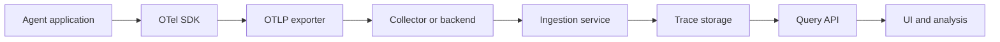
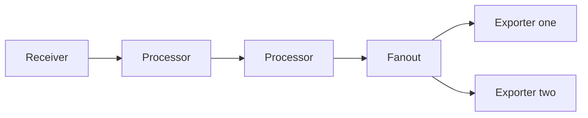
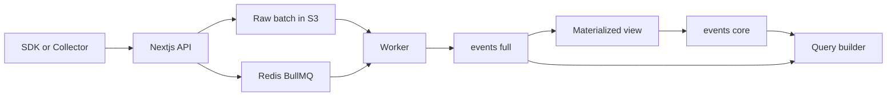
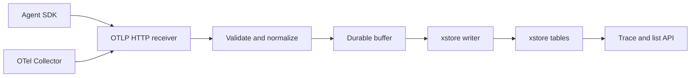

# Agent Trace 摄入、存储与查询学习指南

更新日期：2026-08-24

## 1. 阅读目标与调研范围

本文面向第一次接触可观测性基础设施的开发者，说明 Agent Trace 系统为什么存在、各组件如何协作，以及 OpenTelemetry、Langfuse 和 xstore 分别处于体系中的哪个位置。

读完后应能回答以下问题：

1. 一次 Agent 运行如何表示为 trace 和 span。
2. OTel SDK、OTLP、HTTP、gRPC、Collector、GenAI 语义约定分别解决什么问题。
3. Langfuse 如何接收 OTLP 数据，如何异步写入 ClickHouse，又如何支持列表查询和 trace 详情查询。
4. xstore demo 需要先固定哪些协议、数据模型、写入语义和查询能力。
5. 遇到摄入错误、重复数据、乱序 span 或慢查询时，应从哪一层开始定位。

本文基于以下源码版本：

| 仓库 | 本地目录 | 提交 |
| --- | --- | --- |
| OpenTelemetry Collector | `opentelemetry-collector/` | `b6918236de851afd9fbf560d43c44909a0fbf4e8` |
| OpenTelemetry Protocol | `opentelemetry-proto/` | `ac2c4b5d1f3a6079de62f9afec860158ecc8af09` |
| OpenTelemetry GenAI Semantic Conventions | `semantic-conventions-genai/` | `8a3767d6c5d09bc0917722720973c0c44182d960` |
| Langfuse | `langfuse/` | `7b1eeb952e9cf10a4f18b476d561b7d24d4d54bd` |

文中的 Mermaid 图仅使用 Mermaid 8.8.3 可以解析的基础语法，同时兼容当前 Mermaid 11 系列。

## 2. Overview：Agent Trace 系统解决什么问题

### 2.1 从一次 Agent 运行开始

Agent 通常会执行规划、模型调用、检索、工具调用和结果整理。一次运行可以表示为一棵操作树：

```text
invoke_agent
├── plan
├── retrieval
├── call_model
├── execute_tool
│   └── call_database
└── call_model
```

整棵操作树称为一个 **trace**。每个有开始时间和结束时间的操作称为一个 **span**。所有 span 共享 `trace_id`，每个 span 使用 `span_id` 标识自身，并通过 `parent_span_id` 指向父操作。

这套结构支持以下工程问题：

- 失败发生在哪个模型调用或工具调用。
- 总延迟由哪些步骤组成。
- 哪个模型消耗了多少 token 和成本。
- Agent 为什么产生某个输出，执行过哪些工具。
- 某个模型、Agent 版本或工具在一段时间内的成功率和延迟分布。

前四项需要按 `trace_id` 重建一次运行。最后一项需要跨大量 span 做筛选、排序和聚合。因此，存储系统通常把 span 作为主要写入与分析单元，把 `trace_id` 作为关联句柄。

### 2.2 系统全景



各层职责如下：

| 层 | 主要职责 | 典型实现 |
| --- | --- | --- |
| 埋点 | 在 Agent、模型和工具调用处创建 span，传播上下文 | OTel SDK、Langfuse SDK、框架集成 |
| 协议 | 规定遥测数据的结构、编码、请求和响应语义 | OTLP |
| 接收与处理 | 解码、校验、补充属性、采样、组批、路由 | OTel Collector、Langfuse API |
| 缓冲 | 吸收流量波动，提供异步处理和失败重试 | Collector sending queue、BullMQ、消息队列 |
| 存储 | 持久保存 span、属性和大字段 | ClickHouse、xstore、对象存储 |
| 查询 | 支持 trace 重建、列表筛选和统计聚合 | Query API、SQL builder、可视化界面 |

这六层通过四类契约连接：

1. **数据模型**：trace、span、resource、scope、event、link 和 status。
2. **传输协议**：数据如何编码、发送、确认、限流和重试。
3. **领域语义**：哪些属性表示模型、token、Agent、工具和检索。
4. **存储查询**：写入确认点、幂等键、表结构、索引和查询接口。

OpenTelemetry 提供前三类通用契约。Langfuse 在这些契约上增加 GenAI 产品语义、异步写入、存储和查询。xstore demo 的目标是以 xstore 承担存储与查询能力，并明确它与上游协议和处理层的边界。

## 3. 核心术语及其关系

### 3.1 Trace 数据模型

| 术语 | 含义 | 在本体系中的作用 |
| --- | --- | --- |
| Trace | 共享一个 `trace_id` 的 span 集合 | 表示一次端到端 Agent 运行或请求 |
| Span / Observation | 一个有起止时间的操作 | 主要写入、筛选和聚合单元；Langfuse 常称 observation |
| Root span | `parent_span_id` 为空的 span | 表示已收到根操作，不代表整个 trace 已完整到达 |
| Attribute | 附着在 span 等对象上的键值属性 | 保存模型、token、工具、用户定义标签等可查询信息 |
| Resource | 产生遥测数据的实体及其属性 | 保存服务名、进程、容器和部署环境等来源信息 |
| Instrumentation scope | 产生 span 的埋点库名称、版本和属性 | 区分数据来源与埋点版本，支持兼容性分析 |
| Span event | span 生命周期内的时间点记录 | 表示异常、流式阶段等时间点信息 |
| Span link | 父子树之外的因果引用 | 表示批处理、消息消费、扇入和扇出关系 |
| Status | span 的结果状态 | 标记成功、错误及错误说明 |
| Context propagation | 在进程和网络调用间传播 trace 与 span 上下文 | 维持跨组件的父子关系 |
| Baggage | 随上下文传播的业务键值 | 将租户、会话等信息传递给下游埋点；需要控制大小和敏感信息 |

OTLP trace 请求的结构如下：

```text
ExportTraceServiceRequest
└── ResourceSpans[]
    ├── Resource.attributes[]
    └── ScopeSpans[]
        ├── InstrumentationScope
        └── Span[]
            ├── trace_id / span_id / parent_span_id
            ├── name / kind / start / end / status
            ├── attributes[]
            ├── events[]
            └── links[]
```

`trace_id` 固定为 16 字节，`span_id` 固定为 8 字节。一个请求可以包含多个 resource、多个 scope 和多个 trace。父 span 与子 span 可以由不同请求携带，也可以乱序到达。

### 3.2 OpenTelemetry 与 OTLP

**OpenTelemetry，简称 OTel**，是一套可观测性标准和工具生态，覆盖 trace、metric 和 log。它提供 API、SDK、数据模型、语义约定、传输协议和 Collector。应用使用 OTel SDK 生成遥测数据，使埋点代码与具体后端保持松耦合。

**OTLP，OpenTelemetry Protocol**，是 OTel 定义的遥测数据传输协议。它规定：

- trace、metric 和 log 在网络上的消息结构。
- Protocol Buffers 和 JSON 编码方式。
- HTTP 和 gRPC 传输方式。
- 成功、部分成功、永久失败、可重试失败和限流语义。

OTLP 充当 SDK、Collector 和存储后端之间的通用输入契约。后端实现 OTLP endpoint 后，可以接收多语言 OTel SDK 和 Collector 的数据。OTLP 负责传输，持久存储、索引和查询由后端实现。

### 3.3 Protocol Buffers、HTTP 与 gRPC

这三个术语处于不同层次：

| 术语 | 作用 | 在 OTLP 中的使用方式 |
| --- | --- | --- |
| Protocol Buffers，简称 protobuf | 用 schema 描述消息，并提供紧凑的二进制编码和多语言代码生成 | OTLP 的标准消息定义；OTLP HTTP 和 OTLP gRPC 都可以使用 protobuf 消息 |
| HTTP | 通用的请求与响应传输协议 | OTLP HTTP 使用固定 URL 接收 protobuf 或 JSON，请求处理和调试较直接 |
| gRPC | 基于 HTTP/2、protobuf 和代码生成的 RPC 框架 | OTLP gRPC 将 `Export` 定义为强类型 RPC，适合 SDK 与 Collector 的高吞吐长连接传输 |

选择 OTLP/HTTP 作为 demo 首个入口的原因是客户端覆盖广、服务端实现简单，并且便于使用常规 HTTP 工具测试 JSON 和 protobuf。gRPC 适合需要类型化客户端、连接复用和高吞吐的场景。两种入口应归一化到同一个内部 span 模型，避免形成两套写入逻辑。

Langfuse 当前实现 OTLP/HTTP 的 JSON 和 protobuf 输入，未实现 OTLP/gRPC endpoint。部署方仍可让 SDK 先发送到 Collector，再由 Collector 使用 OTLP/HTTP 转发给 Langfuse。

### 3.4 Collector、语义约定与 GenAI

**OpenTelemetry Collector** 是独立运行的遥测数据处理服务。它通过 receiver 接收数据，通过 processor 完成批处理、过滤、采样和属性转换，再通过 exporter 发送到一个或多个后端。应用接入 Collector 后，可以在不修改应用埋点的情况下调整路由和处理策略。

**Semantic Conventions，语义约定**，规定通用属性名及含义。例如服务名使用 `service.name`。它解决的是不同 SDK 和框架对同一概念使用不同字段名的问题。

**GenAI，Generative AI**，即生成式人工智能。普通 span 可以描述操作的父子关系、耗时和错误，但无法直接说明一个 span 是模型生成、Agent 执行、工具调用还是检索，也无法统一表达模型名、token 和输入输出。OpenTelemetry GenAI Semantic Conventions 使用 `gen_ai.*` 属性补充这层领域语义。

三者的关系可以概括为：

- OTel trace 模型描述操作结构。
- GenAI 语义约定解释操作的业务含义。
- OTLP 把两者编码并传输。
- Collector 在传输路径中处理和转发数据。
- Langfuse 或 xstore 后端负责持久化与查询。

### 3.5 存储与可靠性术语

| 术语 | 含义与工程影响 |
| --- | --- |
| Backpressure | 下游变慢时压力向上游传播；系统需要队列容量、限流和拒绝策略 |
| Idempotency | 相同数据重试写入后保持同一可见结果；候选键为 tenant 或 project 加 `trace_id` 加 `span_id` |
| At least once | 数据可能被重复发送，系统以重试降低丢失概率；摄入端需要幂等处理 |
| Partial success | 一个 OTLP batch 中仅部分数据被接受；响应携带拒绝数量和原因 |
| Head sampling | trace 开始时决定是否采样；资源消耗低，无法按最终错误或延迟决定 |
| Tail sampling | 收集一段时间后按 trace 结果采样；需要按 `trace_id` 暂存和聚合 |
| Wide event | 将 observation 和常用 trace、resource 属性放在同一行；减少查询 join |
| Column pruning | 查询仅读取所需列；将大 input 和 output 与常用列分开可降低扫描量 |
| Data skipping | 通过分区、排序键和索引跳过无关数据块 |
| Replay | 从持久保存的原始批次重新执行转换与写入，用于恢复和 schema 演进 |

## 4. 端到端数据流与关键语义

### 4.1 一条 span 如何到达查询界面

1. Agent 代码或框架集成使用 OTel SDK 创建 span，并写入 GenAI 属性。
2. SDK exporter 将一批 span 编码为 OTLP protobuf 或 JSON。
3. 数据直接发送到后端，也可以先发送到 Collector 做批处理、采样和路由。
4. 摄入服务完成解码、结构校验、鉴权、租户绑定和字段规范化。
5. 缓冲层持久接收已确认的数据，并将写入任务异步交给 worker。
6. worker 把 resource、scope 和 span 展平为存储行，执行脱敏、字段映射和幂等写入。
7. 查询层按 tenant 和时间筛选 span，或按 `trace_id` 读取全部 span 后重建操作树。

### 4.2 确认、重试与重复

OTLP 的成功响应只确认当前 client/server hop 已接受数据。它不提供跨 SDK、Collector、队列和存储的端到端 exactly-once 保证。

摄入服务必须明确自己的成功确认点，例如：

- 已进入内存队列。
- 已提交持久队列。
- 已提交 xstore。

确认点决定服务崩溃时的数据丢失窗口和客户端重试行为。客户端收到可重试错误后会重发同一批数据，因此存储端需要处理重复 span。父子 span 可能乱序和延迟到达，查询侧应按已有数据重建当前视图。

### 4.3 数据量与安全边界

Agent trace 的 input、output、system instructions 和 tool arguments 可能体积较大，并可能包含个人信息、密钥和业务数据。摄入协议需要定义：

- 解压后请求大小和单字段大小限制。
- 字段采集开关、脱敏规则和访问控制。
- 原始数据与规范化数据的保留期。
- 超限数据采用整批拒绝、字段截断或 OTLP partial success。
- 查询列表是否读取完整 input 和 output。

## 5. OpenTelemetry 源码阅读

### 5.1 从 protobuf 定义理解数据契约

优先阅读以下文件：

1. [`trace.proto`](https://github.com/open-telemetry/opentelemetry-proto/blob/f178c39d2b2ca4d6eec4c68d77fd4c780396fbad/opentelemetry/proto/trace/v1/trace.proto)：span、event、link、status 与层次结构。
2. [`trace_service.proto`](https://github.com/open-telemetry/opentelemetry-proto/blob/f178c39d2b2ca4d6eec4c68d77fd4c780396fbad/opentelemetry/proto/collector/trace/v1/trace_service.proto)：`Export` RPC、成功响应和 partial success。
3. [`docs/specification.md`](https://github.com/open-telemetry/opentelemetry-proto/blob/f178c39d2b2ca4d6eec4c68d77fd4c780396fbad/docs/specification.md)：OTLP/HTTP、OTLP/gRPC、重试、限流和确认语义。

阅读时先回答“一个请求可以包含什么”和“服务端如何表达接受结果”，再关注各语言生成代码。

### 5.2 Collector pipeline



Collector 使用 push based consumer 链。网络 handler 把请求解码为 `ptrace.Traces`，随后同步调用下游 `ConsumeTraces`。processor 和 exporter 通过统一接口连接，运行时根据配置构造 pipeline graph。

推荐精读顺序：

1. [`receiver/otlpreceiver/factory.go`](https://github.com/open-telemetry/opentelemetry-collector/blob/6e5f0828a9be93d7fb7e7b8ce0712ac56a1ad2e5/receiver/otlpreceiver/factory.go)：receiver factory 和 trace consumer 注册。
2. [`receiver/otlpreceiver/otlphttp.go`](https://github.com/open-telemetry/opentelemetry-collector/blob/6e5f0828a9be93d7fb7e7b8ce0712ac56a1ad2e5/receiver/otlpreceiver/otlphttp.go)：HTTP content type、解码、响应码与 `Retry-After`。
3. [`receiver/otlpreceiver/internal/trace/otlp.go`](https://github.com/open-telemetry/opentelemetry-collector/blob/6e5f0828a9be93d7fb7e7b8ce0712ac56a1ad2e5/receiver/otlpreceiver/internal/trace/otlp.go)：`ExportRequest` 到 `ConsumeTraces` 的最短主路径。
4. [`pdata/ptrace/ptraceotlp/request.go`](https://github.com/open-telemetry/opentelemetry-collector/blob/6e5f0828a9be93d7fb7e7b8ce0712ac56a1ad2e5/pdata/ptrace/ptraceotlp/request.go)：OTLP request 与 Collector 内部数据的 wrapper 关系。
5. [`service/internal/graph/receiver.go`](https://github.com/open-telemetry/opentelemetry-collector/blob/6e5f0828a9be93d7fb7e7b8ce0712ac56a1ad2e5/service/internal/graph/receiver.go) 和 [`graph.go`](https://github.com/open-telemetry/opentelemetry-collector/blob/6e5f0828a9be93d7fb7e7b8ce0712ac56a1ad2e5/service/internal/graph/graph.go)：receiver、processor 和 exporter 的运行时装配。
6. [`internal/fanoutconsumer/traces.go`](https://github.com/open-telemetry/opentelemetry-collector/blob/6e5f0828a9be93d7fb7e7b8ce0712ac56a1ad2e5/internal/fanoutconsumer/traces.go)：多下游扇出时的只读标记与按需复制。
7. [`processor/batchprocessor/batch_processor.go`](https://github.com/open-telemetry/opentelemetry-collector/blob/6e5f0828a9be93d7fb7e7b8ce0712ac56a1ad2e5/processor/batchprocessor/batch_processor.go)：按时间和 span 数量组批。
8. [`exporter/exporterhelper/README.md`](https://github.com/open-telemetry/opentelemetry-collector/blob/6e5f0828a9be93d7fb7e7b8ce0712ac56a1ad2e5/exporter/exporterhelper/README.md) 和 [`internal/queue/persistent_queue.go`](https://github.com/open-telemetry/opentelemetry-collector/blob/6e5f0828a9be93d7fb7e7b8ce0712ac56a1ad2e5/exporter/exporterhelper/internal/queue/persistent_queue.go)：发送队列、失败重试和持久队列。

### 5.3 Collector 的可靠性边界

- receiver 到 processor 默认同步传播，下游阻塞会形成背压。
- batch processor 优化吞吐，不构成持久化边界。
- 持久 sending queue 位于 exporter helper，用于发送失败后的恢复。
- retryable failure 会触发重发，同一 span 可能多次到达后端。
- permanent failure 表示输入无法通过重试恢复，HTTP 通常返回 4xx，gRPC 通常返回 `InvalidArgument`。
- partial success 表示 batch 中部分 span 被拒绝，服务端需要准确报告 `rejected_spans`。

## 6. Agent 与 GenAI 语义

### 6.1 为什么普通 trace 模型还不够

普通 span 提供名称、时间、父子关系、属性和状态。Agent 分析还需要稳定回答以下问题：

- 这是 Agent 调用、模型生成、工具执行、检索还是规划。
- 请求模型和响应模型分别是什么。
- 输入、输出、token usage 和缓存 token 如何记录。
- 工具定义、工具参数和工具结果如何关联。
- 一组操作属于哪个 conversation、session、Agent 和 Agent 版本。

GenAI Semantic Conventions 为这些概念提供标准属性名。该规范当前处于 Development 状态，schema 应保留通用 attributes，并把稳定且高频查询的字段提升为显式列。

### 6.2 重点源码与字段

优先阅读：

- [`gen-ai-agent-spans.md`](https://github.com/open-telemetry/semantic-conventions-genai/blob/5ca9052bc796ef1e497200b1d558fd87a201f335/docs/gen-ai/gen-ai-agent-spans.md)：`create_agent`、`invoke_agent`、`invoke_workflow`、`plan` 和 `execute_tool`。
- [`gen-ai-spans.md`](https://github.com/open-telemetry/semantic-conventions-genai/blob/5ca9052bc796ef1e497200b1d558fd87a201f335/docs/gen-ai/gen-ai-spans.md)：模型调用、输入输出、token usage、provider 和响应属性。
- [`mcp.md`](https://github.com/open-telemetry/semantic-conventions-genai/blob/5ca9052bc796ef1e497200b1d558fd87a201f335/docs/gen-ai/mcp.md)：MCP client、server 与 tool 调用关系。
- [`gen-ai-events.md`](https://github.com/open-telemetry/semantic-conventions-genai/blob/5ca9052bc796ef1e497200b1d558fd87a201f335/docs/gen-ai/gen-ai-events.md)：适合表示时间点事件的数据。

| 分类 | 字段示例 | 查询用途 |
| --- | --- | --- |
| 操作 | `gen_ai.operation.name` | 区分 chat、invoke_agent、execute_tool、retrieval 和 plan |
| Agent | `gen_ai.agent.id/name/version` | 按 Agent 与版本分析 |
| Provider 和 Model | `gen_ai.provider.name`、`gen_ai.request.model`、`gen_ai.response.model` | 模型路由、版本和分布 |
| Conversation | `gen_ai.conversation.id` | 关联多轮会话 |
| Usage | `gen_ai.usage.input_tokens`、`output_tokens`、cache 和 reasoning 分项 | 成本与容量分析 |
| Content | `gen_ai.input.messages`、`output.messages`、`system_instructions` | 调试与评估 |
| Tool | `gen_ai.tool.definitions`、tool call 和 result | 还原 Agent 行为 |
| Error | `error.type`、span status | 失败分类 |

## 7. Langfuse 实现分析

### 7.1 Langfuse 在体系中的位置

Langfuse 是面向 LLM 和 Agent 的可观测性平台。它接收 SDK 或 OTLP 数据，把 span 映射为 observation，持久化 GenAI 字段，并提供 trace waterfall、筛选、聚合、成本和评估相关查询。

Langfuse 的核心作用是把通用遥测数据转换为适合 GenAI 产品查询的数据模型。

### 7.2 OTLP 摄入链路



图中的数据流分为以下步骤：

1. [`web/src/pages/api/public/otel/v1/traces/index.ts`](https://github.com/langfuse/langfuse/blob/983c2a6e5bbe9e8f35fe10eb017c9abd6220833b/web/src/pages/api/public/otel/v1/traces/index.ts) 完成鉴权、gzip 解压、JSON 或 protobuf 解码、ID 与 collection shape 校验。
2. [`OtelIngestionProcessor.publishToOtelIngestionQueue`](https://github.com/langfuse/langfuse/blob/983c2a6e5bbe9e8f35fe10eb017c9abd6220833b/packages/shared/src/server/otel/OtelIngestionProcessor.ts) 把整个原始 batch 写入 S3，再向 BullMQ 写入对象的 `fileKey`。
3. [`worker/src/queues/otelIngestionQueue.ts`](https://github.com/langfuse/langfuse/blob/983c2a6e5bbe9e8f35fe10eb017c9abd6220833b/worker/src/queues/otelIngestionQueue.ts) 根据 `fileKey` 下载对象，执行 masking、转换、数据丰富并选择写入路径。
4. [`OtelIngestionProcessor.processToIngestionEvents`](https://github.com/langfuse/langfuse/blob/983c2a6e5bbe9e8f35fe10eb017c9abd6220833b/packages/shared/src/server/otel/OtelIngestionProcessor.ts) 把每个 OTLP span 转换成 Langfuse observation，并按需生成 trace event。
5. [`ObservationTypeMapper.ts`](https://github.com/langfuse/langfuse/blob/983c2a6e5bbe9e8f35fe10eb017c9abd6220833b/packages/shared/src/server/otel/ObservationTypeMapper.ts) 兼容 Langfuse、OTel GenAI、OpenInference 和 Vercel AI SDK 等属性体系。
6. [`IngestionService.writeEventRecord`](https://github.com/langfuse/langfuse/blob/983c2a6e5bbe9e8f35fe10eb017c9abd6220833b/worker/src/services/IngestionService/index.ts) 写入 `events_full`；[`ClickhouseWriter`](https://github.com/langfuse/langfuse/blob/983c2a6e5bbe9e8f35fe10eb017c9abd6220833b/worker/src/services/ClickhouseWriter/index.ts) 按表缓冲并批量 insert。

请求成功表示原始 batch 已上传且队列 job 已创建。此时 ClickHouse 可能尚未写入，查询可能暂时看不到数据。队列配置为 6 次指数退避重试。S3 中的原始输入支持 replay、故障调查和转换逻辑升级。

### 7.3 Observation 类型映射

Langfuse 将 OTLP span 进一步解释为 `span`、`generation`、`agent`、`tool`、`chain`、`retriever`、`evaluator`、`embedding`、`guardrail` 或 `event`。映射逻辑会读取多种属性约定，统一到 Langfuse observation model。

存储层需要同时保留两类信息：

- 稳定、高频的规范化列，用于按模型、类型、错误、token 和耗时查询。
- 原始或长尾 attributes，用于兼容新的 SDK、语义约定和自定义字段。

### 7.4 Full 与 Core 存储模型

Langfuse v4 使用 observation first 宽表：

- [`0039_create_events_full.up.sql`](https://github.com/langfuse/langfuse/blob/983c2a6e5bbe9e8f35fe10eb017c9abd6220833b/packages/shared/clickhouse/migrations/unclustered/0039_create_events_full.up.sql)：保存完整 input、output、metadata 和 GenAI 字段。
- [`0040_create_events_core.up.sql`](https://github.com/langfuse/langfuse/blob/983c2a6e5bbe9e8f35fe10eb017c9abd6220833b/packages/shared/clickhouse/migrations/unclustered/0040_create_events_core.up.sql)：保存面向列表与聚合的紧凑副本。
- [`0041_create_events_core_mv.up.sql`](https://github.com/langfuse/langfuse/blob/983c2a6e5bbe9e8f35fe10eb017c9abd6220833b/packages/shared/clickhouse/migrations/unclustered/0041_create_events_core_mv.up.sql)：通过 materialized view 将 input、output 和 metadata value 截断到 200 字符后写入 core 表。

两张表按月分区，主键以 `project_id + minute(start_time) + hash(trace_id)` 开头，排序键继续包含 `span_id + start_time`。这种布局服务 tenant 与时间范围扫描，并保持同一 trace 的局部性。

查询路径体现了“先缩小结果集，再读取大字段”的原则：

- [`EventsQueryBuilder.needsFullTable`](https://github.com/langfuse/langfuse/blob/983c2a6e5bbe9e8f35fe10eb017c9abd6220833b/packages/shared/src/server/queries/clickhouse-sql/event-query-builder.ts) 默认选择 `events_core`，需要完整 I/O 或展开 metadata 时选择 `events_full`。
- [`buildEventsFullTableSplitQuery`](https://github.com/langfuse/langfuse/blob/983c2a6e5bbe9e8f35fe10eb017c9abd6220833b/packages/shared/src/server/queries/clickhouse-sql/event-query-builder.ts) 先在 core 表筛选和排序，再用命中主键回查 full 表。
- [`getTraceByIdFromEventsTable`](https://github.com/langfuse/langfuse/blob/983c2a6e5bbe9e8f35fe10eb017c9abd6220833b/packages/shared/src/server/repositories/events.ts) 从 events 聚合重建 trace。

### 7.5 阅读源码时需要区分的实现背景

当前 Langfuse 主干包含 v3 到 v4 的 dual write、staging 和 direct write 路由。这些分支用于在线迁移。理解目标架构时，重点跟踪以下 direct path：

```text
OTLP span
  → enriched immutable event
  → events_full
  → events_core
  → query
```

以下实现选择需要结合 xstore 能力重新评估：

- Langfuse API 会先把解压后的完整请求读入内存，超过 16 MiB 时记录 warning。xstore 服务应定义解压后的硬性大小限制。
- Langfuse 对结构错误的 span 采用整批拒绝。xstore 需要明确整批原子拒绝或 OTLP partial success。
- S3、Redis 和 ClickHouse 分别承担原始批次、任务队列和分析存储。xstore 若提供相应持久能力，可以合并部分组件。
- observation first 宽表和 full/core 投影是 Langfuse 的查询设计选择，不属于 OTLP 协议要求。

## 8. xstore Demo 的参考架构

本文尚未获取 xstore 的事务、索引、compaction、schema evolution 和对象存储能力。以下内容是基于 OTel 与 Langfuse 的工程映射，需要用 xstore 实际接口验证。

标准 openGauss 的实际部署、固定样本摄入和精确对账见 [蓝区 openGauss 复现指南](trace-ingestion-demo-blue-zone-guide.md)；GV 连接、Go 换源、定制 Collector 构建和 dstore 验收见 [黄区 GV xstore 复现指南](trace-ingestion-demo-yellow-zone-guide.md)。本节用于建立目标体系和后续能力演进视图，两份运行指南用于复现当前三表摄入 MVP。

### 8.1 最小可运行链路



demo 建议先实现 OTLP/HTTP backend，接收 JSON 与 protobuf，并用标准 Collector 作为上游协议兼容客户端。后续如需复用 Collector 的 retry 和 persistent queue，可增加 xstore exporter。两种方式共享相同的规范化模型和写入语义。

### 8.2 组件边界

| 组件 | 最小职责 | 首轮验证 |
| --- | --- | --- |
| OTLP receiver | 鉴权、解压、解码、结构和大小校验 | JSON 与 protobuf 产生相同规范化结果 |
| Normalizer | 展平 resource、scope 和 span，映射 GenAI 高频字段 | 多 resource、多 scope、多 trace 输入 |
| Durable buffer | 在成功响应前建立持久接收边界 | 进程退出和下游暂时失败后可恢复 |
| xstore writer | 组批、幂等、冲突检测、提交 | 同一 batch 重放不产生可见重复 |
| Query service | tenant 与时间筛选、trace 重建、聚合 | 数据裁剪和大字段延迟读取生效 |

### 8.3 最小宽表字段

建议至少覆盖以下字段组：

| 字段组 | 字段示例 |
| --- | --- |
| 身份 | `tenant_id`、`project_id`、`trace_id`、`span_id`、`parent_span_id` |
| 时间 | `start_time`、`end_time`、`duration`、`ingested_at` |
| 基础语义 | `name`、`kind`、`status_code`、`status_message` |
| 来源 | `service_name`、resource attributes、scope name 和 version、SDK 信息 |
| Agent 与 GenAI | operation、observation type、agent、provider、model、usage、cost、tool、conversation |
| 扩展数据 | span attributes、events、links、input、output、raw batch reference |

高频筛选字段使用显式列，长尾属性保留 map 或 JSON。大 input 和 output 可以采用 full/core projection 或外部 blob reference。字段从 attributes 提升为显式列时继续保留原始属性，使语义约定升级后可以 replay。

### 8.4 写入语义

- 以 `project_id + trace_id + span_id` 作为幂等键候选。
- 相同键和相同内容的重试执行去重；相同键和不同内容记录冲突指标并进入可检查的失败路径。
- 组批同时设置 span 数、字节数和等待时间上限。
- 接口文档明确成功响应对应进入持久队列或提交 xstore。
- 摄入过程持续接收乱序与 late arrival span，不等待 trace 完成。
- 记录 rejected、queued、written、duplicated、conflicted、write latency 和 queue age 指标。

### 8.5 首批查询与验收用例

首批查询直接检验存储布局：

1. 指定 tenant 和时间范围，按延迟、错误、model、tool 和 observation type 筛选。
2. 指定 `trace_id` 获取全部 span，按 parent 关系构建 waterfall。
3. 按 model 和 provider 汇总 token、cost 和 latency。
4. 按 session 或 conversation 分析多轮行为。
5. 仅在详情查询中读取完整 input 和 output。

验收用例：

- OTLP/HTTP JSON 与 protobuf 产生相同规范化行。
- 同一请求包含多个 resource、scope 和 trace。
- 子 span 先于父 span 到达，最终仍可重建 trace。
- 同一 batch 重放两次不会产生可见重复。
- 非法 ID、非法 collection 和超大解压 payload 返回固定的永久错误。
- xstore 暂时失败返回可重试错误，重试后数据最终可查询。
- 大 input 和 output 不增加基础列查询的扫描量。
- tenant、时间范围和 trace ID 条件触发可验证的数据裁剪。

## 9. 建议学习与动手顺序

### 第一阶段：建立全局模型，约 1 小时

阅读第 2 至 4 节。选择一次熟悉的 Agent 运行，手工画出 trace 和 span 树，并标出模型、工具、token、错误、input 和 output 应存放的位置。

完成标准：能够向同事说明 OTel、OTLP、Collector、GenAI 语义约定和存储后端的边界。

### 第二阶段：协议与 Collector 主链路，约 2 小时

阅读两个 proto 文件、OTLP specification、Collector `handleTraces` 和 `Receiver.Export`。手写一个最小 OTLP JSON，并标注每个字段在 `ptrace.Traces` 和规范化行中的位置。

完成标准：能够解释一个请求包含多个 trace、重试产生重复和 Collector 背压的原因。

### 第三阶段：Langfuse 写路径，约 3 小时

从 API route 跟到 S3、BullMQ、worker、`OtelIngestionProcessor`、`IngestionService` 和 `events_full`。记录每一步的输入、输出、失败语义和确认点。

完成标准：能够解释 HTTP 成功响应后数据为何可能暂时不可查询，以及 replay 如何实现。

### 第四阶段：查询与 xstore 映射，约 3 小时

阅读 `events_full`、`events_core`、materialized view、query builder 和 `getTraceByIdFromEventsTable`。用 xstore demo 的现有 schema 对照第 8 节，记录事务、幂等、late arrival、full/core 和查询裁剪能力。

完成标准：形成一页 xstore 能力差距表，并用第 8.5 节用例验证首个端到端版本。

## 10. 官方资料

- [OpenTelemetry Collector Architecture](https://opentelemetry.io/docs/collector/architecture/)
- [OTLP Specification](https://opentelemetry.io/docs/specs/otlp/)
- [OpenTelemetry GenAI Semantic Conventions](https://github.com/open-telemetry/semantic-conventions-genai)
- [Langfuse Architecture](https://langfuse.com/handbook/product-engineering/architecture)
- [Langfuse OpenTelemetry integration and attribute mapping](https://langfuse.com/integrations/native/opentelemetry)
- [Langfuse data model](https://langfuse.com/docs/observability/data-model)
- [Langfuse observation types](https://langfuse.com/docs/observability/features/observation-types)
- [Simplifying Langfuse for Scale](https://langfuse.com/blog/2026-03-10-simplify-langfuse-for-scale)
